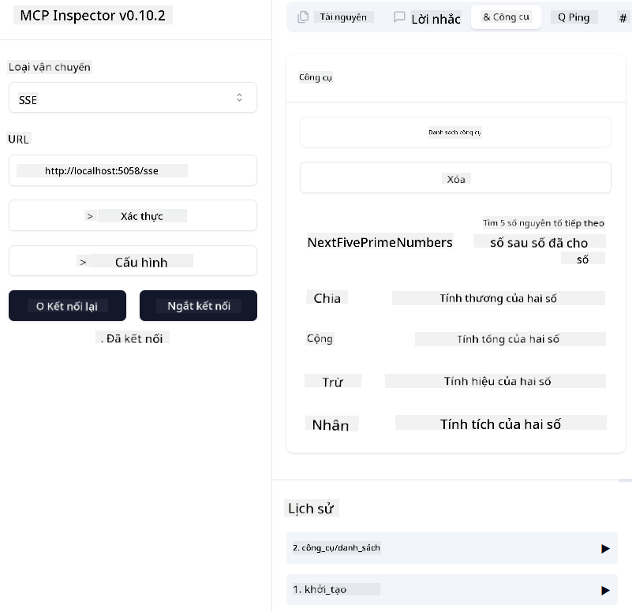
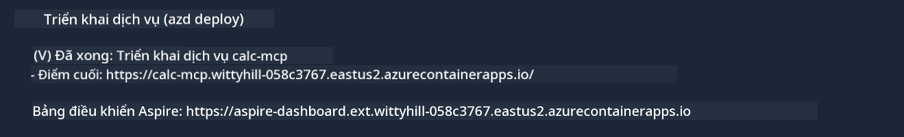

<!--
CO_OP_TRANSLATOR_METADATA:
{
  "original_hash": "5020a3e1a1c7f30c00f9e37f1fa208e3",
  "translation_date": "2025-05-17T14:10:28+00:00",
  "source_file": "04-PracticalImplementation/samples/csharp/README.md",
  "language_code": "vi"
}
-->
Ví dụ trước cho thấy cách sử dụng một dự án .NET cục bộ với kiểu `sdio`. Và cách chạy máy chủ cục bộ trong một container. Đây là giải pháp tốt trong nhiều tình huống. Tuy nhiên, có thể hữu ích khi máy chủ chạy từ xa, như trong môi trường đám mây. Đây là lúc kiểu `http` xuất hiện.

Nhìn vào giải pháp trong thư mục `04-PracticalImplementation`, có thể trông phức tạp hơn nhiều so với ví dụ trước. Nhưng thực tế, không phải vậy. Nếu bạn xem kỹ dự án `src/mcpserver/mcpserver.csproj`, bạn sẽ thấy rằng nó chủ yếu là cùng mã như ví dụ trước. Sự khác biệt duy nhất là chúng ta đang sử dụng một thư viện khác `ModelContextProtocol.AspNetCore` để xử lý các yêu cầu HTTP. Và chúng ta thay đổi phương thức `IsPrime` để làm cho nó riêng tư, chỉ để cho thấy rằng bạn có thể có các phương thức riêng tư trong mã của mình. Phần còn lại của mã giống như trước.

Các dự án khác là từ [.NET Aspire](https://learn.microsoft.com/dotnet/aspire/get-started/aspire-overview). Có .NET Aspire trong giải pháp sẽ cải thiện trải nghiệm của nhà phát triển trong khi phát triển và kiểm tra và giúp tăng khả năng quan sát. Nó không cần thiết để chạy máy chủ, nhưng là một thực hành tốt để có nó trong giải pháp của bạn.

## Khởi động máy chủ cục bộ

1. Từ VS Code (với phần mở rộng C# DevKit), mở giải pháp `04-PracticalImplementation\samples\csharp\src\Calculator-chap4.sln`.
2. Nhấn `F5` để khởi động máy chủ. Nó sẽ mở trình duyệt web với bảng điều khiển .NET Aspire.

hoặc

1. Từ terminal, điều hướng đến thư mục `04-PracticalImplementation\samples\csharp\src`
2. Thực thi lệnh sau để khởi động máy chủ:
   ```bash
    dotnet run --project .\AppHost
   ```

3. Từ Dashboard, ghi chú URL `http`. Nó nên là dạng như `http://localhost:5058/`.

## Test `SSE` với ModelContext Protocol Inspector

Nếu bạn có Node.js 22.7.5 trở lên, bạn có thể sử dụng ModelContext Protocol Inspector để kiểm tra máy chủ của mình.

Khởi động máy chủ và chạy lệnh sau trong terminal:

```bash
npx @modelcontextprotocol/inspector@latest
```



- Chọn `SSE` as the Transport type. SSE stand for Server-Sent Events. 
- In the Url field, enter the URL of the server noted earlier,and append `/sse`. Nó nên là `http` (không phải `https`) something like `http://localhost:5058/sse`.
- select the Connect button.

A nice thing about the Inspector is that it provide a nice visibility on what is happening.

- Try listing the availables tools
- Try some of them, it should works just like before.


## Test `SSE` with Github Copilot Chat in VS Code

To use the `SSE` transport with Github Copilot Chat, change the configuration of the `mcp-calc` máy chủ đã được tạo trước để trông như thế này:

```json
"mcp-calc": {
    "type": "sse",
    "url": "http://localhost:5058/sse"
}
```

Thực hiện một số thử nghiệm:
- Yêu cầu 3 số nguyên tố sau 6780. Chú ý cách Copilot sẽ sử dụng công cụ mới `NextFivePrimeNumbers` và chỉ trả về 3 số nguyên tố đầu tiên.
- Yêu cầu 7 số nguyên tố sau 111, để xem điều gì xảy ra.

# Triển khai máy chủ lên Azure

Hãy triển khai máy chủ lên Azure để nhiều người có thể sử dụng nó.

Từ terminal, điều hướng đến thư mục `04-PracticalImplementation\samples\csharp\src` và chạy lệnh sau:

```bash
azd init
```

Điều này sẽ tạo một số tệp cục bộ để lưu cấu hình tài nguyên Azure, và Hạ tầng như mã (IaC) của bạn.

Sau đó, chạy lệnh sau để triển khai máy chủ lên Azure:

```bash
azd up
```

Khi triển khai hoàn tất, bạn sẽ thấy một thông báo như thế này:



Điều hướng đến bảng điều khiển Aspire và ghi chú URL `HTTP` để sử dụng nó trong MCP Inspector và trong Github Copilot Chat.

## Tiếp theo là gì?

Chúng ta thử các loại vận chuyển khác nhau, công cụ kiểm tra và cũng triển khai máy chủ MCP của chúng ta lên Azure. Nhưng điều gì sẽ xảy ra nếu máy chủ của chúng ta cần truy cập vào các tài nguyên riêng tư? Ví dụ, một cơ sở dữ liệu hoặc một API riêng tư? Trong chương tiếp theo, chúng ta sẽ xem cách cải thiện bảo mật của máy chủ.

**Tuyên bố miễn trừ trách nhiệm**:  
Tài liệu này đã được dịch bằng dịch vụ dịch thuật AI [Co-op Translator](https://github.com/Azure/co-op-translator). Mặc dù chúng tôi cố gắng đảm bảo độ chính xác, xin lưu ý rằng các bản dịch tự động có thể chứa lỗi hoặc không chính xác. Tài liệu gốc bằng ngôn ngữ bản địa nên được coi là nguồn chính thức. Đối với thông tin quan trọng, nên sử dụng dịch vụ dịch thuật chuyên nghiệp của con người. Chúng tôi không chịu trách nhiệm cho bất kỳ sự hiểu lầm hoặc giải thích sai nào phát sinh từ việc sử dụng bản dịch này.