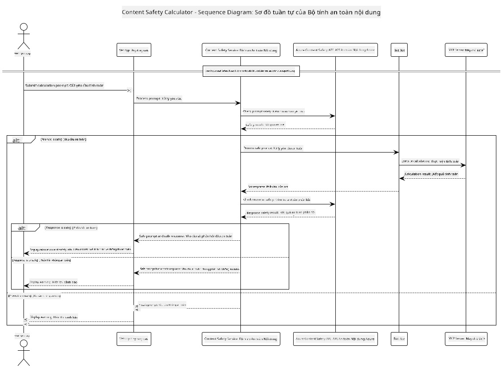

<!--
CO_OP_TRANSLATOR_METADATA:
{
  "original_hash": "e5ea5e7582f70008ea9bec3b3820f20a",
  "translation_date": "2025-07-13T23:18:15+00:00",
  "source_file": "04-PracticalImplementation/samples/java/containerapp/README.md",
  "language_code": "vi"
}
-->
## Kiến trúc Hệ thống

Dự án này minh họa một ứng dụng web sử dụng kiểm tra an toàn nội dung trước khi gửi yêu cầu người dùng đến dịch vụ máy tính thông qua Model Context Protocol (MCP).



### Cách Hoạt Động

1. **Nhập liệu của người dùng**: Người dùng nhập yêu cầu tính toán trên giao diện web  
2. **Kiểm tra an toàn nội dung (đầu vào)**: Yêu cầu được phân tích bởi Azure Content Safety API  
3. **Quyết định an toàn (đầu vào)**:  
   - Nếu nội dung an toàn (mức độ nghiêm trọng < 2 ở tất cả các hạng mục), tiếp tục gửi đến máy tính  
   - Nếu nội dung bị đánh dấu có thể gây hại, quá trình dừng lại và trả về cảnh báo  
4. **Tích hợp máy tính**: Nội dung an toàn được xử lý bởi LangChain4j, giao tiếp với máy chủ MCP calculator  
5. **Kiểm tra an toàn nội dung (đầu ra)**: Phản hồi của bot được phân tích bởi Azure Content Safety API  
6. **Quyết định an toàn (đầu ra)**:  
   - Nếu phản hồi của bot an toàn, hiển thị cho người dùng  
   - Nếu phản hồi bị đánh dấu có thể gây hại, thay thế bằng cảnh báo  
7. **Phản hồi**: Kết quả (nếu an toàn) được hiển thị cho người dùng cùng với cả hai phân tích an toàn

## Sử dụng Model Context Protocol (MCP) với Dịch vụ Máy tính

Dự án này minh họa cách sử dụng Model Context Protocol (MCP) để gọi các dịch vụ MCP máy tính từ LangChain4j. Việc triển khai sử dụng một máy chủ MCP cục bộ chạy trên cổng 8080 để cung cấp các phép toán máy tính.

### Thiết lập Dịch vụ Azure Content Safety

Trước khi sử dụng các tính năng an toàn nội dung, bạn cần tạo một tài nguyên dịch vụ Azure Content Safety:

1. Đăng nhập vào [Azure Portal](https://portal.azure.com)  
2. Nhấn "Create a resource" và tìm kiếm "Content Safety"  
3. Chọn "Content Safety" và nhấn "Create"  
4. Nhập tên duy nhất cho tài nguyên của bạn  
5. Chọn subscription và nhóm tài nguyên (hoặc tạo mới)  
6. Chọn khu vực được hỗ trợ (xem [Region availability](https://azure.microsoft.com/en-us/global-infrastructure/services/?products=cognitive-services) để biết chi tiết)  
7. Chọn gói giá phù hợp  
8. Nhấn "Create" để triển khai tài nguyên  
9. Khi triển khai hoàn tất, nhấn "Go to resource"  
10. Ở thanh bên trái, dưới "Resource Management", chọn "Keys and Endpoint"  
11. Sao chép một trong các khóa và URL endpoint để sử dụng trong bước tiếp theo

### Cấu hình Biến Môi trường

Đặt biến môi trường `GITHUB_TOKEN` để xác thực các mô hình GitHub:  
```sh
export GITHUB_TOKEN=<your_github_token>
```

Đối với các tính năng an toàn nội dung, đặt:  
```sh
export CONTENT_SAFETY_ENDPOINT=<your_content_safety_endpoint>
export CONTENT_SAFETY_KEY=<your_content_safety_key>
```

Các biến môi trường này được ứng dụng sử dụng để xác thực với dịch vụ Azure Content Safety. Nếu các biến này không được thiết lập, ứng dụng sẽ dùng giá trị giả để minh họa, nhưng các tính năng an toàn nội dung sẽ không hoạt động đúng.

### Khởi động Máy chủ MCP Calculator

Trước khi chạy client, bạn cần khởi động máy chủ MCP calculator ở chế độ SSE trên localhost:8080.

## Mô tả Dự án

Dự án này minh họa việc tích hợp Model Context Protocol (MCP) với LangChain4j để gọi các dịch vụ máy tính. Các tính năng chính bao gồm:

- Sử dụng MCP để kết nối với dịch vụ máy tính thực hiện các phép toán cơ bản  
- Kiểm tra an toàn nội dung hai lớp trên cả yêu cầu người dùng và phản hồi của bot  
- Tích hợp với mô hình gpt-4.1-nano của GitHub qua LangChain4j  
- Sử dụng Server-Sent Events (SSE) cho giao thức MCP

## Tích hợp An toàn Nội dung

Dự án bao gồm các tính năng an toàn nội dung toàn diện để đảm bảo cả đầu vào của người dùng và phản hồi hệ thống không chứa nội dung gây hại:

1. **Kiểm tra đầu vào**: Tất cả yêu cầu người dùng được phân tích các loại nội dung gây hại như ngôn từ thù địch, bạo lực, tự làm hại và nội dung tình dục trước khi xử lý.  

2. **Kiểm tra đầu ra**: Ngay cả khi sử dụng các mô hình có thể không kiểm duyệt, hệ thống vẫn kiểm tra tất cả phản hồi được tạo ra qua cùng bộ lọc an toàn nội dung trước khi hiển thị cho người dùng.

Cách tiếp cận hai lớp này đảm bảo hệ thống luôn an toàn bất kể mô hình AI nào được sử dụng, bảo vệ người dùng khỏi cả đầu vào có hại và phản hồi AI có thể gây vấn đề.

## Client Web

Ứng dụng bao gồm giao diện web thân thiện cho phép người dùng tương tác với hệ thống Content Safety Calculator:

### Tính năng Giao diện Web

- Biểu mẫu đơn giản, dễ sử dụng để nhập yêu cầu tính toán  
- Xác thực an toàn nội dung hai lớp (đầu vào và đầu ra)  
- Phản hồi thời gian thực về mức độ an toàn của yêu cầu và phản hồi  
- Chỉ báo an toàn được mã màu giúp dễ dàng nhận biết  
- Thiết kế gọn gàng, đáp ứng, hoạt động tốt trên nhiều thiết bị  
- Ví dụ các yêu cầu an toàn để hướng dẫn người dùng

### Sử dụng Client Web

1. Khởi động ứng dụng:  
   ```sh
   mvn spring-boot:run
   ```

2. Mở trình duyệt và truy cập `http://localhost:8087`

3. Nhập yêu cầu tính toán vào ô văn bản (ví dụ: "Calculate the sum of 24.5 and 17.3")

4. Nhấn "Submit" để xử lý yêu cầu

5. Xem kết quả, bao gồm:  
   - Phân tích an toàn nội dung của yêu cầu  
   - Kết quả tính toán (nếu yêu cầu an toàn)  
   - Phân tích an toàn nội dung của phản hồi bot  
   - Cảnh báo an toàn nếu đầu vào hoặc đầu ra bị đánh dấu

Client web tự động xử lý cả hai quy trình kiểm tra an toàn nội dung, đảm bảo mọi tương tác đều an toàn và phù hợp bất kể mô hình AI nào được sử dụng.

**Tuyên bố từ chối trách nhiệm**:  
Tài liệu này đã được dịch bằng dịch vụ dịch thuật AI [Co-op Translator](https://github.com/Azure/co-op-translator). Mặc dù chúng tôi cố gắng đảm bảo độ chính xác, xin lưu ý rằng các bản dịch tự động có thể chứa lỗi hoặc không chính xác. Tài liệu gốc bằng ngôn ngữ gốc của nó nên được coi là nguồn chính xác và đáng tin cậy. Đối với các thông tin quan trọng, nên sử dụng dịch vụ dịch thuật chuyên nghiệp do con người thực hiện. Chúng tôi không chịu trách nhiệm về bất kỳ sự hiểu lầm hoặc giải thích sai nào phát sinh từ việc sử dụng bản dịch này.