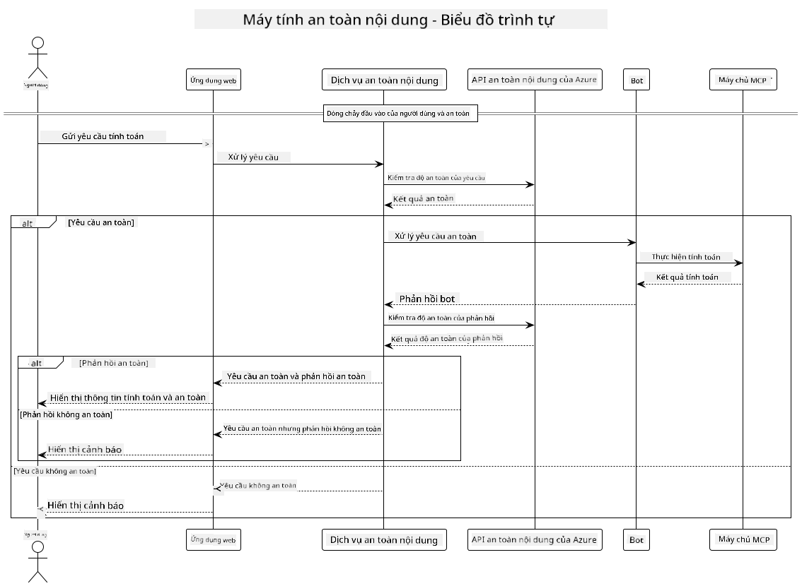

<!--
CO_OP_TRANSLATOR_METADATA:
{
  "original_hash": "e5ea5e7582f70008ea9bec3b3820f20a",
  "translation_date": "2025-05-17T14:29:11+00:00",
  "source_file": "04-PracticalImplementation/samples/java/containerapp/README.md",
  "language_code": "vi"
}
-->
## Kiến trúc hệ thống

Dự án này trình bày một ứng dụng web sử dụng kiểm tra an toàn nội dung trước khi chuyển các yêu cầu của người dùng đến dịch vụ máy tính thông qua Model Context Protocol (MCP).



### Cách Hoạt Động

1. **Nhập liệu của người dùng**: Người dùng nhập một yêu cầu tính toán vào giao diện web
2. **Kiểm tra an toàn nội dung (Nhập liệu)**: Yêu cầu được phân tích bởi Azure Content Safety API
3. **Quyết định an toàn (Nhập liệu)**:
   - Nếu nội dung an toàn (mức độ nghiêm trọng < 2 trong tất cả các danh mục), nó sẽ tiếp tục đến máy tính
   - Nếu nội dung bị đánh dấu là có thể gây hại, quá trình dừng lại và trả về cảnh báo
4. **Tích hợp máy tính**: Nội dung an toàn được xử lý bởi LangChain4j, giao tiếp với máy chủ máy tính MCP
5. **Kiểm tra an toàn nội dung (Xuất ra)**: Phản hồi của bot được phân tích bởi Azure Content Safety API
6. **Quyết định an toàn (Xuất ra)**:
   - Nếu phản hồi của bot an toàn, nó được hiển thị cho người dùng
   - Nếu phản hồi của bot bị đánh dấu là có thể gây hại, nó được thay thế bằng cảnh báo
7. **Phản hồi**: Kết quả (nếu an toàn) được hiển thị cho người dùng cùng với cả hai phân tích an toàn

## Sử dụng Model Context Protocol (MCP) với Dịch vụ Máy tính

Dự án này trình bày cách sử dụng Model Context Protocol (MCP) để gọi dịch vụ máy tính MCP từ LangChain4j. Việc triển khai sử dụng một máy chủ MCP cục bộ chạy trên cổng 8080 để cung cấp các thao tác máy tính.

### Thiết lập Dịch vụ An toàn Nội dung của Azure

Trước khi sử dụng các tính năng an toàn nội dung, bạn cần tạo một tài nguyên dịch vụ An toàn Nội dung của Azure:

1. Đăng nhập vào [Azure Portal](https://portal.azure.com)
2. Nhấp vào "Create a resource" và tìm kiếm "Content Safety"
3. Chọn "Content Safety" và nhấp vào "Create"
4. Nhập tên duy nhất cho tài nguyên của bạn
5. Chọn đăng ký và nhóm tài nguyên của bạn (hoặc tạo mới)
6. Chọn một khu vực được hỗ trợ (kiểm tra [Region availability](https://azure.microsoft.com/en-us/global-infrastructure/services/?products=cognitive-services) để biết chi tiết)
7. Chọn mức giá phù hợp
8. Nhấp vào "Create" để triển khai tài nguyên
9. Khi triển khai hoàn tất, nhấp vào "Go to resource"
10. Trong bảng bên trái, dưới "Resource Management", chọn "Keys and Endpoint"
11. Sao chép một trong các khóa và URL điểm cuối để sử dụng trong bước tiếp theo

### Cấu hình Biến Môi Trường

Đặt biến môi trường `GITHUB_TOKEN` để xác thực mô hình GitHub:
```sh
export GITHUB_TOKEN=<your_github_token>
```

Đối với các tính năng an toàn nội dung, đặt:
```sh
export CONTENT_SAFETY_ENDPOINT=<your_content_safety_endpoint>
export CONTENT_SAFETY_KEY=<your_content_safety_key>
```

Các biến môi trường này được ứng dụng sử dụng để xác thực với dịch vụ An toàn Nội dung của Azure. Nếu các biến này không được đặt, ứng dụng sẽ sử dụng giá trị giữ chỗ cho mục đích trình diễn, nhưng các tính năng an toàn nội dung sẽ không hoạt động đúng cách.

### Khởi động Máy chủ MCP Máy tính

Trước khi chạy client, bạn cần khởi động máy chủ MCP máy tính ở chế độ SSE trên localhost:8080.

## Mô tả Dự án

Dự án này trình bày sự tích hợp của Model Context Protocol (MCP) với LangChain4j để gọi dịch vụ máy tính. Các tính năng chính bao gồm:

- Sử dụng MCP để kết nối với dịch vụ máy tính cho các phép toán cơ bản
- Kiểm tra an toàn nội dung hai lớp trên cả yêu cầu của người dùng và phản hồi của bot
- Tích hợp với mô hình gpt-4.1-nano của GitHub thông qua LangChain4j
- Sử dụng Server-Sent Events (SSE) cho vận chuyển MCP

## Tích hợp An toàn Nội dung

Dự án bao gồm các tính năng an toàn nội dung toàn diện để đảm bảo rằng cả đầu vào của người dùng và phản hồi của hệ thống đều không có nội dung gây hại:

1. **Kiểm tra đầu vào**: Tất cả các yêu cầu của người dùng được phân tích cho các danh mục nội dung gây hại như ngôn từ thù địch, bạo lực, tự gây hại và nội dung tình dục trước khi xử lý.

2. **Kiểm tra đầu ra**: Ngay cả khi sử dụng các mô hình có thể không được kiểm duyệt, hệ thống kiểm tra tất cả các phản hồi được tạo ra thông qua cùng các bộ lọc an toàn nội dung trước khi hiển thị cho người dùng.

Cách tiếp cận hai lớp này đảm bảo rằng hệ thống vẫn an toàn bất kể mô hình AI nào đang được sử dụng, bảo vệ người dùng khỏi cả đầu vào gây hại và đầu ra có thể có vấn đề do AI tạo ra.

## Web Client

Ứng dụng bao gồm một giao diện web thân thiện với người dùng cho phép người dùng tương tác với hệ thống Máy tính An toàn Nội dung:

### Tính năng Giao diện Web

- Biểu mẫu đơn giản, trực quan để nhập yêu cầu tính toán
- Xác thực an toàn nội dung hai lớp (đầu vào và đầu ra)
- Phản hồi thời gian thực về độ an toàn của yêu cầu và phản hồi
- Các chỉ báo an toàn mã màu để dễ dàng diễn giải
- Thiết kế sạch sẽ, đáp ứng hoạt động trên nhiều thiết bị
- Ví dụ yêu cầu an toàn để hướng dẫn người dùng

### Sử dụng Web Client

1. Khởi động ứng dụng:
   ```sh
   mvn spring-boot:run
   ```

2. Mở trình duyệt của bạn và điều hướng đến `http://localhost:8087`

3. Nhập yêu cầu tính toán vào ô văn bản cung cấp (ví dụ: "Tính tổng của 24.5 và 17.3")

4. Nhấp vào "Submit" để xử lý yêu cầu của bạn

5. Xem kết quả, sẽ bao gồm:
   - Phân tích an toàn nội dung của yêu cầu của bạn
   - Kết quả tính toán (nếu yêu cầu an toàn)
   - Phân tích an toàn nội dung của phản hồi của bot
   - Bất kỳ cảnh báo an toàn nào nếu đầu vào hoặc đầu ra bị đánh dấu

Web client tự động xử lý cả hai quy trình xác minh an toàn nội dung, đảm bảo tất cả các tương tác đều an toàn và phù hợp bất kể mô hình AI nào đang được sử dụng.

**Tuyên bố miễn trừ trách nhiệm**:  
Tài liệu này đã được dịch bằng dịch vụ dịch thuật AI [Co-op Translator](https://github.com/Azure/co-op-translator). Mặc dù chúng tôi cố gắng đảm bảo độ chính xác, xin lưu ý rằng các bản dịch tự động có thể chứa lỗi hoặc không chính xác. Tài liệu gốc bằng ngôn ngữ bản địa nên được coi là nguồn tài liệu có thẩm quyền. Đối với thông tin quan trọng, khuyến nghị sử dụng dịch vụ dịch thuật chuyên nghiệp của con người. Chúng tôi không chịu trách nhiệm cho bất kỳ sự hiểu lầm hoặc diễn giải sai nào phát sinh từ việc sử dụng bản dịch này.