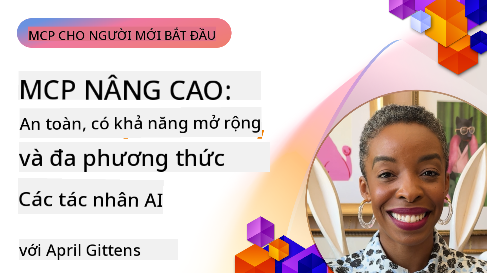

<!--
CO_OP_TRANSLATOR_METADATA:
{
  "original_hash": "d204bc94ea6027d06a703b21b711ca57",
  "translation_date": "2025-08-18T17:12:47+00:00",
  "source_file": "05-AdvancedTopics/README.md",
  "language_code": "vi"
}
-->
# Các Chủ Đề Nâng Cao trong MCP

_(Nhấp vào hình ảnh trên để xem video của bài học này)_

Chương này bao gồm một loạt các chủ đề nâng cao trong việc triển khai Model Context Protocol (MCP), bao gồm tích hợp đa phương thức, khả năng mở rộng, các thực tiễn tốt nhất về bảo mật, và tích hợp doanh nghiệp. Những chủ đề này rất quan trọng để xây dựng các ứng dụng MCP mạnh mẽ và sẵn sàng cho sản xuất, đáp ứng nhu cầu của các hệ thống AI hiện đại.

## Tổng Quan

Bài học này khám phá các khái niệm nâng cao trong việc triển khai Model Context Protocol, tập trung vào tích hợp đa phương thức, khả năng mở rộng, các thực tiễn tốt nhất về bảo mật, và tích hợp doanh nghiệp. Những chủ đề này rất cần thiết để xây dựng các ứng dụng MCP đạt tiêu chuẩn sản xuất, có thể xử lý các yêu cầu phức tạp trong môi trường doanh nghiệp.

## Mục Tiêu Học Tập

Sau khi hoàn thành bài học này, bạn sẽ có thể:

- Triển khai các khả năng đa phương thức trong các khung MCP
- Thiết kế kiến trúc MCP có khả năng mở rộng cho các tình huống có nhu cầu cao
- Áp dụng các thực tiễn tốt nhất về bảo mật phù hợp với nguyên tắc bảo mật của MCP
- Tích hợp MCP với các hệ thống và khung AI doanh nghiệp
- Tối ưu hóa hiệu suất và độ tin cậy trong môi trường sản xuất

## Bài Học và Dự Án Mẫu

| Liên Kết | Tiêu Đề | Mô Tả |
|----------|---------|-------|
| [5.1 Tích hợp với Azure](./mcp-integration/README.md) | Tích hợp với Azure | Tìm hiểu cách tích hợp MCP Server của bạn trên Azure |
| [5.2 Mẫu đa phương thức](./mcp-multi-modality/README.md) | Mẫu MCP đa phương thức | Các mẫu cho âm thanh, hình ảnh và phản hồi đa phương thức |
| [5.3 Mẫu OAuth2 MCP](../../../05-AdvancedTopics/mcp-oauth2-demo) | Demo OAuth2 MCP | Ứng dụng Spring Boot tối thiểu hiển thị OAuth2 với MCP, cả như Authorization và Resource Server. Minh họa việc phát hành token an toàn, các điểm cuối được bảo vệ, triển khai Azure Container Apps, và tích hợp API Management. |
| [5.4 Root Contexts](./mcp-root-contexts/README.md) | Root contexts | Tìm hiểu thêm về root context và cách triển khai chúng |
| [5.5 Routing](./mcp-routing/README.md) | Routing | Tìm hiểu các loại routing khác nhau |
| [5.6 Sampling](./mcp-sampling/README.md) | Sampling | Tìm hiểu cách làm việc với sampling |
| [5.7 Scaling](./mcp-scaling/README.md) | Scaling | Tìm hiểu về khả năng mở rộng |
| [5.8 Security](./mcp-security/README.md) | Security | Bảo vệ MCP Server của bạn |
| [5.9 Mẫu Tìm Kiếm Web](./web-search-mcp/README.md) | MCP Tìm Kiếm Web | MCP server và client Python tích hợp với SerpAPI để tìm kiếm web, tin tức, sản phẩm và Q&A theo thời gian thực. Minh họa sự phối hợp đa công cụ, tích hợp API bên ngoài, và xử lý lỗi mạnh mẽ. |
| [5.10 Phát Trực Tuyến Thời Gian Thực](./mcp-realtimestreaming/README.md) | Streaming | Phát trực tuyến dữ liệu thời gian thực đã trở thành yếu tố thiết yếu trong thế giới dựa trên dữ liệu ngày nay, nơi các doanh nghiệp và ứng dụng cần truy cập thông tin ngay lập tức để đưa ra quyết định kịp thời. |
| [5.11 Tìm Kiếm Web Thời Gian Thực](./mcp-realtimesearch/README.md) | Tìm Kiếm Web | Tìm kiếm web thời gian thực cách MCP biến đổi tìm kiếm web thời gian thực bằng cách cung cấp một phương pháp tiếp cận tiêu chuẩn hóa để quản lý ngữ cảnh giữa các mô hình AI, công cụ tìm kiếm, và ứng dụng. |
| [5.12 Xác Thực Entra ID cho Máy Chủ Model Context Protocol](./mcp-security-entra/README.md) | Xác Thực Entra ID | Microsoft Entra ID cung cấp một giải pháp quản lý danh tính và truy cập dựa trên đám mây mạnh mẽ, giúp đảm bảo rằng chỉ những người dùng và ứng dụng được ủy quyền mới có thể tương tác với máy chủ MCP của bạn. |
| [5.13 Tích Hợp Tác Nhân Azure AI Foundry](./mcp-foundry-agent-integration/README.md) | Tích Hợp Azure AI Foundry | Tìm hiểu cách tích hợp các máy chủ Model Context Protocol với các tác nhân Azure AI Foundry, cho phép phối hợp công cụ mạnh mẽ và khả năng AI doanh nghiệp với các kết nối nguồn dữ liệu bên ngoài được tiêu chuẩn hóa. |
| [5.14 Kỹ Thuật Ngữ Cảnh](./mcp-contextengineering/README.md) | Kỹ Thuật Ngữ Cảnh | Cơ hội tương lai của các kỹ thuật kỹ thuật ngữ cảnh cho các máy chủ MCP, bao gồm tối ưu hóa ngữ cảnh, quản lý ngữ cảnh động, và các chiến lược cho kỹ thuật prompt hiệu quả trong các khung MCP. |

## Tài Liệu Tham Khảo Bổ Sung

Để có thông tin mới nhất về các chủ đề MCP nâng cao, tham khảo:
- [Tài Liệu MCP](https://modelcontextprotocol.io/)
- [Đặc Tả MCP](https://spec.modelcontextprotocol.io/)
- [Kho GitHub](https://github.com/modelcontextprotocol)

## Những Điểm Chính

- Các triển khai MCP đa phương thức mở rộng khả năng AI vượt ra ngoài xử lý văn bản
- Khả năng mở rộng là yếu tố cần thiết cho triển khai doanh nghiệp và có thể được giải quyết thông qua mở rộng ngang và dọc
- Các biện pháp bảo mật toàn diện bảo vệ dữ liệu và đảm bảo kiểm soát truy cập đúng cách
- Tích hợp doanh nghiệp với các nền tảng như Azure OpenAI và Microsoft AI Foundry tăng cường khả năng MCP
- Các triển khai MCP nâng cao hưởng lợi từ kiến trúc được tối ưu hóa và quản lý tài nguyên cẩn thận

## Bài Tập

Thiết kế một triển khai MCP cấp doanh nghiệp cho một trường hợp sử dụng cụ thể:

1. Xác định các yêu cầu đa phương thức cho trường hợp sử dụng của bạn
2. Phác thảo các kiểm soát bảo mật cần thiết để bảo vệ dữ liệu nhạy cảm
3. Thiết kế một kiến trúc có khả năng mở rộng để xử lý tải thay đổi
4. Lên kế hoạch các điểm tích hợp với các hệ thống AI doanh nghiệp
5. Tài liệu hóa các nút thắt hiệu suất tiềm năng và các chiến lược giảm thiểu

## Tài Nguyên Bổ Sung

- [Tài Liệu Azure OpenAI](https://learn.microsoft.com/en-us/azure/ai-services/openai/)
- [Tài Liệu Microsoft AI Foundry](https://learn.microsoft.com/en-us/ai-services/)

---

## Tiếp Theo

- [5.1 Tích Hợp MCP](./mcp-integration/README.md)

**Tuyên bố miễn trừ trách nhiệm**:  
Tài liệu này đã được dịch bằng dịch vụ dịch thuật AI [Co-op Translator](https://github.com/Azure/co-op-translator). Mặc dù chúng tôi cố gắng đảm bảo độ chính xác, xin lưu ý rằng các bản dịch tự động có thể chứa lỗi hoặc sự không chính xác. Tài liệu gốc bằng ngôn ngữ bản địa nên được coi là nguồn tham khảo chính thức. Đối với các thông tin quan trọng, chúng tôi khuyến nghị sử dụng dịch vụ dịch thuật chuyên nghiệp từ con người. Chúng tôi không chịu trách nhiệm cho bất kỳ sự hiểu lầm hoặc diễn giải sai nào phát sinh từ việc sử dụng bản dịch này.