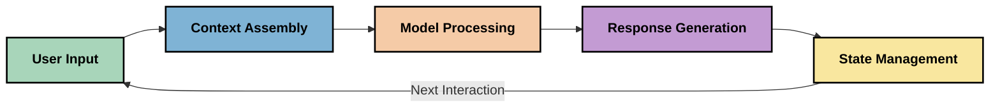
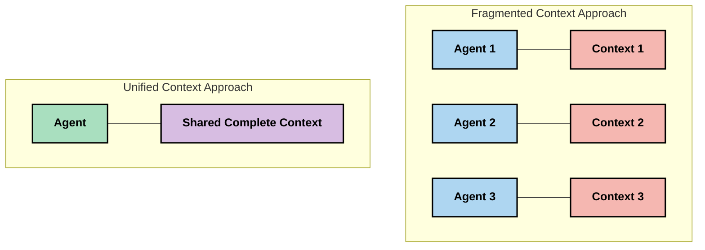
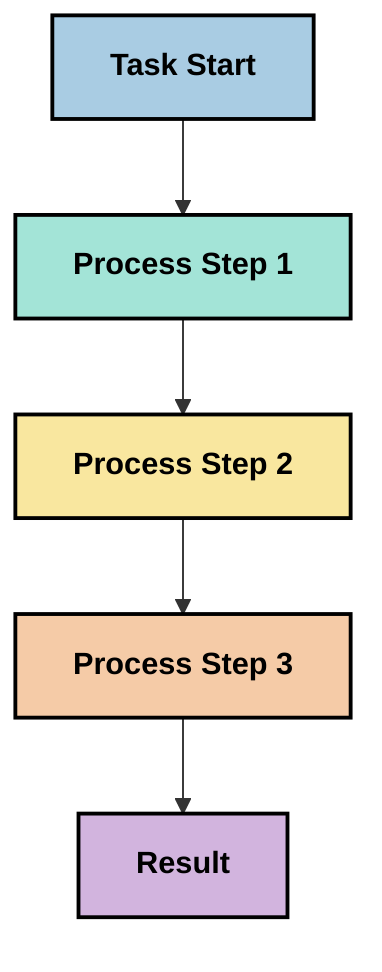
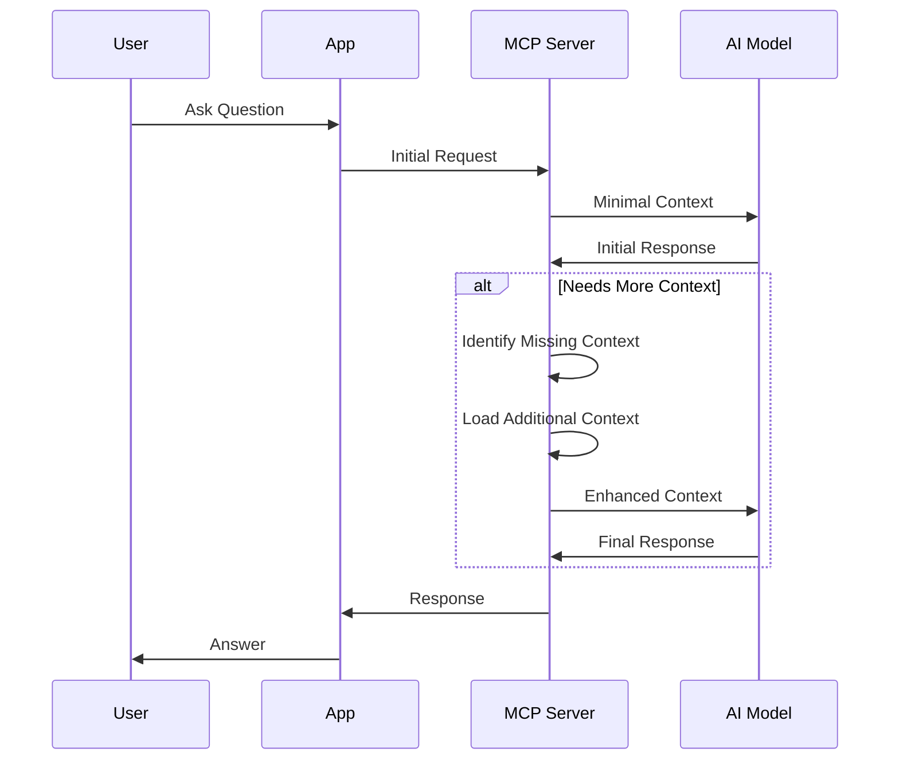
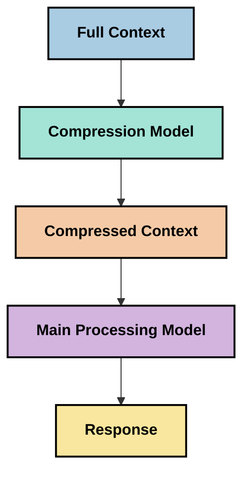

<!--
CO_OP_TRANSLATOR_METADATA:
{
  "original_hash": "5762e8e74dd99d8b7dbb31e69a82561e",
  "translation_date": "2025-07-17T08:40:13+00:00",
  "source_file": "05-AdvancedTopics/mcp-contextengineering/README.md",
  "language_code": "vi"
}
-->
# Kỹ Thuật Ngữ Cảnh: Một Khái Niệm Mới Nổi Trong Hệ Sinh Thái MCP

## Tổng Quan

Kỹ thuật ngữ cảnh là một khái niệm mới nổi trong lĩnh vực AI, nghiên cứu cách thông tin được cấu trúc, truyền tải và duy trì trong suốt quá trình tương tác giữa khách hàng và dịch vụ AI. Khi hệ sinh thái Model Context Protocol (MCP) phát triển, việc hiểu cách quản lý ngữ cảnh hiệu quả ngày càng trở nên quan trọng. Module này giới thiệu khái niệm kỹ thuật ngữ cảnh và khám phá các ứng dụng tiềm năng của nó trong các triển khai MCP.

## Mục Tiêu Học Tập

Sau khi hoàn thành module này, bạn sẽ có thể:

- Hiểu khái niệm mới nổi về kỹ thuật ngữ cảnh và vai trò tiềm năng của nó trong các ứng dụng MCP
- Nhận diện các thách thức chính trong quản lý ngữ cảnh mà thiết kế giao thức MCP hướng tới giải quyết
- Khám phá các kỹ thuật cải thiện hiệu suất mô hình thông qua quản lý ngữ cảnh tốt hơn
- Xem xét các phương pháp đo lường và đánh giá hiệu quả của ngữ cảnh
- Áp dụng các khái niệm mới nổi này để nâng cao trải nghiệm AI thông qua khung MCP

## Giới Thiệu Về Kỹ Thuật Ngữ Cảnh

Kỹ thuật ngữ cảnh là một khái niệm mới nổi tập trung vào việc thiết kế và quản lý có chủ đích luồng thông tin giữa người dùng, ứng dụng và mô hình AI. Khác với các lĩnh vực đã được thiết lập như kỹ thuật prompt, kỹ thuật ngữ cảnh vẫn đang được các chuyên gia định hình khi họ cố gắng giải quyết những thách thức đặc thù trong việc cung cấp cho mô hình AI thông tin đúng lúc, đúng chỗ.

Khi các mô hình ngôn ngữ lớn (LLMs) phát triển, tầm quan trọng của ngữ cảnh ngày càng rõ ràng. Chất lượng, sự liên quan và cấu trúc của ngữ cảnh mà chúng ta cung cấp ảnh hưởng trực tiếp đến kết quả đầu ra của mô hình. Kỹ thuật ngữ cảnh khám phá mối quan hệ này và tìm cách phát triển các nguyên tắc quản lý ngữ cảnh hiệu quả.

> "Vào năm 2025, các mô hình hiện nay cực kỳ thông minh. Nhưng ngay cả con người thông minh nhất cũng không thể làm việc hiệu quả nếu thiếu ngữ cảnh về những gì họ được yêu cầu làm... 'Kỹ thuật ngữ cảnh' là bước tiến tiếp theo của kỹ thuật prompt. Nó là việc thực hiện điều này một cách tự động trong một hệ thống động." — Walden Yan, Cognition AI

Kỹ thuật ngữ cảnh có thể bao gồm:

1. **Lựa chọn ngữ cảnh**: Xác định thông tin nào liên quan cho một nhiệm vụ cụ thể
2. **Cấu trúc ngữ cảnh**: Tổ chức thông tin để tối đa hóa khả năng hiểu của mô hình
3. **Truyền tải ngữ cảnh**: Tối ưu cách thức và thời điểm gửi thông tin đến mô hình
4. **Duy trì ngữ cảnh**: Quản lý trạng thái và sự phát triển của ngữ cảnh theo thời gian
5. **Đánh giá ngữ cảnh**: Đo lường và cải thiện hiệu quả của ngữ cảnh

Những lĩnh vực này đặc biệt quan trọng đối với hệ sinh thái MCP, vốn cung cấp một cách chuẩn hóa để các ứng dụng truyền ngữ cảnh đến LLMs.

## Góc Nhìn Hành Trình Ngữ Cảnh

Một cách để hình dung kỹ thuật ngữ cảnh là theo dõi hành trình thông tin đi qua hệ thống MCP:



### Các Giai Đoạn Chính Trong Hành Trình Ngữ Cảnh:

1. **Đầu vào người dùng**: Thông tin thô từ người dùng (văn bản, hình ảnh, tài liệu)
2. **Tập hợp ngữ cảnh**: Kết hợp đầu vào người dùng với ngữ cảnh hệ thống, lịch sử hội thoại và các thông tin được truy xuất khác
3. **Xử lý mô hình**: Mô hình AI xử lý ngữ cảnh đã tập hợp
4. **Tạo phản hồi**: Mô hình tạo ra kết quả dựa trên ngữ cảnh được cung cấp
5. **Quản lý trạng thái**: Hệ thống cập nhật trạng thái nội bộ dựa trên tương tác

Góc nhìn này làm nổi bật tính động của ngữ cảnh trong các hệ thống AI và đặt ra các câu hỏi quan trọng về cách quản lý thông tin tốt nhất ở mỗi giai đoạn.

## Các Nguyên Tắc Mới Nổi Trong Kỹ Thuật Ngữ Cảnh

Khi lĩnh vực kỹ thuật ngữ cảnh dần hình thành, một số nguyên tắc ban đầu bắt đầu xuất hiện từ các chuyên gia. Những nguyên tắc này có thể giúp định hướng các lựa chọn triển khai MCP:

### Nguyên Tắc 1: Chia Sẻ Ngữ Cảnh Một Cách Toàn Diện

Ngữ cảnh nên được chia sẻ đầy đủ giữa tất cả các thành phần của hệ thống thay vì bị phân mảnh qua nhiều tác nhân hoặc quy trình. Khi ngữ cảnh bị phân tán, các quyết định được đưa ra ở một phần của hệ thống có thể mâu thuẫn với các quyết định ở phần khác.



Trong các ứng dụng MCP, điều này gợi ý thiết kế hệ thống nơi ngữ cảnh chảy liền mạch qua toàn bộ quy trình thay vì bị chia nhỏ.

### Nguyên Tắc 2: Nhận Thức Rằng Hành Động Mang Theo Quyết Định Ngầm Định

Mỗi hành động mà mô hình thực hiện đều chứa đựng các quyết định ngầm định về cách hiểu ngữ cảnh. Khi nhiều thành phần hoạt động trên các ngữ cảnh khác nhau, những quyết định ngầm định này có thể mâu thuẫn, dẫn đến kết quả không nhất quán.

Nguyên tắc này có ý nghĩa quan trọng đối với các ứng dụng MCP:
- Ưu tiên xử lý tuyến tính các nhiệm vụ phức tạp thay vì thực thi song song với ngữ cảnh phân mảnh
- Đảm bảo tất cả các điểm quyết định đều có quyền truy cập vào cùng một thông tin ngữ cảnh
- Thiết kế hệ thống để các bước sau có thể nhìn thấy toàn bộ ngữ cảnh của các quyết định trước đó

### Nguyên Tắc 3: Cân Bằng Độ Sâu Ngữ Cảnh Với Giới Hạn Cửa Sổ

Khi các cuộc hội thoại và quy trình kéo dài, cửa sổ ngữ cảnh cuối cùng sẽ bị tràn. Kỹ thuật ngữ cảnh hiệu quả khám phá các cách tiếp cận để quản lý sự căng thẳng giữa ngữ cảnh toàn diện và giới hạn kỹ thuật.

Các phương pháp tiềm năng đang được nghiên cứu bao gồm:
- Nén ngữ cảnh giữ lại thông tin thiết yếu trong khi giảm lượng token sử dụng
- Tải ngữ cảnh theo tiến trình dựa trên mức độ liên quan với nhu cầu hiện tại
- Tóm tắt các tương tác trước đó đồng thời bảo tồn các quyết định và sự kiện quan trọng

## Thách Thức Ngữ Cảnh và Thiết Kế Giao Thức MCP

Model Context Protocol (MCP) được thiết kế với nhận thức về những thách thức đặc thù trong quản lý ngữ cảnh. Hiểu các thách thức này giúp giải thích các khía cạnh chính trong thiết kế giao thức MCP:

### Thách Thức 1: Giới Hạn Cửa Sổ Ngữ Cảnh  
Hầu hết các mô hình AI có kích thước cửa sổ ngữ cảnh cố định, giới hạn lượng thông tin có thể xử lý cùng lúc.

**Phản hồi thiết kế MCP:**  
- Giao thức hỗ trợ ngữ cảnh có cấu trúc, dựa trên tài nguyên có thể tham chiếu hiệu quả  
- Tài nguyên có thể được phân trang và tải dần

### Thách Thức 2: Xác Định Mức Độ Liên Quan  
Việc xác định thông tin nào là quan trọng nhất để đưa vào ngữ cảnh rất khó khăn.

**Phản hồi thiết kế MCP:**  
- Công cụ linh hoạt cho phép truy xuất thông tin động theo nhu cầu  
- Prompt có cấu trúc giúp tổ chức ngữ cảnh nhất quán

### Thách Thức 3: Duy Trì Ngữ Cảnh  
Quản lý trạng thái qua các tương tác đòi hỏi theo dõi ngữ cảnh cẩn thận.

**Phản hồi thiết kế MCP:**  
- Quản lý phiên chuẩn hóa  
- Mẫu tương tác rõ ràng cho sự phát triển ngữ cảnh

### Thách Thức 4: Ngữ Cảnh Đa Phương Thức  
Các loại dữ liệu khác nhau (văn bản, hình ảnh, dữ liệu có cấu trúc) cần cách xử lý khác nhau.

**Phản hồi thiết kế MCP:**  
- Thiết kế giao thức hỗ trợ nhiều loại nội dung  
- Đại diện chuẩn hóa cho thông tin đa phương thức

### Thách Thức 5: Bảo Mật và Quyền Riêng Tư  
Ngữ cảnh thường chứa thông tin nhạy cảm cần được bảo vệ.

**Phản hồi thiết kế MCP:**  
- Ranh giới rõ ràng giữa trách nhiệm của client và server  
- Tùy chọn xử lý cục bộ để giảm thiểu rủi ro lộ dữ liệu

Hiểu các thách thức này và cách MCP giải quyết chúng tạo nền tảng để khám phá các kỹ thuật kỹ thuật ngữ cảnh tiên tiến hơn.

## Các Phương Pháp Kỹ Thuật Ngữ Cảnh Mới Nổi

Khi lĩnh vực kỹ thuật ngữ cảnh phát triển, một số phương pháp hứa hẹn đang xuất hiện. Đây là những suy nghĩ hiện tại chứ không phải thực hành đã được khẳng định, và có thể thay đổi khi chúng ta có thêm kinh nghiệm với các triển khai MCP.

### 1. Xử Lý Tuyến Tính Đơn Luồng

Trái ngược với kiến trúc đa tác nhân phân phối ngữ cảnh, một số chuyên gia nhận thấy xử lý tuyến tính đơn luồng cho kết quả nhất quán hơn. Điều này phù hợp với nguyên tắc duy trì ngữ cảnh thống nhất.



Mặc dù cách tiếp cận này có vẻ kém hiệu quả hơn xử lý song song, nó thường tạo ra kết quả mạch lạc và đáng tin cậy hơn vì mỗi bước xây dựng dựa trên sự hiểu biết đầy đủ về các quyết định trước đó.

### 2. Chia Nhỏ và Ưu Tiên Ngữ Cảnh

Phân tách ngữ cảnh lớn thành các phần dễ quản lý và ưu tiên những phần quan trọng nhất.

```python
# Conceptual Example: Context Chunking and Prioritization
def process_with_chunked_context(documents, query):
    # 1. Break documents into smaller chunks
    chunks = chunk_documents(documents)
    
    # 2. Calculate relevance scores for each chunk
    scored_chunks = [(chunk, calculate_relevance(chunk, query)) for chunk in chunks]
    
    # 3. Sort chunks by relevance score
    sorted_chunks = sorted(scored_chunks, key=lambda x: x[1], reverse=True)
    
    # 4. Use the most relevant chunks as context
    context = create_context_from_chunks([chunk for chunk, score in sorted_chunks[:5]])
    
    # 5. Process with the prioritized context
    return generate_response(context, query)
```

Khái niệm trên minh họa cách chúng ta có thể chia nhỏ tài liệu lớn thành các phần dễ xử lý và chỉ chọn những phần liên quan nhất cho ngữ cảnh. Cách này giúp làm việc trong giới hạn cửa sổ ngữ cảnh đồng thời tận dụng được kho tri thức lớn.

### 3. Tải Ngữ Cảnh Theo Tiến Trình

Tải ngữ cảnh dần dần khi cần thay vì tải toàn bộ cùng lúc.



Tải ngữ cảnh theo tiến trình bắt đầu với ngữ cảnh tối thiểu và mở rộng chỉ khi cần thiết. Điều này có thể giảm đáng kể lượng token sử dụng cho các truy vấn đơn giản trong khi vẫn giữ khả năng xử lý các câu hỏi phức tạp.

### 4. Nén và Tóm Tắt Ngữ Cảnh

Giảm kích thước ngữ cảnh trong khi giữ lại thông tin thiết yếu.



Nén ngữ cảnh tập trung vào:  
- Loại bỏ thông tin trùng lặp  
- Tóm tắt nội dung dài  
- Trích xuất các sự kiện và chi tiết quan trọng  
- Bảo tồn các yếu tố ngữ cảnh then chốt  
- Tối ưu hóa sử dụng token

Cách tiếp cận này đặc biệt hữu ích để duy trì các cuộc hội thoại dài trong giới hạn cửa sổ ngữ cảnh hoặc xử lý tài liệu lớn hiệu quả. Một số chuyên gia sử dụng các mô hình chuyên biệt dành riêng cho nén và tóm tắt lịch sử hội thoại.

## Các Cân Nhắc Khám Phá Trong Kỹ Thuật Ngữ Cảnh

Khi khám phá lĩnh vực kỹ thuật ngữ cảnh mới nổi, có một số cân nhắc đáng lưu ý khi làm việc với các triển khai MCP. Đây không phải là các thực hành bắt buộc mà là các lĩnh vực khám phá có thể mang lại cải tiến cho trường hợp sử dụng cụ thể của bạn.

### Xác Định Mục Tiêu Ngữ Cảnh

Trước khi triển khai các giải pháp quản lý ngữ cảnh phức tạp, hãy làm rõ bạn muốn đạt được điều gì:  
- Mô hình cần thông tin cụ thể nào để thành công?  
- Thông tin nào là thiết yếu, thông tin nào là bổ sung?  
- Giới hạn hiệu suất của bạn là gì (độ trễ, giới hạn token, chi phí)?

### Khám Phá Các Cách Tiếp Cận Ngữ Cảnh Theo Lớp

Một số chuyên gia thành công với ngữ cảnh được sắp xếp theo các lớp khái niệm:  
- **Lớp cốt lõi**: Thông tin thiết yếu mà mô hình luôn cần  
- **Lớp tình huống**: Ngữ cảnh đặc thù cho tương tác hiện tại  
- **Lớp hỗ trợ**: Thông tin bổ sung có thể hữu ích  
- **Lớp dự phòng**: Thông tin chỉ truy cập khi cần

### Nghiên Cứu Chiến Lược Truy Xuất

Hiệu quả của ngữ cảnh thường phụ thuộc vào cách bạn truy xuất thông tin:  
- Tìm kiếm ngữ nghĩa và embeddings để tìm thông tin liên quan về mặt khái niệm  
- Tìm kiếm dựa trên từ khóa cho các chi tiết thực tế cụ thể  
- Phương pháp kết hợp nhiều cách truy xuất  
- Lọc metadata để thu hẹp phạm vi dựa trên danh mục, ngày tháng hoặc nguồn

### Thử Nghiệm Tính Mạch Lạc Của Ngữ Cảnh

Cấu trúc và luồng ngữ cảnh có thể ảnh hưởng đến khả năng hiểu của mô hình:  
- Gom nhóm các thông tin liên quan lại với nhau  
- Sử dụng định dạng và tổ chức nhất quán  
- Duy trì thứ tự logic hoặc theo thời gian khi phù hợp  
- Tránh thông tin mâu thuẫn

### Cân Nhắc Ưu Nhược Của Kiến Trúc Đa Tác Nhân

Mặc dù kiến trúc đa tác nhân phổ biến trong nhiều khung AI, chúng đi kèm với những thách thức lớn trong quản lý ngữ cảnh:  
- Phân mảnh ngữ cảnh có thể dẫn đến quyết định không nhất quán giữa các tác nhân  
- Xử lý song song có thể gây ra xung đột khó hòa giải  
- Chi phí giao tiếp giữa các tác nhân có thể làm giảm lợi ích hiệu suất  
- Quản lý trạng thái phức tạp để duy trì tính mạch lạc

Trong nhiều trường hợp, cách tiếp cận đơn tác nhân với quản lý ngữ cảnh toàn diện có thể tạo ra kết quả đáng tin cậy hơn so với nhiều tác nhân chuyên biệt với ngữ cảnh phân mảnh.

### Phát Triển Phương Pháp Đánh Giá

Để cải thiện kỹ thuật ngữ cảnh theo thời gian, hãy cân nhắc cách bạn sẽ đo lường thành công:  
- Thử nghiệm A/B với các cấu trúc ngữ cảnh khác nhau  
- Giám sát lượng token sử dụng và thời gian phản hồi  
- Theo dõi mức độ hài lòng của người dùng và tỷ lệ hoàn thành nhiệm vụ  
- Phân tích khi nào và tại sao các chiến lược ngữ cảnh thất bại

Những cân nhắc này là các lĩnh vực khám phá tích cực trong không gian kỹ thuật ngữ cảnh. Khi lĩnh vực trưởng thành, các mẫu và thực hành rõ ràng hơn có thể sẽ xuất hiện.

## Đo Lường Hiệu Quả Ngữ Cảnh: Một Khung Đang Phát Triển

Khi kỹ thuật ngữ cảnh trở thành một khái niệm, các chuyên gia bắt đầu khám phá cách đo lường hiệu quả của nó. Hiện chưa có khung chuẩn nào, nhưng nhiều chỉ số đang được xem xét để hướng dẫn công việc trong tương lai.

### Các Chiều Đo Lường Tiềm Năng

#### 1. Cân Nhắc Hiệu Quả Đầu Vào

- **Tỷ lệ Ngữ Cảnh - Phản Hồi**: Cần bao nhiêu ngữ cảnh so với kích thước phản hồi?  
- **Sử Dụng Token**: Bao nhiêu phần trăm token ngữ cảnh được sử dụng để ảnh hưởng đến phản hồi?  
- **Giảm Ngữ Cảnh**: Khả năng nén thông tin thô hiệu quả đến đâu?

#### 2. Cân Nhắc Hiệu Suất

- **Ảnh Hưởng Độ Trễ**: Quản lý ngữ cảnh ảnh hưởng thế nào đến thời gian phản hồi?  
- **Kinh Tế Token**: Có tối ưu hóa việc sử dụng token không?  
- **Độ Chính Xác Truy Xuất**: Thông tin truy xuất có liên quan đến mức nào?  
- **Sử Dụng Tài Nguyên**: Cần bao nhiêu tài nguyên tính toán?

#### 3. Cân Nhắc Chất Lượng

- **Mức Độ Liên Quan Phản Hồi**: Phản hồi có đáp ứng tốt câu hỏi không?  
- **Độ Chính Xác Thực Tế**: Quản lý ngữ cảnh có cải thiện độ chính xác không?  
- **Tính Nhất Quán**: Phản hồi có nhất quán với các truy vấn tương tự không?  
- **Tỷ Lệ Ảo Tưởng**: Ngữ cảnh tốt hơn có giảm hiện tượng mô hình tạo thông tin sai không?

#### 4. Cân Nhắc Trải Nghiệm Người Dùng

- **Tỷ Lệ Hỏi Lại**: Người dùng cần làm rõ bao nhiêu lần?  
- **Hoàn Thành Nhiệm Vụ**: Người dùng có hoàn thành mục tiêu không?  
- **Chỉ Số Hài Lòng**: Người dùng đánh giá trải nghiệm thế nào?

### Các Phương Pháp Khám Phá Đo Lường

Khi thử nghiệm kỹ thuật ngữ cảnh trong các triển khai MCP, hãy cân nhắc các phương pháp sau:

1. **So
- [Model Context Protocol Website](https://modelcontextprotocol.io/)
- [Model Context Protocol Specification](https://github.com/modelcontextprotocol/modelcontextprotocol)
- [MCP Documentation](https://modelcontextprotocol.io/docs)
- [MCP C# SDK](https://github.com/modelcontextprotocol/csharp-sdk)
- [MCP Python SDK](https://github.com/modelcontextprotocol/python-sdk)
- [MCP TypeScript SDK](https://github.com/modelcontextprotocol/typescript-sdk)
- [MCP Inspector](https://github.com/modelcontextprotocol/inspector) - Công cụ kiểm thử trực quan cho các máy chủ MCP

### Bài viết về Kỹ thuật Ngữ cảnh
- [Đừng Xây Dựng Multi-Agents: Nguyên tắc của Kỹ thuật Ngữ cảnh](https://cognition.ai/blog/dont-build-multi-agents) - Những hiểu biết của Walden Yan về nguyên tắc kỹ thuật ngữ cảnh
- [Hướng dẫn Thực tiễn để Xây dựng Agents](https://cdn.openai.com/business-guides-and-resources/a-practical-guide-to-building-agents.pdf) - Hướng dẫn của OpenAI về thiết kế agent hiệu quả
- [Xây dựng Agents Hiệu quả](https://www.anthropic.com/engineering/building-effective-agents) - Phương pháp phát triển agent của Anthropic

### Nghiên cứu Liên quan
- [Tăng cường Truy xuất Động cho Mô hình Ngôn ngữ Lớn](https://arxiv.org/abs/2310.01487) - Nghiên cứu về các phương pháp truy xuất động
- [Lạc giữa đoạn giữa: Cách Mô hình Ngôn ngữ Sử dụng Ngữ cảnh Dài](https://arxiv.org/abs/2307.03172) - Nghiên cứu quan trọng về các mẫu xử lý ngữ cảnh
- [Tạo hình ảnh có điều kiện văn bản phân cấp với CLIP Latents](https://arxiv.org/abs/2204.06125) - Bài báo DALL-E 2 với những hiểu biết về cấu trúc ngữ cảnh
- [Khám phá Vai trò của Ngữ cảnh trong Kiến trúc Mô hình Ngôn ngữ Lớn](https://aclanthology.org/2023.findings-emnlp.124/) - Nghiên cứu gần đây về xử lý ngữ cảnh
- [Hợp tác Đa tác nhân: Tổng quan](https://arxiv.org/abs/2304.03442) - Nghiên cứu về hệ thống đa tác nhân và những thách thức của chúng

### Tài nguyên Bổ sung
- [Kỹ thuật Tối ưu Cửa sổ Ngữ cảnh](https://learn.microsoft.com/en-us/azure/ai-services/openai/concepts/context-window)
- [Kỹ thuật RAG Nâng cao](https://www.microsoft.com/en-us/research/blog/retrieval-augmented-generation-rag-and-frontier-models/)
- [Tài liệu Semantic Kernel](https://github.com/microsoft/semantic-kernel)
- [Bộ công cụ AI cho Quản lý Ngữ cảnh](https://github.com/microsoft/aitoolkit)

## Tiếp theo là gì
- [6. Đóng góp từ Cộng đồng](../../06-CommunityContributions/README.md)

**Tuyên bố từ chối trách nhiệm**:  
Tài liệu này đã được dịch bằng dịch vụ dịch thuật AI [Co-op Translator](https://github.com/Azure/co-op-translator). Mặc dù chúng tôi cố gắng đảm bảo độ chính xác, xin lưu ý rằng các bản dịch tự động có thể chứa lỗi hoặc không chính xác. Tài liệu gốc bằng ngôn ngữ gốc của nó nên được coi là nguồn chính xác và đáng tin cậy. Đối với các thông tin quan trọng, nên sử dụng dịch vụ dịch thuật chuyên nghiệp do con người thực hiện. Chúng tôi không chịu trách nhiệm về bất kỳ sự hiểu lầm hoặc giải thích sai nào phát sinh từ việc sử dụng bản dịch này.