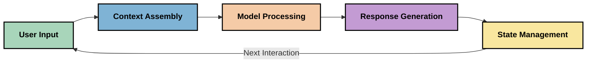
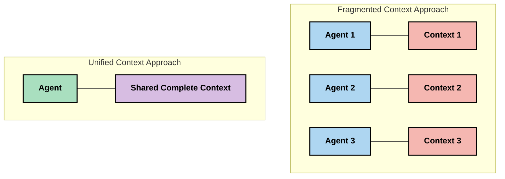
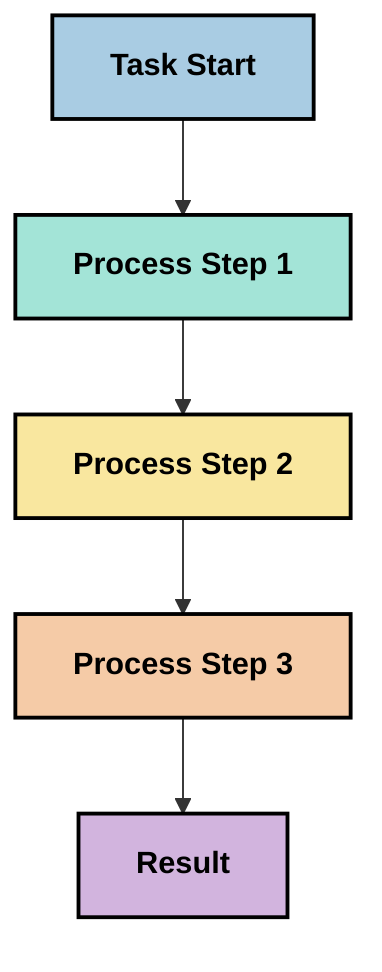
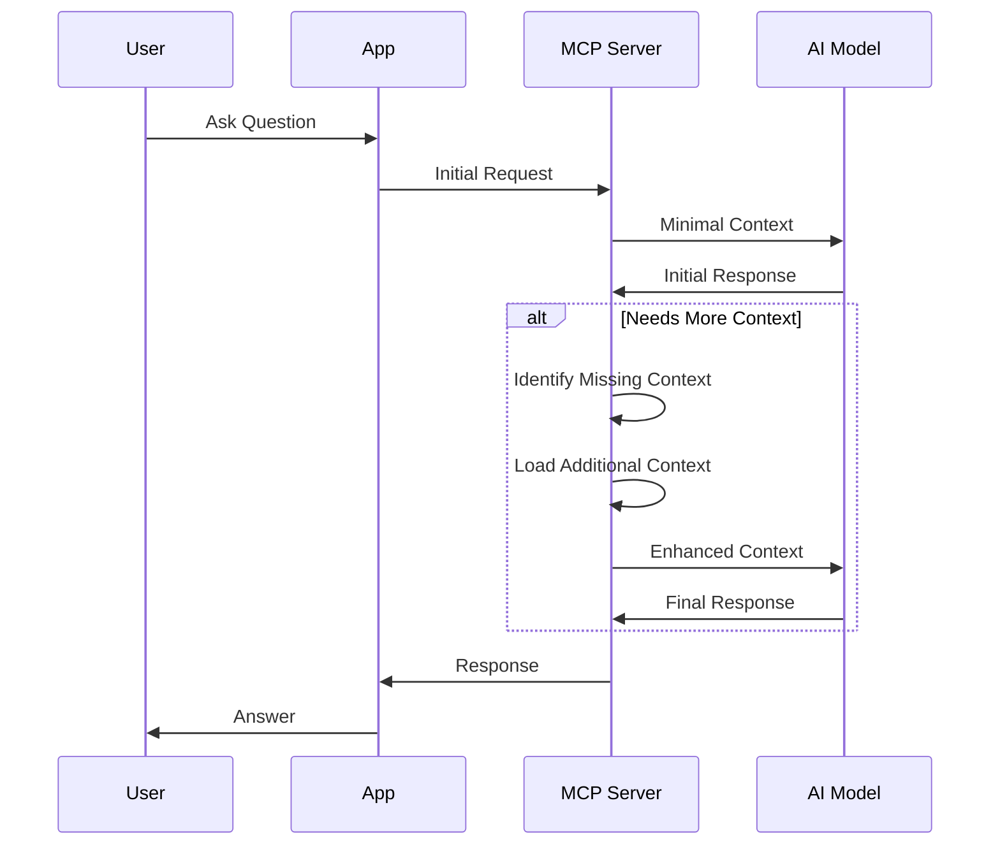
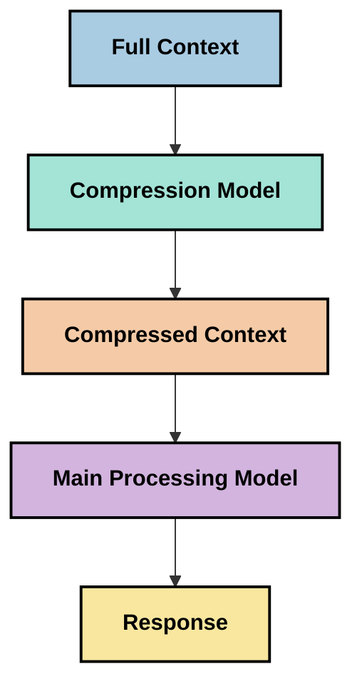

<!--
CO_OP_TRANSLATOR_METADATA:
{
  "original_hash": "fd169ca3071b81b5ee282e194bc823df",
  "translation_date": "2025-09-15T20:47:14+00:00",
  "source_file": "05-AdvancedTopics/mcp-contextengineering/README.md",
  "language_code": "vi"
}
-->
# Kỹ thuật Ngữ cảnh: Một Khái Niệm Mới Trong Hệ Sinh Thái MCP

## Tổng quan

Kỹ thuật ngữ cảnh là một khái niệm mới nổi trong lĩnh vực AI, tập trung vào cách thông tin được cấu trúc, truyền tải và duy trì trong suốt các tương tác giữa khách hàng và dịch vụ AI. Khi hệ sinh thái Model Context Protocol (MCP) phát triển, việc hiểu cách quản lý ngữ cảnh hiệu quả ngày càng trở nên quan trọng. Module này giới thiệu khái niệm kỹ thuật ngữ cảnh và khám phá các ứng dụng tiềm năng của nó trong các triển khai MCP.

## Mục tiêu học tập

Sau khi hoàn thành module này, bạn sẽ có thể:

- Hiểu khái niệm mới nổi về kỹ thuật ngữ cảnh và vai trò tiềm năng của nó trong các ứng dụng MCP
- Xác định các thách thức chính trong quản lý ngữ cảnh mà thiết kế giao thức MCP giải quyết
- Khám phá các kỹ thuật cải thiện hiệu suất mô hình thông qua xử lý ngữ cảnh tốt hơn
- Xem xét các phương pháp đo lường và đánh giá hiệu quả ngữ cảnh
- Áp dụng các khái niệm mới nổi này để cải thiện trải nghiệm AI thông qua khung MCP

## Giới thiệu về Kỹ thuật Ngữ cảnh

Kỹ thuật ngữ cảnh là một khái niệm mới nổi tập trung vào việc thiết kế và quản lý có chủ đích luồng thông tin giữa người dùng, ứng dụng và mô hình AI. Không giống như các lĩnh vực đã được thiết lập như kỹ thuật gợi ý, kỹ thuật ngữ cảnh vẫn đang được các nhà thực hành định hình khi họ làm việc để giải quyết các thách thức độc đáo trong việc cung cấp cho mô hình AI thông tin phù hợp vào đúng thời điểm.

Khi các mô hình ngôn ngữ lớn (LLMs) phát triển, tầm quan trọng của ngữ cảnh ngày càng trở nên rõ ràng. Chất lượng, mức độ liên quan và cấu trúc của ngữ cảnh mà chúng ta cung cấp ảnh hưởng trực tiếp đến đầu ra của mô hình. Kỹ thuật ngữ cảnh khám phá mối quan hệ này và tìm cách phát triển các nguyên tắc để quản lý ngữ cảnh hiệu quả.

> "Vào năm 2025, các mô hình ngoài kia cực kỳ thông minh. Nhưng ngay cả con người thông minh nhất cũng không thể làm việc hiệu quả nếu không có ngữ cảnh về những gì họ được yêu cầu làm... 'Kỹ thuật ngữ cảnh' là cấp độ tiếp theo của kỹ thuật gợi ý. Nó là về việc thực hiện điều này một cách tự động trong một hệ thống động." — Walden Yan, Cognition AI

Kỹ thuật ngữ cảnh có thể bao gồm:

1. **Lựa chọn Ngữ cảnh**: Xác định thông tin nào phù hợp với một nhiệm vụ cụ thể
2. **Cấu trúc Ngữ cảnh**: Tổ chức thông tin để tối đa hóa khả năng hiểu của mô hình
3. **Truyền tải Ngữ cảnh**: Tối ưu hóa cách và thời điểm thông tin được gửi đến mô hình
4. **Duy trì Ngữ cảnh**: Quản lý trạng thái và sự phát triển của ngữ cảnh theo thời gian
5. **Đánh giá Ngữ cảnh**: Đo lường và cải thiện hiệu quả của ngữ cảnh

Các lĩnh vực tập trung này đặc biệt liên quan đến hệ sinh thái MCP, cung cấp một cách tiêu chuẩn hóa để các ứng dụng cung cấp ngữ cảnh cho LLMs.

## Quan điểm Hành trình Ngữ cảnh

Một cách để hình dung kỹ thuật ngữ cảnh là theo dõi hành trình thông tin đi qua một hệ thống MCP:



### Các giai đoạn chính trong Hành trình Ngữ cảnh:

1. **Đầu vào của Người dùng**: Thông tin thô từ người dùng (văn bản, hình ảnh, tài liệu)
2. **Lắp ráp Ngữ cảnh**: Kết hợp đầu vào của người dùng với ngữ cảnh hệ thống, lịch sử hội thoại và thông tin được truy xuất khác
3. **Xử lý Mô hình**: Mô hình AI xử lý ngữ cảnh đã lắp ráp
4. **Tạo Phản hồi**: Mô hình tạo ra đầu ra dựa trên ngữ cảnh được cung cấp
5. **Quản lý Trạng thái**: Hệ thống cập nhật trạng thái nội bộ dựa trên tương tác

Quan điểm này làm nổi bật bản chất động của ngữ cảnh trong các hệ thống AI và đặt ra các câu hỏi quan trọng về cách quản lý thông tin tốt nhất ở mỗi giai đoạn.

## Các Nguyên tắc Mới Nổi trong Kỹ thuật Ngữ cảnh

Khi lĩnh vực kỹ thuật ngữ cảnh hình thành, một số nguyên tắc ban đầu đang bắt đầu xuất hiện từ các nhà thực hành. Những nguyên tắc này có thể giúp định hình các lựa chọn triển khai MCP.

### Nguyên tắc 1: Chia sẻ Ngữ cảnh Hoàn toàn

Ngữ cảnh nên được chia sẻ hoàn toàn giữa tất cả các thành phần của hệ thống thay vì bị phân mảnh qua nhiều tác nhân hoặc quy trình. Khi ngữ cảnh bị phân tán, các quyết định được thực hiện ở một phần của hệ thống có thể mâu thuẫn với các quyết định được thực hiện ở nơi khác.



Trong các ứng dụng MCP, điều này gợi ý thiết kế các hệ thống nơi ngữ cảnh chảy liền mạch qua toàn bộ quy trình thay vì bị phân chia.

### Nguyên tắc 2: Nhận thức rằng Hành động Mang Quyết định Ngầm

Mỗi hành động mà mô hình thực hiện đều bao hàm các quyết định ngầm về cách diễn giải ngữ cảnh. Khi nhiều thành phần hành động trên các ngữ cảnh khác nhau, các quyết định ngầm này có thể mâu thuẫn, dẫn đến kết quả không nhất quán.

Nguyên tắc này có những tác động quan trọng đối với các ứng dụng MCP:
- Ưu tiên xử lý tuyến tính các nhiệm vụ phức tạp hơn là thực thi song song với ngữ cảnh phân mảnh
- Đảm bảo rằng tất cả các điểm quyết định đều có quyền truy cập vào cùng một thông tin ngữ cảnh
- Thiết kế các hệ thống nơi các bước sau có thể thấy toàn bộ ngữ cảnh của các quyết định trước đó

### Nguyên tắc 3: Cân bằng Độ sâu Ngữ cảnh với Giới hạn Cửa sổ

Khi các cuộc hội thoại và quy trình trở nên dài hơn, cửa sổ ngữ cảnh cuối cùng sẽ tràn. Kỹ thuật ngữ cảnh hiệu quả khám phá các phương pháp để quản lý sự căng thẳng này giữa ngữ cảnh toàn diện và các giới hạn kỹ thuật.

Các phương pháp tiềm năng đang được khám phá bao gồm:
- Nén ngữ cảnh để duy trì thông tin thiết yếu trong khi giảm sử dụng token
- Tải ngữ cảnh tiến bộ dựa trên mức độ liên quan đến nhu cầu hiện tại
- Tóm tắt các tương tác trước đó trong khi bảo tồn các quyết định và sự kiện chính

## Các Thách thức Ngữ cảnh và Thiết kế Giao thức MCP

Model Context Protocol (MCP) được thiết kế với nhận thức về các thách thức độc đáo của quản lý ngữ cảnh. Hiểu các thách thức này giúp giải thích các khía cạnh chính của thiết kế giao thức MCP:

### Thách thức 1: Giới hạn Cửa sổ Ngữ cảnh
Hầu hết các mô hình AI có kích thước cửa sổ ngữ cảnh cố định, giới hạn lượng thông tin chúng có thể xử lý cùng lúc.

**Phản hồi Thiết kế MCP:** 
- Giao thức hỗ trợ ngữ cảnh dựa trên tài nguyên có cấu trúc, có thể được tham chiếu hiệu quả
- Các tài nguyên có thể được phân trang và tải tiến bộ

### Thách thức 2: Xác định Mức độ Liên quan
Xác định thông tin nào là quan trọng nhất để đưa vào ngữ cảnh là một nhiệm vụ khó khăn.

**Phản hồi Thiết kế MCP:**
- Công cụ linh hoạt cho phép truy xuất thông tin động dựa trên nhu cầu
- Gợi ý có cấu trúc cho phép tổ chức ngữ cảnh nhất quán

### Thách thức 3: Duy trì Ngữ cảnh
Quản lý trạng thái qua các tương tác đòi hỏi theo dõi ngữ cảnh cẩn thận.

**Phản hồi Thiết kế MCP:**
- Quản lý phiên tiêu chuẩn hóa
- Các mẫu tương tác được xác định rõ ràng cho sự phát triển ngữ cảnh

### Thách thức 4: Ngữ cảnh Đa phương tiện
Các loại dữ liệu khác nhau (văn bản, hình ảnh, dữ liệu có cấu trúc) yêu cầu xử lý khác nhau.

**Phản hồi Thiết kế MCP:**
- Thiết kế giao thức phù hợp với các loại nội dung khác nhau
- Đại diện tiêu chuẩn hóa cho thông tin đa phương tiện

### Thách thức 5: Bảo mật và Quyền riêng tư
Ngữ cảnh thường chứa thông tin nhạy cảm cần được bảo vệ.

**Phản hồi Thiết kế MCP:**
- Ranh giới rõ ràng giữa trách nhiệm của khách hàng và máy chủ
- Tùy chọn xử lý cục bộ để giảm thiểu việc lộ dữ liệu

Hiểu các thách thức này và cách MCP giải quyết chúng cung cấp nền tảng để khám phá các kỹ thuật kỹ thuật ngữ cảnh tiên tiến hơn.

## Các Phương pháp Kỹ thuật Ngữ cảnh Mới Nổi

Khi lĩnh vực kỹ thuật ngữ cảnh phát triển, một số phương pháp đầy hứa hẹn đang xuất hiện. Những phương pháp này đại diện cho suy nghĩ hiện tại hơn là các thực hành đã được thiết lập, và có thể sẽ phát triển khi chúng ta có thêm kinh nghiệm với các triển khai MCP.

### 1. Xử lý Tuyến tính Một luồng

Trái ngược với các kiến trúc đa tác nhân phân phối ngữ cảnh, một số nhà thực hành nhận thấy rằng xử lý tuyến tính một luồng tạo ra kết quả nhất quán hơn. Điều này phù hợp với nguyên tắc duy trì ngữ cảnh thống nhất.



Mặc dù phương pháp này có vẻ kém hiệu quả hơn so với xử lý song song, nó thường tạo ra kết quả mạch lạc và đáng tin cậy hơn vì mỗi bước xây dựng dựa trên sự hiểu biết đầy đủ về các quyết định trước đó.

### 2. Phân đoạn và Ưu tiên Ngữ cảnh

Chia ngữ cảnh lớn thành các phần có thể quản lý được và ưu tiên những phần quan trọng nhất.

```python
# Conceptual Example: Context Chunking and Prioritization
def process_with_chunked_context(documents, query):
    # 1. Break documents into smaller chunks
    chunks = chunk_documents(documents)
    
    # 2. Calculate relevance scores for each chunk
    scored_chunks = [(chunk, calculate_relevance(chunk, query)) for chunk in chunks]
    
    # 3. Sort chunks by relevance score
    sorted_chunks = sorted(scored_chunks, key=lambda x: x[1], reverse=True)
    
    # 4. Use the most relevant chunks as context
    context = create_context_from_chunks([chunk for chunk, score in sorted_chunks[:5]])
    
    # 5. Process with the prioritized context
    return generate_response(context, query)
```

Khái niệm trên minh họa cách chúng ta có thể chia các tài liệu lớn thành các phần có thể quản lý được và chỉ chọn những phần liên quan nhất cho ngữ cảnh. Phương pháp này có thể giúp làm việc trong giới hạn cửa sổ ngữ cảnh trong khi vẫn tận dụng các cơ sở kiến thức lớn.

### 3. Tải Ngữ cảnh Tiến bộ

Tải ngữ cảnh tiến bộ khi cần thiết thay vì tất cả cùng một lúc.



Tải ngữ cảnh tiến bộ bắt đầu với ngữ cảnh tối thiểu và chỉ mở rộng khi cần thiết. Điều này có thể giảm đáng kể việc sử dụng token cho các truy vấn đơn giản trong khi vẫn duy trì khả năng xử lý các câu hỏi phức tạp.

### 4. Nén và Tóm tắt Ngữ cảnh

Giảm kích thước ngữ cảnh trong khi bảo tồn thông tin thiết yếu.



Nén ngữ cảnh tập trung vào:
- Loại bỏ thông tin dư thừa
- Tóm tắt nội dung dài
- Trích xuất các sự kiện và chi tiết chính
- Bảo tồn các yếu tố ngữ cảnh quan trọng
- Tối ưu hóa hiệu quả token

Phương pháp này có thể đặc biệt có giá trị để duy trì các cuộc hội thoại dài trong cửa sổ ngữ cảnh hoặc để xử lý các tài liệu lớn một cách hiệu quả. Một số nhà thực hành đang sử dụng các mô hình chuyên biệt cụ thể cho việc nén ngữ cảnh và tóm tắt lịch sử hội thoại.

## Các Cân nhắc Khám phá Kỹ thuật Ngữ cảnh

Khi chúng ta khám phá lĩnh vực mới nổi của kỹ thuật ngữ cảnh, một số cân nhắc đáng lưu ý khi làm việc với các triển khai MCP. Đây không phải là các thực hành tốt nhất mang tính quy định mà là các lĩnh vực khám phá có thể mang lại cải tiến trong trường hợp sử dụng cụ thể của bạn.

### Xem xét Mục tiêu Ngữ cảnh của Bạn

Trước khi triển khai các giải pháp quản lý ngữ cảnh phức tạp, hãy xác định rõ ràng những gì bạn đang cố gắng đạt được:
- Mô hình cần thông tin cụ thể nào để thành công?
- Thông tin nào là thiết yếu so với bổ sung?
- Các ràng buộc hiệu suất của bạn là gì (độ trễ, giới hạn token, chi phí)?

### Khám phá Các Phương pháp Ngữ cảnh Phân lớp

Một số nhà thực hành đang tìm thấy thành công với ngữ cảnh được sắp xếp theo các lớp khái niệm:
- **Lớp Cốt lõi**: Thông tin thiết yếu mà mô hình luôn cần
- **Lớp Tình huống**: Ngữ cảnh cụ thể cho tương tác hiện tại
- **Lớp Hỗ trợ**: Thông tin bổ sung có thể hữu ích
- **Lớp Dự phòng**: Thông tin chỉ được truy cập khi cần thiết

### Điều tra Các Chiến lược Truy xuất

Hiệu quả của ngữ cảnh của bạn thường phụ thuộc vào cách bạn truy xuất thông tin:
- Tìm kiếm ngữ nghĩa và nhúng để tìm thông tin liên quan về mặt khái niệm
- Tìm kiếm dựa trên từ khóa cho các chi tiết thực tế cụ thể
- Các phương pháp lai kết hợp nhiều phương pháp truy xuất
- Lọc siêu dữ liệu để thu hẹp phạm vi dựa trên danh mục, ngày tháng hoặc nguồn

### Thử nghiệm với Tính Mạch lạc của Ngữ cảnh

Cấu trúc và luồng của ngữ cảnh của bạn có thể ảnh hưởng đến khả năng hiểu của mô hình:
- Nhóm thông tin liên quan lại với nhau
- Sử dụng định dạng và tổ chức nhất quán
- Duy trì thứ tự logic hoặc theo thời gian khi thích hợp
- Tránh thông tin mâu thuẫn

### Cân nhắc Các Thỏa hiệp của Kiến trúc Đa Tác nhân

Mặc dù các kiến trúc đa tác nhân phổ biến trong nhiều khung AI, chúng đi kèm với những thách thức đáng kể đối với quản lý ngữ cảnh:
- Phân mảnh ngữ cảnh có thể dẫn đến các quyết định không nhất quán giữa các tác nhân
- Xử lý song song có thể giới thiệu các xung đột khó giải quyết
- Chi phí giao tiếp giữa các tác nhân có thể làm giảm hiệu quả hiệu suất
- Quản lý trạng thái phức tạp là cần thiết để duy trì tính mạch lạc

Trong nhiều trường hợp, cách tiếp cận một tác nhân với quản lý ngữ cảnh toàn diện có thể tạo ra kết quả đáng tin cậy hơn so với nhiều tác nhân chuyên biệt với ngữ cảnh phân mảnh.

### Phát triển Các Phương pháp Đánh giá

Để cải thiện kỹ thuật ngữ cảnh theo thời gian, hãy xem xét cách bạn sẽ đo lường thành công:
- Kiểm tra A/B các cấu trúc ngữ cảnh khác nhau
- Theo dõi việc sử dụng token và thời gian phản hồi
- Theo dõi sự hài lòng của người dùng và tỷ lệ hoàn thành nhiệm vụ
- Phân tích khi và tại sao các chiến lược ngữ cảnh thất bại

Những cân nhắc này đại diện cho các lĩnh vực khám phá tích cực trong không gian kỹ thuật ngữ cảnh. Khi lĩnh vực này trưởng thành, các mẫu và thực hành xác định hơn có thể sẽ xuất hiện.

## Đo lường Hiệu quả Ngữ cảnh: Một Khung Đang Phát Triển

Khi kỹ thuật ngữ cảnh nổi lên như một khái niệm, các nhà thực hành đang bắt đầu khám phá cách chúng ta có thể đo lường hiệu quả của nó. Chưa có khung thiết lập nào tồn tại, nhưng các chỉ số khác nhau đang được xem xét có thể giúp định hướng công việc trong tương lai.

### Các Kích thước Đo lường Tiềm năng

#### 1. Cân nhắc Hiệu quả Đầu vào

- **Tỷ lệ Ngữ cảnh-Phản hồi**: Cần bao nhiêu ngữ cảnh so với kích thước phản hồi?
- **Sử dụng Token**: Tỷ lệ phần trăm token ngữ cảnh được cung cấp ảnh hưởng đến phản hồi là bao nhiêu?
- **Giảm Ngữ cảnh**: Chúng ta có thể nén thông tin thô hiệu quả đến mức nào?

#### 2. Cân nhắc Hiệu suất

- **Tác động Độ trễ**: Quản lý ngữ cảnh ảnh hưởng đến thời gian phản hồi như thế nào?
- **Kinh tế Token**: Chúng ta có tối ưu hóa việc sử dụng token hiệu quả không?
- **Độ chính xác Truy xuất**: Thông tin được truy xuất có mức độ liên quan như thế nào?
- **Sử dụng Tài nguyên**: Cần sử dụng tài nguyên tính toán nào?

#### 3. Cân nhắc Chất lượng

- **Mức độ Liên quan của Phản hồi**: Phản hồi giải quyết truy vấn tốt đến mức nào?
- **Độ chính xác Thực tế**: Quản lý ngữ cảnh có cải thiện độ chính xác thực tế không?
- **Tính nhất quán**: Phản hồi có nhất quán giữa các truy vấn tương tự không?
- **Tỷ lệ Ảo tưởng**: Ngữ cảnh tốt hơn có giảm ảo tưởng của mô hình không?

#### 4. Cân nhắc Trải nghiệm Người dùng

- **Tỷ lệ Theo dõi**: Người dùng cần làm rõ bao nhiêu lần?
- **Hoàn thành Nhiệm vụ**: Người dùng có hoàn thành mục tiêu của họ thành công không?
- **Chỉ số Hài lòng**: Người dùng đánh giá trải nghiệm của họ như thế nào?

### Các Phương pháp Tiếp cận Khám phá Đo lường

Khi thử nghiệm kỹ thuật ngữ cảnh trong các triển khai MCP, hãy xem xét các phương pháp tiếp cận khám phá sau:

1. **So sánh Cơ bản**: Thiết
- [Trang web Giao thức Ngữ cảnh Mô hình](https://modelcontextprotocol.io/)
- [Đặc tả Giao thức Ngữ cảnh Mô hình](https://github.com/modelcontextprotocol/modelcontextprotocol)
- [Tài liệu MCP](https://modelcontextprotocol.io/docs)
- [MCP C# SDK](https://github.com/modelcontextprotocol/csharp-sdk)
- [MCP Python SDK](https://github.com/modelcontextprotocol/python-sdk)
- [MCP TypeScript SDK](https://github.com/modelcontextprotocol/typescript-sdk)
- [MCP Inspector](https://github.com/modelcontextprotocol/inspector) - Công cụ kiểm tra trực quan cho các máy chủ MCP

### Bài viết về Kỹ thuật Ngữ cảnh
- [Đừng xây dựng nhiều tác nhân: Nguyên tắc của Kỹ thuật Ngữ cảnh](https://cognition.ai/blog/dont-build-multi-agents) - Những chia sẻ của Walden Yan về nguyên tắc kỹ thuật ngữ cảnh
- [Hướng dẫn thực tế để xây dựng tác nhân](https://cdn.openai.com/business-guides-and-resources/a-practical-guide-to-building-agents.pdf) - Hướng dẫn của OpenAI về thiết kế tác nhân hiệu quả
- [Xây dựng tác nhân hiệu quả](https://www.anthropic.com/engineering/building-effective-agents) - Cách tiếp cận của Anthropic trong phát triển tác nhân

### Nghiên cứu liên quan
- [Tăng cường truy xuất động cho các mô hình ngôn ngữ lớn](https://arxiv.org/abs/2310.01487) - Nghiên cứu về các phương pháp truy xuất động
- [Lạc lối ở giữa: Cách các mô hình ngôn ngữ sử dụng ngữ cảnh dài](https://arxiv.org/abs/2307.03172) - Nghiên cứu quan trọng về cách xử lý ngữ cảnh
- [Tạo hình ảnh có điều kiện văn bản theo cấp bậc với CLIP Latents](https://arxiv.org/abs/2204.06125) - Bài báo DALL-E 2 với những hiểu biết về cấu trúc ngữ cảnh
- [Khám phá vai trò của ngữ cảnh trong kiến trúc mô hình ngôn ngữ lớn](https://aclanthology.org/2023.findings-emnlp.124/) - Nghiên cứu gần đây về xử lý ngữ cảnh
- [Hợp tác đa tác nhân: Một khảo sát](https://arxiv.org/abs/2304.03442) - Nghiên cứu về hệ thống đa tác nhân và những thách thức của chúng

### Tài nguyên bổ sung
- [Kỹ thuật tối ưu hóa cửa sổ ngữ cảnh](https://learn.microsoft.com/en-us/azure/ai-services/openai/concepts/context-window)
- [Kỹ thuật RAG nâng cao](https://www.microsoft.com/en-us/research/blog/retrieval-augmented-generation-rag-and-frontier-models/)
- [Tài liệu Semantic Kernel](https://github.com/microsoft/semantic-kernel)
- [Bộ công cụ AI cho quản lý ngữ cảnh](https://github.com/microsoft/aitoolkit)

## Tiếp theo

- [5.15 MCP Custom Transport](../mcp-transport/README.md)

---

**Tuyên bố miễn trừ trách nhiệm**:  
Tài liệu này đã được dịch bằng dịch vụ dịch thuật AI [Co-op Translator](https://github.com/Azure/co-op-translator). Mặc dù chúng tôi cố gắng đảm bảo độ chính xác, xin lưu ý rằng các bản dịch tự động có thể chứa lỗi hoặc không chính xác. Tài liệu gốc bằng ngôn ngữ bản địa nên được coi là nguồn thông tin chính thức. Đối với các thông tin quan trọng, nên sử dụng dịch vụ dịch thuật chuyên nghiệp từ con người. Chúng tôi không chịu trách nhiệm cho bất kỳ sự hiểu lầm hoặc diễn giải sai nào phát sinh từ việc sử dụng bản dịch này.