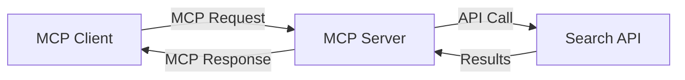
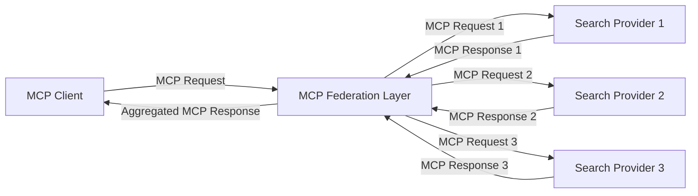
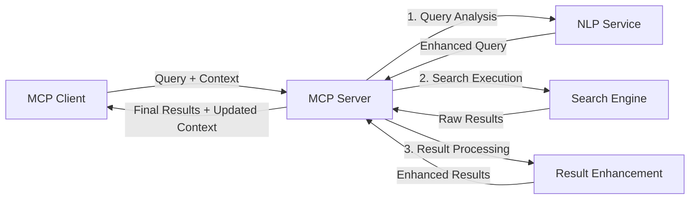

<!--
CO_OP_TRANSLATOR_METADATA:
{
  "original_hash": "16bef2c93c6a86d4ca6a8ce9e120e384",
  "translation_date": "2025-06-13T02:54:32+00:00",
  "source_file": "05-AdvancedTopics/mcp-realtimesearch/README.md",
  "language_code": "vi"
}
-->
## Tuyên bố từ chối trách nhiệm về ví dụ mã

> **Lưu ý quan trọng**: Các ví dụ mã dưới đây minh họa việc tích hợp Model Context Protocol (MCP) với chức năng tìm kiếm web. Mặc dù chúng tuân theo các mẫu và cấu trúc của SDK MCP chính thức, nhưng đã được đơn giản hóa để phục vụ mục đích học tập.
> 
> Các ví dụ này trình bày:
> 
> 1. **Triển khai Python**: Một máy chủ FastMCP cung cấp công cụ tìm kiếm web và kết nối với API tìm kiếm bên ngoài. Ví dụ này minh họa quản lý vòng đời đúng cách, xử lý ngữ cảnh và triển khai công cụ theo các mẫu của [SDK Python MCP chính thức](https://github.com/modelcontextprotocol/python-sdk). Máy chủ sử dụng giao thức Streamable HTTP được khuyến nghị, thay thế cho giao thức SSE cũ trong triển khai thực tế.
> 
> 2. **Triển khai JavaScript**: Triển khai TypeScript/JavaScript theo mẫu FastMCP từ [SDK TypeScript MCP chính thức](https://github.com/modelcontextprotocol/typescript-sdk) để tạo máy chủ tìm kiếm với định nghĩa công cụ và kết nối khách hàng phù hợp. Nó tuân theo các mẫu mới nhất cho quản lý phiên và bảo toàn ngữ cảnh.
> 
> Các ví dụ này cần bổ sung xử lý lỗi, xác thực và mã tích hợp API cụ thể để sử dụng trong môi trường sản xuất. Các điểm cuối API tìm kiếm được hiển thị (`https://api.search-service.example/search`) là ví dụ và cần thay thế bằng các điểm cuối dịch vụ tìm kiếm thực tế.
> 
> Để biết chi tiết triển khai đầy đủ và các phương pháp cập nhật nhất, vui lòng tham khảo [đặc tả MCP chính thức](https://spec.modelcontextprotocol.io/) và tài liệu SDK.

## Các Khái Niệm Cốt Lõi

### Khung Model Context Protocol (MCP)

Ở nền tảng, Model Context Protocol cung cấp cách chuẩn hóa để các mô hình AI, ứng dụng và dịch vụ trao đổi ngữ cảnh. Trong tìm kiếm web thời gian thực, khung này rất cần thiết để tạo trải nghiệm tìm kiếm đa lượt liên tục, mạch lạc. Các thành phần chính bao gồm:

1. **Kiến trúc Client-Server**: MCP thiết lập sự phân tách rõ ràng giữa khách hàng tìm kiếm (người gửi yêu cầu) và máy chủ tìm kiếm (người cung cấp), cho phép mô hình triển khai linh hoạt.

2. **Giao tiếp JSON-RPC**: Giao thức sử dụng JSON-RPC để trao đổi tin nhắn, tương thích với công nghệ web và dễ triển khai trên nhiều nền tảng khác nhau.

3. **Quản lý Ngữ cảnh**: MCP định nghĩa các phương pháp có cấu trúc để duy trì, cập nhật và tận dụng ngữ cảnh tìm kiếm qua nhiều lượt tương tác.

4. **Định nghĩa Công cụ**: Khả năng tìm kiếm được cung cấp dưới dạng các công cụ chuẩn hóa với tham số và giá trị trả về rõ ràng.

5. **Hỗ trợ Streaming**: Giao thức hỗ trợ truyền kết quả theo luồng, cần thiết cho tìm kiếm thời gian thực khi kết quả có thể đến dần dần.

### Các Mẫu Tích Hợp Tìm kiếm Web

Khi tích hợp MCP với tìm kiếm web, xuất hiện một số mẫu sau:

#### 1. Tích hợp trực tiếp nhà cung cấp tìm kiếm

Trong mẫu này, máy chủ MCP trực tiếp giao tiếp với một hoặc nhiều API tìm kiếm, chuyển đổi yêu cầu MCP thành các cuộc gọi API đặc thù và định dạng kết quả thành phản hồi MCP.

#### 2. Tìm kiếm liên kết có bảo toàn ngữ cảnh

Mẫu này phân phối truy vấn tìm kiếm qua nhiều nhà cung cấp tìm kiếm tương thích MCP, mỗi nhà cung cấp có thể chuyên về các loại nội dung hoặc khả năng tìm kiếm khác nhau, đồng thời duy trì ngữ cảnh thống nhất.

#### 3. Chuỗi tìm kiếm nâng cao bằng ngữ cảnh

Ở mẫu này, quá trình tìm kiếm được chia thành nhiều giai đoạn, với ngữ cảnh được làm giàu ở mỗi bước, tạo ra kết quả ngày càng phù hợp hơn.

### Các thành phần ngữ cảnh tìm kiếm

Trong tìm kiếm web dựa trên MCP, ngữ cảnh thường bao gồm:

- **Lịch sử truy vấn**: Các truy vấn tìm kiếm trước đó trong phiên
- **Ưu tiên người dùng**: Ngôn ngữ, khu vực, cài đặt an toàn tìm kiếm
- **Lịch sử tương tác**: Kết quả đã nhấp, thời gian dành cho kết quả
- **Tham số tìm kiếm**: Bộ lọc, thứ tự sắp xếp và các điều chỉnh tìm kiếm khác
- **Kiến thức miền**: Ngữ cảnh chuyên ngành liên quan đến tìm kiếm
- **Ngữ cảnh thời gian**: Yếu tố liên quan đến thời gian
- **Ưu tiên nguồn**: Nguồn thông tin đáng tin cậy hoặc ưu tiên

## Các trường hợp sử dụng và ứng dụng

### Nghiên cứu và thu thập thông tin

MCP nâng cao quy trình nghiên cứu bằng cách:

- Bảo toàn ngữ cảnh nghiên cứu qua các phiên tìm kiếm
- Cho phép truy vấn tinh vi và phù hợp ngữ cảnh hơn
- Hỗ trợ liên kết tìm kiếm đa nguồn
- Tạo điều kiện trích xuất kiến thức từ kết quả tìm kiếm

### Giám sát tin tức và xu hướng thời gian thực

Tìm kiếm dựa trên MCP mang lại lợi thế cho giám sát tin tức:

- Khám phá tin tức mới gần như tức thời
- Lọc thông tin phù hợp theo ngữ cảnh
- Theo dõi chủ đề và thực thể qua nhiều nguồn
- Cảnh báo tin tức cá nhân hóa dựa trên ngữ cảnh người dùng

### Duyệt web và nghiên cứu được tăng cường bởi AI

MCP mở ra khả năng mới cho duyệt web tăng cường AI:

- Gợi ý tìm kiếm theo ngữ cảnh dựa trên hoạt động trình duyệt hiện tại
- Tích hợp liền mạch tìm kiếm web với trợ lý hỗ trợ LLM
- Tinh chỉnh tìm kiếm đa lượt với ngữ cảnh được duy trì
- Cải thiện kiểm tra thực tế và xác minh thông tin

## Xu hướng và đổi mới trong tương lai

### Sự phát triển của MCP trong tìm kiếm web

Trong tương lai, MCP dự kiến sẽ phát triển để giải quyết:

- **Tìm kiếm đa phương thức**: Tích hợp tìm kiếm văn bản, hình ảnh, âm thanh và video với ngữ cảnh được bảo toàn
- **Tìm kiếm phi tập trung**: Hỗ trợ hệ sinh thái tìm kiếm phân tán và liên kết
- **Bảo mật tìm kiếm**: Cơ chế tìm kiếm bảo vệ quyền riêng tư theo ngữ cảnh
- **Hiểu truy vấn**: Phân tích ngữ nghĩa sâu các truy vấn tìm kiếm ngôn ngữ tự nhiên

### Tiến bộ công nghệ tiềm năng

Các công nghệ mới sẽ định hình tương lai tìm kiếm MCP:

1. **Kiến trúc tìm kiếm thần kinh**: Hệ thống tìm kiếm dựa trên nhúng được tối ưu cho MCP
2. **Ngữ cảnh tìm kiếm cá nhân hóa**: Học mẫu tìm kiếm người dùng cá nhân theo thời gian
3. **Tích hợp đồ thị tri thức**: Tìm kiếm ngữ cảnh được tăng cường bởi đồ thị tri thức chuyên ngành
4. **Ngữ cảnh đa phương thức**: Bảo toàn ngữ cảnh qua các phương thức tìm kiếm khác nhau

## Bài tập thực hành

### Bài tập 1: Thiết lập đường ống tìm kiếm MCP cơ bản

Trong bài tập này, bạn sẽ học cách:
- Cấu hình môi trường tìm kiếm MCP cơ bản
- Triển khai bộ xử lý ngữ cảnh cho tìm kiếm web
- Kiểm tra và xác thực bảo toàn ngữ cảnh qua các lượt tìm kiếm

### Bài tập 2: Xây dựng trợ lý nghiên cứu với tìm kiếm MCP

Tạo ứng dụng hoàn chỉnh mà:
- Xử lý câu hỏi nghiên cứu ngôn ngữ tự nhiên
- Thực hiện tìm kiếm web có nhận biết ngữ cảnh
- Tổng hợp thông tin từ nhiều nguồn
- Trình bày kết quả nghiên cứu có tổ chức

### Bài tập 3: Triển khai liên kết tìm kiếm đa nguồn với MCP

Bài tập nâng cao bao gồm:
- Phân phối truy vấn theo ngữ cảnh tới nhiều công cụ tìm kiếm
- Xếp hạng và tổng hợp kết quả
- Loại trùng kết quả theo ngữ cảnh
- Xử lý siêu dữ liệu đặc thù từng nguồn

## Tài nguyên bổ sung

- [Đặc tả Model Context Protocol](https://spec.modelcontextprotocol.io/) - Đặc tả MCP chính thức và tài liệu giao thức chi tiết
- [Tài liệu Model Context Protocol](https://modelcontextprotocol.io/) - Hướng dẫn chi tiết và tài liệu triển khai
- [SDK Python MCP](https://github.com/modelcontextprotocol/python-sdk) - Triển khai Python chính thức của giao thức MCP
- [SDK TypeScript MCP](https://github.com/modelcontextprotocol/typescript-sdk) - Triển khai TypeScript chính thức của giao thức MCP
- [Máy chủ tham khảo MCP](https://github.com/modelcontextprotocol/servers) - Các triển khai máy chủ MCP tham khảo
- [Tài liệu API Bing Web Search](https://learn.microsoft.com/en-us/bing/search-apis/bing-web-search/overview) - API tìm kiếm web của Microsoft
- [Google Custom Search JSON API](https://developers.google.com/custom-search/v1/overview) - Công cụ tìm kiếm tùy chỉnh của Google
- [Tài liệu SerpAPI](https://serpapi.com/search-api) - API trang kết quả công cụ tìm kiếm
- [Tài liệu Meilisearch](https://www.meilisearch.com/docs) - Công cụ tìm kiếm mã nguồn mở
- [Tài liệu Elasticsearch](https://www.elastic.co/guide/index.html) - Công cụ tìm kiếm và phân tích phân tán
- [Tài liệu LangChain](https://python.langchain.com/docs/get_started/introduction) - Xây dựng ứng dụng với LLMs

## Kết quả học tập

Sau khi hoàn thành module này, bạn sẽ có khả năng:

- Hiểu các nguyên lý cơ bản của tìm kiếm web thời gian thực và các thách thức
- Giải thích cách Model Context Protocol (MCP) nâng cao khả năng tìm kiếm web thời gian thực
- Triển khai giải pháp tìm kiếm dựa trên MCP sử dụng các framework và API phổ biến
- Thiết kế và triển khai kiến trúc tìm kiếm hiệu suất cao, có khả năng mở rộng với MCP
- Áp dụng các khái niệm MCP cho các trường hợp sử dụng như tìm kiếm ngữ nghĩa, trợ lý nghiên cứu và duyệt web tăng cường AI
- Đánh giá các xu hướng mới và đổi mới tương lai trong công nghệ tìm kiếm dựa trên MCP

### Các cân nhắc về Tin cậy và An toàn

Khi triển khai các giải pháp tìm kiếm web dựa trên MCP, hãy nhớ các nguyên tắc quan trọng sau đây từ đặc tả MCP:

1. **Sự đồng ý và kiểm soát của người dùng**: Người dùng phải đồng ý rõ ràng và hiểu tất cả các quyền truy cập dữ liệu và hoạt động. Điều này đặc biệt quan trọng với các triển khai tìm kiếm web có thể truy cập nguồn dữ liệu bên ngoài.

2. **Bảo mật dữ liệu**: Đảm bảo xử lý thích hợp các truy vấn và kết quả tìm kiếm, nhất là khi có thể chứa thông tin nhạy cảm. Triển khai kiểm soát truy cập phù hợp để bảo vệ dữ liệu người dùng.

3. **An toàn công cụ**: Thực hiện xác thực và ủy quyền đúng cách cho các công cụ tìm kiếm, vì chúng có thể gây rủi ro bảo mật qua thực thi mã tùy ý. Mô tả hành vi công cụ nên được coi là không đáng tin trừ khi lấy từ máy chủ tin cậy.

4. **Tài liệu rõ ràng**: Cung cấp tài liệu minh bạch về khả năng, giới hạn và các cân nhắc bảo mật của triển khai tìm kiếm dựa trên MCP, theo hướng dẫn triển khai trong đặc tả MCP.

5. **Luồng đồng ý vững chắc**: Xây dựng luồng đồng ý và ủy quyền rõ ràng, giải thích cụ thể chức năng của từng công cụ trước khi cho phép sử dụng, đặc biệt với các công cụ tương tác với tài nguyên web bên ngoài.

Để biết chi tiết về an ninh và cân nhắc tin cậy MCP, vui lòng tham khảo [tài liệu chính thức](https://modelcontextprotocol.io/specification/2025-03-26#security-and-trust-%26-safety).

## Tiếp theo là

- [6. Đóng góp từ cộng đồng](../../06-CommunityContributions/README.md)

**Tuyên bố miễn trừ trách nhiệm**:  
Tài liệu này đã được dịch bằng dịch vụ dịch thuật AI [Co-op Translator](https://github.com/Azure/co-op-translator). Mặc dù chúng tôi cố gắng đảm bảo độ chính xác, xin lưu ý rằng các bản dịch tự động có thể chứa lỗi hoặc sai sót. Tài liệu gốc bằng ngôn ngữ bản địa nên được coi là nguồn chính xác và đáng tin cậy. Đối với các thông tin quan trọng, nên sử dụng dịch vụ dịch thuật chuyên nghiệp do con người thực hiện. Chúng tôi không chịu trách nhiệm về bất kỳ sự hiểu nhầm hoặc diễn giải sai nào phát sinh từ việc sử dụng bản dịch này.