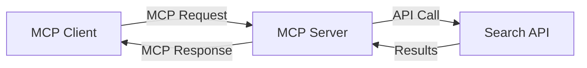
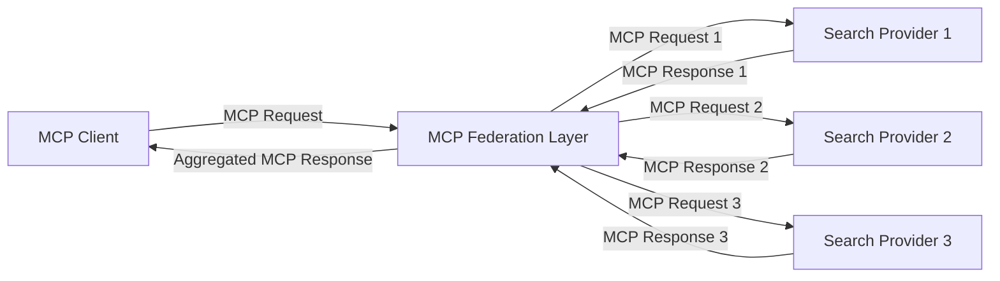
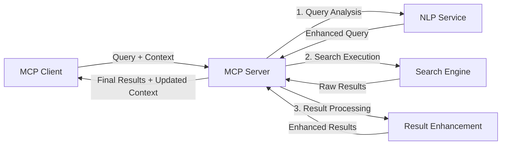

<!--
CO_OP_TRANSLATOR_METADATA:
{
  "original_hash": "eb12652eb7bd17f2193b835a344425c6",
  "translation_date": "2025-06-26T14:11:59+00:00",
  "source_file": "05-AdvancedTopics/mcp-realtimesearch/README.md",
  "language_code": "vi"
}
-->
## Tuyên bố từ chối trách nhiệm về Ví dụ Mã

> **Lưu ý Quan trọng**: Các ví dụ mã dưới đây minh họa cách tích hợp Model Context Protocol (MCP) với chức năng tìm kiếm trên web. Mặc dù chúng tuân theo các mẫu và cấu trúc của SDK MCP chính thức, nhưng đã được đơn giản hóa cho mục đích giáo dục.
> 
> Các ví dụ này thể hiện:
> 
> 1. **Triển khai Python**: Một máy chủ FastMCP cung cấp công cụ tìm kiếm web và kết nối với API tìm kiếm bên ngoài. Ví dụ này minh họa quản lý vòng đời đúng cách, xử lý ngữ cảnh và triển khai công cụ theo các mẫu của [SDK MCP Python chính thức](https://github.com/modelcontextprotocol/python-sdk). Máy chủ sử dụng giao thức HTTP Streamable được khuyến nghị, thay thế giao thức SSE cũ cho triển khai thực tế.
> 
> 2. **Triển khai JavaScript**: Triển khai TypeScript/JavaScript sử dụng mẫu FastMCP từ [SDK MCP TypeScript chính thức](https://github.com/modelcontextprotocol/typescript-sdk) để tạo máy chủ tìm kiếm với định nghĩa công cụ và kết nối khách hàng hợp lệ. Nó theo các mẫu mới nhất cho quản lý phiên và bảo toàn ngữ cảnh.
> 
> Các ví dụ này cần bổ sung xử lý lỗi, xác thực và mã tích hợp API cụ thể để sử dụng trong sản xuất. Các điểm cuối API tìm kiếm được sử dụng (`https://api.search-service.example/search`) chỉ là ví dụ và cần được thay thế bằng các điểm cuối dịch vụ tìm kiếm thực tế.
> 
> Để biết chi tiết triển khai đầy đủ và các phương pháp cập nhật nhất, vui lòng tham khảo [đặc tả MCP chính thức](https://spec.modelcontextprotocol.io/) và tài liệu SDK.

## Khái niệm Cốt lõi

### Khung Model Context Protocol (MCP)

Cốt lõi, Model Context Protocol cung cấp một cách tiêu chuẩn để các mô hình AI, ứng dụng và dịch vụ trao đổi ngữ cảnh. Trong tìm kiếm web thời gian thực, khung này rất quan trọng để tạo ra trải nghiệm tìm kiếm mạch lạc, nhiều lượt. Các thành phần chính bao gồm:

1. **Kiến trúc Khách - Máy chủ**: MCP thiết lập sự phân tách rõ ràng giữa khách hàng tìm kiếm (người gửi yêu cầu) và máy chủ tìm kiếm (người cung cấp), cho phép mô hình triển khai linh hoạt.

2. **Giao tiếp JSON-RPC**: Giao thức sử dụng JSON-RPC để trao đổi thông điệp, tương thích với công nghệ web và dễ dàng triển khai trên nhiều nền tảng.

3. **Quản lý Ngữ cảnh**: MCP định nghĩa các phương pháp có cấu trúc để duy trì, cập nhật và tận dụng ngữ cảnh tìm kiếm qua nhiều tương tác.

4. **Định nghĩa Công cụ**: Khả năng tìm kiếm được phơi bày dưới dạng các công cụ tiêu chuẩn với tham số và giá trị trả về rõ ràng.

5. **Hỗ trợ Streaming**: Giao thức hỗ trợ phát kết quả theo luồng, cần thiết cho tìm kiếm thời gian thực khi kết quả có thể đến dần dần.

### Mẫu Tích hợp Tìm kiếm Web

Khi tích hợp MCP với tìm kiếm web, có một số mẫu phổ biến:

#### 1. Tích hợp Trực tiếp Nhà cung cấp Tìm kiếm

Trong mẫu này, máy chủ MCP trực tiếp kết nối với một hoặc nhiều API tìm kiếm, chuyển đổi yêu cầu MCP thành các cuộc gọi API cụ thể và định dạng kết quả thành phản hồi MCP.

#### 2. Tìm kiếm Liên kết với Bảo toàn Ngữ cảnh

Mẫu này phân phối các truy vấn tìm kiếm qua nhiều nhà cung cấp tìm kiếm tương thích MCP, mỗi nhà cung cấp có thể chuyên về các loại nội dung hoặc khả năng tìm kiếm khác nhau, đồng thời duy trì một ngữ cảnh thống nhất.

#### 3. Chuỗi Tìm kiếm Tăng cường Ngữ cảnh

Ở mẫu này, quá trình tìm kiếm được chia thành nhiều giai đoạn, với ngữ cảnh được làm giàu tại mỗi bước, dẫn đến kết quả ngày càng phù hợp hơn.

### Thành phần Ngữ cảnh Tìm kiếm

Trong tìm kiếm web dựa trên MCP, ngữ cảnh thường bao gồm:

- **Lịch sử Truy vấn**: Các truy vấn tìm kiếm trước đó trong phiên
- **Sở thích Người dùng**: Ngôn ngữ, vùng miền, cài đặt tìm kiếm an toàn
- **Lịch sử Tương tác**: Kết quả nào đã được nhấp, thời gian dành cho kết quả
- **Tham số Tìm kiếm**: Bộ lọc, thứ tự sắp xếp và các bộ điều chỉnh tìm kiếm khác
- **Kiến thức Chuyên ngành**: Ngữ cảnh chủ đề liên quan đến tìm kiếm
- **Ngữ cảnh Thời gian**: Các yếu tố liên quan đến thời gian
- **Sở thích Nguồn**: Các nguồn tin cậy hoặc ưu tiên

## Trường hợp sử dụng và Ứng dụng

### Nghiên cứu và Thu thập Thông tin

MCP nâng cao quy trình nghiên cứu bằng cách:

- Bảo toàn ngữ cảnh nghiên cứu qua các phiên tìm kiếm
- Cho phép các truy vấn phức tạp và phù hợp ngữ cảnh hơn
- Hỗ trợ liên kết tìm kiếm đa nguồn
- Hỗ trợ trích xuất kiến thức từ kết quả tìm kiếm

### Giám sát Tin tức và Xu hướng Thời gian thực

Tìm kiếm dựa trên MCP mang lại lợi ích cho việc giám sát tin tức:

- Phát hiện gần như ngay lập tức các câu chuyện tin tức mới nổi
- Lọc thông tin phù hợp theo ngữ cảnh
- Theo dõi chủ đề và thực thể qua nhiều nguồn
- Cảnh báo tin tức cá nhân hóa dựa trên ngữ cảnh người dùng

### Duyệt web và Nghiên cứu Tăng cường AI

MCP mở ra khả năng mới cho duyệt web tăng cường AI:

- Gợi ý tìm kiếm theo ngữ cảnh dựa trên hoạt động trình duyệt hiện tại
- Tích hợp liền mạch tìm kiếm web với trợ lý dựa trên LLM
- Tinh chỉnh tìm kiếm nhiều lượt với ngữ cảnh được duy trì
- Nâng cao kiểm tra sự thật và xác minh thông tin

## Xu hướng và Đổi mới trong tương lai

### Sự phát triển của MCP trong Tìm kiếm Web

Trong tương lai, MCP dự kiến sẽ phát triển để giải quyết:

- **Tìm kiếm Đa phương thức**: Kết hợp tìm kiếm văn bản, hình ảnh, âm thanh và video với ngữ cảnh được bảo toàn
- **Tìm kiếm Phi tập trung**: Hỗ trợ hệ sinh thái tìm kiếm phân tán và liên kết
- **Bảo mật Tìm kiếm**: Cơ chế tìm kiếm bảo vệ quyền riêng tư theo ngữ cảnh
- **Hiểu Truy vấn**: Phân tích ngữ nghĩa sâu sắc các truy vấn tìm kiếm ngôn ngữ tự nhiên

### Tiến bộ Công nghệ Tiềm năng

Các công nghệ mới sẽ định hình tương lai của tìm kiếm MCP:

1. **Kiến trúc Tìm kiếm Thần kinh**: Hệ thống tìm kiếm dựa trên nhúng tối ưu cho MCP
2. **Ngữ cảnh Tìm kiếm Cá nhân hóa**: Học mẫu tìm kiếm cá nhân của người dùng theo thời gian
3. **Tích hợp Đồ thị Kiến thức**: Tìm kiếm theo ngữ cảnh được tăng cường bởi đồ thị kiến thức chuyên ngành
4. **Ngữ cảnh Đa phương thức**: Duy trì ngữ cảnh qua các phương thức tìm kiếm khác nhau

## Bài tập Thực hành

### Bài tập 1: Thiết lập Pipeline Tìm kiếm MCP Cơ bản

Trong bài tập này, bạn sẽ học cách:
- Cấu hình môi trường tìm kiếm MCP cơ bản
- Triển khai bộ xử lý ngữ cảnh cho tìm kiếm web
- Kiểm tra và xác thực việc bảo toàn ngữ cảnh qua các lượt tìm kiếm

### Bài tập 2: Xây dựng Trợ lý Nghiên cứu với Tìm kiếm MCP

Tạo ứng dụng hoàn chỉnh có thể:
- Xử lý các câu hỏi nghiên cứu bằng ngôn ngữ tự nhiên
- Thực hiện tìm kiếm web theo ngữ cảnh
- Tổng hợp thông tin từ nhiều nguồn
- Trình bày kết quả nghiên cứu có tổ chức

### Bài tập 3: Triển khai Liên kết Tìm kiếm Đa nguồn với MCP

Bài tập nâng cao bao gồm:
- Phân phối truy vấn theo ngữ cảnh tới nhiều công cụ tìm kiếm
- Xếp hạng và tổng hợp kết quả
- Loại bỏ trùng lặp theo ngữ cảnh
- Xử lý siêu dữ liệu nguồn riêng biệt

## Tài nguyên Bổ sung

- [Đặc tả Model Context Protocol](https://spec.modelcontextprotocol.io/) - Đặc tả MCP chính thức và tài liệu chi tiết
- [Tài liệu Model Context Protocol](https://modelcontextprotocol.io/) - Hướng dẫn và tài liệu triển khai chi tiết
- [MCP Python SDK](https://github.com/modelcontextprotocol/python-sdk) - Triển khai Python chính thức của giao thức MCP
- [MCP TypeScript SDK](https://github.com/modelcontextprotocol/typescript-sdk) - Triển khai TypeScript chính thức của giao thức MCP
- [Máy chủ Tham khảo MCP](https://github.com/modelcontextprotocol/servers) - Triển khai tham khảo máy chủ MCP
- [Tài liệu Bing Web Search API](https://learn.microsoft.com/en-us/bing/search-apis/bing-web-search/overview) - API tìm kiếm web của Microsoft
- [Google Custom Search JSON API](https://developers.google.com/custom-search/v1/overview) - Công cụ tìm kiếm lập trình của Google
- [Tài liệu SerpAPI](https://serpapi.com/search-api) - API trang kết quả công cụ tìm kiếm
- [Tài liệu Meilisearch](https://www.meilisearch.com/docs) - Công cụ tìm kiếm mã nguồn mở
- [Tài liệu Elasticsearch](https://www.elastic.co/guide/index.html) - Công cụ tìm kiếm và phân tích phân tán
- [Tài liệu LangChain](https://python.langchain.com/docs/get_started/introduction) - Xây dựng ứng dụng với LLM

## Kết quả Học tập

Sau khi hoàn thành mô-đun này, bạn sẽ có khả năng:

- Hiểu được các nguyên lý cơ bản của tìm kiếm web thời gian thực và những thách thức của nó
- Giải thích cách Model Context Protocol (MCP) nâng cao khả năng tìm kiếm web thời gian thực
- Triển khai các giải pháp tìm kiếm dựa trên MCP sử dụng các framework và API phổ biến
- Thiết kế và triển khai kiến trúc tìm kiếm có khả năng mở rộng và hiệu suất cao với MCP
- Áp dụng các khái niệm MCP cho nhiều trường hợp sử dụng như tìm kiếm ngữ nghĩa, trợ lý nghiên cứu và duyệt web tăng cường AI
- Đánh giá các xu hướng mới nổi và đổi mới trong công nghệ tìm kiếm dựa trên MCP

### Các Cân nhắc về Độ tin cậy và An toàn

Khi triển khai các giải pháp tìm kiếm web dựa trên MCP, hãy nhớ các nguyên tắc quan trọng sau từ đặc tả MCP:

1. **Sự Đồng ý và Kiểm soát của Người dùng**: Người dùng phải đồng ý rõ ràng và hiểu tất cả quyền truy cập dữ liệu và các thao tác. Điều này đặc biệt quan trọng với các triển khai tìm kiếm web có thể truy cập nguồn dữ liệu bên ngoài.

2. **Bảo mật Dữ liệu**: Đảm bảo xử lý thích hợp các truy vấn và kết quả tìm kiếm, nhất là khi có thể chứa thông tin nhạy cảm. Triển khai kiểm soát truy cập phù hợp để bảo vệ dữ liệu người dùng.

3. **An toàn Công cụ**: Thực hiện xác thực và ủy quyền đúng đắn cho các công cụ tìm kiếm, vì chúng có thể gây rủi ro bảo mật qua việc thực thi mã tùy ý. Mô tả hành vi công cụ nên được coi là không đáng tin cậy trừ khi lấy từ máy chủ đáng tin cậy.

4. **Tài liệu Rõ ràng**: Cung cấp tài liệu minh bạch về khả năng, giới hạn và các cân nhắc bảo mật của triển khai tìm kiếm MCP, tuân theo hướng dẫn triển khai trong đặc tả MCP.

5. **Luồng Đồng ý Mạnh mẽ**: Xây dựng các luồng đồng ý và ủy quyền rõ ràng, giải thích chi tiết chức năng của từng công cụ trước khi cho phép sử dụng, đặc biệt với các công cụ tương tác với tài nguyên web bên ngoài.

Để biết chi tiết đầy đủ về bảo mật và các cân nhắc về độ tin cậy của MCP, vui lòng tham khảo [tài liệu chính thức](https://modelcontextprotocol.io/specification/2025-03-26#security-and-trust-%26-safety).

## Tiếp theo

- [5.11 Xác thực Entra ID cho Máy chủ Model Context Protocol](../mcp-security-entra/README.md)

**Tuyên bố từ chối trách nhiệm**:  
Tài liệu này đã được dịch bằng dịch vụ dịch thuật AI [Co-op Translator](https://github.com/Azure/co-op-translator). Mặc dù chúng tôi cố gắng đảm bảo độ chính xác, xin lưu ý rằng bản dịch tự động có thể chứa lỗi hoặc sai sót. Tài liệu gốc bằng ngôn ngữ gốc của nó nên được coi là nguồn chính xác và đáng tin cậy. Đối với thông tin quan trọng, nên sử dụng dịch vụ dịch thuật chuyên nghiệp do con người thực hiện. Chúng tôi không chịu trách nhiệm về bất kỳ sự hiểu lầm hay giải thích sai nào phát sinh từ việc sử dụng bản dịch này.