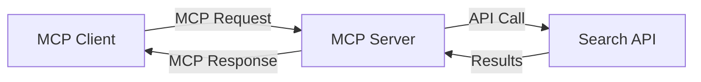
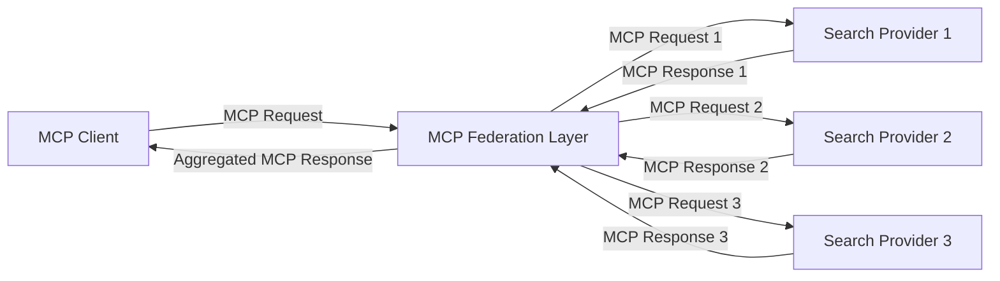
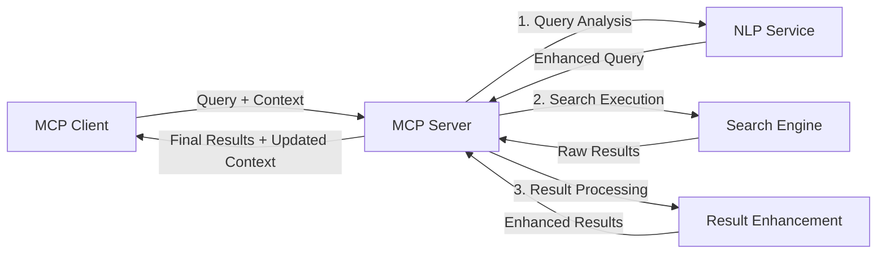

<!--
CO_OP_TRANSLATOR_METADATA:
{
  "original_hash": "333a03e51f90bdf3e6f1ba1694c73f36",
  "translation_date": "2025-07-17T07:40:56+00:00",
  "source_file": "05-AdvancedTopics/mcp-realtimesearch/README.md",
  "language_code": "vi"
}
-->
## Tuyên bố về Ví dụ Mã

> **Lưu ý Quan trọng**: Các ví dụ mã dưới đây minh họa việc tích hợp Model Context Protocol (MCP) với chức năng tìm kiếm web. Mặc dù chúng tuân theo các mẫu và cấu trúc của SDK MCP chính thức, nhưng đã được đơn giản hóa cho mục đích giáo dục.
> 
> Các ví dụ này trình bày:
> 
> 1. **Triển khai Python**: Một máy chủ FastMCP cung cấp công cụ tìm kiếm web và kết nối với API tìm kiếm bên ngoài. Ví dụ này minh họa quản lý vòng đời đúng cách, xử lý ngữ cảnh và triển khai công cụ theo mẫu của [SDK MCP Python chính thức](https://github.com/modelcontextprotocol/python-sdk). Máy chủ sử dụng giao thức Streamable HTTP được khuyến nghị, thay thế cho giao thức SSE cũ trong các triển khai sản xuất.
> 
> 2. **Triển khai JavaScript**: Một triển khai TypeScript/JavaScript sử dụng mẫu FastMCP từ [SDK MCP TypeScript chính thức](https://github.com/modelcontextprotocol/typescript-sdk) để tạo máy chủ tìm kiếm với định nghĩa công cụ và kết nối khách hàng đúng chuẩn. Nó tuân theo các mẫu mới nhất được khuyến nghị cho quản lý phiên và bảo toàn ngữ cảnh.
> 
> Các ví dụ này cần bổ sung xử lý lỗi, xác thực và mã tích hợp API cụ thể cho việc sử dụng trong sản xuất. Các điểm cuối API tìm kiếm được hiển thị (`https://api.search-service.example/search`) chỉ là chỗ giữ chỗ và cần được thay thế bằng các điểm cuối dịch vụ tìm kiếm thực tế.
> 
> Để biết chi tiết triển khai đầy đủ và các phương pháp cập nhật nhất, vui lòng tham khảo [đặc tả MCP chính thức](https://spec.modelcontextprotocol.io/) và tài liệu SDK.

## Các Khái Niệm Cốt Lõi

### Khung Model Context Protocol (MCP)

Ở nền tảng, Model Context Protocol cung cấp một cách tiêu chuẩn để các mô hình AI, ứng dụng và dịch vụ trao đổi ngữ cảnh. Trong tìm kiếm web thời gian thực, khung này rất cần thiết để tạo ra trải nghiệm tìm kiếm đa lượt mạch lạc. Các thành phần chính bao gồm:

1. **Kiến trúc Khách-Chủ**: MCP thiết lập sự phân tách rõ ràng giữa các khách hàng tìm kiếm (người yêu cầu) và máy chủ tìm kiếm (người cung cấp), cho phép các mô hình triển khai linh hoạt.

2. **Giao tiếp JSON-RPC**: Giao thức sử dụng JSON-RPC để trao đổi thông điệp, giúp tương thích với công nghệ web và dễ dàng triển khai trên nhiều nền tảng khác nhau.

3. **Quản lý Ngữ cảnh**: MCP định nghĩa các phương pháp có cấu trúc để duy trì, cập nhật và tận dụng ngữ cảnh tìm kiếm qua nhiều tương tác.

4. **Định nghĩa Công cụ**: Khả năng tìm kiếm được phơi bày dưới dạng các công cụ tiêu chuẩn với các tham số và giá trị trả về rõ ràng.

5. **Hỗ trợ Streaming**: Giao thức hỗ trợ truyền kết quả theo luồng, rất cần thiết cho tìm kiếm thời gian thực khi kết quả có thể đến dần dần.

### Các Mẫu Tích Hợp Tìm Kiếm Web

Khi tích hợp MCP với tìm kiếm web, một số mẫu phổ biến xuất hiện:

#### 1. Tích Hợp Trực Tiếp Nhà Cung Cấp Tìm Kiếm

Trong mẫu này, máy chủ MCP trực tiếp giao tiếp với một hoặc nhiều API tìm kiếm, chuyển đổi các yêu cầu MCP thành các cuộc gọi API cụ thể và định dạng kết quả thành phản hồi MCP.

#### 2. Tìm Kiếm Liên Liên Kết với Bảo Toàn Ngữ Cảnh

Mẫu này phân phối các truy vấn tìm kiếm qua nhiều nhà cung cấp tìm kiếm tương thích MCP, mỗi nhà cung cấp có thể chuyên về các loại nội dung hoặc khả năng tìm kiếm khác nhau, đồng thời duy trì một ngữ cảnh thống nhất.

#### 3. Chuỗi Tìm Kiếm Nâng Cao Ngữ Cảnh

Trong mẫu này, quá trình tìm kiếm được chia thành nhiều giai đoạn, với ngữ cảnh được làm giàu ở mỗi bước, dẫn đến kết quả ngày càng phù hợp hơn.

### Các Thành Phần Ngữ Cảnh Tìm Kiếm

Trong tìm kiếm web dựa trên MCP, ngữ cảnh thường bao gồm:

- **Lịch sử Truy vấn**: Các truy vấn tìm kiếm trước đó trong phiên
- **Sở thích Người dùng**: Ngôn ngữ, khu vực, cài đặt tìm kiếm an toàn
- **Lịch sử Tương tác**: Kết quả nào đã được nhấp, thời gian dành cho kết quả
- **Tham số Tìm kiếm**: Bộ lọc, thứ tự sắp xếp và các bộ điều chỉnh tìm kiếm khác
- **Kiến thức Chuyên ngành**: Ngữ cảnh chuyên môn liên quan đến tìm kiếm
- **Ngữ cảnh Thời gian**: Các yếu tố liên quan đến thời gian
- **Ưu tiên Nguồn**: Các nguồn thông tin đáng tin cậy hoặc ưu tiên

## Các Trường Hợp Sử Dụng và Ứng Dụng

### Nghiên Cứu và Thu Thập Thông Tin

MCP nâng cao quy trình nghiên cứu bằng cách:

- Bảo toàn ngữ cảnh nghiên cứu qua các phiên tìm kiếm
- Cho phép các truy vấn tinh vi và phù hợp ngữ cảnh hơn
- Hỗ trợ liên kết tìm kiếm đa nguồn
- Tạo điều kiện trích xuất kiến thức từ kết quả tìm kiếm

### Giám Sát Tin Tức và Xu Hướng Thời Gian Thực

Tìm kiếm dựa trên MCP mang lại lợi thế cho giám sát tin tức:

- Phát hiện gần như thời gian thực các câu chuyện tin tức mới nổi
- Lọc thông tin phù hợp theo ngữ cảnh
- Theo dõi chủ đề và thực thể qua nhiều nguồn
- Cảnh báo tin tức cá nhân hóa dựa trên ngữ cảnh người dùng

### Duyệt Web và Nghiên Cứu Tăng Cường AI

MCP tạo ra các khả năng mới cho duyệt web tăng cường AI:

- Gợi ý tìm kiếm theo ngữ cảnh dựa trên hoạt động trình duyệt hiện tại
- Tích hợp liền mạch tìm kiếm web với trợ lý dựa trên LLM
- Tinh chỉnh tìm kiếm đa lượt với ngữ cảnh được duy trì
- Nâng cao kiểm chứng và xác minh thông tin

## Xu Hướng và Đổi Mới Tương Lai

### Sự Phát Triển của MCP trong Tìm Kiếm Web

Nhìn về phía trước, chúng ta kỳ vọng MCP sẽ phát triển để giải quyết:

- **Tìm kiếm Đa phương thức**: Tích hợp tìm kiếm văn bản, hình ảnh, âm thanh và video với ngữ cảnh được bảo toàn
- **Tìm kiếm Phi tập trung**: Hỗ trợ các hệ sinh thái tìm kiếm phân tán và liên liên kết
- **Search Privacy**: Cơ chế tìm kiếm bảo vệ quyền riêng tư dựa trên ngữ cảnh
- **Query Understanding**: Phân tích ngữ nghĩa sâu sắc các truy vấn tìm kiếm bằng ngôn ngữ tự nhiên

### Tiềm năng phát triển công nghệ

Các công nghệ mới nổi sẽ định hình tương lai của tìm kiếm MCP:

1. **Neural Search Architectures**: Hệ thống tìm kiếm dựa trên embedding được tối ưu hóa cho MCP  
2. **Personalized Search Context**: Học thói quen tìm kiếm cá nhân theo thời gian  
3. **Knowledge Graph Integration**: Tìm kiếm theo ngữ cảnh được nâng cao nhờ các đồ thị tri thức chuyên ngành  
4. **Cross-Modal Context**: Duy trì ngữ cảnh xuyên suốt các phương thức tìm kiếm khác nhau  

## Bài tập thực hành

### Bài tập 1: Thiết lập pipeline tìm kiếm MCP cơ bản

Trong bài tập này, bạn sẽ học cách:  
- Cấu hình môi trường tìm kiếm MCP cơ bản  
- Triển khai các bộ xử lý ngữ cảnh cho tìm kiếm web  
- Kiểm tra và xác nhận việc bảo toàn ngữ cảnh qua các lần tìm kiếm  

### Bài tập 2: Xây dựng trợ lý nghiên cứu với MCP Search

Tạo một ứng dụng hoàn chỉnh có khả năng:  
- Xử lý các câu hỏi nghiên cứu bằng ngôn ngữ tự nhiên  
- Thực hiện tìm kiếm web theo ngữ cảnh  
- Tổng hợp thông tin từ nhiều nguồn khác nhau  
- Trình bày kết quả nghiên cứu một cách có tổ chức  

### Bài tập 3: Triển khai liên kết tìm kiếm đa nguồn với MCP

Bài tập nâng cao bao gồm:  
- Phân phối truy vấn theo ngữ cảnh đến nhiều công cụ tìm kiếm  
- Xếp hạng và tổng hợp kết quả  
- Loại bỏ trùng lặp kết quả dựa trên ngữ cảnh  
- Xử lý metadata đặc thù của từng nguồn  

## Tài nguyên bổ sung

- [Model Context Protocol Specification](https://spec.modelcontextprotocol.io/) - Tài liệu chính thức và chi tiết về giao thức MCP  
- [Model Context Protocol Documentation](https://modelcontextprotocol.io/) - Hướng dẫn chi tiết và tài liệu triển khai  
- [MCP Python SDK](https://github.com/modelcontextprotocol/python-sdk) - Bộ công cụ Python chính thức cho MCP  
- [MCP TypeScript SDK](https://github.com/modelcontextprotocol/typescript-sdk) - Bộ công cụ TypeScript chính thức cho MCP  
- [MCP Reference Servers](https://github.com/modelcontextprotocol/servers) - Các triển khai tham khảo của máy chủ MCP  
- [Bing Web Search API Documentation](https://learn.microsoft.com/en-us/bing/search-apis/bing-web-search/overview) - API tìm kiếm web của Microsoft  
- [Google Custom Search JSON API](https://developers.google.com/custom-search/v1/overview) - Công cụ tìm kiếm tùy chỉnh của Google  
- [SerpAPI Documentation](https://serpapi.com/search-api) - API trang kết quả công cụ tìm kiếm  
- [Meilisearch Documentation](https://www.meilisearch.com/docs) - Công cụ tìm kiếm mã nguồn mở  
- [Elasticsearch Documentation](https://www.elastic.co/guide/index.html) - Công cụ tìm kiếm và phân tích phân tán  
- [LangChain Documentation](https://python.langchain.com/docs/get_started/introduction) - Xây dựng ứng dụng với LLMs  

## Kết quả học tập

Sau khi hoàn thành module này, bạn sẽ có khả năng:

- Hiểu được các nguyên lý cơ bản của tìm kiếm web thời gian thực và những thách thức liên quan  
- Giải thích cách Model Context Protocol (MCP) nâng cao khả năng tìm kiếm web thời gian thực  
- Triển khai các giải pháp tìm kiếm dựa trên MCP sử dụng các framework và API phổ biến  
- Thiết kế và triển khai kiến trúc tìm kiếm có khả năng mở rộng và hiệu suất cao với MCP  
- Áp dụng các khái niệm MCP vào nhiều trường hợp sử dụng khác nhau như tìm kiếm ngữ nghĩa, trợ lý nghiên cứu, và duyệt web được hỗ trợ bởi AI  
- Đánh giá các xu hướng mới nổi và đổi mới trong công nghệ tìm kiếm dựa trên MCP  

### Các cân nhắc về độ tin cậy và an toàn

Khi triển khai các giải pháp tìm kiếm web dựa trên MCP, hãy nhớ các nguyên tắc quan trọng sau từ tài liệu MCP:

1. **Sự đồng ý và kiểm soát của người dùng**: Người dùng phải đồng ý rõ ràng và hiểu đầy đủ về việc truy cập và thao tác dữ liệu. Điều này đặc biệt quan trọng với các triển khai tìm kiếm web có thể truy cập nguồn dữ liệu bên ngoài.  

2. **Bảo mật dữ liệu**: Đảm bảo xử lý truy vấn và kết quả tìm kiếm một cách phù hợp, nhất là khi chứa thông tin nhạy cảm. Áp dụng các biện pháp kiểm soát truy cập để bảo vệ dữ liệu người dùng.  

3. **An toàn công cụ**: Thực hiện xác thực và ủy quyền đúng đắn cho các công cụ tìm kiếm, vì chúng có thể gây rủi ro bảo mật do khả năng thực thi mã tùy ý. Mô tả hành vi công cụ không nên được tin tưởng nếu không lấy từ máy chủ đáng tin cậy.  

4. **Tài liệu rõ ràng**: Cung cấp tài liệu minh bạch về khả năng, giới hạn và các cân nhắc bảo mật của triển khai tìm kiếm dựa trên MCP, theo hướng dẫn trong tài liệu MCP.  

5. **Quy trình đồng ý chặt chẽ**: Xây dựng quy trình đồng ý và ủy quyền rõ ràng, giải thích cụ thể chức năng của từng công cụ trước khi cho phép sử dụng, đặc biệt với các công cụ tương tác với tài nguyên web bên ngoài.  

Để biết chi tiết về bảo mật và các cân nhắc về độ tin cậy trong MCP, vui lòng tham khảo [tài liệu chính thức](https://modelcontextprotocol.io/specification/2025-03-26#security-and-trust-%26-safety).  

## Tiếp theo là gì

- [5.12 Entra ID Authentication for Model Context Protocol Servers](../mcp-security-entra/README.md)

**Tuyên bố từ chối trách nhiệm**:  
Tài liệu này đã được dịch bằng dịch vụ dịch thuật AI [Co-op Translator](https://github.com/Azure/co-op-translator). Mặc dù chúng tôi cố gắng đảm bảo độ chính xác, xin lưu ý rằng bản dịch tự động có thể chứa lỗi hoặc không chính xác. Tài liệu gốc bằng ngôn ngữ gốc của nó nên được coi là nguồn chính xác và đáng tin cậy. Đối với các thông tin quan trọng, nên sử dụng dịch vụ dịch thuật chuyên nghiệp do con người thực hiện. Chúng tôi không chịu trách nhiệm về bất kỳ sự hiểu lầm hoặc giải thích sai nào phát sinh từ việc sử dụng bản dịch này.