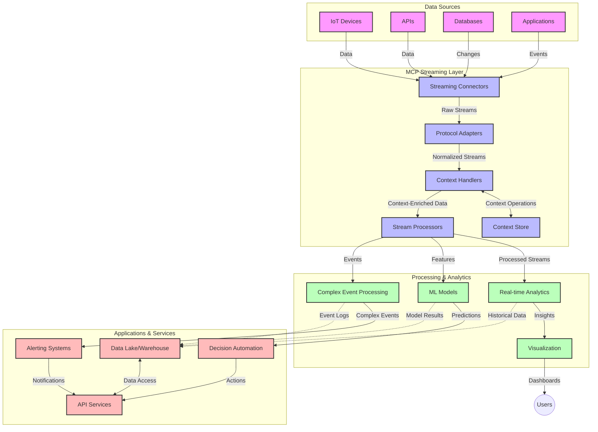

<!--
CO_OP_TRANSLATOR_METADATA:
{
  "original_hash": "195f7287638b77a549acadd96c8f981c",
  "translation_date": "2025-07-14T01:45:34+00:00",
  "source_file": "05-AdvancedTopics/mcp-realtimestreaming/README.md",
  "language_code": "vi"
}
-->
# Model Context Protocol cho Truyền Dữ Liệu Thời Gian Thực

## Tổng quan

Truyền dữ liệu thời gian thực đã trở thành yếu tố thiết yếu trong thế giới dựa trên dữ liệu ngày nay, nơi các doanh nghiệp và ứng dụng cần truy cập thông tin ngay lập tức để đưa ra quyết định kịp thời. Model Context Protocol (MCP) đại diện cho một bước tiến quan trọng trong việc tối ưu hóa các quy trình truyền dữ liệu thời gian thực, nâng cao hiệu quả xử lý dữ liệu, duy trì tính toàn vẹn ngữ cảnh và cải thiện hiệu suất tổng thể của hệ thống.

Module này khám phá cách MCP thay đổi truyền dữ liệu thời gian thực bằng cách cung cấp một phương pháp chuẩn hóa quản lý ngữ cảnh giữa các mô hình AI, nền tảng truyền dữ liệu và ứng dụng.

## Giới thiệu về Truyền Dữ Liệu Thời Gian Thực

Truyền dữ liệu thời gian thực là một mô hình công nghệ cho phép chuyển, xử lý và phân tích dữ liệu liên tục ngay khi dữ liệu được tạo ra, giúp hệ thống phản ứng ngay lập tức với thông tin mới. Khác với xử lý theo lô truyền thống hoạt động trên tập dữ liệu tĩnh, truyền dữ liệu thời gian thực xử lý dữ liệu đang di chuyển, cung cấp thông tin và hành động với độ trễ tối thiểu.

### Các khái niệm cốt lõi của Truyền Dữ Liệu Thời Gian Thực:

- **Dòng dữ liệu liên tục**: Dữ liệu được xử lý như một dòng sự kiện hoặc bản ghi không ngừng nghỉ.
- **Xử lý độ trễ thấp**: Hệ thống được thiết kế để giảm thiểu thời gian giữa việc tạo dữ liệu và xử lý.
- **Khả năng mở rộng**: Kiến trúc truyền dữ liệu phải xử lý được khối lượng và tốc độ dữ liệu biến đổi.
- **Khả năng chịu lỗi**: Hệ thống cần có khả năng chống chịu sự cố để đảm bảo dòng dữ liệu không bị gián đoạn.
- **Xử lý có trạng thái**: Duy trì ngữ cảnh xuyên suốt các sự kiện là điều quan trọng để phân tích có ý nghĩa.

### Model Context Protocol và Truyền Dữ Liệu Thời Gian Thực

Model Context Protocol (MCP) giải quyết một số thách thức quan trọng trong môi trường truyền dữ liệu thời gian thực:

1. **Liên tục ngữ cảnh**: MCP chuẩn hóa cách duy trì ngữ cảnh giữa các thành phần truyền dữ liệu phân tán, đảm bảo các mô hình AI và nút xử lý có quyền truy cập vào ngữ cảnh lịch sử và môi trường liên quan.

2. **Quản lý trạng thái hiệu quả**: Bằng cách cung cấp cơ chế có cấu trúc cho việc truyền ngữ cảnh, MCP giảm tải quản lý trạng thái trong các pipeline truyền dữ liệu.

3. **Tính tương tác**: MCP tạo ra ngôn ngữ chung để chia sẻ ngữ cảnh giữa các công nghệ truyền dữ liệu và mô hình AI đa dạng, cho phép kiến trúc linh hoạt và mở rộng hơn.

4. **Ngữ cảnh tối ưu cho truyền dữ liệu**: Các triển khai MCP có thể ưu tiên những yếu tố ngữ cảnh quan trọng nhất cho việc ra quyết định thời gian thực, tối ưu cả về hiệu suất và độ chính xác.

5. **Xử lý thích ứng**: Với quản lý ngữ cảnh đúng cách qua MCP, hệ thống truyền dữ liệu có thể điều chỉnh xử lý một cách linh hoạt dựa trên điều kiện và mẫu dữ liệu thay đổi.

Trong các ứng dụng hiện đại từ mạng cảm biến IoT đến nền tảng giao dịch tài chính, việc tích hợp MCP với công nghệ truyền dữ liệu giúp xử lý thông minh hơn, nhận biết ngữ cảnh và phản ứng phù hợp với các tình huống phức tạp, thay đổi liên tục trong thời gian thực.

## Mục tiêu học tập

Kết thúc bài học này, bạn sẽ có khả năng:

- Hiểu các nguyên lý cơ bản của truyền dữ liệu thời gian thực và những thách thức liên quan
- Giải thích cách Model Context Protocol (MCP) nâng cao truyền dữ liệu thời gian thực
- Triển khai các giải pháp truyền dữ liệu dựa trên MCP sử dụng các framework phổ biến như Kafka và Pulsar
- Thiết kế và triển khai kiến trúc truyền dữ liệu chịu lỗi, hiệu suất cao với MCP
- Áp dụng các khái niệm MCP vào các trường hợp sử dụng IoT, giao dịch tài chính và phân tích dữ liệu dựa trên AI
- Đánh giá các xu hướng mới nổi và đổi mới tương lai trong công nghệ truyền dữ liệu dựa trên MCP

### Định nghĩa và Ý nghĩa

Truyền dữ liệu thời gian thực bao gồm việc tạo, xử lý và truyền dữ liệu liên tục với độ trễ tối thiểu. Khác với xử lý theo lô, nơi dữ liệu được thu thập và xử lý theo nhóm, dữ liệu truyền được xử lý từng phần khi nó đến, cho phép có được thông tin và hành động ngay lập tức.

Các đặc điểm chính của truyền dữ liệu thời gian thực bao gồm:

- **Độ trễ thấp**: Xử lý và phân tích dữ liệu trong vòng vài mili giây đến vài giây
- **Dòng dữ liệu liên tục**: Dòng dữ liệu không gián đoạn từ nhiều nguồn khác nhau
- **Xử lý ngay lập tức**: Phân tích dữ liệu ngay khi nó đến thay vì theo lô
- **Kiến trúc hướng sự kiện**: Phản ứng với các sự kiện ngay khi chúng xảy ra

### Thách thức trong truyền dữ liệu truyền thống

Các phương pháp truyền dữ liệu truyền thống gặp phải một số hạn chế:

1. **Mất ngữ cảnh**: Khó khăn trong việc duy trì ngữ cảnh xuyên suốt các hệ thống phân tán
2. **Vấn đề mở rộng**: Thách thức trong việc mở rộng để xử lý dữ liệu với khối lượng và tốc độ cao
3. **Phức tạp trong tích hợp**: Khó khăn trong việc tương tác giữa các hệ thống khác nhau
4. **Quản lý độ trễ**: Cân bằng giữa thông lượng và thời gian xử lý
5. **Tính nhất quán dữ liệu**: Đảm bảo độ chính xác và đầy đủ của dữ liệu xuyên suốt dòng dữ liệu

## Hiểu về Model Context Protocol (MCP)

### MCP là gì?

Model Context Protocol (MCP) là một giao thức truyền thông chuẩn hóa được thiết kế để tạo điều kiện cho sự tương tác hiệu quả giữa các mô hình AI và ứng dụng. Trong bối cảnh truyền dữ liệu thời gian thực, MCP cung cấp một khung làm việc cho:

- Bảo tồn ngữ cảnh xuyên suốt pipeline dữ liệu
- Chuẩn hóa định dạng trao đổi dữ liệu
- Tối ưu hóa việc truyền tải các bộ dữ liệu lớn
- Nâng cao giao tiếp giữa mô hình với mô hình và mô hình với ứng dụng

### Các thành phần chính và kiến trúc

Kiến trúc MCP cho truyền dữ liệu thời gian thực bao gồm một số thành phần chính:

1. **Context Handlers**: Quản lý và duy trì thông tin ngữ cảnh xuyên suốt pipeline truyền dữ liệu
2. **Stream Processors**: Xử lý các luồng dữ liệu đến bằng các kỹ thuật nhận biết ngữ cảnh
3. **Protocol Adapters**: Chuyển đổi giữa các giao thức truyền dữ liệu khác nhau trong khi vẫn giữ nguyên ngữ cảnh
4. **Context Store**: Lưu trữ và truy xuất thông tin ngữ cảnh một cách hiệu quả
5. **Streaming Connectors**: Kết nối với các nền tảng truyền dữ liệu khác nhau (Kafka, Pulsar, Kinesis, v.v.)



### MCP cải thiện xử lý dữ liệu thời gian thực như thế nào

MCP giải quyết các thách thức truyền thống trong truyền dữ liệu bằng cách:

- **Tính toàn vẹn ngữ cảnh**: Duy trì mối quan hệ giữa các điểm dữ liệu xuyên suốt pipeline
- **Truyền tải tối ưu**: Giảm sự trùng lặp trong trao đổi dữ liệu thông qua quản lý ngữ cảnh thông minh
- **Giao diện chuẩn hóa**: Cung cấp API nhất quán cho các thành phần truyền dữ liệu
- **Giảm độ trễ**: Tối thiểu hóa chi phí xử lý nhờ quản lý ngữ cảnh hiệu quả
- **Nâng cao khả năng mở rộng**: Hỗ trợ mở rộng theo chiều ngang trong khi vẫn giữ nguyên ngữ cảnh

## Tích hợp và Triển khai

Hệ thống truyền dữ liệu thời gian thực đòi hỏi thiết kế kiến trúc và triển khai cẩn thận để duy trì cả hiệu suất và tính toàn vẹn ngữ cảnh. Model Context Protocol cung cấp một phương pháp chuẩn hóa để tích hợp các mô hình AI và công nghệ truyền dữ liệu, cho phép xây dựng các pipeline xử lý phức tạp, nhận biết ngữ cảnh.

### Tổng quan về tích hợp MCP trong kiến trúc truyền dữ liệu

Việc triển khai MCP trong môi trường truyền dữ liệu thời gian thực cần lưu ý các điểm chính sau:

1. **Tuần tự hóa và truyền tải ngữ cảnh**: MCP cung cấp cơ chế hiệu quả để mã hóa thông tin ngữ cảnh trong các gói dữ liệu truyền, đảm bảo ngữ cảnh quan trọng đi theo dữ liệu xuyên suốt pipeline xử lý. Bao gồm các định dạng tuần tự hóa chuẩn hóa được tối ưu cho truyền tải streaming.

2. **Xử lý luồng có trạng thái**: MCP cho phép xử lý có trạng thái thông minh hơn bằng cách duy trì biểu diễn ngữ cảnh nhất quán giữa các nút xử lý. Điều này đặc biệt hữu ích trong kiến trúc truyền dữ liệu phân tán, nơi quản lý trạng thái thường gặp khó khăn.

3. **Thời gian sự kiện so với thời gian xử lý**: Các triển khai MCP trong hệ thống streaming phải giải quyết thách thức phổ biến là phân biệt giữa thời điểm sự kiện xảy ra và thời điểm nó được xử lý. Giao thức có thể tích hợp ngữ cảnh thời gian để giữ nguyên ý nghĩa thời gian sự kiện.

4. **Quản lý áp lực ngược (Backpressure)**: Bằng cách chuẩn hóa xử lý ngữ cảnh, MCP giúp quản lý áp lực ngược trong hệ thống truyền dữ liệu, cho phép các thành phần thông báo khả năng xử lý và điều chỉnh luồng dữ liệu phù hợp.

5. **Cửa sổ ngữ cảnh và tổng hợp**: MCP hỗ trợ các phép toán cửa sổ phức tạp hơn bằng cách cung cấp biểu diễn có cấu trúc về ngữ cảnh thời gian và quan hệ, giúp tổng hợp dữ liệu có ý nghĩa hơn trên các luồng sự kiện.

6. **Xử lý chính xác một lần (Exactly-Once Processing)**: Trong các hệ thống yêu cầu xử lý chính xác một lần, MCP có thể tích hợp metadata xử lý để theo dõi và xác minh trạng thái xử lý giữa các thành phần phân tán.

Việc triển khai MCP trên nhiều công nghệ truyền dữ liệu khác nhau tạo ra một phương pháp thống nhất trong quản lý ngữ cảnh, giảm nhu cầu viết mã tích hợp tùy chỉnh đồng thời nâng cao khả năng duy trì ngữ cảnh có ý nghĩa khi dữ liệu di chuyển qua pipeline.

### MCP trong các framework truyền dữ liệu khác nhau

Các ví dụ này tuân theo đặc tả MCP hiện tại, tập trung vào giao thức JSON-RPC với các cơ chế truyền tải riêng biệt. Mã nguồn minh họa cách bạn có thể triển khai các phương thức truyền tải tùy chỉnh tích hợp các nền tảng truyền dữ liệu như Kafka và Pulsar trong khi vẫn giữ tương thích hoàn toàn với giao thức MCP.

Các ví dụ được thiết kế để cho thấy cách các nền tảng truyền dữ liệu có thể tích hợp với MCP nhằm cung cấp xử lý dữ liệu thời gian thực đồng thời bảo toàn nhận thức ngữ cảnh là trọng tâm của MCP. Cách tiếp cận này đảm bảo các mẫu mã phản ánh chính xác trạng thái hiện tại của đặc tả MCP tính đến tháng 6 năm 2025.

MCP có thể được tích hợp với các framework truyền dữ liệu phổ biến bao gồm:

#### Tích hợp Apache Kafka

```python
import asyncio
import json
from typing import Dict, Any, Optional
from confluent_kafka import Consumer, Producer, KafkaError
from mcp.client import Client, ClientCapabilities
from mcp.core.message import JsonRpcMessage
from mcp.core.transports import Transport

# Custom transport class to bridge MCP with Kafka
class KafkaMCPTransport(Transport):
    def __init__(self, bootstrap_servers: str, input_topic: str, output_topic: str):
        self.bootstrap_servers = bootstrap_servers
        self.input_topic = input_topic
        self.output_topic = output_topic
        self.producer = Producer({'bootstrap.servers': bootstrap_servers})
        self.consumer = Consumer({
            'bootstrap.servers': bootstrap_servers,
            'group.id': 'mcp-client-group',
            'auto.offset.reset': 'earliest'
        })
        self.message_queue = asyncio.Queue()
        self.running = False
        self.consumer_task = None
        
    async def connect(self):
        """Connect to Kafka and start consuming messages"""
        self.consumer.subscribe([self.input_topic])
        self.running = True
        self.consumer_task = asyncio.create_task(self._consume_messages())
        return self
        
    async def _consume_messages(self):
        """Background task to consume messages from Kafka and queue them for processing"""
        while self.running:
            try:
                msg = self.consumer.poll(1.0)
                if msg is None:
                    await asyncio.sleep(0.1)
                    continue
                
                if msg.error():
                    if msg.error().code() == KafkaError._PARTITION_EOF:
                        continue
                    print(f"Consumer error: {msg.error()}")
                    continue
                
                # Parse the message value as JSON-RPC
                try:
                    message_str = msg.value().decode('utf-8')
                    message_data = json.loads(message_str)
                    mcp_message = JsonRpcMessage.from_dict(message_data)
                    await self.message_queue.put(mcp_message)
                except Exception as e:
                    print(f"Error parsing message: {e}")
            except Exception as e:
                print(f"Error in consumer loop: {e}")
                await asyncio.sleep(1)
    
    async def read(self) -> Optional[JsonRpcMessage]:
        """Read the next message from the queue"""
        try:
            message = await self.message_queue.get()
            return message
        except Exception as e:
            print(f"Error reading message: {e}")
            return None
    
    async def write(self, message: JsonRpcMessage) -> None:
        """Write a message to the Kafka output topic"""
        try:
            message_json = json.dumps(message.to_dict())
            self.producer.produce(
                self.output_topic,
                message_json.encode('utf-8'),
                callback=self._delivery_report
            )
            self.producer.poll(0)  # Trigger callbacks
        except Exception as e:
            print(f"Error writing message: {e}")
    
    def _delivery_report(self, err, msg):
        """Kafka producer delivery callback"""
        if err is not None:
            print(f'Message delivery failed: {err}')
        else:
            print(f'Message delivered to {msg.topic()} [{msg.partition()}]')
    
    async def close(self) -> None:
        """Close the transport"""
        self.running = False
        if self.consumer_task:
            self.consumer_task.cancel()
            try:
                await self.consumer_task
            except asyncio.CancelledError:
                pass
        self.consumer.close()
        self.producer.flush()

# Example usage of the Kafka MCP transport
async def kafka_mcp_example():
    # Create MCP client with Kafka transport
    client = Client(
        {"name": "kafka-mcp-client", "version": "1.0.0"},
        ClientCapabilities({})
    )
    
    # Create and connect the Kafka transport
    transport = KafkaMCPTransport(
        bootstrap_servers="localhost:9092",
        input_topic="mcp-responses",
        output_topic="mcp-requests"
    )
    
    await client.connect(transport)
    
    try:
        # Initialize the MCP session
        await client.initialize()
        
        # Example of executing a tool via MCP
        response = await client.execute_tool(
            "process_data",
            {
                "data": "sample data",
                "metadata": {
                    "source": "sensor-1",
                    "timestamp": "2025-06-12T10:30:00Z"
                }
            }
        )
        
        print(f"Tool execution response: {response}")
        
        # Clean shutdown
        await client.shutdown()
    finally:
        await transport.close()

# Run the example
if __name__ == "__main__":
    asyncio.run(kafka_mcp_example())
```

#### Triển khai Apache Pulsar

```python
import asyncio
import json
import pulsar
from typing import Dict, Any, Optional
from mcp.core.message import JsonRpcMessage
from mcp.core.transports import Transport
from mcp.server import Server, ServerOptions
from mcp.server.tools import Tool, ToolExecutionContext, ToolMetadata

# Create a custom MCP transport that uses Pulsar
class PulsarMCPTransport(Transport):
    def __init__(self, service_url: str, request_topic: str, response_topic: str):
        self.service_url = service_url
        self.request_topic = request_topic
        self.response_topic = response_topic
        self.client = pulsar.Client(service_url)
        self.producer = self.client.create_producer(response_topic)
        self.consumer = self.client.subscribe(
            request_topic,
            "mcp-server-subscription",
            consumer_type=pulsar.ConsumerType.Shared
        )
        self.message_queue = asyncio.Queue()
        self.running = False
        self.consumer_task = None
    
    async def connect(self):
        """Connect to Pulsar and start consuming messages"""
        self.running = True
        self.consumer_task = asyncio.create_task(self._consume_messages())
        return self
    
    async def _consume_messages(self):
        """Background task to consume messages from Pulsar and queue them for processing"""
        while self.running:
            try:
                # Non-blocking receive with timeout
                msg = self.consumer.receive(timeout_millis=500)
                
                # Process the message
                try:
                    message_str = msg.data().decode('utf-8')
                    message_data = json.loads(message_str)
                    mcp_message = JsonRpcMessage.from_dict(message_data)
                    await self.message_queue.put(mcp_message)
                    
                    # Acknowledge the message
                    self.consumer.acknowledge(msg)
                except Exception as e:
                    print(f"Error processing message: {e}")
                    # Negative acknowledge if there was an error
                    self.consumer.negative_acknowledge(msg)
            except Exception as e:
                # Handle timeout or other exceptions
                await asyncio.sleep(0.1)
    
    async def read(self) -> Optional[JsonRpcMessage]:
        """Read the next message from the queue"""
        try:
            message = await self.message_queue.get()
            return message
        except Exception as e:
            print(f"Error reading message: {e}")
            return None
    
    async def write(self, message: JsonRpcMessage) -> None:
        """Write a message to the Pulsar output topic"""
        try:
            message_json = json.dumps(message.to_dict())
            self.producer.send(message_json.encode('utf-8'))
        except Exception as e:
            print(f"Error writing message: {e}")
    
    async def close(self) -> None:
        """Close the transport"""
        self.running = False
        if self.consumer_task:
            self.consumer_task.cancel()
            try:
                await self.consumer_task
            except asyncio.CancelledError:
                pass
        self.consumer.close()
        self.producer.close()
        self.client.close()

# Define a sample MCP tool that processes streaming data
@Tool(
    name="process_streaming_data",
    description="Process streaming data with context preservation",
    metadata=ToolMetadata(
        required_capabilities=["streaming"]
    )
)
async def process_streaming_data(
    ctx: ToolExecutionContext,
    data: str,
    source: str,
    priority: str = "medium"
) -> Dict[str, Any]:
    """
    Process streaming data while preserving context
    
    Args:
        ctx: Tool execution context
        data: The data to process
        source: The source of the data
        priority: Priority level (low, medium, high)
        
    Returns:
        Dict containing processed results and context information
    """
    # Example processing that leverages MCP context
    print(f"Processing data from {source} with priority {priority}")
    
    # Access conversation context from MCP
    conversation_id = ctx.conversation_id if hasattr(ctx, 'conversation_id') else "unknown"
    
    # Return results with enhanced context
    return {
        "processed_data": f"Processed: {data}",
        "context": {
            "conversation_id": conversation_id,
            "source": source,
            "priority": priority,
            "processing_timestamp": ctx.get_current_time_iso()
        }
    }

# Example MCP server implementation using Pulsar transport
async def run_mcp_server_with_pulsar():
    # Create MCP server
    server = Server(
        {"name": "pulsar-mcp-server", "version": "1.0.0"},
        ServerOptions(
            capabilities={"streaming": True}
        )
    )
    
    # Register our tool
    server.register_tool(process_streaming_data)
    
    # Create and connect Pulsar transport
    transport = PulsarMCPTransport(
        service_url="pulsar://localhost:6650",
        request_topic="mcp-requests",
        response_topic="mcp-responses"
    )
    
    try:
        # Start the server with the Pulsar transport
        await server.run(transport)
    finally:
        await transport.close()

# Run the server
if __name__ == "__main__":
    asyncio.run(run_mcp_server_with_pulsar())
```

### Các thực hành tốt nhất khi triển khai

Khi triển khai MCP cho truyền dữ liệu thời gian thực:

1. **Thiết kế để chịu lỗi**:
   - Thực hiện xử lý lỗi phù hợp
   - Sử dụng dead-letter queue cho các tin nhắn thất bại
   - Thiết kế bộ xử lý idempotent

2. **Tối ưu hiệu suất**:
   - Cấu hình kích thước bộ đệm phù hợp
   - Sử dụng batching khi cần thiết
   - Triển khai cơ chế backpressure

3. **Giám sát và quan sát**:
   - Theo dõi các chỉ số xử lý luồng
   - Giám sát việc truyền ngữ cảnh
   - Thiết lập cảnh báo khi có bất thường

4. **Bảo mật luồng dữ liệu**:
   - Mã hóa dữ liệu nhạy cảm
   - Sử dụng xác thực và phân quyền
   - Áp dụng kiểm soát truy cập phù hợp

### MCP trong IoT và Edge Computing

MCP nâng cao truyền dữ liệu IoT bằng cách:

- Bảo tồn ngữ cảnh thiết bị xuyên suốt pipeline xử lý
- Cho phép truyền dữ liệu hiệu quả từ edge lên cloud
- Hỗ trợ phân tích thời gian thực trên luồng dữ liệu IoT
- Tạo điều kiện giao tiếp thiết bị với thiết bị dựa trên ngữ cảnh

Ví dụ: Mạng cảm biến thành phố thông minh  
```
Sensors → Edge Gateways → MCP Stream Processors → Real-time Analytics → Automated Responses
```

### Vai trò trong giao dịch tài chính và giao dịch tần suất cao

MCP mang lại lợi thế lớn cho truyền dữ liệu tài chính:

- Xử lý độ trễ cực thấp cho quyết định giao dịch
- Duy trì ngữ cảnh giao dịch xuyên suốt quá trình xử lý
- Hỗ trợ xử lý sự kiện phức tạp với nhận thức ngữ cảnh
- Đảm bảo tính nhất quán dữ liệu trong các hệ thống giao dịch phân tán

### Nâng cao phân tích dữ liệu dựa trên AI

MCP mở ra khả năng mới cho phân tích dữ liệu truyền:

- Huấn luyện và suy luận mô hình thời gian thực
- Học liên tục từ dữ liệu truyền
- Trích xuất đặc trưng nhận biết ngữ cảnh
- Pipeline suy luận đa mô hình với ngữ cảnh được bảo toàn

## Xu hướng và Đổi mới trong tương lai

### Sự phát triển của MCP trong môi trường thời gian thực

Trong tương lai, MCP dự kiến sẽ phát triển để giải quyết:

- **Tích hợp điện toán lượng tử**: Chuẩn bị cho các hệ thống truyền dữ liệu dựa trên công nghệ lượng tử
- **Xử lý native tại edge**: Di chuyển nhiều xử lý nhận biết ngữ cảnh hơn về các thiết bị edge
- **Quản lý luồng tự động**: Pipeline truyền dữ liệu tự tối ưu hóa
- **Truyền dữ liệu liên kết (Federated Streaming)**: Xử lý phân tán đồng thời bảo vệ quyền riêng tư

### Tiến bộ công nghệ tiềm năng

Các công nghệ mới sẽ định hình tương lai của truyền dữ liệu MCP:

1. **Giao thức truyền dữ liệu tối ưu cho AI**: Các giao thức tùy chỉnh dành riêng cho khối lượng công việc AI
2. **Tích hợp điện toán thần kinh (Neuromorphic Computing)**: Điện toán lấy cảm hứng từ não bộ cho xử lý luồng
3. **Truyền dữ liệu không máy chủ (Serverless Streaming)**: Truyền dữ liệu theo sự kiện, có khả năng mở rộng mà không cần quản lý hạ tầng
4. **Kho ngữ cảnh phân tán**: Quản lý ngữ cảnh phân tán toàn cầu nhưng vẫn đảm bảo tính nhất quán cao

## Bài tập thực hành

### Bài tập 1: Thiết lập pipeline truyền dữ liệu MCP cơ bản

Trong bài tập này, bạn sẽ học cách:
- Cấu hình môi trường truyền dữ liệu MCP cơ bản
- Triển khai các context handler cho xử lý luồng
- Kiểm tra và xác nhận việc bảo tồn ngữ cảnh

### Bài tập 2: Xây dựng bảng điều khiển phân tích thời gian thực

Tạo một ứng dụng hoàn chỉnh có khả năng:
- Thu thập dữ liệu truyền sử dụng MCP
- Xử lý luồng dữ liệu đồng thời duy trì ngữ cảnh
- Hiển thị kết quả trực quan theo thời gian thực

### Bài tập 3: Triển khai xử lý sự kiện phức tạp với MCP

Bài tập nâng cao bao gồm:
- Phát hiện mẫu trong các luồng dữ liệu
- Tương quan ngữ cảnh giữa nhiều luồng
- Tạo ra các sự kiện phức tạp với ngữ cảnh được bảo toàn

## Tài nguyên bổ sung

- [Model Context Protocol Specification](https://github.com/modelcontextprotocol) - Đặc tả và tài liệu chính thức của MCP
- [Apache Kafka Documentation](https://kafka.apache.org/documentation/) - Tìm hiểu về Kafka cho xử lý luồng
- [Apache Pulsar](https://pulsar.apache.org/) - Nền tảng nhắn tin và truyền dữ liệu thống nhất
- [Streaming Systems: The What, Where, When, and How of Large-Scale Data Processing](https://www.oreilly.com/library/view/streaming-systems/9781491983867/) - Sách toàn diện về kiến trúc truyền dữ liệu
- [Microsoft Azure Event Hubs](https://learn.microsoft.com/azure/event-hubs/event-hubs-about) - Dịch vụ truyền sự kiện được quản lý
- [MLflow Documentation](https://mlflow.org/docs/latest/index.html) - Theo dõi và triển khai mô hình ML
- [Real-Time Analytics with Apache Storm](https://storm.apache.org/releases/current/index.html) - Framework xử lý tính toán thời gian thực
- [Flink ML](https://nightlies.apache.org/flink/flink-ml-docs-master/) - Thư viện học máy cho Apache Flink
- [LangChain Documentation](https://python.langchain.com/docs/get_started/introduction) - Xây dựng ứng dụng với LLMs

## Kết quả học tập

Sau khi hoàn thành module này, bạn sẽ có thể:

- Hiểu các nguyên lý cơ bản của truyền dữ liệu thời gian thực và những thách thức liên quan
- Giải thích cách Model Context Protocol (MCP) nâng cao truyền dữ liệu thời gian thực
- Triển khai các giải pháp truyền dữ liệu dựa trên MCP sử dụng các framework phổ biến như Kafka và Pulsar
- Thiết kế và triển khai kiến trúc truyền dữ liệu chịu lỗi, hiệu suất cao với MCP
- Áp dụng các khái niệm

**Tuyên bố từ chối trách nhiệm**:  
Tài liệu này đã được dịch bằng dịch vụ dịch thuật AI [Co-op Translator](https://github.com/Azure/co-op-translator). Mặc dù chúng tôi cố gắng đảm bảo độ chính xác, xin lưu ý rằng các bản dịch tự động có thể chứa lỗi hoặc không chính xác. Tài liệu gốc bằng ngôn ngữ gốc của nó nên được coi là nguồn chính xác và đáng tin cậy. Đối với các thông tin quan trọng, nên sử dụng dịch vụ dịch thuật chuyên nghiệp do con người thực hiện. Chúng tôi không chịu trách nhiệm về bất kỳ sự hiểu lầm hoặc giải thích sai nào phát sinh từ việc sử dụng bản dịch này.