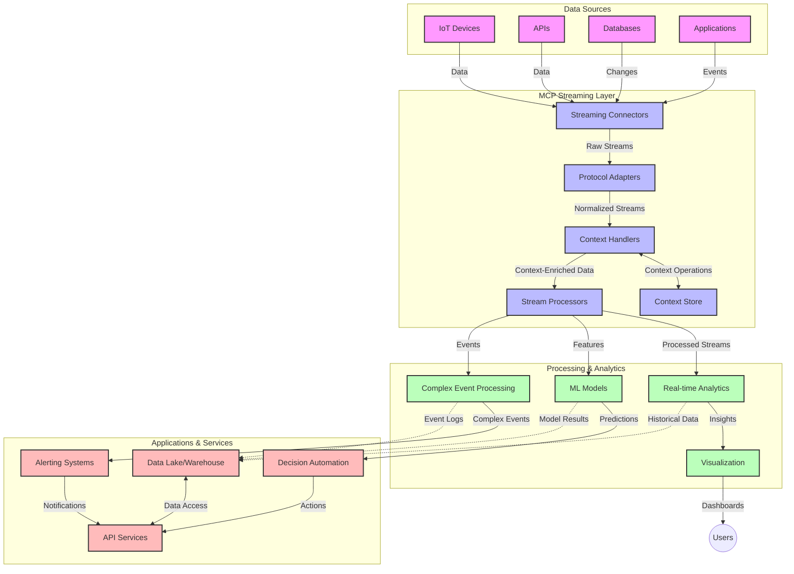

<!--
CO_OP_TRANSLATOR_METADATA:
{
  "original_hash": "68c518dbff8a3b127ed2aa934054c56c",
  "translation_date": "2025-06-11T17:23:47+00:00",
  "source_file": "05-AdvancedTopics/mcp-realtimestreaming/README.md",
  "language_code": "vi"
}
-->
# Giao thức Ngữ cảnh Mô hình cho Truyền dữ liệu Thời gian Thực

## Tổng quan

Truyền dữ liệu thời gian thực đã trở thành yếu tố thiết yếu trong thế giới dữ liệu ngày nay, nơi các doanh nghiệp và ứng dụng cần truy cập thông tin ngay lập tức để đưa ra quyết định kịp thời. Giao thức Ngữ cảnh Mô hình (MCP) đại diện cho bước tiến quan trọng trong việc tối ưu hóa các quy trình truyền dữ liệu thời gian thực này, nâng cao hiệu quả xử lý dữ liệu, duy trì tính toàn vẹn ngữ cảnh và cải thiện hiệu suất tổng thể của hệ thống.

Module này khám phá cách MCP biến đổi truyền dữ liệu thời gian thực bằng cách cung cấp một phương pháp chuẩn hóa quản lý ngữ cảnh giữa các mô hình AI, nền tảng truyền dữ liệu và ứng dụng.

## Giới thiệu về Truyền dữ liệu Thời gian Thực

Truyền dữ liệu thời gian thực là một mô hình công nghệ cho phép chuyển, xử lý và phân tích dữ liệu liên tục ngay khi dữ liệu được tạo ra, giúp hệ thống phản ứng ngay lập tức với thông tin mới. Khác với xử lý theo lô truyền thống hoạt động trên tập dữ liệu tĩnh, truyền dữ liệu xử lý dữ liệu đang di chuyển, cung cấp thông tin và hành động với độ trễ tối thiểu.

### Các Khái niệm Cốt lõi của Truyền dữ liệu Thời gian Thực:

- **Dòng dữ liệu liên tục**: Dữ liệu được xử lý như một dòng sự kiện hoặc bản ghi không ngừng nghỉ.
- **Xử lý độ trễ thấp**: Hệ thống được thiết kế để giảm thiểu thời gian giữa việc tạo dữ liệu và xử lý.
- **Khả năng mở rộng**: Kiến trúc truyền dữ liệu phải xử lý được khối lượng và tốc độ dữ liệu biến đổi.
- **Khả năng chịu lỗi**: Hệ thống cần có khả năng chống chịu sự cố để đảm bảo dòng dữ liệu không bị gián đoạn.
- **Xử lý trạng thái**: Duy trì ngữ cảnh xuyên suốt các sự kiện là rất quan trọng để phân tích có ý nghĩa.

### Giao thức Ngữ cảnh Mô hình và Truyền dữ liệu Thời gian Thực

Giao thức Ngữ cảnh Mô hình (MCP) giải quyết nhiều thách thức quan trọng trong môi trường truyền dữ liệu thời gian thực:

1. **Liên tục Ngữ cảnh**: MCP chuẩn hóa cách duy trì ngữ cảnh trên các thành phần truyền dữ liệu phân tán, đảm bảo các mô hình AI và nút xử lý có quyền truy cập vào ngữ cảnh lịch sử và môi trường liên quan.

2. **Quản lý Trạng thái Hiệu quả**: Bằng cách cung cấp các cơ chế có cấu trúc để truyền ngữ cảnh, MCP giảm tải quản lý trạng thái trong các pipeline truyền dữ liệu.

3. **Tương tác Liên hệ**: MCP tạo ra một ngôn ngữ chung để chia sẻ ngữ cảnh giữa các công nghệ truyền dữ liệu và mô hình AI đa dạng, cho phép kiến trúc linh hoạt và mở rộng hơn.

4. **Ngữ cảnh Tối ưu cho Truyền dữ liệu**: Các triển khai MCP có thể ưu tiên những phần tử ngữ cảnh quan trọng nhất cho quyết định thời gian thực, tối ưu cả về hiệu suất và độ chính xác.

5. **Xử lý Thích ứng**: Với quản lý ngữ cảnh đúng đắn qua MCP, hệ thống truyền dữ liệu có thể điều chỉnh linh hoạt xử lý dựa trên điều kiện và mẫu dữ liệu đang thay đổi.

Trong các ứng dụng hiện đại từ mạng cảm biến IoT đến nền tảng giao dịch tài chính, việc tích hợp MCP với công nghệ truyền dữ liệu giúp xử lý thông minh hơn, có nhận thức ngữ cảnh và phản hồi phù hợp với các tình huống phức tạp, thay đổi theo thời gian thực.

## Mục tiêu Học tập

Sau bài học này, bạn sẽ có khả năng:

- Hiểu các nguyên tắc cơ bản của truyền dữ liệu thời gian thực và những thách thức liên quan
- Giải thích cách Giao thức Ngữ cảnh Mô hình (MCP) nâng cao truyền dữ liệu thời gian thực
- Triển khai giải pháp truyền dữ liệu dựa trên MCP sử dụng các framework phổ biến như Kafka và Pulsar
- Thiết kế và triển khai kiến trúc truyền dữ liệu chịu lỗi, hiệu suất cao với MCP
- Áp dụng các khái niệm MCP vào các trường hợp sử dụng IoT, giao dịch tài chính và phân tích dữ liệu dựa trên AI
- Đánh giá các xu hướng mới nổi và đổi mới tương lai trong công nghệ truyền dữ liệu dựa trên MCP

### Định nghĩa và Ý nghĩa

Truyền dữ liệu thời gian thực bao gồm việc tạo, xử lý và truyền dữ liệu liên tục với độ trễ thấp nhất có thể. Khác với xử lý theo lô, nơi dữ liệu được thu thập và xử lý theo nhóm, dữ liệu truyền được xử lý từng phần khi nó đến, cho phép có cái nhìn và hành động ngay lập tức.

Các đặc điểm chính của truyền dữ liệu thời gian thực bao gồm:

- **Độ trễ thấp**: Xử lý và phân tích dữ liệu trong phạm vi mili giây đến vài giây
- **Dòng liên tục**: Dòng dữ liệu không gián đoạn từ nhiều nguồn khác nhau
- **Xử lý ngay lập tức**: Phân tích dữ liệu khi nó đến thay vì theo lô
- **Kiến trúc hướng sự kiện**: Phản ứng với sự kiện ngay khi chúng xảy ra

### Thách thức trong Truyền dữ liệu Truyền thống

Các phương pháp truyền dữ liệu truyền thống gặp phải một số hạn chế:

1. **Mất ngữ cảnh**: Khó duy trì ngữ cảnh trên các hệ thống phân tán
2. **Vấn đề mở rộng**: Khó khăn trong việc mở rộng để xử lý dữ liệu với khối lượng và tốc độ lớn
3. **Phức tạp trong tích hợp**: Vấn đề tương tác giữa các hệ thống khác nhau
4. **Quản lý độ trễ**: Cân bằng giữa thông lượng và thời gian xử lý
5. **Tính nhất quán dữ liệu**: Đảm bảo độ chính xác và đầy đủ của dữ liệu xuyên suốt dòng

## Hiểu về Giao thức Ngữ cảnh Mô hình (MCP)

### MCP là gì?

Giao thức Ngữ cảnh Mô hình (MCP) là một giao thức truyền thông chuẩn hóa nhằm tạo điều kiện tương tác hiệu quả giữa các mô hình AI và ứng dụng. Trong bối cảnh truyền dữ liệu thời gian thực, MCP cung cấp một khuôn khổ để:

- Bảo tồn ngữ cảnh xuyên suốt pipeline dữ liệu
- Chuẩn hóa định dạng trao đổi dữ liệu
- Tối ưu hóa truyền tải các bộ dữ liệu lớn
- Nâng cao giao tiếp giữa mô hình với mô hình và mô hình với ứng dụng

### Các thành phần chính và Kiến trúc

Kiến trúc MCP cho truyền dữ liệu thời gian thực bao gồm các thành phần chính:

1. **Bộ xử lý Ngữ cảnh**: Quản lý và duy trì thông tin ngữ cảnh xuyên suốt pipeline truyền dữ liệu
2. **Bộ xử lý Dòng dữ liệu**: Xử lý các luồng dữ liệu đầu vào bằng các kỹ thuật nhận thức ngữ cảnh
3. **Bộ chuyển đổi Giao thức**: Chuyển đổi giữa các giao thức truyền dữ liệu khác nhau đồng thời bảo tồn ngữ cảnh
4. **Kho Ngữ cảnh**: Lưu trữ và truy xuất thông tin ngữ cảnh một cách hiệu quả
5. **Bộ kết nối Truyền dữ liệu**: Kết nối với các nền tảng truyền dữ liệu khác nhau (Kafka, Pulsar, Kinesis, v.v.)



### MCP cải thiện xử lý dữ liệu thời gian thực như thế nào

MCP giải quyết các thách thức truyền dữ liệu truyền thống bằng cách:

- **Toàn vẹn Ngữ cảnh**: Duy trì mối quan hệ giữa các điểm dữ liệu xuyên suốt pipeline
- **Truyền tải Tối ưu**: Giảm thiểu sự trùng lặp trong trao đổi dữ liệu thông qua quản lý ngữ cảnh thông minh
- **Giao diện Chuẩn hóa**: Cung cấp API nhất quán cho các thành phần truyền dữ liệu
- **Giảm Độ trễ**: Tối thiểu hóa chi phí xử lý nhờ quản lý ngữ cảnh hiệu quả
- **Tăng Khả năng mở rộng**: Hỗ trợ mở rộng ngang trong khi vẫn giữ được ngữ cảnh

## Tích hợp và Triển khai

Hệ thống truyền dữ liệu thời gian thực đòi hỏi thiết kế kiến trúc và triển khai cẩn thận để duy trì cả hiệu suất và tính toàn vẹn ngữ cảnh. Giao thức Ngữ cảnh Mô hình cung cấp một cách tiếp cận chuẩn hóa để tích hợp các mô hình AI và công nghệ truyền dữ liệu, cho phép pipeline xử lý có nhận thức ngữ cảnh tinh vi hơn.

### Tổng quan về tích hợp MCP trong kiến trúc truyền dữ liệu

Triển khai MCP trong môi trường truyền dữ liệu thời gian thực cần xem xét các điểm chính sau:

1. **Tuần tự hóa và Vận chuyển Ngữ cảnh**: MCP cung cấp cơ chế hiệu quả để mã hóa thông tin ngữ cảnh trong các gói dữ liệu truyền, đảm bảo ngữ cảnh quan trọng đi theo dữ liệu trong suốt pipeline xử lý. Điều này bao gồm các định dạng tuần tự hóa chuẩn hóa, tối ưu cho vận chuyển truyền dữ liệu.

2. **Xử lý Luồng có Trạng thái**: MCP cho phép xử lý trạng thái thông minh hơn bằng cách duy trì biểu diễn ngữ cảnh nhất quán trên các nút xử lý. Điều này đặc biệt quan trọng trong kiến trúc truyền dữ liệu phân tán, nơi quản lý trạng thái thường gặp khó khăn.

3. **Thời gian Sự kiện so với Thời gian Xử lý**: Các triển khai MCP trong hệ thống truyền dữ liệu phải giải quyết thách thức phân biệt giữa thời điểm sự kiện xảy ra và thời điểm nó được xử lý. Giao thức có thể tích hợp ngữ cảnh thời gian để bảo tồn ý nghĩa thời gian sự kiện.

4. **Quản lý Áp lực ngược (Backpressure)**: Nhờ chuẩn hóa xử lý ngữ cảnh, MCP hỗ trợ quản lý áp lực ngược trong hệ thống truyền dữ liệu, cho phép các thành phần truyền đạt khả năng xử lý và điều chỉnh luồng dữ liệu tương ứng.

5. **Cửa sổ Ngữ cảnh và Tổng hợp**: MCP tạo điều kiện cho các phép toán cửa sổ phức tạp hơn bằng cách cung cấp biểu diễn có cấu trúc về ngữ cảnh thời gian và quan hệ, giúp tổng hợp dữ liệu có ý nghĩa hơn trên các luồng sự kiện.

6. **Xử lý Chính xác Một lần (Exactly-Once)**: Trong các hệ thống truyền dữ liệu yêu cầu tính chính xác một lần, MCP có thể tích hợp siêu dữ liệu xử lý để theo dõi và xác minh trạng thái xử lý trên các thành phần phân tán.

Việc triển khai MCP trên nhiều công nghệ truyền dữ liệu khác nhau tạo ra một cách tiếp cận thống nhất cho quản lý ngữ cảnh, giảm nhu cầu viết mã tích hợp tùy chỉnh đồng thời nâng cao khả năng duy trì ngữ cảnh có ý nghĩa khi dữ liệu chảy qua pipeline.

### MCP trong các Framework Truyền dữ liệu Phổ biến

MCP có thể tích hợp với các framework truyền dữ liệu phổ biến bao gồm:

#### Tích hợp Apache Kafka

```python
from mcp_streaming import MCPKafkaConnector

# Initialize MCP Kafka connector
connector = MCPKafkaConnector(
    bootstrap_servers='localhost:9092',
    context_preservation=True
)

# Create a context-aware consumer
consumer = connector.create_consumer('input-topic')

# Process streaming data with context
for message in consumer:
    context = message.get_context()
    data = message.get_value()
    
    # Process with context awareness
    result = process_with_context(data, context)
    
    # Produce output with preserved context
    connector.produce('output-topic', result, context=context)
```

#### Triển khai Apache Pulsar

```python
from mcp_streaming import MCPPulsarClient

# Initialize MCP Pulsar client
client = MCPPulsarClient('pulsar://localhost:6650')

# Subscribe with context awareness
consumer = client.subscribe('input-topic', 'subscription-name', 
                           context_enabled=True)

# Process messages with context preservation
while True:
    message = consumer.receive()
    context = message.get_context()
    
    # Process with context
    result = process_with_context(message.data(), context)
    
    # Acknowledge the message
    consumer.acknowledge(message)
    
    # Send result with preserved context
    producer = client.create_producer('output-topic')
    producer.send(result, context=context)
```

### Các thực hành tốt nhất khi triển khai

Khi triển khai MCP cho truyền dữ liệu thời gian thực:

1. **Thiết kế để chịu lỗi**:
   - Triển khai xử lý lỗi thích hợp
   - Sử dụng hàng đợi dead-letter cho các thông điệp thất bại
   - Thiết kế bộ xử lý idempotent

2. **Tối ưu hiệu suất**:
   - Cấu hình kích thước bộ đệm phù hợp
   - Sử dụng xử lý theo lô khi thích hợp
   - Triển khai cơ chế áp lực ngược

3. **Giám sát và Quan sát**:
   - Theo dõi các chỉ số xử lý luồng
   - Giám sát việc truyền ngữ cảnh
   - Thiết lập cảnh báo khi có bất thường

4. **Bảo mật luồng dữ liệu**:
   - Mã hóa dữ liệu nhạy cảm
   - Sử dụng xác thực và phân quyền
   - Áp dụng kiểm soát truy cập hợp lý

### MCP trong IoT và Điện toán Biên

MCP nâng cao truyền dữ liệu IoT bằng cách:

- Bảo tồn ngữ cảnh thiết bị xuyên suốt pipeline xử lý
- Cho phép truyền dữ liệu hiệu quả từ biên đến đám mây
- Hỗ trợ phân tích thời gian thực trên các luồng dữ liệu IoT
- Tạo điều kiện giao tiếp thiết bị với thiết bị có ngữ cảnh

Ví dụ: Mạng cảm biến Thành phố Thông minh  
```
Sensors → Edge Gateways → MCP Stream Processors → Real-time Analytics → Automated Responses
```

### Vai trò trong Giao dịch Tài chính và Giao dịch Tần suất Cao

MCP mang lại lợi thế đáng kể cho truyền dữ liệu tài chính:

- Xử lý độ trễ cực thấp cho quyết định giao dịch
- Duy trì ngữ cảnh giao dịch xuyên suốt quá trình xử lý
- Hỗ trợ xử lý sự kiện phức tạp với nhận thức ngữ cảnh
- Đảm bảo tính nhất quán dữ liệu trên hệ thống giao dịch phân tán

### Nâng cao phân tích dữ liệu dựa trên AI

MCP mở ra các khả năng mới cho phân tích luồng:

- Huấn luyện và suy luận mô hình thời gian thực
- Học liên tục từ dữ liệu truyền
- Trích xuất đặc trưng có nhận thức ngữ cảnh
- Pipeline suy luận đa mô hình với ngữ cảnh được bảo tồn

## Xu hướng và Đổi mới trong Tương lai

### Sự phát triển của MCP trong môi trường thời gian thực

Nhìn về phía trước, MCP dự kiến sẽ phát triển để giải quyết:

- **Tích hợp Điện toán Lượng tử**: Chuẩn bị cho hệ thống truyền dữ liệu dựa trên lượng tử
- **Xử lý Gốc Biên**: Đưa nhiều xử lý nhận thức ngữ cảnh hơn về các thiết bị biên
- **Quản lý Luồng Tự động**: Pipeline truyền dữ liệu tự tối ưu hóa
- **Truyền dữ liệu Liên kết (Federated Streaming)**: Xử lý phân tán đồng thời bảo vệ quyền riêng tư

### Tiến bộ Công nghệ Tiềm năng

Các công nghệ mới sẽ định hình tương lai của truyền dữ liệu MCP:

1. **Giao thức truyền dữ liệu Tối ưu AI**: Giao thức tùy chỉnh dành riêng cho khối lượng công việc AI
2. **Tích hợp Điện toán Thần kinh (Neuromorphic Computing)**: Điện toán lấy cảm hứng từ não bộ cho xử lý luồng
3. **Truyền dữ liệu Không máy chủ (Serverless Streaming)**: Truyền dữ liệu hướng sự kiện, có thể mở rộng mà không cần quản lý hạ tầng
4. **Kho Ngữ cảnh Phân tán**: Quản lý ngữ cảnh phân tán toàn cầu nhưng vẫn nhất quán cao

## Bài tập Thực hành

### Bài tập 1: Thiết lập Pipeline truyền dữ liệu MCP cơ bản

Trong bài tập này, bạn sẽ học cách:
- Cấu hình môi trường truyền dữ liệu MCP cơ bản
- Triển khai bộ xử lý ngữ cảnh cho xử lý luồng
- Kiểm thử và xác nhận bảo tồn ngữ cảnh

### Bài tập 2: Xây dựng Bảng điều khiển Phân tích Thời gian Thực

Tạo một ứng dụng hoàn chỉnh mà:
- Thu thập dữ liệu truyền qua MCP
- Xử lý luồng dữ liệu trong khi duy trì ngữ cảnh
- Hiển thị kết quả trực quan theo thời gian thực

### Bài tập 3: Triển khai Xử lý Sự kiện Phức tạp với MCP

Bài tập nâng cao bao gồm:
- Phát hiện mẫu trong các luồng
- Tương quan ngữ cảnh giữa nhiều luồng
- Tạo sự kiện phức tạp với ngữ cảnh được bảo tồn

## Tài nguyên Tham khảo

- [Model Context Protocol Specification](https://github.com/microsoft/model-context-protocol) - Tài liệu và đặc tả chính thức của MCP
- [Apache Kafka Documentation](https://kafka.apache.org/documentation/) - Tìm hiểu về Kafka cho xử lý luồng
- [Apache Pulsar](https://pulsar.apache.org/) - Nền tảng nhắn tin và truyền dữ liệu thống nhất
- [Streaming Systems: The What, Where, When, and How of Large-Scale Data Processing](https://www.oreilly.com/library/view/streaming-systems/9781491983867/) - Sách toàn diện về kiến trúc truyền dữ liệu
- [Microsoft Azure Event Hubs](https://learn.microsoft.com/en-us/azure/event-hubs/event-hubs-about) - Dịch vụ truyền dữ liệu sự kiện được quản lý
- [MLflow Documentation](https://mlflow.org/docs/latest/index.html) - Theo dõi và triển khai mô hình ML
- [Real-Time Analytics with Apache Storm](https://storm.apache.org/releases/current/index.html) - Framework xử lý tính toán thời gian thực
- [Flink ML](https://nightlies.apache.org/flink/flink-ml-docs-master/) - Thư viện máy học cho Apache Flink
- [LangChain Documentation](https://python.langchain.com/docs/get_started/introduction) - Xây dựng ứng dụng với LLMs

## Kết quả Học tập

Sau khi hoàn thành module này, bạn sẽ có khả năng:

- Hiểu các nguyên tắc cơ bản và thách thức của truyền dữ liệu thời gian thực
- Giải thích cách Giao thức Ngữ cảnh Mô hình (MCP) nâng cao truyền dữ liệu thời gian thực
- Triển khai giải pháp truyền dữ liệu dựa trên MCP sử dụng các framework phổ biến như Kafka và Pulsar
- Thiết kế và triển khai kiến trúc truyền dữ liệu chịu lỗi, hiệu suất cao với MCP
- Áp dụng các khái niệm MCP vào IoT, giao dịch tài chính và phân tích dữ liệu dựa trên AI
- Đánh giá các xu hướng mới nổi và đổi mới tương lai trong công nghệ truyền dữ liệu dựa trên MCP

## Tiếp theo là gì

- [6. Community Contributions](../../06-Community

**Tuyên bố miễn trừ trách nhiệm**:  
Tài liệu này đã được dịch bằng dịch vụ dịch thuật AI [Co-op Translator](https://github.com/Azure/co-op-translator). Mặc dù chúng tôi cố gắng đảm bảo độ chính xác, xin lưu ý rằng các bản dịch tự động có thể chứa lỗi hoặc không chính xác. Tài liệu gốc bằng ngôn ngữ gốc của nó nên được xem là nguồn tham khảo chính thức. Đối với các thông tin quan trọng, nên sử dụng dịch vụ dịch thuật chuyên nghiệp do con người thực hiện. Chúng tôi không chịu trách nhiệm về bất kỳ sự hiểu lầm hay giải thích sai nào phát sinh từ việc sử dụng bản dịch này.