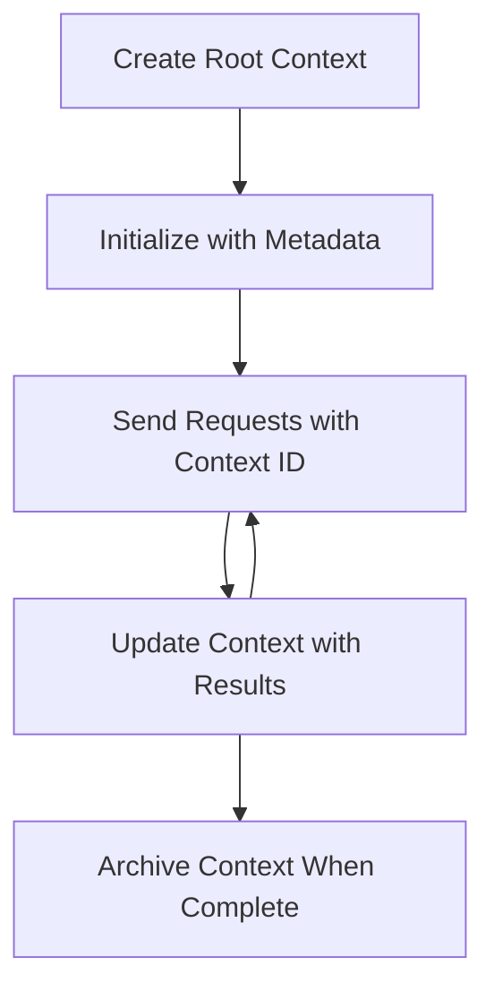

<!--
CO_OP_TRANSLATOR_METADATA:
{
  "original_hash": "ebdb86db46113f1cbd59ce4c74caaa79",
  "translation_date": "2025-07-17T07:38:52+00:00",
  "source_file": "05-AdvancedTopics/mcp-root-contexts/README.md",
  "language_code": "vi"
}
-->
# MCP Root Contexts

Root contexts là một khái niệm cơ bản trong Model Context Protocol, cung cấp một lớp lưu trữ bền vững để duy trì lịch sử cuộc trò chuyện và trạng thái chung qua nhiều yêu cầu và phiên làm việc.

## Giới thiệu

Trong bài học này, chúng ta sẽ tìm hiểu cách tạo, quản lý và sử dụng root contexts trong MCP.

## Mục tiêu học tập

Sau bài học này, bạn sẽ có thể:

- Hiểu mục đích và cấu trúc của root contexts
- Tạo và quản lý root contexts bằng các thư viện client MCP
- Triển khai root contexts trong các ứng dụng .NET, Java, JavaScript và Python
- Sử dụng root contexts cho các cuộc trò chuyện nhiều lượt và quản lý trạng thái
- Áp dụng các thực hành tốt nhất trong quản lý root contexts

## Hiểu về Root Contexts

Root contexts đóng vai trò như các vùng chứa lưu giữ lịch sử và trạng thái cho một chuỗi các tương tác liên quan. Chúng cho phép:

- **Duy trì cuộc trò chuyện**: Giữ cho các cuộc trò chuyện nhiều lượt được mạch lạc
- **Quản lý bộ nhớ**: Lưu trữ và truy xuất thông tin qua các tương tác
- **Quản lý trạng thái**: Theo dõi tiến trình trong các quy trình phức tạp
- **Chia sẻ ngữ cảnh**: Cho phép nhiều client truy cập cùng một trạng thái cuộc trò chuyện

Trong MCP, root contexts có các đặc điểm chính sau:

- Mỗi root context có một định danh duy nhất.
- Chúng có thể chứa lịch sử cuộc trò chuyện, sở thích người dùng và các siêu dữ liệu khác.
- Có thể được tạo, truy cập và lưu trữ khi cần thiết.
- Hỗ trợ kiểm soát truy cập và quyền hạn chi tiết.

## Vòng đời của Root Context



## Làm việc với Root Contexts

Dưới đây là ví dụ về cách tạo và quản lý root contexts.

### Triển khai C#

```csharp
// .NET Example: Root Context Management
using Microsoft.Mcp.Client;
using System;
using System.Threading.Tasks;
using System.Collections.Generic;

public class RootContextExample
{
    private readonly IMcpClient _client;
    private readonly IRootContextManager _contextManager;
    
    public RootContextExample(IMcpClient client, IRootContextManager contextManager)
    {
        _client = client;
        _contextManager = contextManager;
    }
    
    public async Task DemonstrateRootContextAsync()
    {
        // 1. Create a new root context
        var contextResult = await _contextManager.CreateRootContextAsync(new RootContextCreateOptions
        {
            Name = "Customer Support Session",
            Metadata = new Dictionary<string, string>
            {
                ["CustomerName"] = "Acme Corporation",
                ["PriorityLevel"] = "High",
                ["Domain"] = "Cloud Services"
            }
        });
        
        string contextId = contextResult.ContextId;
        Console.WriteLine($"Created root context with ID: {contextId}");
        
        // 2. First interaction using the context
        var response1 = await _client.SendPromptAsync(
            "I'm having issues scaling my web service deployment in the cloud.", 
            new SendPromptOptions { RootContextId = contextId }
        );
        
        Console.WriteLine($"First response: {response1.GeneratedText}");
        
        // Second interaction - the model will have access to the previous conversation
        var response2 = await _client.SendPromptAsync(
            "Yes, we're using containerized deployments with Kubernetes.", 
            new SendPromptOptions { RootContextId = contextId }
        );
        
        Console.WriteLine($"Second response: {response2.GeneratedText}");
        
        // 3. Add metadata to the context based on conversation
        await _contextManager.UpdateContextMetadataAsync(contextId, new Dictionary<string, string>
        {
            ["TechnicalEnvironment"] = "Kubernetes",
            ["IssueType"] = "Scaling"
        });
        
        // 4. Get context information
        var contextInfo = await _contextManager.GetRootContextInfoAsync(contextId);
        
        Console.WriteLine("Context Information:");
        Console.WriteLine($"- Name: {contextInfo.Name}");
        Console.WriteLine($"- Created: {contextInfo.CreatedAt}");
        Console.WriteLine($"- Messages: {contextInfo.MessageCount}");
        
        // 5. When the conversation is complete, archive the context
        await _contextManager.ArchiveRootContextAsync(contextId);
        Console.WriteLine($"Archived context {contextId}");
    }
}
```

Trong đoạn mã trên, chúng ta đã:

1. Tạo một root context cho phiên hỗ trợ khách hàng.
2. Gửi nhiều tin nhắn trong context đó, cho phép mô hình duy trì trạng thái.
3. Cập nhật context với các siêu dữ liệu liên quan dựa trên cuộc trò chuyện.
4. Truy xuất thông tin context để hiểu lịch sử cuộc trò chuyện.
5. Lưu trữ context khi cuộc trò chuyện kết thúc.

## Ví dụ: Triển khai Root Context cho phân tích tài chính

Trong ví dụ này, chúng ta sẽ tạo một root context cho phiên phân tích tài chính, minh họa cách duy trì trạng thái qua nhiều tương tác.

### Triển khai Java

```java
// Java Example: Root Context Implementation
package com.example.mcp.contexts;

import com.mcp.client.McpClient;
import com.mcp.client.ContextManager;
import com.mcp.models.RootContext;
import com.mcp.models.McpResponse;

import java.util.HashMap;
import java.util.Map;
import java.util.UUID;

public class RootContextsDemo {
    private final McpClient client;
    private final ContextManager contextManager;
    
    public RootContextsDemo(String serverUrl) {
        this.client = new McpClient.Builder()
            .setServerUrl(serverUrl)
            .build();
            
        this.contextManager = new ContextManager(client);
    }
    
    public void demonstrateRootContext() throws Exception {
        // Create context metadata
        Map<String, String> metadata = new HashMap<>();
        metadata.put("projectName", "Financial Analysis");
        metadata.put("userRole", "Financial Analyst");
        metadata.put("dataSource", "Q1 2025 Financial Reports");
        
        // 1. Create a new root context
        RootContext context = contextManager.createRootContext("Financial Analysis Session", metadata);
        String contextId = context.getId();
        
        System.out.println("Created context: " + contextId);
        
        // 2. First interaction
        McpResponse response1 = client.sendPrompt(
            "Analyze the trends in Q1 financial data for our technology division",
            contextId
        );
        
        System.out.println("First response: " + response1.getGeneratedText());
        
        // 3. Update context with important information gained from response
        contextManager.addContextMetadata(contextId, 
            Map.of("identifiedTrend", "Increasing cloud infrastructure costs"));
        
        // Second interaction - using the same context
        McpResponse response2 = client.sendPrompt(
            "What's driving the increase in cloud infrastructure costs?",
            contextId
        );
        
        System.out.println("Second response: " + response2.getGeneratedText());
        
        // 4. Generate a summary of the analysis session
        McpResponse summaryResponse = client.sendPrompt(
            "Summarize our analysis of the technology division financials in 3-5 key points",
            contextId
        );
        
        // Store the summary in context metadata
        contextManager.addContextMetadata(contextId, 
            Map.of("analysisSummary", summaryResponse.getGeneratedText()));
            
        // Get updated context information
        RootContext updatedContext = contextManager.getRootContext(contextId);
        
        System.out.println("Context Information:");
        System.out.println("- Created: " + updatedContext.getCreatedAt());
        System.out.println("- Last Updated: " + updatedContext.getLastUpdatedAt());
        System.out.println("- Analysis Summary: " + 
            updatedContext.getMetadata().get("analysisSummary"));
            
        // 5. Archive context when done
        contextManager.archiveContext(contextId);
        System.out.println("Context archived");
    }
}
```

Trong đoạn mã trên, chúng ta đã:

1. Tạo một root context cho phiên phân tích tài chính.
2. Gửi nhiều tin nhắn trong context đó, cho phép mô hình duy trì trạng thái.
3. Cập nhật context với các siêu dữ liệu liên quan dựa trên cuộc trò chuyện.
4. Tạo bản tóm tắt phiên phân tích và lưu trữ trong siêu dữ liệu của context.
5. Lưu trữ context khi cuộc trò chuyện kết thúc.

## Ví dụ: Quản lý Root Context

Quản lý root contexts hiệu quả là rất quan trọng để duy trì lịch sử và trạng thái cuộc trò chuyện. Dưới đây là ví dụ về cách triển khai quản lý root context.

### Triển khai JavaScript

```javascript
// JavaScript Example: Managing MCP Root Contexts
const { McpClient, RootContextManager } = require('@mcp/client');

class ContextSession {
  constructor(serverUrl, apiKey = null) {
    // Initialize the MCP client
    this.client = new McpClient({
      serverUrl,
      apiKey
    });
    
    // Initialize context manager
    this.contextManager = new RootContextManager(this.client);
  }
  
  /**
   * Create a new conversation context
   * @param {string} sessionName - Name of the conversation session
   * @param {Object} metadata - Additional metadata for the context
   * @returns {Promise<string>} - Context ID
   */
  async createConversationContext(sessionName, metadata = {}) {
    try {
      const contextResult = await this.contextManager.createRootContext({
        name: sessionName,
        metadata: {
          ...metadata,
          createdAt: new Date().toISOString(),
          status: 'active'
        }
      });
      
      console.log(`Created root context '${sessionName}' with ID: ${contextResult.id}`);
      return contextResult.id;
    } catch (error) {
      console.error('Error creating root context:', error);
      throw error;
    }
  }
  
  /**
   * Send a message in an existing context
   * @param {string} contextId - The root context ID
   * @param {string} message - The user's message
   * @param {Object} options - Additional options
   * @returns {Promise<Object>} - Response data
   */
  async sendMessage(contextId, message, options = {}) {
    try {
      // Send the message using the specified context
      const response = await this.client.sendPrompt(message, {
        rootContextId: contextId,
        temperature: options.temperature || 0.7,
        allowedTools: options.allowedTools || []
      });
      
      // Optionally store important insights from the conversation
      if (options.storeInsights) {
        await this.storeConversationInsights(contextId, message, response.generatedText);
      }
      
      return {
        message: response.generatedText,
        toolCalls: response.toolCalls || [],
        contextId
      };
    } catch (error) {
      console.error(`Error sending message in context ${contextId}:`, error);
      throw error;
    }
  }
  
  /**
   * Store important insights from a conversation
   * @param {string} contextId - The root context ID
   * @param {string} userMessage - User's message
   * @param {string} aiResponse - AI's response
   */
  async storeConversationInsights(contextId, userMessage, aiResponse) {
    try {
      // Extract potential insights (in a real app, this would be more sophisticated)
      const combinedText = userMessage + "\n" + aiResponse;
      
      // Simple heuristic to identify potential insights
      const insightWords = ["important", "key point", "remember", "significant", "crucial"];
      
      const potentialInsights = combinedText
        .split(".")
        .filter(sentence => 
          insightWords.some(word => sentence.toLowerCase().includes(word))
        )
        .map(sentence => sentence.trim())
        .filter(sentence => sentence.length > 10);
      
      // Store insights in context metadata
      if (potentialInsights.length > 0) {
        const insights = {};
        potentialInsights.forEach((insight, index) => {
          insights[`insight_${Date.now()}_${index}`] = insight;
        });
        
        await this.contextManager.updateContextMetadata(contextId, insights);
        console.log(`Stored ${potentialInsights.length} insights in context ${contextId}`);
      }
    } catch (error) {
      console.warn('Error storing conversation insights:', error);
      // Non-critical error, so just log warning
    }
  }
  
  /**
   * Get summary information about a context
   * @param {string} contextId - The root context ID
   * @returns {Promise<Object>} - Context information
   */
  async getContextInfo(contextId) {
    try {
      const contextInfo = await this.contextManager.getContextInfo(contextId);
      
      return {
        id: contextInfo.id,
        name: contextInfo.name,
        created: new Date(contextInfo.createdAt).toLocaleString(),
        lastUpdated: new Date(contextInfo.lastUpdatedAt).toLocaleString(),
        messageCount: contextInfo.messageCount,
        metadata: contextInfo.metadata,
        status: contextInfo.status
      };
    } catch (error) {
      console.error(`Error getting context info for ${contextId}:`, error);
      throw error;
    }
  }
  
  /**
   * Generate a summary of the conversation in a context
   * @param {string} contextId - The root context ID
   * @returns {Promise<string>} - Generated summary
   */
  async generateContextSummary(contextId) {
    try {
      // Ask the model to generate a summary of the conversation so far
      const response = await this.client.sendPrompt(
        "Please summarize our conversation so far in 3-4 sentences, highlighting the main points discussed.",
        { rootContextId: contextId, temperature: 0.3 }
      );
      
      // Store the summary in context metadata
      await this.contextManager.updateContextMetadata(contextId, {
        conversationSummary: response.generatedText,
        summarizedAt: new Date().toISOString()
      });
      
      return response.generatedText;
    } catch (error) {
      console.error(`Error generating context summary for ${contextId}:`, error);
      throw error;
    }
  }
  
  /**
   * Archive a context when it's no longer needed
   * @param {string} contextId - The root context ID
   * @returns {Promise<Object>} - Result of the archive operation
   */
  async archiveContext(contextId) {
    try {
      // Generate a final summary before archiving
      const summary = await this.generateContextSummary(contextId);
      
      // Archive the context
      await this.contextManager.archiveContext(contextId);
      
      return {
        status: "archived",
        contextId,
        summary
      };
    } catch (error) {
      console.error(`Error archiving context ${contextId}:`, error);
      throw error;
    }
  }
}

// Example usage
async function demonstrateContextSession() {
  const session = new ContextSession('https://mcp-server-example.com');
  
  try {
    // 1. Create a new context for a product support conversation
    const contextId = await session.createConversationContext(
      'Product Support - Database Performance',
      {
        customer: 'Globex Corporation',
        product: 'Enterprise Database',
        severity: 'Medium',
        supportAgent: 'AI Assistant'
      }
    );
    
    // 2. First message in the conversation
    const response1 = await session.sendMessage(
      contextId,
      "I'm experiencing slow query performance on our database cluster after the latest update.",
      { storeInsights: true }
    );
    console.log('Response 1:', response1.message);
    
    // Follow-up message in the same context
    const response2 = await session.sendMessage(
      contextId,
      "Yes, we've already checked the indexes and they seem to be properly configured.",
      { storeInsights: true }
    );
    console.log('Response 2:', response2.message);
    
    // 3. Get information about the context
    const contextInfo = await session.getContextInfo(contextId);
    console.log('Context Information:', contextInfo);
    
    // 4. Generate and display conversation summary
    const summary = await session.generateContextSummary(contextId);
    console.log('Conversation Summary:', summary);
    
    // 5. Archive the context when done
    const archiveResult = await session.archiveContext(contextId);
    console.log('Archive Result:', archiveResult);
    
    // 6. Handle any errors gracefully
  } catch (error) {
    console.error('Error in context session demonstration:', error);
  }
}

demonstrateContextSession();
```

Trong đoạn mã trên, chúng ta đã:

1. Tạo một root context cho cuộc trò chuyện hỗ trợ sản phẩm với hàm `createConversationContext`. Trong trường hợp này, context liên quan đến các vấn đề về hiệu suất cơ sở dữ liệu.

2. Gửi nhiều tin nhắn trong context đó, cho phép mô hình duy trì trạng thái với hàm `sendMessage`. Các tin nhắn gửi đi liên quan đến hiệu suất truy vấn chậm và cấu hình chỉ mục.

3. Cập nhật context với các siêu dữ liệu liên quan dựa trên cuộc trò chuyện.

4. Tạo bản tóm tắt cuộc trò chuyện và lưu trữ trong siêu dữ liệu context với hàm `generateContextSummary`.

5. Lưu trữ context khi cuộc trò chuyện kết thúc với hàm `archiveContext`.

6. Xử lý lỗi một cách linh hoạt để đảm bảo độ bền vững.

## Root Context cho Hỗ trợ Nhiều Lượt

Trong ví dụ này, chúng ta sẽ tạo một root context cho phiên hỗ trợ nhiều lượt, minh họa cách duy trì trạng thái qua nhiều tương tác.

### Triển khai Python

```python
# Python Example: Root Context for Multi-Turn Assistance
import asyncio
from datetime import datetime
from mcp_client import McpClient, RootContextManager

class AssistantSession:
    def __init__(self, server_url, api_key=None):
        self.client = McpClient(server_url=server_url, api_key=api_key)
        self.context_manager = RootContextManager(self.client)
    
    async def create_session(self, name, user_info=None):
        """Create a new root context for an assistant session"""
        metadata = {
            "session_type": "assistant",
            "created_at": datetime.now().isoformat(),
        }
        
        # Add user information if provided
        if user_info:
            metadata.update({f"user_{k}": v for k, v in user_info.items()})
            
        # Create the root context
        context = await self.context_manager.create_root_context(name, metadata)
        return context.id
    
    async def send_message(self, context_id, message, tools=None):
        """Send a message within a root context"""
        # Create options with context ID
        options = {
            "root_context_id": context_id
        }
        
        # Add tools if specified
        if tools:
            options["allowed_tools"] = tools
        
        # Send the prompt within the context
        response = await self.client.send_prompt(message, options)
        
        # Update context metadata with conversation progress
        await self.context_manager.update_context_metadata(
            context_id,
            {
                f"message_{datetime.now().timestamp()}": message[:50] + "...",
                "last_interaction": datetime.now().isoformat()
            }
        )
        
        return response
    
    async def get_conversation_history(self, context_id):
        """Retrieve conversation history from a context"""
        context_info = await self.context_manager.get_context_info(context_id)
        messages = await self.client.get_context_messages(context_id)
        
        return {
            "context_info": context_info,
            "messages": messages
        }
    
    async def end_session(self, context_id):
        """End an assistant session by archiving the context"""
        # Generate a summary prompt first
        summary_response = await self.client.send_prompt(
            "Please summarize our conversation and any key points or decisions made.",
            {"root_context_id": context_id}
        )
        
        # Store summary in metadata
        await self.context_manager.update_context_metadata(
            context_id,
            {
                "summary": summary_response.generated_text,
                "ended_at": datetime.now().isoformat(),
                "status": "completed"
            }
        )
        
        # Archive the context
        await self.context_manager.archive_context(context_id)
        
        return {
            "status": "completed",
            "summary": summary_response.generated_text
        }

# Example usage
async def demo_assistant_session():
    assistant = AssistantSession("https://mcp-server-example.com")
    
    # 1. Create session
    context_id = await assistant.create_session(
        "Technical Support Session",
        {"name": "Alex", "technical_level": "advanced", "product": "Cloud Services"}
    )
    print(f"Created session with context ID: {context_id}")
    
    # 2. First interaction
    response1 = await assistant.send_message(
        context_id, 
        "I'm having trouble with the auto-scaling feature in your cloud platform.",
        ["documentation_search", "diagnostic_tool"]
    )
    print(f"Response 1: {response1.generated_text}")
    
    # Second interaction in the same context
    response2 = await assistant.send_message(
        context_id,
        "Yes, I've already checked the configuration settings you mentioned, but it's still not working."
    )
    print(f"Response 2: {response2.generated_text}")
    
    # 3. Get history
    history = await assistant.get_conversation_history(context_id)
    print(f"Session has {len(history['messages'])} messages")
    
    # 4. End session
    end_result = await assistant.end_session(context_id)
    print(f"Session ended with summary: {end_result['summary']}")

if __name__ == "__main__":
    asyncio.run(demo_assistant_session())
```

Trong đoạn mã trên, chúng ta đã:

1. Tạo một root context cho phiên hỗ trợ kỹ thuật với hàm `create_session`. Context bao gồm thông tin người dùng như tên và trình độ kỹ thuật.

2. Gửi nhiều tin nhắn trong context đó, cho phép mô hình duy trì trạng thái với hàm `send_message`. Các tin nhắn gửi đi liên quan đến các vấn đề với tính năng tự động mở rộng.

3. Truy xuất lịch sử cuộc trò chuyện bằng hàm `get_conversation_history`, cung cấp thông tin context và các tin nhắn.

4. Kết thúc phiên làm việc bằng cách lưu trữ context và tạo bản tóm tắt với hàm `end_session`. Bản tóm tắt ghi lại các điểm chính của cuộc trò chuyện.

## Thực hành tốt nhất cho Root Context

Dưới đây là một số thực hành tốt nhất để quản lý root contexts hiệu quả:

- **Tạo các context tập trung**: Tạo các root context riêng biệt cho các mục đích hoặc lĩnh vực cuộc trò chuyện khác nhau để giữ sự rõ ràng.

- **Đặt chính sách hết hạn**: Áp dụng các chính sách lưu trữ hoặc xóa các context cũ để quản lý bộ nhớ và tuân thủ chính sách lưu trữ dữ liệu.

- **Lưu trữ siêu dữ liệu liên quan**: Sử dụng siêu dữ liệu context để lưu giữ thông tin quan trọng về cuộc trò chuyện có thể hữu ích sau này.

- **Sử dụng ID context nhất quán**: Khi một context được tạo, sử dụng ID của nó một cách nhất quán cho tất cả các yêu cầu liên quan để duy trì tính liên tục.

- **Tạo bản tóm tắt**: Khi context trở nên lớn, hãy cân nhắc tạo các bản tóm tắt để ghi lại thông tin thiết yếu đồng thời quản lý kích thước context.

- **Triển khai kiểm soát truy cập**: Đối với hệ thống đa người dùng, triển khai kiểm soát truy cập phù hợp để đảm bảo quyền riêng tư và bảo mật của các context cuộc trò chuyện.

- **Xử lý giới hạn context**: Nhận biết các giới hạn về kích thước context và áp dụng các chiến lược xử lý cho các cuộc trò chuyện rất dài.

- **Lưu trữ khi hoàn thành**: Lưu trữ các context khi cuộc trò chuyện kết thúc để giải phóng tài nguyên đồng thời giữ lại lịch sử cuộc trò chuyện.

## Tiếp theo

- [5.5 Routing](../mcp-routing/README.md)

**Tuyên bố từ chối trách nhiệm**:  
Tài liệu này đã được dịch bằng dịch vụ dịch thuật AI [Co-op Translator](https://github.com/Azure/co-op-translator). Mặc dù chúng tôi cố gắng đảm bảo độ chính xác, xin lưu ý rằng bản dịch tự động có thể chứa lỗi hoặc không chính xác. Tài liệu gốc bằng ngôn ngữ gốc của nó nên được coi là nguồn chính xác và đáng tin cậy. Đối với các thông tin quan trọng, nên sử dụng dịch vụ dịch thuật chuyên nghiệp do con người thực hiện. Chúng tôi không chịu trách nhiệm về bất kỳ sự hiểu lầm hoặc giải thích sai nào phát sinh từ việc sử dụng bản dịch này.