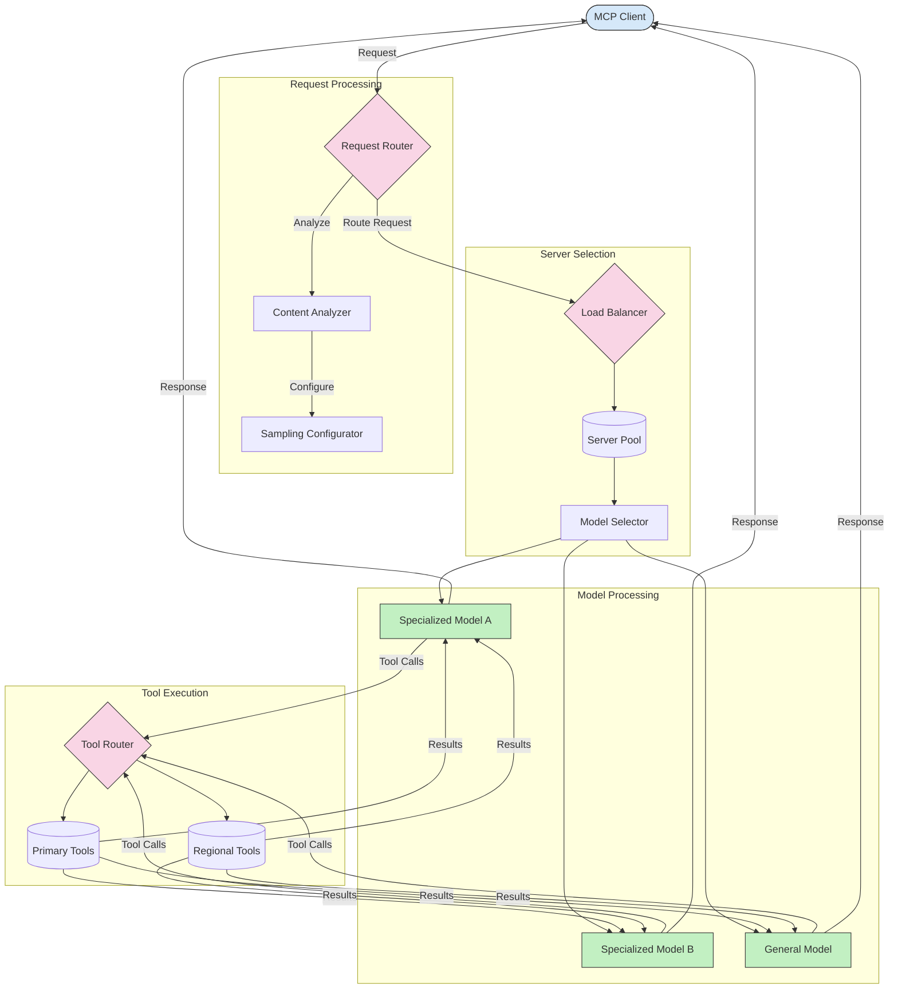

<!--
CO_OP_TRANSLATOR_METADATA:
{
  "original_hash": "2f1b473818b5a6cc9a9bbf777fffa6d4",
  "translation_date": "2025-07-14T21:49:19+00:00",
  "source_file": "05-AdvancedTopics/mcp-routing/README.md",
  "language_code": "vi"
}
-->
## Cân bằng tải thông minh

Cân bằng tải giúp tối ưu hóa việc sử dụng tài nguyên và đảm bảo tính sẵn sàng cao cho các dịch vụ MCP. Có nhiều cách để thực hiện cân bằng tải, chẳng hạn như vòng tròn (round-robin), thời gian phản hồi có trọng số, hoặc các chiến lược nhận biết nội dung.

Hãy xem ví dụ dưới đây minh họa cách triển khai sử dụng các chiến lược sau:

- **Vòng tròn (Round Robin)**: Phân phối đều các yêu cầu đến các máy chủ có sẵn.
- **Thời gian phản hồi có trọng số (Weighted Response Time)**: Điều hướng yêu cầu đến các máy chủ dựa trên thời gian phản hồi trung bình của chúng.
- **Nhận biết nội dung (Content-Aware)**: Điều hướng yêu cầu đến các máy chủ chuyên biệt dựa trên nội dung của yêu cầu.

## Định tuyến công cụ động

Định tuyến công cụ đảm bảo các cuộc gọi công cụ được chuyển đến dịch vụ phù hợp nhất dựa trên ngữ cảnh. Ví dụ, cuộc gọi công cụ thời tiết có thể cần được định tuyến đến điểm cuối khu vực dựa trên vị trí người dùng, hoặc công cụ máy tính có thể cần sử dụng một phiên bản API cụ thể.

Hãy cùng xem ví dụ minh họa cách triển khai định tuyến công cụ động dựa trên phân tích yêu cầu, điểm cuối khu vực và hỗ trợ phiên bản.

## Kiến trúc lấy mẫu và định tuyến trong MCP

Lấy mẫu là một thành phần quan trọng của Model Context Protocol (MCP) cho phép xử lý và định tuyến yêu cầu hiệu quả. Nó bao gồm việc phân tích các yêu cầu đến để xác định mô hình hoặc dịch vụ phù hợp nhất để xử lý, dựa trên các tiêu chí như loại nội dung, ngữ cảnh người dùng và tải hệ thống.

Lấy mẫu và định tuyến có thể được kết hợp để tạo ra một kiến trúc vững chắc, tối ưu hóa việc sử dụng tài nguyên và đảm bảo tính sẵn sàng cao. Quá trình lấy mẫu có thể được sử dụng để phân loại yêu cầu, trong khi định tuyến sẽ chuyển chúng đến các mô hình hoặc dịch vụ phù hợp.

Sơ đồ dưới đây minh họa cách lấy mẫu và định tuyến hoạt động cùng nhau trong một kiến trúc MCP toàn diện:

## Tiếp theo

- [5.6 Lấy mẫu](../mcp-sampling/README.md)

**Tuyên bố từ chối trách nhiệm**:  
Tài liệu này đã được dịch bằng dịch vụ dịch thuật AI [Co-op Translator](https://github.com/Azure/co-op-translator). Mặc dù chúng tôi cố gắng đảm bảo độ chính xác, xin lưu ý rằng các bản dịch tự động có thể chứa lỗi hoặc không chính xác. Tài liệu gốc bằng ngôn ngữ gốc của nó nên được coi là nguồn chính xác và đáng tin cậy. Đối với các thông tin quan trọng, nên sử dụng dịch vụ dịch thuật chuyên nghiệp do con người thực hiện. Chúng tôi không chịu trách nhiệm về bất kỳ sự hiểu lầm hoặc giải thích sai nào phát sinh từ việc sử dụng bản dịch này.