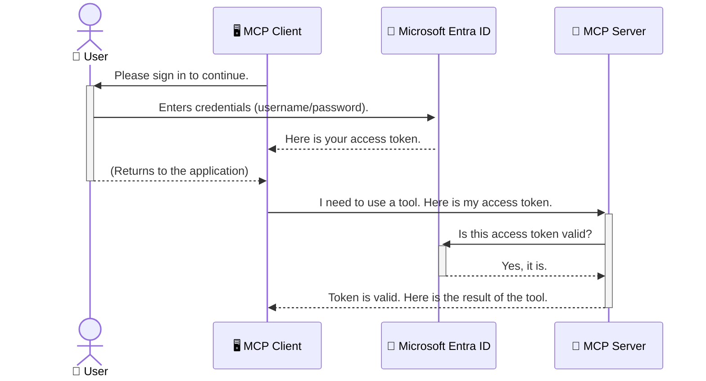

<!--
CO_OP_TRANSLATOR_METADATA:
{
  "original_hash": "0abf26a6c4dbe905d5d49ccdc0ccfe92",
  "translation_date": "2025-06-26T16:35:23+00:00",
  "source_file": "05-AdvancedTopics/mcp-security-entra/README.md",
  "language_code": "vi"
}
-->
# Bảo mật Quy trình AI: Xác thực Entra ID cho Máy chủ Model Context Protocol

## Giới thiệu  
Bảo mật máy chủ Model Context Protocol (MCP) của bạn quan trọng không kém việc khóa cửa chính nhà mình. Để máy chủ MCP mở sẽ khiến công cụ và dữ liệu của bạn dễ bị truy cập trái phép, dẫn đến các lỗ hổng bảo mật. Microsoft Entra ID cung cấp giải pháp quản lý danh tính và truy cập trên đám mây mạnh mẽ, giúp đảm bảo chỉ người dùng và ứng dụng được phép mới có thể tương tác với máy chủ MCP của bạn. Trong phần này, bạn sẽ học cách bảo vệ quy trình AI của mình bằng xác thực Entra ID.

## Mục tiêu học tập  
Sau phần này, bạn sẽ có thể:

- Hiểu được tầm quan trọng của việc bảo mật máy chủ MCP.
- Giải thích những kiến thức cơ bản về Microsoft Entra ID và xác thực OAuth 2.0.
- Nhận biết sự khác biệt giữa client công khai và client bí mật.
- Triển khai xác thực Entra ID trong cả trường hợp máy chủ MCP cục bộ (client công khai) và từ xa (client bí mật).
- Áp dụng các thực hành bảo mật tốt nhất khi phát triển quy trình AI.

## Bảo mật và MCP

Giống như bạn không để cửa chính nhà mở, bạn cũng không nên để máy chủ MCP của mình cho bất kỳ ai truy cập tự do. Bảo mật quy trình AI là yếu tố cần thiết để xây dựng các ứng dụng vững chắc, đáng tin cậy và an toàn. Chương này sẽ giới thiệu cách sử dụng Microsoft Entra ID để bảo vệ máy chủ MCP, đảm bảo chỉ người dùng và ứng dụng được ủy quyền mới có thể tương tác với công cụ và dữ liệu của bạn.

## Tại sao bảo mật quan trọng với máy chủ MCP

Hãy tưởng tượng máy chủ MCP của bạn có một công cụ gửi email hoặc truy cập cơ sở dữ liệu khách hàng. Nếu máy chủ không được bảo mật, bất kỳ ai cũng có thể sử dụng công cụ đó, dẫn đến truy cập dữ liệu trái phép, gửi thư rác hoặc các hành vi độc hại khác.

Bằng cách triển khai xác thực, bạn đảm bảo mọi yêu cầu gửi đến máy chủ đều được xác minh, xác nhận danh tính người dùng hoặc ứng dụng gửi yêu cầu. Đây là bước đầu tiên và quan trọng nhất để bảo vệ quy trình AI của bạn.

## Giới thiệu Microsoft Entra ID

[**Microsoft Entra ID**](https://adoption.microsoft.com/microsoft-security/entra/) là dịch vụ quản lý danh tính và truy cập dựa trên đám mây. Bạn có thể xem nó như một nhân viên bảo vệ an ninh toàn diện cho các ứng dụng của bạn. Nó xử lý quá trình phức tạp xác minh danh tính người dùng (xác thực) và xác định quyền hạn của họ (ủy quyền).

Sử dụng Entra ID, bạn có thể:

- Kích hoạt đăng nhập an toàn cho người dùng.
- Bảo vệ API và dịch vụ.
- Quản lý chính sách truy cập từ một nơi tập trung.

Đối với máy chủ MCP, Entra ID cung cấp giải pháp mạnh mẽ và được tin cậy rộng rãi để quản lý ai có thể truy cập các chức năng của máy chủ.

---

## Hiểu về cơ chế: Cách xác thực Entra ID hoạt động

Entra ID sử dụng các chuẩn mở như **OAuth 2.0** để xử lý xác thực. Mặc dù chi tiết có thể phức tạp, nhưng ý tưởng cốt lõi rất đơn giản và có thể hiểu qua một phép ẩn dụ.

### Giới thiệu nhẹ nhàng về OAuth 2.0: Chìa khóa valet

Hãy tưởng tượng OAuth 2.0 giống như dịch vụ valet cho xe của bạn. Khi bạn đến nhà hàng, bạn không đưa chìa khóa chính cho người giữ xe. Thay vào đó, bạn đưa một **chìa khóa valet** với quyền hạn giới hạn — nó có thể khởi động xe và khóa cửa, nhưng không mở cốp hoặc ngăn chứa đồ.

Trong phép ẩn dụ này:

- **Bạn** là **Người dùng**.
- **Chiếc xe của bạn** là **Máy chủ MCP** với các công cụ và dữ liệu quan trọng.
- **Người giữ xe** là **Microsoft Entra ID**.
- **Nhân viên giữ xe** là **MCP Client** (ứng dụng cố gắng truy cập máy chủ).
- **Chìa khóa valet** là **Access Token**.

Access token là một chuỗi ký tự bảo mật mà MCP client nhận được từ Entra ID sau khi bạn đăng nhập. Client sau đó dùng token này gửi kèm trong mỗi yêu cầu đến máy chủ MCP. Máy chủ có thể kiểm tra token để xác minh yêu cầu hợp lệ và client có quyền truy cập cần thiết, mà không cần xử lý trực tiếp thông tin đăng nhập thực tế của bạn (như mật khẩu).

### Quy trình xác thực

Quy trình hoạt động như sau:



### Giới thiệu Microsoft Authentication Library (MSAL)

Trước khi vào phần code, cần giới thiệu một thành phần quan trọng bạn sẽ thấy trong ví dụ: **Microsoft Authentication Library (MSAL)**.

MSAL là thư viện do Microsoft phát triển giúp lập trình viên dễ dàng xử lý xác thực hơn. Thay vì phải tự viết các đoạn code phức tạp để xử lý token bảo mật, quản lý đăng nhập và làm mới phiên, MSAL sẽ đảm nhiệm phần nặng này.

Sử dụng thư viện như MSAL rất được khuyến khích vì:

- **An toàn:** MSAL tuân thủ các giao thức tiêu chuẩn ngành và thực hành bảo mật tốt nhất, giảm nguy cơ lỗ hổng trong mã của bạn.
- **Đơn giản hóa phát triển:** MSAL trừu tượng hóa sự phức tạp của các giao thức OAuth 2.0 và OpenID Connect, cho phép bạn thêm xác thực mạnh mẽ vào ứng dụng chỉ với vài dòng code.
- **Được duy trì:** Microsoft thường xuyên cập nhật MSAL để đối phó với các mối đe dọa bảo mật mới và thay đổi nền tảng.

MSAL hỗ trợ đa dạng ngôn ngữ và framework ứng dụng như .NET, JavaScript/TypeScript, Python, Java, Go, cùng các nền tảng di động iOS và Android. Điều này giúp bạn áp dụng mẫu xác thực nhất quán trên toàn bộ hệ thống công nghệ của mình.

Để tìm hiểu thêm về MSAL, bạn có thể xem tài liệu [Tổng quan về MSAL](https://learn.microsoft.com/entra/identity-platform/msal-overview).

---

## Bảo mật Máy chủ MCP với Entra ID: Hướng dẫn từng bước

Bây giờ, hãy cùng xem cách bảo mật máy chủ MCP cục bộ (giao tiếp qua `stdio`) using Entra ID. This example uses a **public client**, which is suitable for applications running on a user's machine, like a desktop app or a local development server.

### Scenario 1: Securing a Local MCP Server (with a Public Client)

In this scenario, we'll look at an MCP server that runs locally, communicates over `stdio`, and uses Entra ID to authenticate the user before allowing access to its tools. The server will have a single tool that fetches the user's profile information from the Microsoft Graph API.

#### 1. Setting Up the Application in Entra ID

Before writing any code, you need to register your application in Microsoft Entra ID. This tells Entra ID about your application and grants it permission to use the authentication service.

1. Navigate to the **[Microsoft Entra portal](https://entra.microsoft.com/)**.
2. Go to **App registrations** and click **New registration**.
3. Give your application a name (e.g., "My Local MCP Server").
4. For **Supported account types**, select **Accounts in this organizational directory only**.
5. You can leave the **Redirect URI** blank for this example.
6. Click **Register**.

Once registered, take note of the **Application (client) ID** and **Directory (tenant) ID**. You'll need these in your code.

#### 2. The Code: A Breakdown

Let's look at the key parts of the code that handle authentication. The full code for this example is available in the [Entra ID - Local - WAM](https://github.com/Azure-Samples/mcp-auth-servers/tree/main/src/entra-id-local-wam) folder of the [mcp-auth-servers GitHub repository](https://github.com/Azure-Samples/mcp-auth-servers).

**`AuthenticationService.cs`**

This class is responsible for handling the interaction with Entra ID.

- **`CreateAsync`**: This method initializes the `PublicClientApplication` from the MSAL (Microsoft Authentication Library). It's configured with your application's `clientId` and `tenantId`.
- **`WithBroker`**: This enables the use of a broker (like the Windows Web Account Manager), which provides a more secure and seamless single sign-on experience.
- **`AcquireTokenAsync`**: Đây là phương thức chính. Nó sẽ cố gắng lấy token một cách im lặng (nghĩa là người dùng không phải đăng nhập lại nếu đã có phiên hợp lệ). Nếu không lấy được token im lặng, nó sẽ yêu cầu người dùng đăng nhập tương tác.

```csharp
// Simplified for clarity
public static async Task<AuthenticationService> CreateAsync(ILogger<AuthenticationService> logger)
{
    var msalClient = PublicClientApplicationBuilder
        .Create(_clientId) // Your Application (client) ID
        .WithAuthority(AadAuthorityAudience.AzureAdMyOrg)
        .WithTenantId(_tenantId) // Your Directory (tenant) ID
        .WithBroker(new BrokerOptions(BrokerOptions.OperatingSystems.Windows))
        .Build();

    // ... cache registration ...

    return new AuthenticationService(logger, msalClient);
}

public async Task<string> AcquireTokenAsync()
{
    try
    {
        // Try silent authentication first
        var accounts = await _msalClient.GetAccountsAsync();
        var account = accounts.FirstOrDefault();

        AuthenticationResult? result = null;

        if (account != null)
        {
            result = await _msalClient.AcquireTokenSilent(_scopes, account).ExecuteAsync();
        }
        else
        {
            // If no account, or silent fails, go interactive
            result = await _msalClient.AcquireTokenInteractive(_scopes).ExecuteAsync();
        }

        return result.AccessToken;
    }
    catch (Exception ex)
    {
        _logger.LogError(ex, "An error occurred while acquiring the token.");
        throw; // Optionally rethrow the exception for higher-level handling
    }
}
```

**`Program.cs`**

This is where the MCP server is set up and the authentication service is integrated.

- **`AddSingleton<AuthenticationService>`**: This registers the `AuthenticationService` with the dependency injection container, so it can be used by other parts of the application (like our tool).
- **`GetUserDetailsFromGraph` tool**: This tool requires an instance of `AuthenticationService`. Before it does anything, it calls `authService.AcquireTokenAsync()` để lấy token truy cập hợp lệ. Nếu xác thực thành công, token sẽ được dùng để gọi Microsoft Graph API và lấy thông tin người dùng.

```csharp
// Simplified for clarity
[McpServerTool(Name = "GetUserDetailsFromGraph")]
public static async Task<string> GetUserDetailsFromGraph(
    AuthenticationService authService)
{
    try
    {
        // This will trigger the authentication flow
        var accessToken = await authService.AcquireTokenAsync();

        // Use the token to create a GraphServiceClient
        var graphClient = new GraphServiceClient(
            new BaseBearerTokenAuthenticationProvider(new TokenProvider(authService)));

        var user = await graphClient.Me.GetAsync();

        return System.Text.Json.JsonSerializer.Serialize(user);
    }
    catch (Exception ex)
    {
        return $"Error: {ex.Message}";
    }
}
```

#### 3. Cách tất cả hoạt động cùng nhau

1. Khi MCP client cố gắng sử dụng `GetUserDetailsFromGraph` tool, the tool first calls `AcquireTokenAsync`.
2. `AcquireTokenAsync` triggers the MSAL library to check for a valid token.
3. If no token is found, MSAL, through the broker, will prompt the user to sign in with their Entra ID account.
4. Once the user signs in, Entra ID issues an access token.
5. The tool receives the token and uses it to make a secure call to the Microsoft Graph API.
6. The user's details are returned to the MCP client.

This process ensures that only authenticated users can use the tool, effectively securing your local MCP server.

### Scenario 2: Securing a Remote MCP Server (with a Confidential Client)

When your MCP server is running on a remote machine (like a cloud server) and communicates over a protocol like HTTP Streaming, the security requirements are different. In this case, you should use a **confidential client** and the **Authorization Code Flow**. This is a more secure method because the application's secrets are never exposed to the browser.

This example uses a TypeScript-based MCP server that uses Express.js to handle HTTP requests.

#### 1. Setting Up the Application in Entra ID

The setup in Entra ID is similar to the public client, but with one key difference: you need to create a **client secret**.

1. Navigate to the **[Microsoft Entra portal](https://entra.microsoft.com/)**.
2. In your app registration, go to the **Certificates & secrets** tab.
3. Click **New client secret**, give it a description, and click **Add**.
4. **Important:** Copy the secret value immediately. You will not be able to see it again.
5. You also need to configure a **Redirect URI**. Go to the **Authentication** tab, click **Add a platform**, select **Web**, and enter the redirect URI for your application (e.g., `http://localhost:3001/auth/callback`).

> **⚠️ Important Security Note:** For production applications, Microsoft strongly recommends using **secretless authentication** methods such as **Managed Identity** or **Workload Identity Federation** instead of client secrets. Client secrets pose security risks as they can be exposed or compromised. Managed identities provide a more secure approach by eliminating the need to store credentials in your code or configuration.
>
> For more information about managed identities and how to implement them, see the [Managed identities for Azure resources overview](https://learn.microsoft.com/entra/identity/managed-identities-azure-resources/overview).

#### 2. The Code: A Breakdown

This example uses a session-based approach. When the user authenticates, the server stores the access token and refresh token in a session and gives the user a session token. This session token is then used for subsequent requests. The full code for this example is available in the [Entra ID - Confidential client](https://github.com/Azure-Samples/mcp-auth-servers/tree/main/src/entra-id-cca-session) folder of the [mcp-auth-servers GitHub repository](https://github.com/Azure-Samples/mcp-auth-servers).

**`Server.ts`**

This file sets up the Express server and the MCP transport layer.

- **`requireBearerAuth`**: This is middleware that protects the `/sse` and `/message` endpoints. It checks for a valid bearer token in the `Authorization` header of the request.
- **`EntraIdServerAuthProvider`**: This is a custom class that implements the `McpServerAuthorizationProvider` interface. It's responsible for handling the OAuth 2.0 flow.
- **`/auth/callback`**: Endpoint này xử lý việc chuyển hướng từ Entra ID sau khi người dùng đã xác thực. Nó đổi mã ủy quyền lấy access token và refresh token.

```typescript
// Simplified for clarity
const app = express();
const { server } = createServer();
const provider = new EntraIdServerAuthProvider();

// Protect the SSE endpoint
app.get("/sse", requireBearerAuth({
  provider,
  requiredScopes: ["User.Read"]
}), async (req, res) => {
  // ... connect to the transport ...
});

// Protect the message endpoint
app.post("/message", requireBearerAuth({
  provider,
  requiredScopes: ["User.Read"]
}), async (req, res) => {
  // ... handle the message ...
});

// Handle the OAuth 2.0 callback
app.get("/auth/callback", (req, res) => {
  provider.handleCallback(req.query.code, req.query.state)
    .then(result => {
      // ... handle success or failure ...
    });
});
```

**`Tools.ts`**

This file defines the tools that the MCP server provides. The `getUserDetails` tool tương tự ví dụ trước, nhưng lấy access token từ session.

```typescript
// Simplified for clarity
server.setRequestHandler(CallToolRequestSchema, async (request) => {
  const { name } = request.params;
  const context = request.params?.context as { token?: string } | undefined;
  const sessionToken = context?.token;

  if (name === ToolName.GET_USER_DETAILS) {
    if (!sessionToken) {
      throw new AuthenticationError("Authentication token is missing or invalid. Ensure the token is provided in the request context.");
    }

    // Get the Entra ID token from the session store
    const tokenData = tokenStore.getToken(sessionToken);
    const entraIdToken = tokenData.accessToken;

    const graphClient = Client.init({
      authProvider: (done) => {
        done(null, entraIdToken);
      }
    });

    const user = await graphClient.api('/me').get();

    // ... return user details ...
  }
});
```

**`auth/EntraIdServerAuthProvider.ts`**

This class handles the logic for:

- Redirecting the user to the Entra ID sign-in page.
- Exchanging the authorization code for an access token.
- Storing the tokens in the `tokenStore`.
- Refreshing the access token when it expires.

#### 3. How It All Works Together

1. When a user first tries to connect to the MCP server, the `requireBearerAuth` middleware will see that they don't have a valid session and will redirect them to the Entra ID sign-in page.
2. The user signs in with their Entra ID account.
3. Entra ID redirects the user back to the `/auth/callback` endpoint with an authorization code.
4. The server exchanges the code for an access token and a refresh token, stores them, and creates a session token which is sent to the client.
5. The client can now use this session token in the `Authorization` header for all future requests to the MCP server.
6. When the `getUserDetails` tool được gọi sẽ dùng token session để tra cứu access token Entra ID rồi gọi Microsoft Graph API.

Luồng này phức tạp hơn so với luồng client công khai, nhưng cần thiết cho các endpoint hướng ra internet. Vì máy chủ MCP từ xa có thể truy cập qua internet công cộng, nên cần các biện pháp bảo mật mạnh hơn để chống truy cập trái phép và các cuộc tấn công tiềm ẩn.

## Thực hành bảo mật tốt nhất

- **Luôn sử dụng HTTPS:** Mã hóa kết nối giữa client và server để bảo vệ token khỏi bị chặn.
- **Triển khai Role-Based Access Control (RBAC):** Không chỉ kiểm tra *người dùng đã xác thực* mà còn kiểm tra *quyền hạn* của họ. Bạn có thể định nghĩa vai trò trong Entra ID và kiểm tra trong máy chủ MCP.
- **Giám sát và kiểm tra:** Ghi lại mọi sự kiện xác thực để phát hiện và phản ứng kịp thời với hoạt động đáng ngờ.
- **Xử lý giới hạn tần suất và điều tiết:** Microsoft Graph và các API khác áp dụng giới hạn tần suất để ngăn lạm dụng. Triển khai cơ chế exponential backoff và thử lại trong máy chủ MCP để xử lý mềm mại các phản hồi HTTP 429 (Quá nhiều yêu cầu). Cân nhắc lưu cache dữ liệu truy cập thường xuyên để giảm số lần gọi API.
- **Bảo mật lưu trữ token:** Lưu trữ access token và refresh token một cách an toàn. Ứng dụng cục bộ nên dùng cơ chế lưu trữ an toàn của hệ thống. Ứng dụng máy chủ nên cân nhắc dùng lưu trữ mã hóa hoặc dịch vụ quản lý khóa an toàn như Azure Key Vault.
- **Xử lý hết hạn token:** Access token có thời hạn sử dụng giới hạn. Triển khai tự động làm mới token bằng refresh token để duy trì trải nghiệm người dùng liền mạch mà không cần đăng nhập lại.
- **Cân nhắc dùng Azure API Management:** Mặc dù việc bảo mật trực tiếp trong máy chủ MCP cho phép kiểm soát chi tiết, các API Gateway như Azure API Management có thể xử lý nhiều vấn đề bảo mật tự động, bao gồm xác thực, ủy quyền, giới hạn tần suất và giám sát. Chúng cung cấp lớp bảo mật tập trung giữa client và máy chủ MCP. Để biết thêm chi tiết về sử dụng API Gateway với MCP, xem bài viết [Azure API Management Your Auth Gateway For MCP Servers](https://techcommunity.microsoft.com/blog/integrationsonazureblog/azure-api-management-your-auth-gateway-for-mcp-servers/4402690).

## Những điểm chính cần nhớ

- Bảo mật máy chủ MCP rất quan trọng để bảo vệ dữ liệu và công cụ của bạn.
- Microsoft Entra ID cung cấp giải pháp xác thực và ủy quyền mạnh mẽ, dễ mở rộng.
- Dùng **public client** cho ứng dụng cục bộ và **confidential client** cho máy chủ từ xa.
- **Authorization Code Flow** là lựa chọn an toàn nhất cho ứng dụng web.

## Bài tập

1. Hãy nghĩ về một máy chủ MCP bạn có thể xây dựng. Nó sẽ là máy chủ cục bộ hay máy chủ từ xa?
2. Dựa trên câu trả lời, bạn sẽ dùng client công khai hay client bí mật?
3. Máy chủ MCP của bạn sẽ yêu cầu quyền gì để thực hiện các thao tác với Microsoft Graph?

## Bài tập thực hành

### Bài tập 1: Đăng ký ứng dụng trong Entra ID  
Truy cập cổng Microsoft Entra.  
Đăng ký ứng dụng mới cho máy chủ MCP của bạn.  
Ghi lại Application (client) ID và Directory (tenant) ID.

### Bài tập 2: Bảo mật máy chủ MCP cục bộ (Public Client)  
- Thực hiện theo ví dụ code để tích hợp MSAL (Microsoft Authentication Library) cho xác thực người dùng.  
- Thử nghiệm luồng xác thực bằng cách gọi công cụ MCP lấy thông tin người dùng từ Microsoft Graph.

### Bài tập 3: Bảo mật máy chủ MCP từ xa (Confidential Client)  
- Đăng ký confidential client trong Entra ID và tạo client secret.  
- Cấu hình máy chủ MCP Express.js sử dụng Authorization Code Flow.  
- Kiểm tra các endpoint được bảo vệ và xác nhận truy cập dựa trên token.

### Bài tập 4: Áp dụng thực hành bảo mật tốt nhất  
- Kích hoạt HTTPS cho máy chủ cục bộ hoặc từ xa.  
- Triển khai RBAC trong logic máy chủ.  
- Thêm xử lý hết hạn token và lưu trữ token an toàn.

## Tài nguyên

1. **Tài liệu Tổng quan MSAL**  
   Tìm hiểu cách Microsoft Authentication Library (MSAL) hỗ trợ lấy token an toàn trên nhiều nền tảng:  
   [MSAL Overview on Microsoft Learn](https://learn.microsoft.com/en-gb/entra/msal/overview)

2. **Kho mã nguồn Azure-Samples/mcp-auth-servers trên GitHub**  
   Các ví dụ triển khai máy chủ MCP minh họa luồng xác thực:  
   [Azure-Samples/mcp-auth-servers on GitHub](https://github.com/Azure-Samples/mcp-auth-servers)

3. **Tổng quan Managed Identities cho Azure Resources**  
   Hiểu cách loại bỏ secret bằng cách sử dụng managed identities được gán cho hệ thống hoặc người dùng:  
   [Managed Identities Overview on Microsoft Learn](https://learn.microsoft.com/en-us/entra/identity/managed-identities-azure-resources/)

4. **Azure API Management: Cổng xác thực cho máy chủ MCP**  
   Phân tích sâu về việc sử dụng APIM như cổng OAuth2 an toàn cho máy chủ MCP:  
   [Azure API Management Your Auth Gateway For MCP Servers](https://techcommunity.microsoft.com/blog/integrationsonazureblog/azure-api-management-your-auth-gateway-for-mcp-servers/4402690)

5. **Tham khảo quyền Microsoft Graph**  
   Danh sách đầy đủ quyền được ủy quyền và quyền ứng dụng cho Microsoft Graph:  
   [Microsoft Graph Permissions Reference](https://learn.microsoft.com/zh-tw/graph/permissions-reference)

## Kết quả học tập  
Sau khi hoàn thành phần này, bạn sẽ có thể:

- Trình bày tại sao xác thực quan trọng với máy chủ MCP và quy trình AI.  
- Thiết lập và cấu hình xác thực Entra ID cho cả máy chủ MCP cục bộ và từ xa.  
- Lựa chọn loại client phù hợp (công khai hoặc bí mật) dựa trên cách triển khai máy chủ.  
- Áp dụng thực hành mã hóa an toàn, bao gồm lưu trữ token và ủy quyền theo vai trò.  
- Tự tin bảo vệ máy chủ MCP và công cụ khỏi truy cập trái phép.

## Tiếp theo

- [6. Đóng góp từ cộng đồng](../../06-CommunityContributions/README.md)

**Tuyên bố miễn trừ trách nhiệm**:  
Tài liệu này đã được dịch bằng dịch vụ dịch thuật AI [Co-op Translator](https://github.com/Azure/co-op-translator). Mặc dù chúng tôi cố gắng đảm bảo độ chính xác, xin lưu ý rằng bản dịch tự động có thể chứa lỗi hoặc sai sót. Tài liệu gốc bằng ngôn ngữ nguyên bản của nó nên được coi là nguồn chính xác và có thẩm quyền. Đối với các thông tin quan trọng, nên sử dụng dịch vụ dịch thuật chuyên nghiệp do con người thực hiện. Chúng tôi không chịu trách nhiệm về bất kỳ sự hiểu lầm hoặc diễn giải sai nào phát sinh từ việc sử dụng bản dịch này.