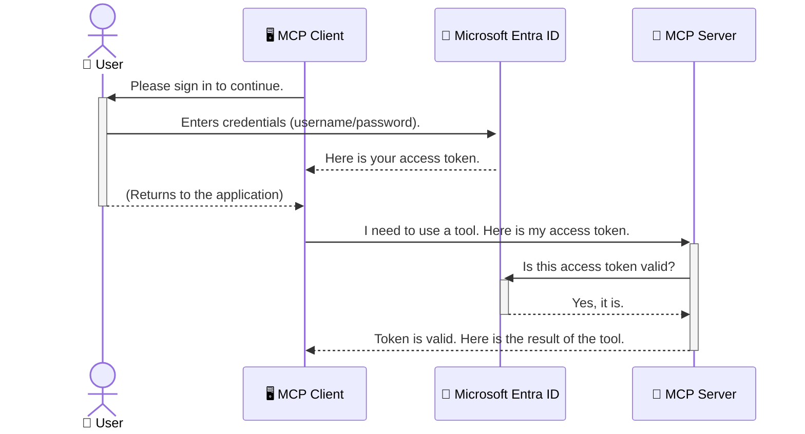

<!--
CO_OP_TRANSLATOR_METADATA:
{
  "original_hash": "9abe1d303ab126f9a8b87f03cebe5213",
  "translation_date": "2025-06-26T14:54:00+00:00",
  "source_file": "05-AdvancedTopics/mcp-security-entra/README.md",
  "language_code": "vi"
}
-->
# Bảo Mật Quy Trình AI: Xác Thực Entra ID cho Máy Chủ Model Context Protocol

## Giới Thiệu  
Bảo mật máy chủ Model Context Protocol (MCP) của bạn quan trọng không kém việc khóa cửa chính nhà bạn. Việc để máy chủ MCP mở sẽ khiến công cụ và dữ liệu của bạn dễ bị truy cập trái phép, dẫn đến các lỗ hổng bảo mật. Microsoft Entra ID cung cấp giải pháp quản lý danh tính và truy cập dựa trên đám mây mạnh mẽ, giúp đảm bảo chỉ người dùng và ứng dụng được ủy quyền mới có thể tương tác với máy chủ MCP của bạn. Trong phần này, bạn sẽ học cách bảo vệ quy trình AI của mình bằng xác thực Entra ID.

## Mục Tiêu Học Tập  
Sau khi hoàn thành phần này, bạn sẽ có thể:

- Hiểu được tầm quan trọng của việc bảo mật máy chủ MCP.  
- Giải thích các kiến thức cơ bản về Microsoft Entra ID và xác thực OAuth 2.0.  
- Phân biệt được sự khác nhau giữa client công khai và client bảo mật.  
- Triển khai xác thực Entra ID cho cả kịch bản máy chủ MCP cục bộ (client công khai) và máy chủ MCP từ xa (client bảo mật).  
- Áp dụng các thực hành bảo mật tốt nhất khi phát triển quy trình AI.

# Bảo Mật Quy Trình AI: Xác Thực Entra ID cho Máy Chủ Model Context Protocol

Cũng như bạn không để cửa chính nhà mình mở, bạn cũng không nên để máy chủ MCP của mình cho phép truy cập tự do. Bảo mật quy trình AI là điều cần thiết để xây dựng các ứng dụng vững chắc, đáng tin cậy và an toàn. Chương này sẽ giới thiệu cách sử dụng Microsoft Entra ID để bảo vệ máy chủ MCP, đảm bảo chỉ người dùng và ứng dụng được phép mới có thể truy cập công cụ và dữ liệu của bạn.

## Tại Sao Bảo Mật Lại Quan Trọng với Máy Chủ MCP

Hãy tưởng tượng máy chủ MCP của bạn có một công cụ gửi email hoặc truy cập cơ sở dữ liệu khách hàng. Nếu máy chủ không được bảo mật, bất kỳ ai cũng có thể sử dụng công cụ đó, dẫn đến truy cập dữ liệu trái phép, gửi thư rác hoặc các hành vi độc hại khác.

Bằng cách triển khai xác thực, bạn đảm bảo mọi yêu cầu đến máy chủ đều được xác minh, xác nhận danh tính người dùng hoặc ứng dụng gửi yêu cầu. Đây là bước đầu tiên và quan trọng nhất để bảo vệ quy trình AI của bạn.

## Giới Thiệu về Microsoft Entra ID

**Microsoft Entra ID** là dịch vụ quản lý danh tính và truy cập dựa trên đám mây. Bạn có thể hình dung nó như một nhân viên bảo vệ an ninh toàn diện cho các ứng dụng của bạn. Nó xử lý quy trình phức tạp xác minh danh tính người dùng (xác thực) và xác định quyền hạn của họ (ủy quyền).

Khi sử dụng Entra ID, bạn có thể:

- Cho phép người dùng đăng nhập an toàn.  
- Bảo vệ API và dịch vụ.  
- Quản lý chính sách truy cập từ một nơi tập trung.

Đối với máy chủ MCP, Entra ID cung cấp giải pháp đáng tin cậy và được sử dụng rộng rãi để quản lý ai có thể truy cập các chức năng của máy chủ.

---

## Hiểu Về Cơ Chế: Cách Xác Thực Entra ID Hoạt Động

Entra ID sử dụng các chuẩn mở như **OAuth 2.0** để xử lý xác thực. Dù chi tiết có thể phức tạp, nhưng ý tưởng cốt lõi rất đơn giản và có thể hiểu qua một phép ẩn dụ.

### Giới Thiệu Nhẹ Nhàng về OAuth 2.0: Chìa Khóa Valet

Hãy tưởng tượng OAuth 2.0 giống như dịch vụ valet cho xe của bạn. Khi bạn đến nhà hàng, bạn không đưa chìa khóa chính cho người valet. Thay vào đó, bạn đưa một **chìa khóa valet** với quyền hạn giới hạn — nó có thể khởi động xe và khóa cửa, nhưng không thể mở cốp hay ngăn đựng đồ.

Trong phép ẩn dụ này:

- **Bạn** là **Người Dùng**.  
- **Chiếc xe của bạn** là **Máy Chủ MCP** với các công cụ và dữ liệu giá trị.  
- **Người valet** là **Microsoft Entra ID**.  
- **Người giữ xe** là **MCP Client** (ứng dụng cố gắng truy cập máy chủ).  
- **Chìa khóa valet** là **Access Token**.

Access token là một chuỗi ký tự bảo mật mà MCP client nhận được từ Entra ID sau khi bạn đăng nhập. Client sẽ gửi token này đến máy chủ MCP mỗi lần gửi yêu cầu. Máy chủ có thể xác minh token để đảm bảo yêu cầu hợp lệ và client có quyền truy cập cần thiết, mà không phải xử lý trực tiếp thông tin đăng nhập thực tế của bạn (như mật khẩu).

### Quy Trình Xác Thực

Quy trình hoạt động như sau:



### Giới Thiệu Microsoft Authentication Library (MSAL)

Trước khi đi vào mã, cần biết về một thành phần quan trọng trong ví dụ: **Microsoft Authentication Library (MSAL)**.

MSAL là thư viện do Microsoft phát triển, giúp lập trình viên dễ dàng xử lý xác thực. Thay vì phải tự viết toàn bộ mã phức tạp để xử lý token bảo mật, quản lý đăng nhập và làm mới phiên, MSAL sẽ đảm nhận phần nặng này.

Sử dụng thư viện như MSAL rất được khuyến khích vì:

- **Bảo Mật:** MSAL áp dụng các chuẩn và thực hành bảo mật theo ngành, giảm thiểu rủi ro lỗ hổng trong mã của bạn.  
- **Đơn Giản Hóa Phát Triển:** MSAL trừu tượng hóa các phức tạp của OAuth 2.0 và OpenID Connect, giúp bạn thêm xác thực mạnh mẽ chỉ với vài dòng mã.  
- **Được Bảo Trì:** Microsoft thường xuyên cập nhật MSAL để đối phó với các mối đe dọa bảo mật mới và thay đổi nền tảng.

MSAL hỗ trợ nhiều ngôn ngữ và framework ứng dụng, bao gồm .NET, JavaScript/TypeScript, Python, Java, Go và các nền tảng di động như iOS và Android. Điều này giúp bạn áp dụng mẫu xác thực đồng nhất trên toàn bộ hệ thống công nghệ.

Để tìm hiểu thêm về MSAL, bạn có thể xem tài liệu chính thức [MSAL overview documentation](https://learn.microsoft.com/entra/identity-platform/msal-overview).

---

## Bảo Mật Máy Chủ MCP với Entra ID: Hướng Dẫn Từng Bước

Bây giờ, hãy cùng xem cách bảo mật máy chủ MCP cục bộ (giao tiếp qua `stdio`) using Entra ID. This example uses a **public client**, which is suitable for applications running on a user's machine, like a desktop app or a local development server.

### Scenario 1: Securing a Local MCP Server (with a Public Client)

In this scenario, we'll look at an MCP server that runs locally, communicates over `stdio`, and uses Entra ID to authenticate the user before allowing access to its tools. The server will have a single tool that fetches the user's profile information from the Microsoft Graph API.

#### 1. Setting Up the Application in Entra ID

Before writing any code, you need to register your application in Microsoft Entra ID. This tells Entra ID about your application and grants it permission to use the authentication service.

1. Navigate to the **[Microsoft Entra portal](https://entra.microsoft.com/)**.
2. Go to **App registrations** and click **New registration**.
3. Give your application a name (e.g., "My Local MCP Server").
4. For **Supported account types**, select **Accounts in this organizational directory only**.
5. You can leave the **Redirect URI** blank for this example.
6. Click **Register**.

Once registered, take note of the **Application (client) ID** and **Directory (tenant) ID**. You'll need these in your code.

#### 2. The Code: A Breakdown

Let's look at the key parts of the code that handle authentication. The full code for this example is available in the [Entra ID - Local - WAM](https://github.com/Azure-Samples/mcp-auth-servers/tree/main/src/entra-id-local-wam) folder of the [mcp-auth-servers GitHub repository](https://github.com/Azure-Samples/mcp-auth-servers).

**`AuthenticationService.cs`**

This class is responsible for handling the interaction with Entra ID.

- **`CreateAsync`**: This method initializes the `PublicClientApplication` from the MSAL (Microsoft Authentication Library). It's configured with your application's `clientId` and `tenantId`.
- **`WithBroker`**: This enables the use of a broker (like the Windows Web Account Manager), which provides a more secure and seamless single sign-on experience.
- **`AcquireTokenAsync`**: Đây là phương thức chính. Nó cố gắng lấy token một cách im lặng (nghĩa là người dùng sẽ không cần đăng nhập lại nếu đã có phiên hợp lệ). Nếu không thể lấy token im lặng, nó sẽ yêu cầu người dùng đăng nhập tương tác.

```csharp
// Simplified for clarity
public static async Task<AuthenticationService> CreateAsync(ILogger<AuthenticationService> logger)
{
    var msalClient = PublicClientApplicationBuilder
        .Create(_clientId) // Your Application (client) ID
        .WithAuthority(AadAuthorityAudience.AzureAdMyOrg)
        .WithTenantId(_tenantId) // Your Directory (tenant) ID
        .WithBroker(new BrokerOptions(BrokerOptions.OperatingSystems.Windows))
        .Build();

    // ... cache registration ...

    return new AuthenticationService(logger, msalClient);
}

public async Task<string> AcquireTokenAsync()
{
    try
    {
        // Try silent authentication first
        var accounts = await _msalClient.GetAccountsAsync();
        var account = accounts.FirstOrDefault();

        AuthenticationResult? result = null;

        if (account != null)
        {
            result = await _msalClient.AcquireTokenSilent(_scopes, account).ExecuteAsync();
        }
        else
        {
            // If no account, or silent fails, go interactive
            result = await _msalClient.AcquireTokenInteractive(_scopes).ExecuteAsync();
        }

        return result.AccessToken;
    }
    catch (Exception ex)
    {
        _logger.LogError(ex, "An error occurred while acquiring the token.");
        throw; // Optionally rethrow the exception for higher-level handling
    }
}
```

**`Program.cs`**

This is where the MCP server is set up and the authentication service is integrated.

- **`AddSingleton<AuthenticationService>`**: This registers the `AuthenticationService` with the dependency injection container, so it can be used by other parts of the application (like our tool).
- **`GetUserDetailsFromGraph` tool**: This tool requires an instance of `AuthenticationService`. Before it does anything, it calls `authService.AcquireTokenAsync()` dùng để lấy access token hợp lệ. Nếu xác thực thành công, nó sẽ dùng token để gọi Microsoft Graph API và lấy thông tin người dùng.

```csharp
// Simplified for clarity
[McpServerTool(Name = "GetUserDetailsFromGraph")]
public static async Task<string> GetUserDetailsFromGraph(
    AuthenticationService authService)
{
    try
    {
        // This will trigger the authentication flow
        var accessToken = await authService.AcquireTokenAsync();

        // Use the token to create a GraphServiceClient
        var graphClient = new GraphServiceClient(
            new BaseBearerTokenAuthenticationProvider(new TokenProvider(authService)));

        var user = await graphClient.Me.GetAsync();

        return System.Text.Json.JsonSerializer.Serialize(user);
    }
    catch (Exception ex)
    {
        return $"Error: {ex.Message}";
    }
}
```

#### 3. Cách Tất Cả Hoạt Động Cùng Nhau

1. Khi MCP client gọi `GetUserDetailsFromGraph` tool, the tool first calls `AcquireTokenAsync`.
2. `AcquireTokenAsync` triggers the MSAL library to check for a valid token.
3. If no token is found, MSAL, through the broker, will prompt the user to sign in with their Entra ID account.
4. Once the user signs in, Entra ID issues an access token.
5. The tool receives the token and uses it to make a secure call to the Microsoft Graph API.
6. The user's details are returned to the MCP client.

This process ensures that only authenticated users can use the tool, effectively securing your local MCP server.

### Scenario 2: Securing a Remote MCP Server (with a Confidential Client)

When your MCP server is running on a remote machine (like a cloud server) and communicates over a protocol like HTTP Streaming, the security requirements are different. In this case, you should use a **confidential client** and the **Authorization Code Flow**. This is a more secure method because the application's secrets are never exposed to the browser.

This example uses a TypeScript-based MCP server that uses Express.js to handle HTTP requests.

#### 1. Setting Up the Application in Entra ID

The setup in Entra ID is similar to the public client, but with one key difference: you need to create a **client secret**.

1. Navigate to the **[Microsoft Entra portal](https://entra.microsoft.com/)**.
2. In your app registration, go to the **Certificates & secrets** tab.
3. Click **New client secret**, give it a description, and click **Add**.
4. **Important:** Copy the secret value immediately. You will not be able to see it again.
5. You also need to configure a **Redirect URI**. Go to the **Authentication** tab, click **Add a platform**, select **Web**, and enter the redirect URI for your application (e.g., `http://localhost:3001/auth/callback`).

> **⚠️ Important Security Note:** For production applications, Microsoft strongly recommends using **secretless authentication** methods such as **Managed Identity** or **Workload Identity Federation** instead of client secrets. Client secrets pose security risks as they can be exposed or compromised. Managed identities provide a more secure approach by eliminating the need to store credentials in your code or configuration.
>
> For more information about managed identities and how to implement them, see the [Managed identities for Azure resources overview](https://learn.microsoft.com/entra/identity/managed-identities-azure-resources/overview).

#### 2. The Code: A Breakdown

This example uses a session-based approach. When the user authenticates, the server stores the access token and refresh token in a session and gives the user a session token. This session token is then used for subsequent requests. The full code for this example is available in the [Entra ID - Confidential client](https://github.com/Azure-Samples/mcp-auth-servers/tree/main/src/entra-id-cca-session) folder of the [mcp-auth-servers GitHub repository](https://github.com/Azure-Samples/mcp-auth-servers).

**`Server.ts`**

This file sets up the Express server and the MCP transport layer.

- **`requireBearerAuth`**: This is middleware that protects the `/sse` and `/message` endpoints. It checks for a valid bearer token in the `Authorization` header of the request.
- **`EntraIdServerAuthProvider`**: This is a custom class that implements the `McpServerAuthorizationProvider` interface. It's responsible for handling the OAuth 2.0 flow.
- **`/auth/callback`**: Endpoint này xử lý chuyển hướng từ Entra ID sau khi người dùng xác thực. Nó đổi mã ủy quyền lấy access token và refresh token.

```typescript
// Simplified for clarity
const app = express();
const { server } = createServer();
const provider = new EntraIdServerAuthProvider();

// Protect the SSE endpoint
app.get("/sse", requireBearerAuth({
  provider,
  requiredScopes: ["User.Read"]
}), async (req, res) => {
  // ... connect to the transport ...
});

// Protect the message endpoint
app.post("/message", requireBearerAuth({
  provider,
  requiredScopes: ["User.Read"]
}), async (req, res) => {
  // ... handle the message ...
});

// Handle the OAuth 2.0 callback
app.get("/auth/callback", (req, res) => {
  provider.handleCallback(req.query.code, req.query.state)
    .then(result => {
      // ... handle success or failure ...
    });
});
```

**`Tools.ts`**

This file defines the tools that the MCP server provides. The `getUserDetails` công cụ tương tự ví dụ trước, nhưng lấy access token từ phiên làm việc.

```typescript
// Simplified for clarity
server.setRequestHandler(CallToolRequestSchema, async (request) => {
  const { name } = request.params;
  const context = request.params?.context as { token?: string } | undefined;
  const sessionToken = context?.token;

  if (name === ToolName.GET_USER_DETAILS) {
    if (!sessionToken) {
      throw new AuthenticationError("Authentication token is missing or invalid. Ensure the token is provided in the request context.");
    }

    // Get the Entra ID token from the session store
    const tokenData = tokenStore.getToken(sessionToken);
    const entraIdToken = tokenData.accessToken;

    const graphClient = Client.init({
      authProvider: (done) => {
        done(null, entraIdToken);
      }
    });

    const user = await graphClient.api('/me').get();

    // ... return user details ...
  }
});
```

**`auth/EntraIdServerAuthProvider.ts`**

This class handles the logic for:

- Redirecting the user to the Entra ID sign-in page.
- Exchanging the authorization code for an access token.
- Storing the tokens in the `tokenStore`.
- Refreshing the access token when it expires.

#### 3. How It All Works Together

1. When a user first tries to connect to the MCP server, the `requireBearerAuth` middleware will see that they don't have a valid session and will redirect them to the Entra ID sign-in page.
2. The user signs in with their Entra ID account.
3. Entra ID redirects the user back to the `/auth/callback` endpoint with an authorization code.
4. The server exchanges the code for an access token and a refresh token, stores them, and creates a session token which is sent to the client.
5. The client can now use this session token in the `Authorization` header for all future requests to the MCP server.
6. When the `getUserDetails` khi được gọi, sử dụng token phiên để tra cứu access token Entra ID rồi dùng token này gọi Microsoft Graph API.

Luồng này phức tạp hơn so với luồng client công khai, nhưng cần thiết cho các endpoint hướng ra internet. Vì máy chủ MCP từ xa có thể truy cập qua internet công cộng, chúng cần các biện pháp bảo mật mạnh hơn để ngăn chặn truy cập trái phép và các cuộc tấn công tiềm năng.

## Thực Hành Bảo Mật Tốt Nhất

- **Luôn sử dụng HTTPS**: Mã hóa giao tiếp giữa client và server để bảo vệ token khỏi bị đánh cắp.  
- **Triển khai Kiểm Soát Truy Cập Dựa trên Vai Trò (RBAC)**: Không chỉ kiểm tra *người dùng đã xác thực hay chưa* mà còn kiểm tra *họ được phép làm gì*. Bạn có thể định nghĩa vai trò trong Entra ID và kiểm tra chúng trong máy chủ MCP.  
- **Giám sát và kiểm tra**: Ghi lại tất cả sự kiện xác thực để phát hiện và phản ứng với các hoạt động đáng ngờ.  
- **Xử lý giới hạn tần suất và điều tiết**: Microsoft Graph và các API khác áp dụng giới hạn tần suất để tránh lạm dụng. Hãy triển khai cơ chế backoff theo cấp số nhân và logic thử lại trong máy chủ MCP để xử lý các phản hồi HTTP 429 (Quá nhiều yêu cầu) một cách mượt mà. Cân nhắc lưu cache dữ liệu truy cập thường xuyên để giảm số lần gọi API.  
- **Lưu trữ token an toàn**: Lưu trữ access token và refresh token một cách bảo mật. Với ứng dụng cục bộ, sử dụng cơ chế lưu trữ an toàn của hệ thống. Với ứng dụng máy chủ, cân nhắc dùng lưu trữ mã hóa hoặc dịch vụ quản lý khóa an toàn như Azure Key Vault.  
- **Xử lý hết hạn token**: Access token có thời hạn sử dụng giới hạn. Triển khai tự động làm mới token bằng refresh token để duy trì trải nghiệm người dùng liền mạch mà không cần đăng nhập lại.  
- **Cân nhắc sử dụng Azure API Management**: Mặc dù bảo mật trực tiếp trong máy chủ MCP giúp bạn kiểm soát chi tiết, các API Gateway như Azure API Management có thể tự động xử lý nhiều vấn đề bảo mật, bao gồm xác thực, ủy quyền, giới hạn tần suất và giám sát. Chúng tạo thành lớp bảo mật tập trung giữa client và máy chủ MCP. Để biết thêm chi tiết về việc sử dụng API Gateway với MCP, xem bài viết [Azure API Management Your Auth Gateway For MCP Servers](https://techcommunity.microsoft.com/blog/integrationsonazureblog/azure-api-management-your-auth-gateway-for-mcp-servers/4402690).

## Những Điểm Cần Ghi Nhớ

- Bảo mật máy chủ MCP rất quan trọng để bảo vệ dữ liệu và công cụ của bạn.  
- Microsoft Entra ID cung cấp giải pháp xác thực và ủy quyền mạnh mẽ, có thể mở rộng.  
- Sử dụng **public client** cho ứng dụng cục bộ và **confidential client** cho máy chủ từ xa.  
- **Authorization Code Flow** là lựa chọn an toàn nhất cho ứng dụng web.

## Bài Tập

1. Hãy nghĩ về một máy chủ MCP bạn có thể xây dựng. Nó sẽ là máy chủ cục bộ hay máy chủ từ xa?  
2. Dựa trên câu trả lời, bạn sẽ dùng client công khai hay client bảo mật?  
3. Máy chủ MCP của bạn sẽ yêu cầu quyền gì để thực hiện các hành động trên Microsoft Graph?

## Bài Tập Thực Hành

### Bài Tập 1: Đăng Ký Ứng Dụng trên Entra ID  
Truy cập cổng Microsoft Entra.  
Đăng ký ứng dụng mới cho máy chủ MCP của bạn.  
Ghi lại Application (client) ID và Directory (tenant) ID.

### Bài Tập 2: Bảo Mật Máy Chủ MCP Cục Bộ (Client Công Khai)  
Theo ví dụ mã để tích hợp MSAL (Microsoft Authentication Library) cho xác thực người dùng.  
Kiểm tra luồng xác thực bằng cách gọi công cụ MCP lấy thông tin người dùng từ Microsoft Graph.

### Bài Tập 3: Bảo Mật Máy Chủ MCP Từ Xa (Client Bảo Mật)  
Đăng ký client bảo mật trên Entra ID và tạo client secret.  
Cấu hình máy chủ MCP Express.js sử dụng Authorization Code Flow.  
Kiểm tra các endpoint được bảo vệ và xác nhận truy cập dựa trên token.

### Bài Tập 4: Áp Dụng Thực Hành Bảo Mật Tốt Nhất  
Kích hoạt HTTPS cho máy chủ cục bộ hoặc từ xa.  
Triển khai kiểm soát truy cập dựa trên vai trò (RBAC) trong logic máy chủ.  
Thêm xử lý hết hạn token và lưu trữ token an toàn.

## Tài Nguyên

1. **Tài Liệu Tổng Quan MSAL**  
   Tìm hiểu cách Microsoft Authentication Library (MSAL) giúp lấy token an toàn trên nhiều nền tảng:  
   [Tổng Quan MSAL trên Microsoft Learn](https://learn.microsoft.com/en-gb/entra/msal/overview)

2. **Kho Mã Azure-Samples/mcp-auth-servers trên GitHub**  
   Các ví dụ triển khai máy chủ MCP minh họa luồng xác thực:  
   [Azure-Samples/mcp-auth-servers trên GitHub](https://github.com/Azure-Samples/mcp-auth-servers)

3. **Tổng Quan Managed Identities cho Tài Nguyên Azure**  
   Hiểu cách loại bỏ bí mật bằng việc sử dụng managed identities do hệ thống hoặc người dùng cấp phát:  
   [Tổng Quan Managed Identities trên Microsoft Learn](https://learn.microsoft.com/en-us/entra/identity/managed-identities-azure-resources/)

4. **Azure API Management: Cổng Xác Thực Cho Máy Chủ MCP**  
   Tìm hiểu sâu về việc dùng APIM làm cổng OAuth2 an toàn cho máy chủ MCP:  
   [Azure API Management Your Auth Gateway For MCP Servers](https://techcommunity.microsoft.com/blog/integrationsonazureblog/azure-api-management-your-auth-gateway-for-mcp-servers/4402690)

5. **Tham Khảo Quyền Microsoft Graph**  
   Danh sách đầy đủ các quyền ủy quyền và ứng dụng cho Microsoft Graph:  
   [Tham Khảo Quyền Microsoft Graph](https://learn.microsoft.com/zh-tw/graph/permissions-reference)

## Kết Quả Học Tập  
Sau khi hoàn thành phần này, bạn sẽ có thể:

- Giải thích tại sao xác thực lại quan trọng với máy chủ MCP và quy trình AI.  
- Thiết lập và cấu hình xác thực Entra ID cho cả kịch bản máy chủ MCP cục bộ và từ xa.  
- Lựa chọn loại client phù hợp (công khai hay bảo mật) dựa trên môi trường triển khai máy chủ.  
- Thực hiện các thực hành mã hóa an toàn, bao gồm lưu trữ token và ủy quyền dựa trên vai trò.  
- Tự tin bảo vệ máy chủ MCP và công cụ khỏi truy cập trái phép.

## Tiếp Theo  

- [6. Đóng Góp Cộng Đồng](../../06-CommunityContributions/README.md)

**Tuyên bố từ chối trách nhiệm**:  
Tài liệu này đã được dịch bằng dịch vụ dịch thuật AI [Co-op Translator](https://github.com/Azure/co-op-translator). Mặc dù chúng tôi cố gắng đảm bảo độ chính xác, xin lưu ý rằng các bản dịch tự động có thể chứa lỗi hoặc sai sót. Tài liệu gốc bằng ngôn ngữ gốc của nó nên được coi là nguồn chính xác và đáng tin cậy. Đối với các thông tin quan trọng, khuyến nghị sử dụng dịch vụ dịch thuật chuyên nghiệp do con người thực hiện. Chúng tôi không chịu trách nhiệm về bất kỳ sự hiểu lầm hoặc diễn giải sai nào phát sinh từ việc sử dụng bản dịch này.