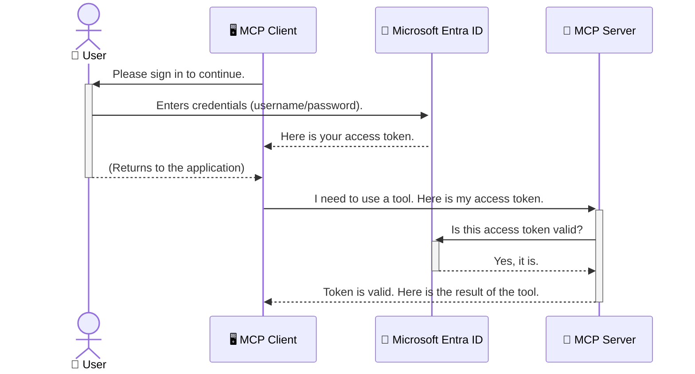

<!--
CO_OP_TRANSLATOR_METADATA:
{
  "original_hash": "6e562d7e5a77c8982da4aa8f762ad1d8",
  "translation_date": "2025-07-14T03:09:41+00:00",
  "source_file": "05-AdvancedTopics/mcp-security-entra/README.md",
  "language_code": "vi"
}
-->
# Bảo mật Quy trình AI: Xác thực Entra ID cho Máy chủ Model Context Protocol

## Giới thiệu
Bảo mật máy chủ Model Context Protocol (MCP) của bạn quan trọng không kém việc khóa cửa chính nhà bạn. Nếu để máy chủ MCP mở, công cụ và dữ liệu của bạn có thể bị truy cập trái phép, dẫn đến các sự cố bảo mật. Microsoft Entra ID cung cấp giải pháp quản lý danh tính và truy cập dựa trên đám mây mạnh mẽ, giúp đảm bảo chỉ người dùng và ứng dụng được phép mới có thể tương tác với máy chủ MCP của bạn. Trong phần này, bạn sẽ học cách bảo vệ quy trình AI của mình bằng xác thực Entra ID.

## Mục tiêu học tập
Sau khi hoàn thành phần này, bạn sẽ có thể:

- Hiểu được tầm quan trọng của việc bảo mật máy chủ MCP.
- Giải thích các kiến thức cơ bản về Microsoft Entra ID và xác thực OAuth 2.0.
- Nhận biết sự khác biệt giữa client công khai và client bảo mật.
- Triển khai xác thực Entra ID trong cả kịch bản máy chủ MCP cục bộ (client công khai) và máy chủ MCP từ xa (client bảo mật).
- Áp dụng các thực hành bảo mật tốt nhất khi phát triển quy trình AI.

## Bảo mật và MCP

Cũng như bạn không để cửa chính nhà mình mở, bạn không nên để máy chủ MCP của mình mở cho bất kỳ ai truy cập. Bảo mật quy trình AI là điều cần thiết để xây dựng các ứng dụng mạnh mẽ, đáng tin cậy và an toàn. Chương này sẽ giới thiệu cách sử dụng Microsoft Entra ID để bảo vệ máy chủ MCP, đảm bảo chỉ người dùng và ứng dụng được phép mới có thể tương tác với công cụ và dữ liệu của bạn.

## Tại sao bảo mật lại quan trọng với máy chủ MCP

Hãy tưởng tượng máy chủ MCP của bạn có một công cụ có thể gửi email hoặc truy cập cơ sở dữ liệu khách hàng. Nếu máy chủ không được bảo mật, bất kỳ ai cũng có thể sử dụng công cụ đó, dẫn đến việc truy cập dữ liệu trái phép, gửi thư rác hoặc các hoạt động độc hại khác.

Bằng cách triển khai xác thực, bạn đảm bảo mọi yêu cầu gửi đến máy chủ đều được xác minh, xác nhận danh tính người dùng hoặc ứng dụng gửi yêu cầu. Đây là bước đầu tiên và quan trọng nhất để bảo vệ quy trình AI của bạn.

## Giới thiệu về Microsoft Entra ID

[**Microsoft Entra ID**](https://adoption.microsoft.com/microsoft-security/entra/) là dịch vụ quản lý danh tính và truy cập dựa trên đám mây. Hãy tưởng tượng nó như một nhân viên bảo vệ an ninh toàn diện cho các ứng dụng của bạn. Nó xử lý quá trình phức tạp xác minh danh tính người dùng (xác thực) và xác định quyền hạn của họ (ủy quyền).

Bằng cách sử dụng Entra ID, bạn có thể:

- Cho phép người dùng đăng nhập an toàn.
- Bảo vệ API và dịch vụ.
- Quản lý chính sách truy cập từ một nơi tập trung.

Đối với máy chủ MCP, Entra ID cung cấp giải pháp mạnh mẽ và được tin cậy rộng rãi để quản lý ai có thể truy cập các chức năng của máy chủ.

---

## Hiểu về cơ chế: Cách xác thực Entra ID hoạt động

Entra ID sử dụng các tiêu chuẩn mở như **OAuth 2.0** để xử lý xác thực. Mặc dù chi tiết có thể phức tạp, nhưng khái niệm cốt lõi rất đơn giản và có thể hiểu qua một phép ẩn dụ.

### Giới thiệu nhẹ nhàng về OAuth 2.0: Chìa khóa valet

Hãy tưởng tượng OAuth 2.0 giống như dịch vụ valet cho chiếc xe của bạn. Khi bạn đến nhà hàng, bạn không đưa cho người valet chìa khóa chính. Thay vào đó, bạn cung cấp một **chìa khóa valet** với quyền hạn giới hạn — nó có thể khởi động xe và khóa cửa, nhưng không thể mở cốp hay ngăn đựng đồ.

Trong phép ẩn dụ này:

- **Bạn** là **Người dùng**.
- **Chiếc xe của bạn** là **Máy chủ MCP** với các công cụ và dữ liệu quý giá.
- **Người valet** là **Microsoft Entra ID**.
- **Nhân viên giữ xe** là **MCP Client** (ứng dụng cố gắng truy cập máy chủ).
- **Chìa khóa valet** là **Access Token**.

Access token là một chuỗi văn bản bảo mật mà MCP client nhận được từ Entra ID sau khi bạn đăng nhập. Client sau đó trình token này cho máy chủ MCP mỗi khi gửi yêu cầu. Máy chủ có thể xác minh token để đảm bảo yêu cầu hợp lệ và client có quyền truy cập cần thiết, mà không cần xử lý trực tiếp thông tin đăng nhập của bạn (như mật khẩu).

### Quy trình xác thực

Quy trình hoạt động như sau:



### Giới thiệu Microsoft Authentication Library (MSAL)

Trước khi đi vào mã nguồn, cần giới thiệu một thành phần quan trọng bạn sẽ thấy trong ví dụ: **Microsoft Authentication Library (MSAL)**.

MSAL là thư viện do Microsoft phát triển giúp các nhà phát triển dễ dàng xử lý xác thực. Thay vì bạn phải viết toàn bộ mã phức tạp để xử lý token bảo mật, quản lý đăng nhập và làm mới phiên, MSAL sẽ lo phần nặng nhọc đó.

Sử dụng thư viện như MSAL được khuyến nghị vì:

- **An toàn:** Nó triển khai các giao thức tiêu chuẩn ngành và thực hành bảo mật tốt nhất, giảm thiểu rủi ro lỗ hổng trong mã của bạn.
- **Đơn giản hóa phát triển:** Nó ẩn đi sự phức tạp của các giao thức OAuth 2.0 và OpenID Connect, cho phép bạn thêm xác thực mạnh mẽ vào ứng dụng chỉ với vài dòng mã.
- **Được duy trì:** Microsoft liên tục cập nhật MSAL để đối phó với các mối đe dọa bảo mật mới và thay đổi nền tảng.

MSAL hỗ trợ nhiều ngôn ngữ và framework ứng dụng, bao gồm .NET, JavaScript/TypeScript, Python, Java, Go, và các nền tảng di động như iOS và Android. Điều này giúp bạn sử dụng cùng một mẫu xác thực nhất quán trên toàn bộ hệ thống công nghệ.

Để tìm hiểu thêm về MSAL, bạn có thể xem tài liệu chính thức [Tổng quan về MSAL](https://learn.microsoft.com/entra/identity-platform/msal-overview).

---

## Bảo mật máy chủ MCP với Entra ID: Hướng dẫn từng bước

Bây giờ, hãy cùng xem cách bảo mật một máy chủ MCP cục bộ (giao tiếp qua `stdio`) bằng Entra ID. Ví dụ này sử dụng **client công khai**, phù hợp với các ứng dụng chạy trên máy người dùng, như ứng dụng desktop hoặc máy chủ phát triển cục bộ.

### Kịch bản 1: Bảo mật máy chủ MCP cục bộ (với client công khai)

Trong kịch bản này, chúng ta xem xét một máy chủ MCP chạy cục bộ, giao tiếp qua `stdio`, và sử dụng Entra ID để xác thực người dùng trước khi cho phép truy cập công cụ. Máy chủ có một công cụ duy nhất lấy thông tin hồ sơ người dùng từ Microsoft Graph API.

#### 1. Thiết lập ứng dụng trong Entra ID

Trước khi viết mã, bạn cần đăng ký ứng dụng trong Microsoft Entra ID. Việc này giúp Entra ID biết về ứng dụng của bạn và cấp quyền sử dụng dịch vụ xác thực.

1. Truy cập **[Microsoft Entra portal](https://entra.microsoft.com/)**.
2. Vào **App registrations** và nhấn **New registration**.
3. Đặt tên cho ứng dụng (ví dụ: "My Local MCP Server").
4. Ở mục **Supported account types**, chọn **Accounts in this organizational directory only**.
5. Bạn có thể để trống **Redirect URI** cho ví dụ này.
6. Nhấn **Register**.

Sau khi đăng ký, ghi lại **Application (client) ID** và **Directory (tenant) ID**. Bạn sẽ cần dùng chúng trong mã.

#### 2. Mã nguồn: Phân tích

Hãy xem các phần chính của mã xử lý xác thực. Mã đầy đủ cho ví dụ này có trong thư mục [Entra ID - Local - WAM](https://github.com/Azure-Samples/mcp-auth-servers/tree/main/src/entra-id-local-wam) trong kho [mcp-auth-servers GitHub](https://github.com/Azure-Samples/mcp-auth-servers).

**`AuthenticationService.cs`**

Lớp này chịu trách nhiệm xử lý tương tác với Entra ID.

- **`CreateAsync`**: Phương thức này khởi tạo `PublicClientApplication` từ MSAL. Nó được cấu hình với `clientId` và `tenantId` của ứng dụng bạn.
- **`WithBroker`**: Kích hoạt sử dụng broker (như Windows Web Account Manager), giúp trải nghiệm đăng nhập một lần an toàn và liền mạch hơn.
- **`AcquireTokenAsync`**: Phương thức chính. Nó cố gắng lấy token một cách im lặng (nếu người dùng đã có phiên hợp lệ). Nếu không lấy được token im lặng, nó sẽ yêu cầu người dùng đăng nhập tương tác.

```csharp
// Simplified for clarity
public static async Task<AuthenticationService> CreateAsync(ILogger<AuthenticationService> logger)
{
    var msalClient = PublicClientApplicationBuilder
        .Create(_clientId) // Your Application (client) ID
        .WithAuthority(AadAuthorityAudience.AzureAdMyOrg)
        .WithTenantId(_tenantId) // Your Directory (tenant) ID
        .WithBroker(new BrokerOptions(BrokerOptions.OperatingSystems.Windows))
        .Build();

    // ... cache registration ...

    return new AuthenticationService(logger, msalClient);
}

public async Task<string> AcquireTokenAsync()
{
    try
    {
        // Try silent authentication first
        var accounts = await _msalClient.GetAccountsAsync();
        var account = accounts.FirstOrDefault();

        AuthenticationResult? result = null;

        if (account != null)
        {
            result = await _msalClient.AcquireTokenSilent(_scopes, account).ExecuteAsync();
        }
        else
        {
            // If no account, or silent fails, go interactive
            result = await _msalClient.AcquireTokenInteractive(_scopes).ExecuteAsync();
        }

        return result.AccessToken;
    }
    catch (Exception ex)
    {
        _logger.LogError(ex, "An error occurred while acquiring the token.");
        throw; // Optionally rethrow the exception for higher-level handling
    }
}
```

**`Program.cs`**

Đây là nơi thiết lập máy chủ MCP và tích hợp dịch vụ xác thực.

- **`AddSingleton<AuthenticationService>`**: Đăng ký `AuthenticationService` với container dependency injection để các phần khác của ứng dụng (như công cụ) có thể sử dụng.
- Công cụ **`GetUserDetailsFromGraph`**: Công cụ này cần một thể hiện của `AuthenticationService`. Trước khi thực hiện, nó gọi `authService.AcquireTokenAsync()` để lấy token truy cập hợp lệ. Nếu xác thực thành công, nó dùng token để gọi Microsoft Graph API và lấy thông tin người dùng.

```csharp
// Simplified for clarity
[McpServerTool(Name = "GetUserDetailsFromGraph")]
public static async Task<string> GetUserDetailsFromGraph(
    AuthenticationService authService)
{
    try
    {
        // This will trigger the authentication flow
        var accessToken = await authService.AcquireTokenAsync();

        // Use the token to create a GraphServiceClient
        var graphClient = new GraphServiceClient(
            new BaseBearerTokenAuthenticationProvider(new TokenProvider(authService)));

        var user = await graphClient.Me.GetAsync();

        return System.Text.Json.JsonSerializer.Serialize(user);
    }
    catch (Exception ex)
    {
        return $"Error: {ex.Message}";
    }
}
```

#### 3. Cách hoạt động tổng thể

1. Khi MCP client cố gắng sử dụng công cụ `GetUserDetailsFromGraph`, công cụ gọi `AcquireTokenAsync`.
2. `AcquireTokenAsync` kích hoạt thư viện MSAL kiểm tra token hợp lệ.
3. Nếu không có token, MSAL qua broker sẽ yêu cầu người dùng đăng nhập bằng tài khoản Entra ID.
4. Sau khi đăng nhập, Entra ID cấp token truy cập.
5. Công cụ nhận token và dùng nó để gọi an toàn Microsoft Graph API.
6. Thông tin người dùng được trả về cho MCP client.

Quy trình này đảm bảo chỉ người dùng đã xác thực mới có thể sử dụng công cụ, bảo vệ hiệu quả máy chủ MCP cục bộ của bạn.

### Kịch bản 2: Bảo mật máy chủ MCP từ xa (với client bảo mật)

Khi máy chủ MCP chạy trên máy từ xa (như máy chủ đám mây) và giao tiếp qua giao thức như HTTP Streaming, yêu cầu bảo mật khác biệt. Trong trường hợp này, bạn nên dùng **client bảo mật** và **Authorization Code Flow**. Đây là phương pháp an toàn hơn vì bí mật ứng dụng không bao giờ bị lộ ra trình duyệt.

Ví dụ này sử dụng máy chủ MCP viết bằng TypeScript, dùng Express.js để xử lý các yêu cầu HTTP.

#### 1. Thiết lập ứng dụng trong Entra ID

Việc thiết lập trong Entra ID tương tự client công khai, nhưng có một điểm khác: bạn cần tạo **client secret**.

1. Truy cập **[Microsoft Entra portal](https://entra.microsoft.com/)**.
2. Trong phần đăng ký ứng dụng, vào tab **Certificates & secrets**.
3. Nhấn **New client secret**, đặt mô tả và nhấn **Add**.
4. **Quan trọng:** Sao chép giá trị secret ngay lập tức. Bạn sẽ không thể xem lại sau.
5. Bạn cũng cần cấu hình **Redirect URI**. Vào tab **Authentication**, nhấn **Add a platform**, chọn **Web**, và nhập URI chuyển hướng cho ứng dụng (ví dụ: `http://localhost:3001/auth/callback`).

> **⚠️ Lưu ý bảo mật quan trọng:** Với ứng dụng sản xuất, Microsoft khuyến nghị sử dụng các phương pháp xác thực không cần secret như **Managed Identity** hoặc **Workload Identity Federation** thay vì client secret. Client secret có nguy cơ bị lộ hoặc bị tấn công. Managed identity cung cấp cách tiếp cận an toàn hơn bằng cách loại bỏ nhu cầu lưu trữ thông tin đăng nhập trong mã hoặc cấu hình.
>
> Để biết thêm về managed identities và cách triển khai, xem [Tổng quan về Managed identities cho tài nguyên Azure](https://learn.microsoft.com/entra/identity/managed-identities-azure-resources/overview).

#### 2. Mã nguồn: Phân tích

Ví dụ này sử dụng phương pháp dựa trên session. Khi người dùng xác thực, máy chủ lưu access token và refresh token trong session và cấp cho người dùng một session token. Token này được dùng cho các yêu cầu tiếp theo. Mã đầy đủ có trong thư mục [Entra ID - Confidential client](https://github.com/Azure-Samples/mcp-auth-servers/tree/main/src/entra-id-cca-session) trong kho [mcp-auth-servers GitHub](https://github.com/Azure-Samples/mcp-auth-servers).

**`Server.ts`**

Tệp này thiết lập máy chủ Express và lớp truyền tải MCP.

- **`requireBearerAuth`**: Middleware bảo vệ các endpoint `/sse` và `/message`. Nó kiểm tra token bearer hợp lệ trong header `Authorization` của yêu cầu.
- **`EntraIdServerAuthProvider`**: Lớp tùy chỉnh triển khai interface `McpServerAuthorizationProvider`. Nó chịu trách nhiệm xử lý luồng OAuth 2.0.
- **`/auth/callback`**: Endpoint xử lý chuyển hướng từ Entra ID sau khi người dùng xác thực. Nó trao đổi authorization code lấy access token và refresh token.

```typescript
// Simplified for clarity
const app = express();
const { server } = createServer();
const provider = new EntraIdServerAuthProvider();

// Protect the SSE endpoint
app.get("/sse", requireBearerAuth({
  provider,
  requiredScopes: ["User.Read"]
}), async (req, res) => {
  // ... connect to the transport ...
});

// Protect the message endpoint
app.post("/message", requireBearerAuth({
  provider,
  requiredScopes: ["User.Read"]
}), async (req, res) => {
  // ... handle the message ...
});

// Handle the OAuth 2.0 callback
app.get("/auth/callback", (req, res) => {
  provider.handleCallback(req.query.code, req.query.state)
    .then(result => {
      // ... handle success or failure ...
    });
});
```

**`Tools.ts`**

Tệp này định nghĩa các công cụ mà máy chủ MCP cung cấp. Công cụ `getUserDetails` tương tự ví dụ trước, nhưng lấy access token từ session.

```typescript
// Simplified for clarity
server.setRequestHandler(CallToolRequestSchema, async (request) => {
  const { name } = request.params;
  const context = request.params?.context as { token?: string } | undefined;
  const sessionToken = context?.token;

  if (name === ToolName.GET_USER_DETAILS) {
    if (!sessionToken) {
      throw new AuthenticationError("Authentication token is missing or invalid. Ensure the token is provided in the request context.");
    }

    // Get the Entra ID token from the session store
    const tokenData = tokenStore.getToken(sessionToken);
    const entraIdToken = tokenData.accessToken;

    const graphClient = Client.init({
      authProvider: (done) => {
        done(null, entraIdToken);
      }
    });

    const user = await graphClient.api('/me').get();

    // ... return user details ...
  }
});
```

**`auth/EntraIdServerAuthProvider.ts`**

Lớp này xử lý logic:

- Chuyển hướng người dùng đến trang đăng nhập Entra ID.
- Trao đổi authorization code lấy access token.
- Lưu token vào `tokenStore`.
- Làm mới access token khi hết hạn.

#### 3. Cách hoạt động tổng thể

1. Khi người dùng lần đầu kết nối với máy chủ MCP, middleware `requireBearerAuth` phát hiện họ chưa có session hợp lệ và chuyển hướng đến trang đăng nhập Entra ID.
2. Người dùng đăng nhập bằng tài khoản Entra ID.
3. Entra ID chuyển hướng người dùng về endpoint `/auth/callback` kèm theo authorization code.
4. Máy chủ trao đổi mã lấy access token và refresh token, lưu trữ chúng, và tạo một session token được gửi đến client.  
5. Client giờ có thể sử dụng session token này trong header `Authorization` cho tất cả các yêu cầu tiếp theo đến máy chủ MCP.  
6. Khi công cụ `getUserDetails` được gọi, nó sử dụng session token để tra cứu access token Entra ID và sau đó dùng token đó để gọi Microsoft Graph API.

Quy trình này phức tạp hơn so với luồng client công khai, nhưng cần thiết cho các endpoint hướng ra internet. Vì các máy chủ MCP từ xa có thể truy cập qua internet công cộng, nên cần các biện pháp bảo mật mạnh hơn để ngăn chặn truy cập trái phép và các cuộc tấn công tiềm năng.

## Các Thực Hành Bảo Mật Tốt Nhất

- **Luôn sử dụng HTTPS**: Mã hóa giao tiếp giữa client và server để bảo vệ token khỏi bị chặn.
- **Triển khai Role-Based Access Control (RBAC)**: Không chỉ kiểm tra *nếu* người dùng đã xác thực; mà còn kiểm tra *họ được phép làm gì*. Bạn có thể định nghĩa vai trò trong Entra ID và kiểm tra chúng trong máy chủ MCP của bạn.
- **Giám sát và kiểm toán**: Ghi lại tất cả các sự kiện xác thực để phát hiện và phản ứng với các hoạt động đáng ngờ.
- **Xử lý giới hạn tần suất và điều tiết**: Microsoft Graph và các API khác áp dụng giới hạn tần suất để ngăn chặn lạm dụng. Triển khai cơ chế exponential backoff và logic thử lại trong máy chủ MCP để xử lý mượt mà các phản hồi HTTP 429 (Too Many Requests). Cân nhắc lưu cache dữ liệu truy cập thường xuyên để giảm số lần gọi API.
- **Lưu trữ token an toàn**: Lưu trữ access token và refresh token một cách an toàn. Với ứng dụng cục bộ, sử dụng cơ chế lưu trữ an toàn của hệ thống. Với ứng dụng máy chủ, cân nhắc sử dụng lưu trữ mã hóa hoặc dịch vụ quản lý khóa an toàn như Azure Key Vault.
- **Xử lý hết hạn token**: Access token có thời hạn sử dụng giới hạn. Triển khai tự động làm mới token bằng refresh token để duy trì trải nghiệm người dùng liền mạch mà không cần xác thực lại.
- **Cân nhắc sử dụng Azure API Management**: Mặc dù việc triển khai bảo mật trực tiếp trong máy chủ MCP giúp bạn kiểm soát chi tiết, các API Gateway như Azure API Management có thể xử lý nhiều vấn đề bảo mật này tự động, bao gồm xác thực, ủy quyền, giới hạn tần suất và giám sát. Chúng cung cấp một lớp bảo mật tập trung nằm giữa client và máy chủ MCP của bạn. Để biết thêm chi tiết về việc sử dụng API Gateway với MCP, xem [Azure API Management Your Auth Gateway For MCP Servers](https://techcommunity.microsoft.com/blog/integrationsonazureblog/azure-api-management-your-auth-gateway-for-mcp-servers/4402690).

## Những Điểm Chính Cần Nhớ

- Bảo mật máy chủ MCP của bạn là điều quan trọng để bảo vệ dữ liệu và công cụ.
- Microsoft Entra ID cung cấp giải pháp xác thực và ủy quyền mạnh mẽ, có khả năng mở rộng.
- Sử dụng **public client** cho ứng dụng cục bộ và **confidential client** cho máy chủ từ xa.
- **Authorization Code Flow** là lựa chọn bảo mật nhất cho các ứng dụng web.

## Bài Tập

1. Hãy nghĩ về một máy chủ MCP mà bạn có thể xây dựng. Nó sẽ là máy chủ cục bộ hay máy chủ từ xa?  
2. Dựa trên câu trả lời của bạn, bạn sẽ sử dụng public client hay confidential client?  
3. Máy chủ MCP của bạn sẽ yêu cầu quyền gì để thực hiện các hành động với Microsoft Graph?

## Bài Tập Thực Hành

### Bài Tập 1: Đăng ký Ứng dụng trong Entra ID  
Đi đến cổng Microsoft Entra.  
Đăng ký một ứng dụng mới cho máy chủ MCP của bạn.  
Ghi lại Application (client) ID và Directory (tenant) ID.

### Bài Tập 2: Bảo mật Máy chủ MCP Cục bộ (Public Client)  
- Theo ví dụ mã để tích hợp MSAL (Microsoft Authentication Library) cho xác thực người dùng.  
- Thử nghiệm luồng xác thực bằng cách gọi công cụ MCP lấy thông tin người dùng từ Microsoft Graph.

### Bài Tập 3: Bảo mật Máy chủ MCP Từ xa (Confidential Client)  
- Đăng ký confidential client trong Entra ID và tạo client secret.  
- Cấu hình máy chủ MCP Express.js của bạn sử dụng Authorization Code Flow.  
- Thử nghiệm các endpoint được bảo vệ và xác nhận truy cập dựa trên token.

### Bài Tập 4: Áp dụng Các Thực Hành Bảo Mật Tốt Nhất  
- Kích hoạt HTTPS cho máy chủ cục bộ hoặc từ xa của bạn.  
- Triển khai kiểm soát truy cập dựa trên vai trò (RBAC) trong logic máy chủ.  
- Thêm xử lý hết hạn token và lưu trữ token an toàn.

## Tài Nguyên

1. **Tài liệu Tổng quan MSAL**  
   Tìm hiểu cách Microsoft Authentication Library (MSAL) giúp lấy token an toàn trên nhiều nền tảng:  
   [MSAL Overview on Microsoft Learn](https://learn.microsoft.com/en-gb/entra/msal/overview)

2. **Kho mã nguồn Azure-Samples/mcp-auth-servers trên GitHub**  
   Các ví dụ tham khảo về máy chủ MCP minh họa các luồng xác thực:  
   [Azure-Samples/mcp-auth-servers on GitHub](https://github.com/Azure-Samples/mcp-auth-servers)

3. **Tổng quan về Managed Identities cho Azure Resources**  
   Hiểu cách loại bỏ bí mật bằng cách sử dụng managed identities được gán cho hệ thống hoặc người dùng:  
   [Managed Identities Overview on Microsoft Learn](https://learn.microsoft.com/en-us/entra/identity/managed-identities-azure-resources/)

4. **Azure API Management: Your Auth Gateway for MCP Servers**  
   Tìm hiểu sâu về việc sử dụng APIM như một cổng OAuth2 bảo mật cho máy chủ MCP:  
   [Azure API Management Your Auth Gateway For MCP Servers](https://techcommunity.microsoft.com/blog/integrationsonazureblog/azure-api-management-your-auth-gateway-for-mcp-servers/4402690)

5. **Tham khảo Quyền Microsoft Graph**  
   Danh sách đầy đủ các quyền được ủy quyền và quyền ứng dụng cho Microsoft Graph:  
   [Microsoft Graph Permissions Reference](https://learn.microsoft.com/zh-tw/graph/permissions-reference)

## Kết quả học tập  
Sau khi hoàn thành phần này, bạn sẽ có thể:

- Giải thích tại sao xác thực lại quan trọng đối với máy chủ MCP và các luồng AI.  
- Thiết lập và cấu hình xác thực Entra ID cho cả kịch bản máy chủ MCP cục bộ và từ xa.  
- Lựa chọn loại client phù hợp (public hoặc confidential) dựa trên cách triển khai máy chủ.  
- Thực hiện các thực hành mã hóa an toàn, bao gồm lưu trữ token và ủy quyền dựa trên vai trò.  
- Tự tin bảo vệ máy chủ MCP và các công cụ của bạn khỏi truy cập trái phép.

## Tiếp theo

- [5.13 Model Context Protocol (MCP) Integration with Azure AI Foundry](../mcp-foundry-agent-integration/README.md)

**Tuyên bố từ chối trách nhiệm**:  
Tài liệu này đã được dịch bằng dịch vụ dịch thuật AI [Co-op Translator](https://github.com/Azure/co-op-translator). Mặc dù chúng tôi cố gắng đảm bảo độ chính xác, xin lưu ý rằng các bản dịch tự động có thể chứa lỗi hoặc không chính xác. Tài liệu gốc bằng ngôn ngữ gốc của nó nên được coi là nguồn chính xác và đáng tin cậy. Đối với các thông tin quan trọng, nên sử dụng dịch vụ dịch thuật chuyên nghiệp do con người thực hiện. Chúng tôi không chịu trách nhiệm về bất kỳ sự hiểu lầm hoặc giải thích sai nào phát sinh từ việc sử dụng bản dịch này.