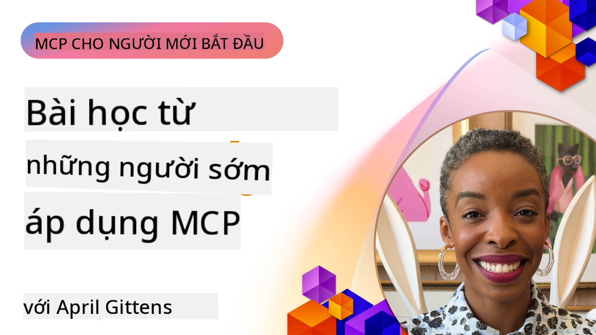

<!--
CO_OP_TRANSLATOR_METADATA:
{
  "original_hash": "41f16dac486d2086a53bc644a01cbe42",
  "translation_date": "2025-08-18T17:08:13+00:00",
  "source_file": "07-LessonsfromEarlyAdoption/README.md",
  "language_code": "vi"
}
-->
# 🌟 Bài học từ những người dùng đầu tiên

[](https://youtu.be/jds7dSmNptE)

_(Nhấp vào hình ảnh trên để xem video của bài học này)_

## 🎯 Nội dung của module này

Module này khám phá cách các tổ chức và nhà phát triển thực sự đang tận dụng Model Context Protocol (MCP) để giải quyết các thách thức thực tế và thúc đẩy đổi mới. Thông qua các nghiên cứu điển hình chi tiết và các dự án thực hành, bạn sẽ khám phá cách MCP cho phép tích hợp AI an toàn, có khả năng mở rộng, kết nối các mô hình ngôn ngữ, công cụ và dữ liệu doanh nghiệp.

### 📚 Xem MCP hoạt động thực tế

Muốn thấy các nguyên tắc này được áp dụng vào các công cụ sẵn sàng sản xuất? Hãy xem [**10 máy chủ MCP của Microsoft đang thay đổi năng suất của nhà phát triển**](microsoft-mcp-servers.md), nơi giới thiệu các máy chủ MCP thực tế của Microsoft mà bạn có thể sử dụng ngay hôm nay.

## Tổng quan

Bài học này khám phá cách những người dùng đầu tiên đã tận dụng Model Context Protocol (MCP) để giải quyết các thách thức thực tế và thúc đẩy đổi mới trong nhiều ngành công nghiệp. Thông qua các nghiên cứu điển hình chi tiết và các dự án thực hành, bạn sẽ thấy cách MCP cho phép tích hợp AI tiêu chuẩn hóa, an toàn và có khả năng mở rộng—kết nối các mô hình ngôn ngữ lớn, công cụ và dữ liệu doanh nghiệp trong một khung làm việc thống nhất. Bạn sẽ có kinh nghiệm thực tế trong việc thiết kế và xây dựng các giải pháp dựa trên MCP, học hỏi từ các mẫu triển khai đã được chứng minh và khám phá các phương pháp tốt nhất để triển khai MCP trong môi trường sản xuất. Bài học cũng nêu bật các xu hướng mới nổi, hướng đi trong tương lai và các tài nguyên mã nguồn mở để giúp bạn luôn đi đầu trong công nghệ MCP và hệ sinh thái đang phát triển của nó.

## Mục tiêu học tập

- Phân tích các triển khai MCP thực tế trong các ngành công nghiệp khác nhau
- Thiết kế và xây dựng các ứng dụng hoàn chỉnh dựa trên MCP
- Khám phá các xu hướng mới nổi và hướng đi trong tương lai của công nghệ MCP
- Áp dụng các phương pháp tốt nhất trong các tình huống phát triển thực tế

## Các triển khai MCP thực tế

### Nghiên cứu điển hình 1: Tự động hóa hỗ trợ khách hàng doanh nghiệp

Một tập đoàn đa quốc gia đã triển khai giải pháp dựa trên MCP để tiêu chuẩn hóa các tương tác AI trên các hệ thống hỗ trợ khách hàng của họ. Điều này cho phép họ:

- Tạo giao diện thống nhất cho nhiều nhà cung cấp LLM
- Duy trì quản lý prompt nhất quán giữa các phòng ban
- Triển khai các kiểm soát bảo mật và tuân thủ mạnh mẽ
- Dễ dàng chuyển đổi giữa các mô hình AI khác nhau dựa trên nhu cầu cụ thể

**Triển khai kỹ thuật:**

```python
# Python MCP server implementation for customer support
import logging
import asyncio
from modelcontextprotocol import create_server, ServerConfig
from modelcontextprotocol.server import MCPServer
from modelcontextprotocol.transports import create_http_transport
from modelcontextprotocol.resources import ResourceDefinition
from modelcontextprotocol.prompts import PromptDefinition
from modelcontextprotocol.tool import ToolDefinition

# Configure logging
logging.basicConfig(level=logging.INFO)

async def main():
    # Create server configuration
    config = ServerConfig(
        name="Enterprise Customer Support Server",
        version="1.0.0",
        description="MCP server for handling customer support inquiries"
    )
    
    # Initialize MCP server
    server = create_server(config)
    
    # Register knowledge base resources
    server.resources.register(
        ResourceDefinition(
            name="customer_kb",
            description="Customer knowledge base documentation"
        ),
        lambda params: get_customer_documentation(params)
    )
    
    # Register prompt templates
    server.prompts.register(
        PromptDefinition(
            name="support_template",
            description="Templates for customer support responses"
        ),
        lambda params: get_support_templates(params)
    )
    
    # Register support tools
    server.tools.register(
        ToolDefinition(
            name="ticketing",
            description="Create and update support tickets"
        ),
        handle_ticketing_operations
    )
    
    # Start server with HTTP transport
    transport = create_http_transport(port=8080)
    await server.run(transport)

if __name__ == "__main__":
    asyncio.run(main())
```

**Kết quả:** Giảm 30% chi phí mô hình, cải thiện 45% tính nhất quán của phản hồi và tăng cường tuân thủ trên các hoạt động toàn cầu.

### Nghiên cứu điển hình 2: Trợ lý chẩn đoán y tế

Một nhà cung cấp dịch vụ chăm sóc sức khỏe đã phát triển cơ sở hạ tầng MCP để tích hợp nhiều mô hình AI y tế chuyên biệt trong khi đảm bảo dữ liệu bệnh nhân nhạy cảm được bảo vệ:

- Chuyển đổi liền mạch giữa các mô hình y tế tổng quát và chuyên biệt
- Kiểm soát quyền riêng tư nghiêm ngặt và nhật ký kiểm tra
- Tích hợp với các hệ thống Hồ sơ Y tế Điện tử (EHR) hiện có
- Kỹ thuật prompt nhất quán cho thuật ngữ y tế

**Triển khai kỹ thuật:**

```csharp
// C# MCP host application implementation in healthcare application
using Microsoft.Extensions.DependencyInjection;
using ModelContextProtocol.SDK.Client;
using ModelContextProtocol.SDK.Security;
using ModelContextProtocol.SDK.Resources;

public class DiagnosticAssistant
{
    private readonly MCPHostClient _mcpClient;
    private readonly PatientContext _patientContext;
    
    public DiagnosticAssistant(PatientContext patientContext)
    {
        _patientContext = patientContext;
        
        // Configure MCP client with healthcare-specific settings
        var clientOptions = new ClientOptions
        {
            Name = "Healthcare Diagnostic Assistant",
            Version = "1.0.0",
            Security = new SecurityOptions
            {
                Encryption = EncryptionLevel.Medical,
                AuditEnabled = true
            }
        };
        
        _mcpClient = new MCPHostClientBuilder()
            .WithOptions(clientOptions)
            .WithTransport(new HttpTransport("https://healthcare-mcp.example.org"))
            .WithAuthentication(new HIPAACompliantAuthProvider())
            .Build();
    }
    
    public async Task<DiagnosticSuggestion> GetDiagnosticAssistance(
        string symptoms, string patientHistory)
    {
        // Create request with appropriate resources and tool access
        var resourceRequest = new ResourceRequest
        {
            Name = "patient_records",
            Parameters = new Dictionary<string, object>
            {
                ["patientId"] = _patientContext.PatientId,
                ["requestingProvider"] = _patientContext.ProviderId
            }
        };
        
        // Request diagnostic assistance using appropriate prompt
        var response = await _mcpClient.SendPromptRequestAsync(
            promptName: "diagnostic_assistance",
            parameters: new Dictionary<string, object>
            {
                ["symptoms"] = symptoms,
                patientHistory = patientHistory,
                relevantGuidelines = _patientContext.GetRelevantGuidelines()
            });
            
        return DiagnosticSuggestion.FromMCPResponse(response);
    }
}
```

**Kết quả:** Cải thiện gợi ý chẩn đoán cho bác sĩ trong khi duy trì tuân thủ đầy đủ HIPAA và giảm đáng kể việc chuyển đổi ngữ cảnh giữa các hệ thống.

### Nghiên cứu điển hình 3: Phân tích rủi ro trong dịch vụ tài chính

Một tổ chức tài chính đã triển khai MCP để tiêu chuẩn hóa các quy trình phân tích rủi ro trên các phòng ban khác nhau:

- Tạo giao diện thống nhất cho các mô hình rủi ro tín dụng, phát hiện gian lận và rủi ro đầu tư
- Triển khai các kiểm soát truy cập nghiêm ngặt và quản lý phiên bản mô hình
- Đảm bảo khả năng kiểm tra của tất cả các khuyến nghị AI
- Duy trì định dạng dữ liệu nhất quán trên các hệ thống đa dạng

**Triển khai kỹ thuật:**

```java
// Java MCP server for financial risk assessment
import org.mcp.server.*;
import org.mcp.security.*;

public class FinancialRiskMCPServer {
    public static void main(String[] args) {
        // Create MCP server with financial compliance features
        MCPServer server = new MCPServerBuilder()
            .withModelProviders(
                new ModelProvider("risk-assessment-primary", new AzureOpenAIProvider()),
                new ModelProvider("risk-assessment-audit", new LocalLlamaProvider())
            )
            .withPromptTemplateDirectory("./compliance/templates")
            .withAccessControls(new SOCCompliantAccessControl())
            .withDataEncryption(EncryptionStandard.FINANCIAL_GRADE)
            .withVersionControl(true)
            .withAuditLogging(new DatabaseAuditLogger())
            .build();
            
        server.addRequestValidator(new FinancialDataValidator());
        server.addResponseFilter(new PII_RedactionFilter());
        
        server.start(9000);
        
        System.out.println("Financial Risk MCP Server running on port 9000");
    }
}
```

**Kết quả:** Tăng cường tuân thủ quy định, chu kỳ triển khai mô hình nhanh hơn 40% và cải thiện tính nhất quán trong đánh giá rủi ro giữa các phòng ban.

### Nghiên cứu điển hình 4: Máy chủ MCP Playwright của Microsoft cho tự động hóa trình duyệt

Microsoft đã phát triển [máy chủ MCP Playwright](https://github.com/microsoft/playwright-mcp) để cho phép tự động hóa trình duyệt an toàn, tiêu chuẩn hóa thông qua Model Context Protocol. Máy chủ sẵn sàng sản xuất này cho phép các tác nhân AI và LLM tương tác với trình duyệt web một cách có kiểm soát, có thể kiểm tra và mở rộng—cho phép các trường hợp sử dụng như kiểm thử web tự động, trích xuất dữ liệu và quy trình làm việc đầu cuối.

> **🎯 Công cụ sẵn sàng sản xuất**
> 
> Nghiên cứu điển hình này giới thiệu một máy chủ MCP thực tế mà bạn có thể sử dụng ngay hôm nay! Tìm hiểu thêm về Máy chủ MCP Playwright và 9 máy chủ MCP sẵn sàng sản xuất khác của Microsoft trong [**Hướng dẫn Máy chủ MCP của Microsoft**](microsoft-mcp-servers.md#8--playwright-mcp-server).

**Các tính năng chính:**
- Cung cấp khả năng tự động hóa trình duyệt (điều hướng, điền biểu mẫu, chụp ảnh màn hình, v.v.) dưới dạng công cụ MCP
- Triển khai các kiểm soát truy cập nghiêm ngặt và sandboxing để ngăn chặn các hành động trái phép
- Cung cấp nhật ký kiểm tra chi tiết cho tất cả các tương tác trình duyệt
- Hỗ trợ tích hợp với Azure OpenAI và các nhà cung cấp LLM khác cho tự động hóa do tác nhân điều khiển
- Cung cấp khả năng duyệt web cho GitHub Copilot's Coding Agent

**Triển khai kỹ thuật:**

```typescript
// TypeScript: Registering Playwright browser automation tools in an MCP server
import { createServer, ToolDefinition } from 'modelcontextprotocol';
import { launch } from 'playwright';

const server = createServer({
  name: 'Playwright MCP Server',
  version: '1.0.0',
  description: 'MCP server for browser automation using Playwright'
});

// Register a tool for navigating to a URL and capturing a screenshot
server.tools.register(
  new ToolDefinition({
    name: 'navigate_and_screenshot',
    description: 'Navigate to a URL and capture a screenshot',
    parameters: {
      url: { type: 'string', description: 'The URL to visit' }
    }
  }),
  async ({ url }) => {
    const browser = await launch();
    const page = await browser.newPage();
    await page.goto(url);
    const screenshot = await page.screenshot();
    await browser.close();
    return { screenshot };
  }
);

// Start the MCP server
server.listen(8080);
```

**Kết quả:**

- Cho phép tự động hóa trình duyệt an toàn, có lập trình cho các tác nhân AI và LLM
- Giảm nỗ lực kiểm thử thủ công và cải thiện phạm vi kiểm thử cho các ứng dụng web
- Cung cấp một khung làm việc có thể tái sử dụng, mở rộng cho tích hợp công cụ dựa trên trình duyệt trong môi trường doanh nghiệp
- Cung cấp khả năng duyệt web cho GitHub Copilot

**Tham khảo:**

- [Kho lưu trữ GitHub của Máy chủ MCP Playwright](https://github.com/microsoft/playwright-mcp)
- [Giải pháp AI và Tự động hóa của Microsoft](https://azure.microsoft.com/en-us/products/ai-services/)

### Nghiên cứu điển hình 5: Azure MCP – Model Context Protocol cấp doanh nghiệp dưới dạng dịch vụ

Máy chủ Azure MCP ([https://aka.ms/azmcp](https://aka.ms/azmcp)) là triển khai cấp doanh nghiệp được quản lý của Microsoft dành cho Model Context Protocol, được thiết kế để cung cấp khả năng máy chủ MCP có khả năng mở rộng, an toàn và tuân thủ như một dịch vụ đám mây. Azure MCP cho phép các tổ chức triển khai, quản lý và tích hợp máy chủ MCP với các dịch vụ AI, dữ liệu và bảo mật của Azure, giảm chi phí vận hành và tăng tốc độ áp dụng AI.

> **🎯 Công cụ sẵn sàng sản xuất**
> 
> Đây là một máy chủ MCP thực tế mà bạn có thể sử dụng ngay hôm nay! Tìm hiểu thêm về Máy chủ MCP Azure AI Foundry trong [**Hướng dẫn Máy chủ MCP của Microsoft**](microsoft-mcp-servers.md).

- Lưu trữ máy chủ MCP được quản lý hoàn toàn với khả năng mở rộng, giám sát và bảo mật tích hợp sẵn
- Tích hợp gốc với Azure OpenAI, Azure AI Search và các dịch vụ Azure khác
- Xác thực và ủy quyền cấp doanh nghiệp thông qua Microsoft Entra ID
- Hỗ trợ các công cụ tùy chỉnh, mẫu prompt và trình kết nối tài nguyên
- Tuân thủ các yêu cầu bảo mật và quy định của doanh nghiệp

**Triển khai kỹ thuật:**

```yaml
# Example: Azure MCP server deployment configuration (YAML)
apiVersion: mcp.microsoft.com/v1
kind: McpServer
metadata:
  name: enterprise-mcp-server
spec:
  modelProviders:
    - name: azure-openai
      type: AzureOpenAI
      endpoint: https://<your-openai-resource>.openai.azure.com/
      apiKeySecret: <your-azure-keyvault-secret>
  tools:
    - name: document_search
      type: AzureAISearch
      endpoint: https://<your-search-resource>.search.windows.net/
      apiKeySecret: <your-azure-keyvault-secret>
  authentication:
    type: EntraID
    tenantId: <your-tenant-id>
  monitoring:
    enabled: true
    logAnalyticsWorkspace: <your-log-analytics-id>
```

**Kết quả:**  
- Giảm thời gian triển khai các dự án AI doanh nghiệp bằng cách cung cấp nền tảng máy chủ MCP sẵn sàng sử dụng và tuân thủ
- Đơn giản hóa tích hợp các LLM, công cụ và nguồn dữ liệu doanh nghiệp
- Tăng cường bảo mật, khả năng quan sát và hiệu quả vận hành cho các khối lượng công việc MCP
- Cải thiện chất lượng mã với các phương pháp tốt nhất của Azure SDK và các mẫu xác thực hiện tại

**Tham khảo:**  
- [Tài liệu Azure MCP](https://aka.ms/azmcp)
- [Kho lưu trữ GitHub của Máy chủ Azure MCP](https://github.com/Azure/azure-mcp)
- [Dịch vụ AI của Azure](https://azure.microsoft.com/en-us/products/ai-services/)
- [Trung tâm MCP của Microsoft](https://mcp.azure.com)

### Nghiên cứu điển hình 6: NLWeb

MCP (Model Context Protocol) là một giao thức mới nổi dành cho Chatbot và trợ lý AI để tương tác với các công cụ. Mỗi phiên bản NLWeb cũng là một máy chủ MCP, hỗ trợ một phương thức cốt lõi, "ask", được sử dụng để đặt câu hỏi cho một trang web bằng ngôn ngữ tự nhiên. Phản hồi trả về tận dụng schema.org, một từ vựng được sử dụng rộng rãi để mô tả dữ liệu web. Nói một cách đơn giản, MCP là NLWeb như Http là với HTML. NLWeb kết hợp các giao thức, định dạng Schema.org và mã mẫu để giúp các trang web nhanh chóng tạo các điểm cuối này, mang lại lợi ích cho cả con người thông qua giao diện hội thoại và máy móc thông qua tương tác tự nhiên giữa các tác nhân.

Có hai thành phần riêng biệt của NLWeb:
- Một giao thức, rất đơn giản để bắt đầu, để giao tiếp với một trang web bằng ngôn ngữ tự nhiên và một định dạng, tận dụng json và schema.org cho câu trả lời trả về. Xem tài liệu về REST API để biết thêm chi tiết.
- Một triển khai đơn giản của (1) tận dụng đánh dấu hiện có, dành cho các trang web có thể được trừu tượng hóa dưới dạng danh sách các mục (sản phẩm, công thức, điểm tham quan, đánh giá, v.v.). Cùng với một tập hợp các tiện ích giao diện người dùng, các trang web có thể dễ dàng cung cấp giao diện hội thoại cho nội dung của họ. Xem tài liệu về "Life of a chat query" để biết thêm chi tiết về cách hoạt động này.

**Tham khảo:**  
- [Tài liệu Azure MCP](https://aka.ms/azmcp)  
- [NLWeb](https://github.com/microsoft/NlWeb)

### Nghiên cứu điển hình 7: Máy chủ MCP Azure AI Foundry – Tích hợp tác nhân AI doanh nghiệp

Máy chủ MCP Azure AI Foundry minh họa cách MCP có thể được sử dụng để điều phối và quản lý các tác nhân AI và quy trình làm việc trong môi trường doanh nghiệp. Bằng cách tích hợp MCP với Azure AI Foundry, các tổ chức có thể tiêu chuẩn hóa các tương tác của tác nhân, tận dụng quản lý quy trình làm việc của Foundry và đảm bảo triển khai an toàn, có khả năng mở rộng.

> **🎯 Công cụ sẵn sàng sản xuất**
> 
> Đây là một máy chủ MCP thực tế mà bạn có thể sử dụng ngay hôm nay! Tìm hiểu thêm về Máy chủ MCP Azure AI Foundry trong [**Hướng dẫn Máy chủ MCP của Microsoft**](microsoft-mcp-servers.md#9--azure-ai-foundry-mcp-server).

**Các tính năng chính:**
- Truy cập toàn diện vào hệ sinh thái AI của Azure, bao gồm danh mục mô hình và quản lý triển khai
- Lập chỉ mục kiến thức với Azure AI Search cho các ứng dụng RAG
- Công cụ đánh giá hiệu suất và đảm bảo chất lượng mô hình AI
- Tích hợp với Danh mục và Phòng thí nghiệm Azure AI Foundry cho các mô hình nghiên cứu tiên tiến
- Khả năng quản lý và đánh giá tác nhân cho các kịch bản sản xuất

**Kết quả:**
- Tạo mẫu nhanh và giám sát mạnh mẽ các quy trình làm việc của tác nhân AI
- Tích hợp liền mạch với các dịch vụ AI của Azure cho các kịch bản nâng cao
- Giao diện thống nhất để xây dựng, triển khai và giám sát các pipeline của tác nhân
- Cải thiện bảo mật, tuân thủ và hiệu quả vận hành cho doanh nghiệp
- Tăng tốc độ áp dụng AI trong khi duy trì kiểm soát các quy trình phức tạp do tác nhân điều khiển

**Tham khảo:**
- [Kho lưu trữ GitHub của Máy chủ MCP Azure AI Foundry](https://github.com/azure-ai-foundry/mcp-foundry)
- [Tích hợp các tác nhân AI Azure với MCP (Blog Microsoft Foundry)](https://devblogs.microsoft.com/foundry/integrating-azure-ai-agents-mcp/)

### Nghiên cứu điển hình 8: Foundry MCP Playground – Thử nghiệm và tạo mẫu

Foundry MCP Playground cung cấp một môi trường sẵn sàng sử dụng để thử nghiệm với các máy chủ MCP và tích hợp Azure AI Foundry. Các nhà phát triển có thể nhanh chóng tạo mẫu, kiểm tra và đánh giá các mô hình AI và quy trình làm việc của tác nhân bằng cách sử dụng các tài nguyên từ Danh mục và Phòng thí nghiệm Azure AI Foundry. Playground đơn giản hóa việc thiết lập, cung cấp các dự án mẫu và hỗ trợ phát triển cộng tác, giúp dễ dàng khám phá các phương pháp tốt nhất và các kịch bản mới với chi phí tối thiểu. Nó đặc biệt hữu ích cho các nhóm muốn xác thực ý tưởng, chia sẻ thử nghiệm và tăng tốc học hỏi mà không cần cơ sở hạ tầng phức tạp. Bằng cách giảm rào cản gia nhập, playground giúp thúc đẩy đổi mới và đóng góp cộng đồng trong hệ sinh thái MCP và Azure AI Foundry.

**Tham khảo:**

- [Kho lưu trữ GitHub của Foundry MCP Playground](https://github.com/azure-ai-foundry/foundry-mcp-playground)

### Nghiên cứu điển hình 9: Máy chủ MCP Microsoft Learn Docs – Truy cập tài liệu được hỗ trợ bởi AI

Máy chủ MCP Microsoft Learn Docs là một dịch vụ được lưu trữ trên đám mây cung cấp cho các trợ lý AI quyền truy cập theo thời gian thực vào tài liệu chính thức của Microsoft thông qua Model Context Protocol. Máy chủ sẵn sàng sản xuất này kết nối với hệ sinh thái Microsoft Learn toàn diện và cho phép tìm kiếm ngữ nghĩa trên tất cả các nguồn chính thức của Microsoft.
> **🎯 Công cụ sẵn sàng cho sản xuất**
> 
> Đây là một máy chủ MCP thực sự mà bạn có thể sử dụng ngay hôm nay! Tìm hiểu thêm về Máy chủ MCP của Microsoft Learn Docs trong [**Hướng dẫn Máy chủ MCP của Microsoft**](microsoft-mcp-servers.md#1--microsoft-learn-docs-mcp-server).
**Các Tính Năng Chính:**
- Truy cập thời gian thực vào tài liệu chính thức của Microsoft, tài liệu Azure, và tài liệu Microsoft 365
- Khả năng tìm kiếm ngữ nghĩa nâng cao, hiểu ngữ cảnh và ý định
- Luôn cập nhật thông tin khi nội dung Microsoft Learn được xuất bản
- Phạm vi bao quát toàn diện từ Microsoft Learn, tài liệu Azure, và nguồn tài liệu Microsoft 365
- Trả về tối đa 10 đoạn nội dung chất lượng cao kèm tiêu đề bài viết và URL

**Tại Sao Điều Này Quan Trọng:**
- Giải quyết vấn đề "kiến thức AI lỗi thời" đối với các công nghệ Microsoft
- Đảm bảo trợ lý AI có quyền truy cập vào các tính năng mới nhất của .NET, C#, Azure, và Microsoft 365
- Cung cấp thông tin chính thống, đáng tin cậy để tạo mã chính xác
- Cần thiết cho các nhà phát triển làm việc với các công nghệ Microsoft đang phát triển nhanh chóng

**Kết Quả:**
- Cải thiện đáng kể độ chính xác của mã do AI tạo ra cho các công nghệ Microsoft
- Giảm thời gian tìm kiếm tài liệu và thực hành tốt nhất hiện tại
- Tăng năng suất của nhà phát triển với khả năng truy xuất tài liệu theo ngữ cảnh
- Tích hợp liền mạch vào quy trình làm việc phát triển mà không cần rời khỏi IDE

**Tham Khảo:**
- [Kho GitHub Tài Liệu Microsoft Learn MCP Server](https://github.com/MicrosoftDocs/mcp)
- [Tài Liệu Microsoft Learn](https://learn.microsoft.com/)

## Dự Án Thực Hành

### Dự Án 1: Xây Dựng MCP Server Đa Nhà Cung Cấp

**Mục Tiêu:** Tạo một MCP server có thể định tuyến yêu cầu đến nhiều nhà cung cấp mô hình AI dựa trên các tiêu chí cụ thể.

**Yêu Cầu:**

- Hỗ trợ ít nhất ba nhà cung cấp mô hình khác nhau (ví dụ: OpenAI, Anthropic, mô hình cục bộ)
- Triển khai cơ chế định tuyến dựa trên siêu dữ liệu yêu cầu
- Tạo hệ thống cấu hình để quản lý thông tin đăng nhập nhà cung cấp
- Thêm bộ nhớ đệm để tối ưu hóa hiệu suất và chi phí
- Xây dựng bảng điều khiển đơn giản để giám sát việc sử dụng

**Các Bước Triển Khai:**

1. Thiết lập cơ sở hạ tầng MCP server cơ bản
2. Triển khai các adapter nhà cung cấp cho từng dịch vụ mô hình AI
3. Tạo logic định tuyến dựa trên thuộc tính yêu cầu
4. Thêm cơ chế bộ nhớ đệm cho các yêu cầu thường xuyên
5. Phát triển bảng điều khiển giám sát
6. Kiểm tra với các mẫu yêu cầu khác nhau

**Công Nghệ:** Chọn từ Python (.NET/Java/Python tùy theo sở thích của bạn), Redis cho bộ nhớ đệm, và một framework web đơn giản cho bảng điều khiển.

### Dự Án 2: Hệ Thống Quản Lý Prompt Doanh Nghiệp

**Mục Tiêu:** Phát triển một hệ thống dựa trên MCP để quản lý, phiên bản hóa, và triển khai các mẫu prompt trong toàn tổ chức.

**Yêu Cầu:**

- Tạo kho lưu trữ tập trung cho các mẫu prompt
- Triển khai hệ thống phiên bản hóa và quy trình phê duyệt
- Xây dựng khả năng kiểm tra mẫu với các đầu vào mẫu
- Phát triển kiểm soát truy cập dựa trên vai trò
- Tạo API để truy xuất và triển khai mẫu

**Các Bước Triển Khai:**

1. Thiết kế schema cơ sở dữ liệu để lưu trữ mẫu
2. Tạo API cốt lõi cho các thao tác CRUD mẫu
3. Triển khai hệ thống phiên bản hóa
4. Xây dựng quy trình phê duyệt
5. Phát triển framework kiểm tra
6. Tạo giao diện web đơn giản để quản lý
7. Tích hợp với MCP server

**Công Nghệ:** Framework backend tùy chọn, cơ sở dữ liệu SQL hoặc NoSQL, và framework frontend cho giao diện quản lý.

### Dự Án 3: Nền Tảng Tạo Nội Dung Dựa Trên MCP

**Mục Tiêu:** Xây dựng nền tảng tạo nội dung sử dụng MCP để cung cấp kết quả nhất quán cho các loại nội dung khác nhau.

**Yêu Cầu:**

- Hỗ trợ nhiều định dạng nội dung (bài viết blog, mạng xã hội, nội dung tiếp thị)
- Triển khai tạo nội dung dựa trên mẫu với các tùy chọn tùy chỉnh
- Tạo hệ thống đánh giá và phản hồi nội dung
- Theo dõi các chỉ số hiệu suất nội dung
- Hỗ trợ phiên bản hóa và lặp lại nội dung

**Các Bước Triển Khai:**

1. Thiết lập cơ sở hạ tầng MCP client
2. Tạo mẫu cho các loại nội dung khác nhau
3. Xây dựng pipeline tạo nội dung
4. Triển khai hệ thống đánh giá
5. Phát triển hệ thống theo dõi chỉ số
6. Tạo giao diện người dùng để quản lý mẫu và tạo nội dung

**Công Nghệ:** Ngôn ngữ lập trình, framework web, và hệ thống cơ sở dữ liệu tùy chọn.

## Định Hướng Tương Lai Cho Công Nghệ MCP

### Xu Hướng Nổi Bật

1. **MCP Đa Phương Thức**
   - Mở rộng MCP để chuẩn hóa tương tác với mô hình hình ảnh, âm thanh, và video
   - Phát triển khả năng suy luận đa phương thức
   - Định dạng prompt chuẩn hóa cho các phương thức khác nhau

2. **Hạ Tầng MCP Liên Kết**
   - Mạng MCP phân tán có thể chia sẻ tài nguyên giữa các tổ chức
   - Các giao thức chuẩn hóa để chia sẻ mô hình an toàn
   - Kỹ thuật tính toán bảo vệ quyền riêng tư

3. **Thị Trường MCP**
   - Hệ sinh thái để chia sẻ và kiếm tiền từ các mẫu và plugin MCP
   - Quy trình đảm bảo chất lượng và chứng nhận
   - Tích hợp với thị trường mô hình

4. **MCP Cho Điện Toán Biên**
   - Điều chỉnh tiêu chuẩn MCP cho các thiết bị biên có tài nguyên hạn chế
   - Các giao thức tối ưu hóa cho môi trường băng thông thấp
   - Các triển khai MCP chuyên biệt cho hệ sinh thái IoT

5. **Khung Quy Định**
   - Phát triển các phần mở rộng MCP để tuân thủ quy định
   - Các giao diện kiểm tra và giải thích chuẩn hóa
   - Tích hợp với các khung quản trị AI mới nổi

### Giải Pháp MCP Từ Microsoft

Microsoft và Azure đã phát triển một số kho mã nguồn mở để giúp các nhà phát triển triển khai MCP trong nhiều tình huống khác nhau:

#### Tổ Chức Microsoft

1. [playwright-mcp](https://github.com/microsoft/playwright-mcp) - MCP server Playwright cho tự động hóa và kiểm tra trình duyệt
2. [files-mcp-server](https://github.com/microsoft/files-mcp-server) - Triển khai MCP server OneDrive để kiểm tra cục bộ và đóng góp cộng đồng
3. [NLWeb](https://github.com/microsoft/NlWeb) - NLWeb là tập hợp các giao thức mở và công cụ mã nguồn mở liên quan. Tập trung chính của nó là thiết lập một lớp nền tảng cho AI Web

#### Tổ Chức Azure-Samples

1. [mcp](https://github.com/Azure-Samples/mcp) - Liên kết đến các mẫu, công cụ, và tài nguyên để xây dựng và tích hợp MCP server trên Azure bằng nhiều ngôn ngữ
2. [mcp-auth-servers](https://github.com/Azure-Samples/mcp-auth-servers) - MCP server tham chiếu minh họa xác thực với đặc tả Model Context Protocol hiện tại
3. [remote-mcp-functions](https://github.com/Azure-Samples/remote-mcp-functions) - Trang đích cho các triển khai Remote MCP Server trong Azure Functions với liên kết đến các kho ngôn ngữ cụ thể
4. [remote-mcp-functions-python](https://github.com/Azure-Samples/remote-mcp-functions-python) - Mẫu khởi động nhanh để xây dựng và triển khai MCP server tùy chỉnh từ xa bằng Azure Functions với Python
5. [remote-mcp-functions-dotnet](https://github.com/Azure-Samples/remote-mcp-functions-dotnet) - Mẫu khởi động nhanh để xây dựng và triển khai MCP server tùy chỉnh từ xa bằng Azure Functions với .NET/C#
6. [remote-mcp-functions-typescript](https://github.com/Azure-Samples/remote-mcp-functions-typescript) - Mẫu khởi động nhanh để xây dựng và triển khai MCP server tùy chỉnh từ xa bằng Azure Functions với TypeScript
7. [remote-mcp-apim-functions-python](https://github.com/Azure-Samples/remote-mcp-apim-functions-python) - Azure API Management làm AI Gateway cho Remote MCP server sử dụng Python
8. [AI-Gateway](https://github.com/Azure-Samples/AI-Gateway) - Thí nghiệm APIM ❤️ AI bao gồm khả năng MCP, tích hợp với Azure OpenAI và AI Foundry

Các kho này cung cấp nhiều triển khai, mẫu, và tài nguyên để làm việc với Model Context Protocol trên các ngôn ngữ lập trình và dịch vụ Azure khác nhau. Chúng bao gồm một loạt các trường hợp sử dụng từ triển khai server cơ bản đến xác thực, triển khai đám mây, và tích hợp doanh nghiệp.

#### Thư Mục Tài Nguyên MCP

Thư mục [MCP Resources](https://github.com/microsoft/mcp/tree/main/Resources) trong kho MCP chính thức của Microsoft cung cấp một bộ sưu tập tài nguyên mẫu, mẫu prompt, và định nghĩa công cụ được chọn lọc để sử dụng với các MCP server. Thư mục này được thiết kế để giúp các nhà phát triển nhanh chóng bắt đầu với MCP bằng cách cung cấp các khối xây dựng có thể tái sử dụng và ví dụ thực hành tốt nhất cho:

- **Mẫu Prompt:** Các mẫu prompt sẵn sàng sử dụng cho các nhiệm vụ và tình huống AI phổ biến, có thể được điều chỉnh cho các triển khai MCP server của riêng bạn.
- **Định Nghĩa Công Cụ:** Các schema công cụ và siêu dữ liệu mẫu để chuẩn hóa tích hợp và gọi công cụ trên các MCP server khác nhau.
- **Mẫu Tài Nguyên:** Các định nghĩa tài nguyên mẫu để kết nối với nguồn dữ liệu, API, và dịch vụ bên ngoài trong khung MCP.
- **Triển Khai Tham Chiếu:** Các mẫu thực tế minh họa cách cấu trúc và tổ chức tài nguyên, prompt, và công cụ trong các dự án MCP thực tế.

Các tài nguyên này tăng tốc phát triển, thúc đẩy chuẩn hóa, và giúp đảm bảo thực hành tốt nhất khi xây dựng và triển khai các giải pháp dựa trên MCP.

#### Thư Mục Tài Nguyên MCP

- [MCP Resources (Mẫu Prompt, Công Cụ, và Định Nghĩa Tài Nguyên)](https://github.com/microsoft/mcp/tree/main/Resources)

### Cơ Hội Nghiên Cứu

- Kỹ thuật tối ưu hóa prompt hiệu quả trong khung MCP
- Mô hình bảo mật cho triển khai MCP đa người thuê
- Đánh giá hiệu suất trên các triển khai MCP khác nhau
- Phương pháp xác minh chính thức cho MCP server

## Kết Luận

Model Context Protocol (MCP) đang nhanh chóng định hình tương lai của tích hợp AI chuẩn hóa, an toàn, và tương thích trên các ngành công nghiệp. Qua các nghiên cứu điển hình và dự án thực hành trong bài học này, bạn đã thấy cách các nhà tiên phong—bao gồm Microsoft và Azure—đang tận dụng MCP để giải quyết các thách thức thực tế, thúc đẩy việc áp dụng AI, và đảm bảo tuân thủ, bảo mật, và khả năng mở rộng. Cách tiếp cận mô-đun của MCP cho phép các tổ chức kết nối các mô hình ngôn ngữ lớn, công cụ, và dữ liệu doanh nghiệp trong một khung thống nhất, có thể kiểm tra. Khi MCP tiếp tục phát triển, việc tham gia cộng đồng, khám phá tài nguyên mã nguồn mở, và áp dụng thực hành tốt nhất sẽ là chìa khóa để xây dựng các giải pháp AI mạnh mẽ, sẵn sàng cho tương lai.

## Tài Nguyên Bổ Sung

- [Kho GitHub MCP Foundry](https://github.com/azure-ai-foundry/mcp-foundry)
- [Foundry MCP Playground](https://github.com/azure-ai-foundry/foundry-mcp-playground)
- [Tích Hợp Azure AI Agents với MCP (Blog Microsoft Foundry)](https://devblogs.microsoft.com/foundry/integrating-azure-ai-agents-mcp/)
- [Kho GitHub MCP (Microsoft)](https://github.com/microsoft/mcp)
- [Thư Mục Tài Nguyên MCP (Mẫu Prompt, Công Cụ, và Định Nghĩa Tài Nguyên)](https://github.com/microsoft/mcp/tree/main/Resources)
- [Cộng Đồng & Tài Liệu MCP](https://modelcontextprotocol.io/introduction)
- [Tài Liệu Azure MCP](https://aka.ms/azmcp)
- [Kho GitHub Playwright MCP Server](https://github.com/microsoft/playwright-mcp)
- [Files MCP Server (OneDrive)](https://github.com/microsoft/files-mcp-server)
- [Azure-Samples MCP](https://github.com/Azure-Samples/mcp)
- [MCP Auth Servers (Azure-Samples)](https://github.com/Azure-Samples/mcp-auth-servers)
- [Remote MCP Functions (Azure-Samples)](https://github.com/Azure-Samples/remote-mcp-functions)
- [Remote MCP Functions Python (Azure-Samples)](https://github.com/Azure-Samples/remote-mcp-functions-python)
- [Remote MCP Functions .NET (Azure-Samples)](https://github.com/Azure-Samples/remote-mcp-functions-dotnet)
- [Remote MCP Functions TypeScript (Azure-Samples)](https://github.com/Azure-Samples/remote-mcp-functions-typescript)
- [Remote MCP APIM Functions Python (Azure-Samples)](https://github.com/Azure-Samples/remote-mcp-apim-functions-python)
- [AI-Gateway (Azure-Samples)](https://github.com/Azure-Samples/AI-Gateway)
- [Giải Pháp AI và Tự Động Hóa của Microsoft](https://azure.microsoft.com/en-us/products/ai-services/)

## Bài Tập

1. Phân tích một nghiên cứu điển hình và đề xuất cách tiếp cận triển khai thay thế.
2. Chọn một ý tưởng dự án và tạo một đặc tả kỹ thuật chi tiết.
3. Nghiên cứu một ngành không được đề cập trong các nghiên cứu điển hình và phác thảo cách MCP có thể giải quyết các thách thức cụ thể của ngành đó.
4. Khám phá một trong các định hướng tương lai và tạo một khái niệm cho phần mở rộng MCP mới để hỗ trợ định hướng đó.

Tiếp Theo: [Microsoft MCP Server](../07-LessonsfromEarlyAdoption/microsoft-mcp-servers.md)

**Tuyên bố miễn trừ trách nhiệm**:  
Tài liệu này đã được dịch bằng dịch vụ dịch thuật AI [Co-op Translator](https://github.com/Azure/co-op-translator). Mặc dù chúng tôi cố gắng đảm bảo độ chính xác, xin lưu ý rằng các bản dịch tự động có thể chứa lỗi hoặc không chính xác. Tài liệu gốc bằng ngôn ngữ bản địa nên được coi là nguồn thông tin chính thức. Đối với các thông tin quan trọng, khuyến nghị sử dụng dịch vụ dịch thuật chuyên nghiệp bởi con người. Chúng tôi không chịu trách nhiệm cho bất kỳ sự hiểu lầm hoặc diễn giải sai nào phát sinh từ việc sử dụng bản dịch này.