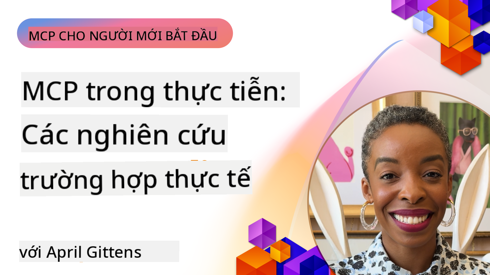

<!--
CO_OP_TRANSLATOR_METADATA:
{
  "original_hash": "1611dc5f6a2a35a789fc4c95fc5bfbe8",
  "translation_date": "2025-09-26T18:45:03+00:00",
  "source_file": "09-CaseStudy/README.md",
  "language_code": "vi"
}
-->
# MCP trong Thực Tiễn: Các Nghiên Cứu Tình Huống Thực Tế

_(Nhấn vào hình ảnh trên để xem video bài học này)_

Model Context Protocol (MCP) đang thay đổi cách các ứng dụng AI tương tác với dữ liệu, công cụ và dịch vụ. Phần này giới thiệu các nghiên cứu tình huống thực tế, minh họa cách MCP được áp dụng trong các kịch bản doanh nghiệp khác nhau.

## Tổng Quan

Phần này trình bày các ví dụ cụ thể về việc triển khai MCP, nhấn mạnh cách các tổ chức tận dụng giao thức này để giải quyết các thách thức kinh doanh phức tạp. Qua việc nghiên cứu các tình huống này, bạn sẽ hiểu rõ hơn về tính linh hoạt, khả năng mở rộng và lợi ích thực tiễn của MCP trong các kịch bản thực tế.

## Mục Tiêu Học Tập Chính

Khi khám phá các nghiên cứu tình huống này, bạn sẽ:

- Hiểu cách MCP có thể được áp dụng để giải quyết các vấn đề kinh doanh cụ thể
- Tìm hiểu về các mẫu tích hợp và cách tiếp cận kiến trúc khác nhau
- Nhận biết các thực tiễn tốt nhất để triển khai MCP trong môi trường doanh nghiệp
- Có cái nhìn sâu sắc về các thách thức và giải pháp trong việc triển khai thực tế
- Xác định cơ hội áp dụng các mẫu tương tự vào dự án của bạn

## Các Nghiên Cứu Tình Huống Nổi Bật

### 1. [Azure AI Travel Agents – Triển Khai Tham Chiếu](./travelagentsample.md)

Nghiên cứu tình huống này xem xét giải pháp tham chiếu toàn diện của Microsoft, minh họa cách xây dựng ứng dụng lập kế hoạch du lịch đa tác nhân, được hỗ trợ bởi AI, sử dụng MCP, Azure OpenAI và Azure AI Search. Dự án này bao gồm:

- Điều phối đa tác nhân thông qua MCP
- Tích hợp dữ liệu doanh nghiệp với Azure AI Search
- Kiến trúc an toàn, có khả năng mở rộng sử dụng các dịch vụ Azure
- Công cụ mở rộng với các thành phần MCP có thể tái sử dụng
- Trải nghiệm người dùng hội thoại được hỗ trợ bởi Azure OpenAI

Chi tiết về kiến trúc và triển khai cung cấp những hiểu biết giá trị về cách xây dựng hệ thống đa tác nhân phức tạp với MCP làm lớp điều phối.

### 2. [Cập Nhật Mục Azure DevOps từ Dữ Liệu YouTube](./UpdateADOItemsFromYT.md)

Nghiên cứu tình huống này minh họa một ứng dụng thực tiễn của MCP trong việc tự động hóa quy trình làm việc. Nó cho thấy cách các công cụ MCP có thể được sử dụng để:

- Trích xuất dữ liệu từ các nền tảng trực tuyến (YouTube)
- Cập nhật các mục công việc trong hệ thống Azure DevOps
- Tạo quy trình tự động hóa có thể lặp lại
- Tích hợp dữ liệu giữa các hệ thống khác nhau

Ví dụ này minh họa cách ngay cả các triển khai MCP đơn giản cũng có thể mang lại hiệu quả đáng kể bằng cách tự động hóa các tác vụ thường xuyên và cải thiện tính nhất quán dữ liệu giữa các hệ thống.

### 3. [Truy Xuất Tài Liệu Thời Gian Thực với MCP](./docs-mcp/README.md)

Nghiên cứu tình huống này hướng dẫn bạn cách kết nối một client console Python với máy chủ Model Context Protocol (MCP) để truy xuất và ghi lại tài liệu Microsoft theo ngữ cảnh, thời gian thực. Bạn sẽ học cách:

- Kết nối với máy chủ MCP bằng client Python và MCP SDK chính thức
- Sử dụng client HTTP streaming để truy xuất dữ liệu thời gian thực hiệu quả
- Gọi các công cụ tài liệu trên máy chủ và ghi phản hồi trực tiếp vào console
- Tích hợp tài liệu Microsoft cập nhật vào quy trình làm việc mà không cần rời khỏi terminal

Chương này bao gồm bài tập thực hành, mẫu mã hoạt động tối thiểu và liên kết đến các tài nguyên bổ sung để học sâu hơn. Xem toàn bộ hướng dẫn và mã trong chương liên kết để hiểu cách MCP có thể thay đổi cách truy cập tài liệu và năng suất của nhà phát triển trong môi trường console.

### 4. [Ứng Dụng Web Tạo Kế Hoạch Học Tập Tương Tác với MCP](./docs-mcp/README.md)

Nghiên cứu tình huống này minh họa cách xây dựng một ứng dụng web tương tác sử dụng Chainlit và Model Context Protocol (MCP) để tạo kế hoạch học tập cá nhân hóa cho bất kỳ chủ đề nào. Người dùng có thể chỉ định một chủ đề (như "Chứng chỉ AI-900") và thời gian học (ví dụ: 8 tuần), và ứng dụng sẽ cung cấp phân chia nội dung theo tuần. Chainlit tạo ra giao diện trò chuyện hội thoại, làm cho trải nghiệm trở nên hấp dẫn và thích ứng.

- Ứng dụng web hội thoại được hỗ trợ bởi Chainlit
- Lời nhắc do người dùng điều khiển cho chủ đề và thời gian
- Đề xuất nội dung theo tuần sử dụng MCP
- Phản hồi thời gian thực, thích ứng trong giao diện trò chuyện

Dự án minh họa cách AI hội thoại và MCP có thể được kết hợp để tạo ra các công cụ giáo dục động, do người dùng điều khiển trong môi trường web hiện đại.

### 5. [Tài Liệu Trong Trình Soạn Thảo với Máy Chủ MCP trong VS Code](./docs-mcp/README.md)

Nghiên cứu tình huống này minh họa cách bạn có thể mang tài liệu Microsoft Learn trực tiếp vào môi trường VS Code của mình bằng máy chủ MCP—không cần chuyển đổi tab trình duyệt! Bạn sẽ thấy cách:

- Tìm kiếm và đọc tài liệu ngay trong VS Code bằng bảng MCP hoặc command palette
- Tham khảo tài liệu và chèn liên kết trực tiếp vào README hoặc file markdown khóa học của bạn
- Sử dụng GitHub Copilot và MCP cùng nhau để có quy trình tài liệu và mã hóa được hỗ trợ bởi AI
- Xác thực và cải thiện tài liệu của bạn với phản hồi thời gian thực và độ chính xác từ nguồn Microsoft
- Tích hợp MCP với quy trình GitHub để xác thực tài liệu liên tục

Việc triển khai bao gồm:

- Ví dụ cấu hình `.vscode/mcp.json` để thiết lập dễ dàng
- Hướng dẫn từng bước bằng hình ảnh về trải nghiệm trong trình soạn thảo
- Mẹo kết hợp Copilot và MCP để tối đa hóa năng suất

Kịch bản này lý tưởng cho các tác giả khóa học, người viết tài liệu và nhà phát triển muốn tập trung trong trình soạn thảo của mình trong khi làm việc với tài liệu, Copilot và các công cụ xác thực—tất cả đều được hỗ trợ bởi MCP.

### 6. [Tạo Máy Chủ MCP với APIM](./apimsample.md)

Nghiên cứu tình huống này cung cấp hướng dẫn từng bước về cách tạo máy chủ MCP sử dụng Azure API Management (APIM). Nó bao gồm:

- Thiết lập máy chủ MCP trong Azure API Management
- Cung cấp các hoạt động API dưới dạng công cụ MCP
- Cấu hình chính sách cho giới hạn tốc độ và bảo mật
- Kiểm tra máy chủ MCP sử dụng Visual Studio Code và GitHub Copilot

Ví dụ này minh họa cách tận dụng khả năng của Azure để tạo một máy chủ MCP mạnh mẽ có thể được sử dụng trong nhiều ứng dụng, nâng cao sự tích hợp của các hệ thống AI với API doanh nghiệp.

### 7. [GitHub MCP Registry — Tăng Tốc Tích Hợp Tác Nhân](https://github.com/mcp)

Nghiên cứu tình huống này xem xét cách GitHub MCP Registry, ra mắt vào tháng 9 năm 2025, giải quyết một thách thức quan trọng trong hệ sinh thái AI: việc khám phá và triển khai các máy chủ Model Context Protocol (MCP) bị phân mảnh.

#### Tổng Quan
**MCP Registry** giải quyết vấn đề ngày càng tăng về các máy chủ MCP bị phân tán trên các kho lưu trữ và registry, trước đây làm cho việc tích hợp trở nên chậm và dễ xảy ra lỗi. Các máy chủ này cho phép các tác nhân AI tương tác với các hệ thống bên ngoài như API, cơ sở dữ liệu và nguồn tài liệu.

#### Vấn Đề
Các nhà phát triển xây dựng quy trình làm việc tác nhân gặp phải nhiều thách thức:
- **Khả năng khám phá kém** của các máy chủ MCP trên các nền tảng khác nhau
- **Câu hỏi thiết lập dư thừa** rải rác trên các diễn đàn và tài liệu
- **Rủi ro bảo mật** từ các nguồn không được xác minh và không đáng tin cậy
- **Thiếu tiêu chuẩn hóa** về chất lượng và khả năng tương thích của máy chủ

#### Kiến Trúc Giải Pháp
GitHub MCP Registry tập trung các máy chủ MCP đáng tin cậy với các tính năng chính:
- **Cài đặt một lần nhấp** tích hợp qua VS Code để thiết lập nhanh chóng
- **Sắp xếp theo tín hiệu** dựa trên số sao, hoạt động và xác thực cộng đồng
- **Tích hợp trực tiếp** với GitHub Copilot và các công cụ tương thích MCP khác
- **Mô hình đóng góp mở** cho phép cả cộng đồng và đối tác doanh nghiệp đóng góp

#### Tác Động Kinh Doanh
Registry đã mang lại những cải tiến đo lường được:
- **Khởi động nhanh hơn** cho các nhà phát triển sử dụng các công cụ như Microsoft Learn MCP Server, truyền tài liệu chính thức trực tiếp vào các tác nhân
- **Năng suất cải thiện** thông qua các máy chủ chuyên biệt như `github-mcp-server`, cho phép tự động hóa GitHub bằng ngôn ngữ tự nhiên (tạo PR, chạy lại CI, quét mã)
- **Niềm tin hệ sinh thái mạnh mẽ hơn** thông qua danh sách được quản lý và tiêu chuẩn cấu hình minh bạch

#### Giá Trị Chiến Lược
Đối với các nhà thực hành chuyên về quản lý vòng đời tác nhân và quy trình làm việc có thể tái tạo, MCP Registry cung cấp:
- **Khả năng triển khai tác nhân mô-đun** với các thành phần tiêu chuẩn hóa
- **Pipeline đánh giá được hỗ trợ bởi registry** để kiểm tra và xác thực nhất quán
- **Khả năng tương tác giữa các công cụ** cho phép tích hợp liền mạch trên các nền tảng AI khác nhau

Nghiên cứu tình huống này chứng minh rằng MCP Registry không chỉ là một thư mục—nó là một nền tảng cơ bản cho tích hợp mô hình quy mô lớn và triển khai hệ thống tác nhân.

## Kết Luận

Bảy nghiên cứu tình huống toàn diện này minh họa tính linh hoạt đáng kinh ngạc và các ứng dụng thực tiễn của Model Context Protocol trong các kịch bản thực tế đa dạng. Từ hệ thống lập kế hoạch du lịch đa tác nhân phức tạp và quản lý API doanh nghiệp đến quy trình làm việc tài liệu hợp lý và MCP Registry mang tính cách mạng của GitHub, các ví dụ này cho thấy MCP cung cấp một cách tiêu chuẩn hóa, có khả năng mở rộng để kết nối các hệ thống AI với các công cụ, dữ liệu và dịch vụ cần thiết để mang lại giá trị vượt trội.

Các nghiên cứu tình huống này bao gồm nhiều khía cạnh của triển khai MCP:
- **Tích Hợp Doanh Nghiệp**: Tự động hóa Azure DevOps và quản lý API Azure
- **Điều Phối Đa Tác Nhân**: Lập kế hoạch du lịch với các tác nhân AI phối hợp
- **Năng Suất Nhà Phát Triển**: Tích hợp VS Code và truy cập tài liệu thời gian thực
- **Phát Triển Hệ Sinh Thái**: MCP Registry của GitHub như một nền tảng cơ bản
- **Ứng Dụng Giáo Dục**: Trình tạo kế hoạch học tập tương tác và giao diện hội thoại

Qua việc nghiên cứu các triển khai này, bạn sẽ có được những hiểu biết quan trọng về:
- **Mẫu kiến trúc** cho các quy mô và trường hợp sử dụng khác nhau
- **Chiến lược triển khai** cân bằng giữa chức năng và khả năng duy trì
- **Cân nhắc về bảo mật và khả năng mở rộng** cho triển khai sản xuất
- **Thực tiễn tốt nhất** cho phát triển máy chủ MCP và tích hợp client
- **Tư duy hệ sinh thái** để xây dựng các giải pháp AI kết nối

Các ví dụ này cùng nhau chứng minh rằng MCP không chỉ là một khung lý thuyết mà còn là một giao thức trưởng thành, sẵn sàng sản xuất, cho phép các giải pháp thực tiễn cho các thách thức kinh doanh phức tạp. Dù bạn đang xây dựng các công cụ tự động hóa đơn giản hay hệ thống đa tác nhân tinh vi, các mẫu và cách tiếp cận được minh họa ở đây cung cấp nền tảng vững chắc cho các dự án MCP của bạn.

## Tài Nguyên Bổ Sung

- [Kho GitHub Azure AI Travel Agents](https://github.com/Azure-Samples/azure-ai-travel-agents)
- [Công Cụ MCP Azure DevOps](https://github.com/microsoft/azure-devops-mcp)
- [Công Cụ MCP Playwright](https://github.com/microsoft/playwright-mcp)
- [Máy Chủ MCP Microsoft Docs](https://github.com/MicrosoftDocs/mcp)
- [GitHub MCP Registry — Tăng Tốc Tích Hợp Tác Nhân](https://github.com/mcp)
- [Ví Dụ Cộng Đồng MCP](https://github.com/microsoft/mcp)

Tiếp Theo: Phòng Thực Hành [Tối Ưu Hóa Quy Trình AI: Xây Dựng Máy Chủ MCP với Bộ Công Cụ AI](../10-StreamliningAIWorkflowsBuildingAnMCPServerWithAIToolkit/README.md)

---

