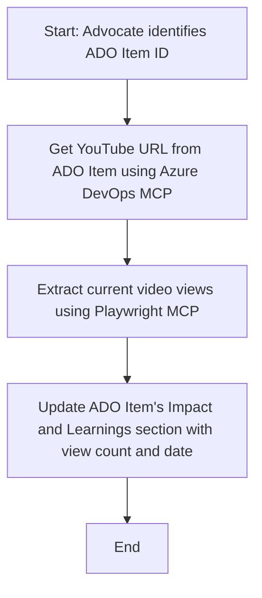

<!--
CO_OP_TRANSLATOR_METADATA:
{
  "original_hash": "14a2dfbea55ef735660a06bd6bdfe5f3",
  "translation_date": "2025-06-13T21:37:00+00:00",
  "source_file": "09-CaseStudy/UpdateADOItemsFromYT.md",
  "language_code": "vi"
}
-->
# Case Study: Cập nhật mục Azure DevOps từ dữ liệu YouTube với MCP

> **Disclaimer:** Đã có các công cụ và báo cáo trực tuyến sẵn có có thể tự động hóa việc cập nhật các mục Azure DevOps bằng dữ liệu từ các nền tảng như YouTube. Kịch bản dưới đây chỉ được cung cấp như một ví dụ minh họa cách sử dụng công cụ MCP để tự động hóa và tích hợp.

## Tổng quan

Case study này trình bày một ví dụ về cách Model Context Protocol (MCP) và các công cụ của nó có thể được dùng để tự động hóa việc cập nhật các mục công việc Azure DevOps (ADO) với thông tin lấy từ các nền tảng trực tuyến như YouTube. Kịch bản được mô tả chỉ là một minh họa trong số nhiều khả năng rộng hơn của các công cụ này, có thể điều chỉnh cho nhiều nhu cầu tự động hóa tương tự.

Trong ví dụ này, một Advocate theo dõi các buổi trực tuyến bằng cách sử dụng các mục ADO, mỗi mục chứa URL video YouTube. Bằng cách tận dụng các công cụ MCP, Advocate có thể giữ cho các mục ADO luôn cập nhật với các chỉ số video mới nhất, như số lượt xem, một cách lặp lại và tự động. Cách tiếp cận này có thể áp dụng cho các trường hợp khác khi cần tích hợp thông tin từ nguồn trực tuyến vào ADO hoặc hệ thống khác.

## Kịch bản

Một Advocate chịu trách nhiệm theo dõi tác động của các buổi trực tuyến và sự tham gia cộng đồng. Mỗi buổi được ghi lại dưới dạng một mục công việc ADO trong dự án 'DevRel', và mục công việc đó có trường chứa URL video YouTube. Để báo cáo chính xác phạm vi tiếp cận của buổi, Advocate cần cập nhật mục ADO với số lượt xem video hiện tại và ngày lấy thông tin này.

## Công cụ sử dụng

- [Azure DevOps MCP](https://github.com/microsoft/azure-devops-mcp): Cho phép truy cập và cập nhật mục công việc ADO qua MCP một cách lập trình.
- [Playwright MCP](https://github.com/microsoft/playwright-mcp): Tự động hóa thao tác trình duyệt để lấy dữ liệu trực tiếp từ các trang web, như số liệu video YouTube.

## Quy trình từng bước

1. **Xác định mục ADO**: Bắt đầu với ID mục công việc ADO (ví dụ: 1234) trong dự án 'DevRel'.
2. **Lấy URL YouTube**: Dùng công cụ Azure DevOps MCP để lấy URL YouTube từ mục công việc.
3. **Trích xuất lượt xem video**: Dùng công cụ Playwright MCP để truy cập URL YouTube và lấy số lượt xem hiện tại.
4. **Cập nhật mục ADO**: Ghi số lượt xem mới nhất và ngày lấy dữ liệu vào phần 'Impact and Learnings' của mục công việc ADO bằng công cụ Azure DevOps MCP.

## Ví dụ Prompt

```bash
- Work with the ADO Item ID: 1234
- The project is '2025-Awesome'
- Get the YouTube URL for the ADO item
- Use Playwright to get the current views from the YouTube video
- Update the ADO item with the current video views and the updated date of the information
```

## Sơ đồ luồng Mermaid



## Triển khai kỹ thuật

- **Điều phối MCP**: Quy trình được điều phối bởi một server MCP, phối hợp sử dụng cả công cụ Azure DevOps MCP và Playwright MCP.
- **Tự động hóa**: Quy trình có thể được kích hoạt thủ công hoặc lên lịch chạy định kỳ để giữ cho các mục ADO luôn cập nhật.
- **Khả năng mở rộng**: Mẫu này có thể mở rộng để cập nhật mục ADO với các chỉ số trực tuyến khác (ví dụ: lượt thích, bình luận) hoặc từ các nền tảng khác.

## Kết quả và tác động

- **Hiệu quả**: Giảm công sức thủ công cho Advocate bằng cách tự động lấy và cập nhật chỉ số video.
- **Chính xác**: Đảm bảo các mục ADO phản ánh dữ liệu mới nhất từ các nguồn trực tuyến.
- **Tính lặp lại**: Cung cấp quy trình có thể tái sử dụng cho các kịch bản tương tự liên quan đến các nguồn dữ liệu hoặc chỉ số khác.

## Tài liệu tham khảo

- [Azure DevOps MCP](https://github.com/microsoft/azure-devops-mcp)
- [Playwright MCP](https://github.com/microsoft/playwright-mcp)
- [Model Context Protocol (MCP)](https://modelcontextprotocol.io/)

**Tuyên bố từ chối trách nhiệm**:  
Tài liệu này đã được dịch bằng dịch vụ dịch thuật AI [Co-op Translator](https://github.com/Azure/co-op-translator). Mặc dù chúng tôi cố gắng đảm bảo độ chính xác, xin lưu ý rằng các bản dịch tự động có thể chứa lỗi hoặc không chính xác. Tài liệu gốc bằng ngôn ngữ nguyên bản nên được coi là nguồn tham khảo chính thức. Đối với thông tin quan trọng, nên sử dụng dịch vụ dịch thuật chuyên nghiệp bởi con người. Chúng tôi không chịu trách nhiệm về bất kỳ sự hiểu lầm hoặc giải thích sai nào phát sinh từ việc sử dụng bản dịch này.