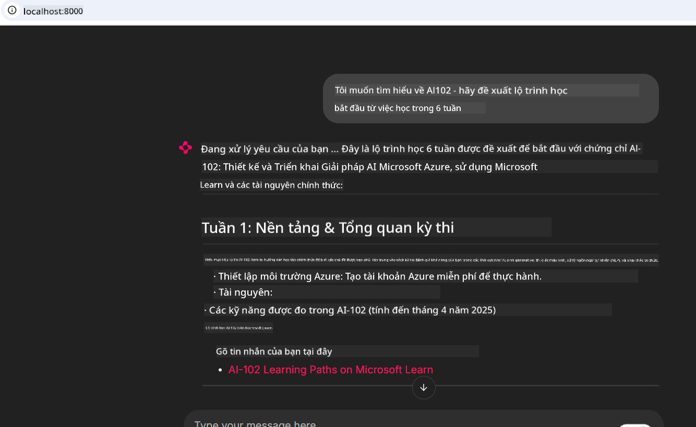

<!--
CO_OP_TRANSLATOR_METADATA:
{
  "original_hash": "4319d291c9d124ecafea52b3d04bfa0e",
  "translation_date": "2025-07-14T06:26:52+00:00",
  "source_file": "09-CaseStudy/docs-mcp/README.md",
  "language_code": "vi"
}
-->
# Case Study: Kết nối với Microsoft Learn Docs MCP Server từ Client

Bạn đã bao giờ phải xoay sở giữa các trang tài liệu, Stack Overflow và vô số tab trình duyệt tìm kiếm, trong khi cố gắng giải quyết một vấn đề trong mã của mình chưa? Có thể bạn giữ một màn hình phụ chỉ để xem tài liệu, hoặc liên tục chuyển đổi giữa IDE và trình duyệt. Liệu có phải sẽ tốt hơn nếu bạn có thể đưa tài liệu trực tiếp vào quy trình làm việc của mình—tích hợp ngay trong ứng dụng, IDE hoặc thậm chí công cụ tùy chỉnh của bạn? Trong nghiên cứu trường hợp này, chúng ta sẽ khám phá cách làm điều đó bằng cách kết nối trực tiếp với Microsoft Learn Docs MCP server từ ứng dụng client của bạn.

## Tổng quan

Phát triển hiện đại không chỉ là viết mã—mà còn là tìm đúng thông tin vào đúng thời điểm. Tài liệu có ở khắp nơi, nhưng hiếm khi ở nơi bạn cần nhất: bên trong công cụ và quy trình làm việc của bạn. Bằng cách tích hợp việc truy xuất tài liệu trực tiếp vào ứng dụng, bạn có thể tiết kiệm thời gian, giảm việc chuyển đổi ngữ cảnh và tăng năng suất. Trong phần này, chúng tôi sẽ hướng dẫn bạn cách kết nối client với Microsoft Learn Docs MCP server, để bạn có thể truy cập tài liệu theo thời gian thực, có ngữ cảnh mà không cần rời khỏi ứng dụng.

Chúng ta sẽ đi qua quy trình thiết lập kết nối, gửi yêu cầu và xử lý phản hồi streaming một cách hiệu quả. Cách tiếp cận này không chỉ giúp đơn giản hóa quy trình làm việc mà còn mở ra cơ hội xây dựng các công cụ phát triển thông minh, hữu ích hơn.

## Mục tiêu học tập

Tại sao chúng ta làm điều này? Bởi vì trải nghiệm nhà phát triển tốt nhất là những trải nghiệm loại bỏ mọi trở ngại. Hãy tưởng tượng một thế giới nơi trình soạn thảo mã, chatbot hoặc ứng dụng web của bạn có thể trả lời câu hỏi về tài liệu ngay lập tức, sử dụng nội dung mới nhất từ Microsoft Learn. Kết thúc chương này, bạn sẽ biết cách:

- Hiểu các khái niệm cơ bản về giao tiếp client-server MCP cho tài liệu
- Triển khai ứng dụng console hoặc web để kết nối với Microsoft Learn Docs MCP server
- Sử dụng HTTP client hỗ trợ streaming để truy xuất tài liệu theo thời gian thực
- Ghi lại và phân tích phản hồi tài liệu trong ứng dụng của bạn

Bạn sẽ thấy những kỹ năng này giúp bạn xây dựng các công cụ không chỉ phản ứng mà còn thực sự tương tác và có ngữ cảnh.

## Kịch bản 1 - Truy xuất tài liệu theo thời gian thực với MCP

Trong kịch bản này, chúng tôi sẽ hướng dẫn bạn cách kết nối client với Microsoft Learn Docs MCP server, để bạn có thể truy cập tài liệu theo thời gian thực, có ngữ cảnh mà không cần rời khỏi ứng dụng.

Hãy thực hành ngay. Nhiệm vụ của bạn là viết một ứng dụng kết nối với Microsoft Learn Docs MCP server, gọi công cụ `microsoft_docs_search`, và ghi lại phản hồi streaming ra console.

### Tại sao chọn cách này?
Bởi vì đây là nền tảng để xây dựng các tích hợp nâng cao hơn—dù bạn muốn tạo chatbot, tiện ích mở rộng IDE hay bảng điều khiển web.

Bạn sẽ tìm thấy mã nguồn và hướng dẫn cho kịch bản này trong thư mục [`solution`](./solution/README.md) của nghiên cứu trường hợp. Các bước sẽ hướng dẫn bạn thiết lập kết nối:
- Sử dụng SDK MCP chính thức và HTTP client hỗ trợ streaming để kết nối
- Gọi công cụ `microsoft_docs_search` với tham số truy vấn để lấy tài liệu
- Thực hiện ghi log và xử lý lỗi đúng cách
- Tạo giao diện console tương tác cho phép người dùng nhập nhiều truy vấn tìm kiếm

Kịch bản này minh họa cách:
- Kết nối với Docs MCP server
- Gửi truy vấn
- Phân tích và in kết quả

Dưới đây là ví dụ khi chạy giải pháp:

```
Prompt> What is Azure Key Vault?
Answer> Azure Key Vault is a cloud service for securely storing and accessing secrets. ...
```

Dưới đây là mẫu giải pháp tối giản. Mã nguồn đầy đủ và chi tiết có trong thư mục solution.

<details>
<summary>Python</summary>

```python
import asyncio
from mcp.client.streamable_http import streamablehttp_client
from mcp import ClientSession

async def main():
    async with streamablehttp_client("https://learn.microsoft.com/api/mcp") as (read_stream, write_stream, _):
        async with ClientSession(read_stream, write_stream) as session:
            await session.initialize()
            result = await session.call_tool("microsoft_docs_search", {"query": "Azure Functions best practices"})
            print(result.content)

if __name__ == "__main__":
    asyncio.run(main())
```

- Để xem triển khai đầy đủ và ghi log, xem [`scenario1.py`](../../../../09-CaseStudy/docs-mcp/solution/python/scenario1.py).
- Hướng dẫn cài đặt và sử dụng có trong file [`README.md`](./solution/python/README.md) cùng thư mục.
</details>

## Kịch bản 2 - Ứng dụng web tạo kế hoạch học tập tương tác với MCP

Trong kịch bản này, bạn sẽ học cách tích hợp Docs MCP vào dự án phát triển web. Mục tiêu là cho phép người dùng tìm kiếm tài liệu Microsoft Learn trực tiếp từ giao diện web, giúp tài liệu luôn sẵn có ngay trong ứng dụng hoặc trang web của bạn.

Bạn sẽ thấy cách:
- Thiết lập ứng dụng web
- Kết nối với Docs MCP server
- Xử lý đầu vào người dùng và hiển thị kết quả

Dưới đây là ví dụ khi chạy giải pháp:

```
User> I want to learn about AI102 - so suggest the roadmap to get it started from learn for 6 weeks

Assistant> Here’s a detailed 6-week roadmap to start your preparation for the AI-102: Designing and Implementing a Microsoft Azure AI Solution certification, using official Microsoft resources and focusing on exam skills areas:

---
## Week 1: Introduction & Fundamentals
- **Understand the Exam**: Review the [AI-102 exam skills outline](https://learn.microsoft.com/en-us/credentials/certifications/exams/ai-102/).
- **Set up Azure**: Sign up for a free Azure account if you don't have one.
- **Learning Path**: [Introduction to Azure AI services](https://learn.microsoft.com/en-us/training/modules/intro-to-azure-ai/)
- **Focus**: Get familiar with Azure portal, AI capabilities, and necessary tools.

....more weeks of the roadmap...

Let me know if you want module-specific recommendations or need more customized weekly tasks!
```

Dưới đây là mẫu giải pháp tối giản. Mã nguồn đầy đủ và chi tiết có trong thư mục solution.



<details>
<summary>Python (Chainlit)</summary>

Chainlit là framework để xây dựng ứng dụng web AI hội thoại. Nó giúp bạn dễ dàng tạo chatbot và trợ lý tương tác có thể gọi các công cụ MCP và hiển thị kết quả theo thời gian thực. Rất phù hợp cho việc tạo mẫu nhanh và giao diện thân thiện với người dùng.

```python
import chainlit as cl
import requests

MCP_URL = "https://learn.microsoft.com/api/mcp"

@cl.on_message
def handle_message(message):
    query = {"question": message}
    response = requests.post(MCP_URL, json=query)
    if response.ok:
        result = response.json()
        cl.Message(content=result.get("answer", "No answer found.")).send()
    else:
        cl.Message(content="Error: " + response.text).send()
```

- Để xem triển khai đầy đủ, xem [`scenario2.py`](../../../../09-CaseStudy/docs-mcp/solution/python/scenario2.py).
- Hướng dẫn cài đặt và chạy có trong [`README.md`](./solution/python/README.md).
</details>

## Kịch bản 3: Tài liệu trong trình soạn thảo với MCP Server trong VS Code

Nếu bạn muốn truy cập Microsoft Learn Docs ngay trong VS Code (thay vì phải chuyển tab trình duyệt), bạn có thể sử dụng MCP server trong trình soạn thảo. Điều này cho phép bạn:
- Tìm kiếm và đọc tài liệu trong VS Code mà không rời khỏi môi trường lập trình.
- Tham chiếu tài liệu và chèn liên kết trực tiếp vào README hoặc các file khóa học.
- Kết hợp GitHub Copilot và MCP để có quy trình làm việc tài liệu AI liền mạch.

**Bạn sẽ học cách:**
- Thêm file `.vscode/mcp.json` hợp lệ vào thư mục gốc workspace (xem ví dụ bên dưới).
- Mở bảng điều khiển MCP hoặc dùng command palette trong VS Code để tìm kiếm và chèn tài liệu.
- Tham chiếu tài liệu trực tiếp trong file markdown khi làm việc.
- Kết hợp quy trình này với GitHub Copilot để tăng năng suất hơn nữa.

Dưới đây là ví dụ thiết lập MCP server trong VS Code:

```json
{
  "servers": {
    "LearnDocsMCP": {
      "url": "https://learn.microsoft.com/api/mcp"
    }
  }
}
```

</details>

> Để xem hướng dẫn chi tiết kèm ảnh chụp màn hình và từng bước, xem [`README.md`](./solution/scenario3/README.md).


Cách tiếp cận này rất phù hợp với những ai xây dựng khóa học kỹ thuật, viết tài liệu hoặc phát triển mã cần tham khảo thường xuyên.

## Những điểm chính cần nhớ

Tích hợp tài liệu trực tiếp vào công cụ không chỉ là sự tiện lợi—mà còn là bước đột phá cho năng suất. Bằng cách kết nối với Microsoft Learn Docs MCP server từ client, bạn có thể:

- Loại bỏ việc chuyển đổi ngữ cảnh giữa mã và tài liệu
- Truy xuất tài liệu cập nhật, có ngữ cảnh theo thời gian thực
- Xây dựng các công cụ phát triển thông minh, tương tác hơn

Những kỹ năng này sẽ giúp bạn tạo ra các giải pháp không chỉ hiệu quả mà còn mang lại trải nghiệm sử dụng thú vị.

## Tài nguyên bổ sung

Để hiểu sâu hơn, hãy khám phá các tài nguyên chính thức sau:

- [Microsoft Learn Docs MCP Server (GitHub)](https://github.com/MicrosoftDocs/mcp)
- [Bắt đầu với Azure MCP Server (mcp-python)](https://learn.microsoft.com/en-us/azure/developer/azure-mcp-server/get-started#create-the-python-app)
- [Azure MCP Server là gì?](https://learn.microsoft.com/en-us/azure/developer/azure-mcp-server/)
- [Giới thiệu Model Context Protocol (MCP)](https://modelcontextprotocol.io/introduction)
- [Thêm plugin từ MCP Server (Python)](https://learn.microsoft.com/en-us/semantic-kernel/concepts/plugins/adding-mcp-plugins)

**Tuyên bố từ chối trách nhiệm**:  
Tài liệu này đã được dịch bằng dịch vụ dịch thuật AI [Co-op Translator](https://github.com/Azure/co-op-translator). Mặc dù chúng tôi cố gắng đảm bảo độ chính xác, xin lưu ý rằng các bản dịch tự động có thể chứa lỗi hoặc không chính xác. Tài liệu gốc bằng ngôn ngữ gốc của nó nên được coi là nguồn chính xác và đáng tin cậy. Đối với các thông tin quan trọng, nên sử dụng dịch vụ dịch thuật chuyên nghiệp do con người thực hiện. Chúng tôi không chịu trách nhiệm về bất kỳ sự hiểu lầm hoặc giải thích sai nào phát sinh từ việc sử dụng bản dịch này.