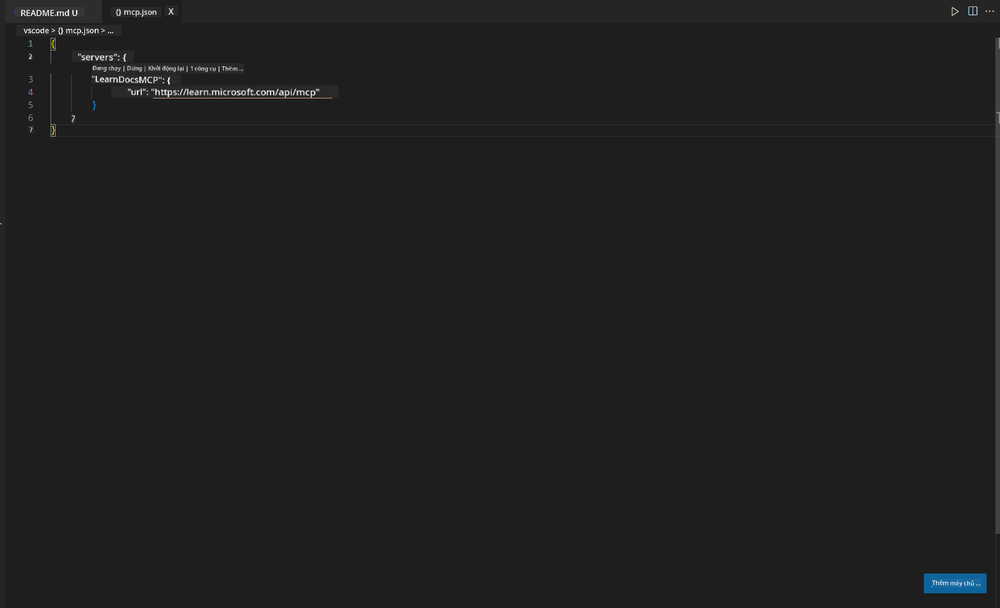
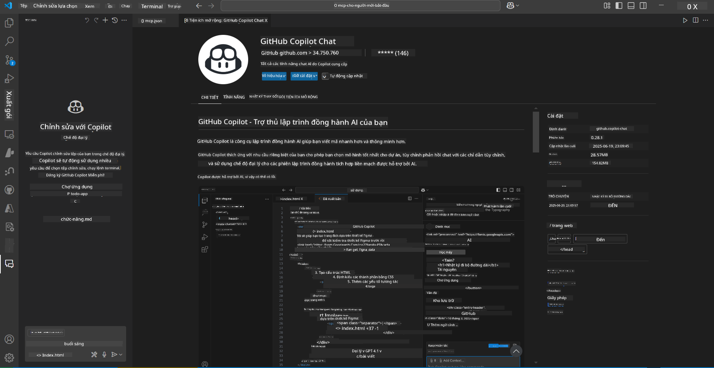
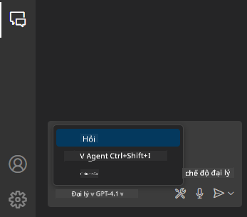
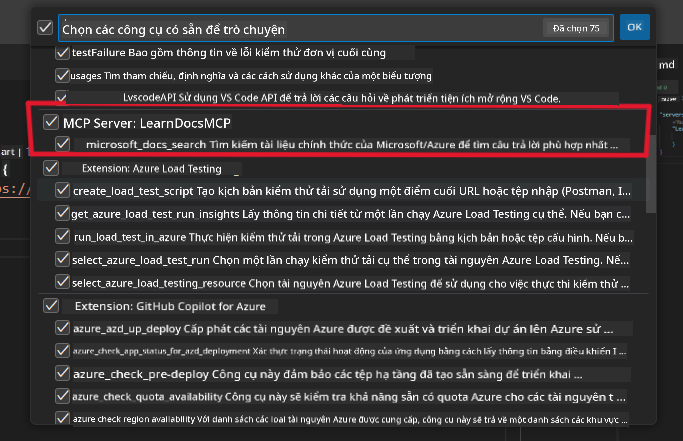
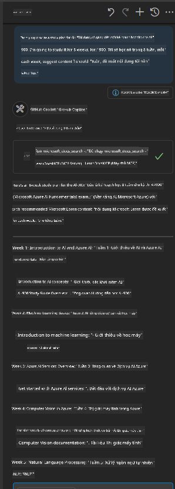
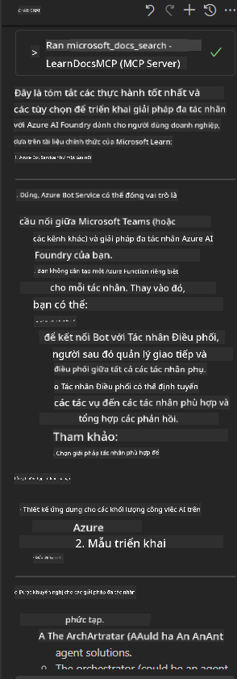

<!--
CO_OP_TRANSLATOR_METADATA:
{
  "original_hash": "db532b1ec386c9ce38c791653dc3c881",
  "translation_date": "2025-07-14T06:53:41+00:00",
  "source_file": "09-CaseStudy/docs-mcp/solution/scenario3/README.md",
  "language_code": "vi"
}
-->
# Scenario 3: Tài liệu trong trình soạn thảo với MCP Server trong VS Code

## Tổng quan

Trong kịch bản này, bạn sẽ học cách đưa Microsoft Learn Docs trực tiếp vào môi trường Visual Studio Code của mình bằng cách sử dụng MCP server. Thay vì phải liên tục chuyển đổi giữa các tab trình duyệt để tìm kiếm tài liệu, bạn có thể truy cập, tìm kiếm và tham khảo tài liệu chính thức ngay trong trình soạn thảo. Cách tiếp cận này giúp tối ưu quy trình làm việc, giữ bạn tập trung và cho phép tích hợp liền mạch với các công cụ như GitHub Copilot.

- Tìm kiếm và đọc tài liệu ngay trong VS Code mà không cần rời khỏi môi trường lập trình.
- Tham khảo tài liệu và chèn liên kết trực tiếp vào README hoặc các file khóa học.
- Sử dụng GitHub Copilot và MCP cùng nhau để có quy trình làm việc với tài liệu được hỗ trợ bởi AI một cách mượt mà.

## Mục tiêu học tập

Kết thúc chương này, bạn sẽ hiểu cách thiết lập và sử dụng MCP server trong VS Code để nâng cao quy trình làm việc với tài liệu và phát triển. Bạn sẽ có khả năng:

- Cấu hình workspace để sử dụng MCP server cho việc tra cứu tài liệu.
- Tìm kiếm và chèn tài liệu trực tiếp từ trong VS Code.
- Kết hợp sức mạnh của GitHub Copilot và MCP để có quy trình làm việc hiệu quả hơn, được hỗ trợ bởi AI.

Những kỹ năng này sẽ giúp bạn duy trì sự tập trung, cải thiện chất lượng tài liệu và tăng năng suất làm việc với vai trò là nhà phát triển hoặc người viết tài liệu kỹ thuật.

## Giải pháp

Để truy cập tài liệu ngay trong trình soạn thảo, bạn sẽ thực hiện một loạt các bước tích hợp MCP server với VS Code và GitHub Copilot. Giải pháp này rất phù hợp cho tác giả khóa học, người viết tài liệu và nhà phát triển muốn giữ sự tập trung trong trình soạn thảo khi làm việc với tài liệu và Copilot.

- Nhanh chóng thêm liên kết tham khảo vào README khi viết tài liệu khóa học hoặc dự án.
- Sử dụng Copilot để tạo mã và MCP để tìm kiếm, trích dẫn tài liệu liên quan ngay lập tức.
- Giữ sự tập trung trong trình soạn thảo và tăng năng suất.

### Hướng dẫn từng bước

Để bắt đầu, làm theo các bước sau. Với mỗi bước, bạn có thể thêm ảnh chụp màn hình từ thư mục assets để minh họa trực quan quá trình.

1. **Thêm cấu hình MCP:**
   Tại thư mục gốc dự án, tạo file `.vscode/mcp.json` và thêm cấu hình sau:
   ```json
   {
     "servers": {
       "LearnDocsMCP": {
         "url": "https://learn.microsoft.com/api/mcp"
       }
     }
   }
   ```
   Cấu hình này cho VS Code biết cách kết nối với [`Microsoft Learn Docs MCP server`](https://github.com/MicrosoftDocs/mcp).
   
   
    
2. **Mở bảng GitHub Copilot Chat:**
   Nếu bạn chưa cài đặt tiện ích mở rộng GitHub Copilot, hãy vào phần Extensions trong VS Code và cài đặt. Bạn có thể tải trực tiếp từ [Visual Studio Code Marketplace](https://marketplace.visualstudio.com/items?itemName=GitHub.copilot-chat). Sau đó, mở bảng Copilot Chat từ thanh bên.

   

3. **Bật chế độ agent và kiểm tra công cụ:**
   Trong bảng Copilot Chat, bật chế độ agent.

   

   Sau khi bật chế độ agent, kiểm tra xem MCP server có được liệt kê trong các công cụ có sẵn không. Điều này đảm bảo agent Copilot có thể truy cập server tài liệu để lấy thông tin liên quan.
   
   
4. **Bắt đầu cuộc trò chuyện mới và đặt câu hỏi cho agent:**
   Mở một cuộc trò chuyện mới trong bảng Copilot Chat. Bạn có thể đặt câu hỏi về tài liệu cho agent. Agent sẽ sử dụng MCP server để lấy và hiển thị tài liệu Microsoft Learn liên quan ngay trong trình soạn thảo.

   - *"Tôi đang cố gắng viết kế hoạch học tập cho chủ đề X. Tôi sẽ học trong 8 tuần, mỗi tuần hãy gợi ý nội dung tôi nên học."*

   

5. **Truy vấn trực tiếp:**

   > Hãy cùng xem một truy vấn trực tiếp từ phần [#get-help](https://discord.gg/D6cRhjHWSC) trong Azure AI Foundry Discord ([xem tin nhắn gốc](https://discord.com/channels/1113626258182504448/1385498306720829572)):
   
   *"Tôi đang tìm câu trả lời về cách triển khai giải pháp đa agent với các agent AI phát triển trên Azure AI Foundry. Tôi thấy không có phương pháp triển khai trực tiếp, như các kênh Copilot Studio. Vậy có những cách nào khác để triển khai cho người dùng doanh nghiệp tương tác và hoàn thành công việc?
Có nhiều bài viết/blog nói rằng chúng ta có thể dùng dịch vụ Azure Bot để làm cầu nối giữa MS Teams và các Azure AI Foundry Agents, vậy liệu có hoạt động nếu tôi thiết lập một Azure bot kết nối với Orchestrator Agent trên Azure AI Foundry qua Azure function để thực hiện điều phối, hay tôi cần tạo Azure function cho từng agent AI trong giải pháp đa agent để điều phối tại Bot framework? Mọi gợi ý khác đều rất được hoan nghênh."*

   

   Agent sẽ phản hồi với các liên kết tài liệu và tóm tắt liên quan, bạn có thể chèn trực tiếp vào file markdown hoặc dùng làm tham khảo trong mã của mình.
   
### Ví dụ truy vấn

Dưới đây là một số truy vấn mẫu bạn có thể thử. Những truy vấn này sẽ minh họa cách MCP server và Copilot phối hợp để cung cấp tài liệu và tham khảo theo ngữ cảnh ngay lập tức mà không cần rời khỏi VS Code:

- "Cho tôi xem cách sử dụng triggers trong Azure Functions."
- "Chèn liên kết đến tài liệu chính thức của Azure Key Vault."
- "Những thực hành tốt nhất để bảo mật tài nguyên Azure là gì?"
- "Tìm một quickstart cho dịch vụ Azure AI."

Những truy vấn này sẽ minh họa cách MCP server và Copilot phối hợp để cung cấp tài liệu và tham khảo theo ngữ cảnh ngay lập tức mà không cần rời khỏi VS Code.

---

**Tuyên bố từ chối trách nhiệm**:  
Tài liệu này đã được dịch bằng dịch vụ dịch thuật AI [Co-op Translator](https://github.com/Azure/co-op-translator). Mặc dù chúng tôi cố gắng đảm bảo độ chính xác, xin lưu ý rằng các bản dịch tự động có thể chứa lỗi hoặc không chính xác. Tài liệu gốc bằng ngôn ngữ gốc của nó nên được coi là nguồn chính xác và đáng tin cậy. Đối với các thông tin quan trọng, nên sử dụng dịch vụ dịch thuật chuyên nghiệp do con người thực hiện. Chúng tôi không chịu trách nhiệm về bất kỳ sự hiểu lầm hoặc giải thích sai nào phát sinh từ việc sử dụng bản dịch này.