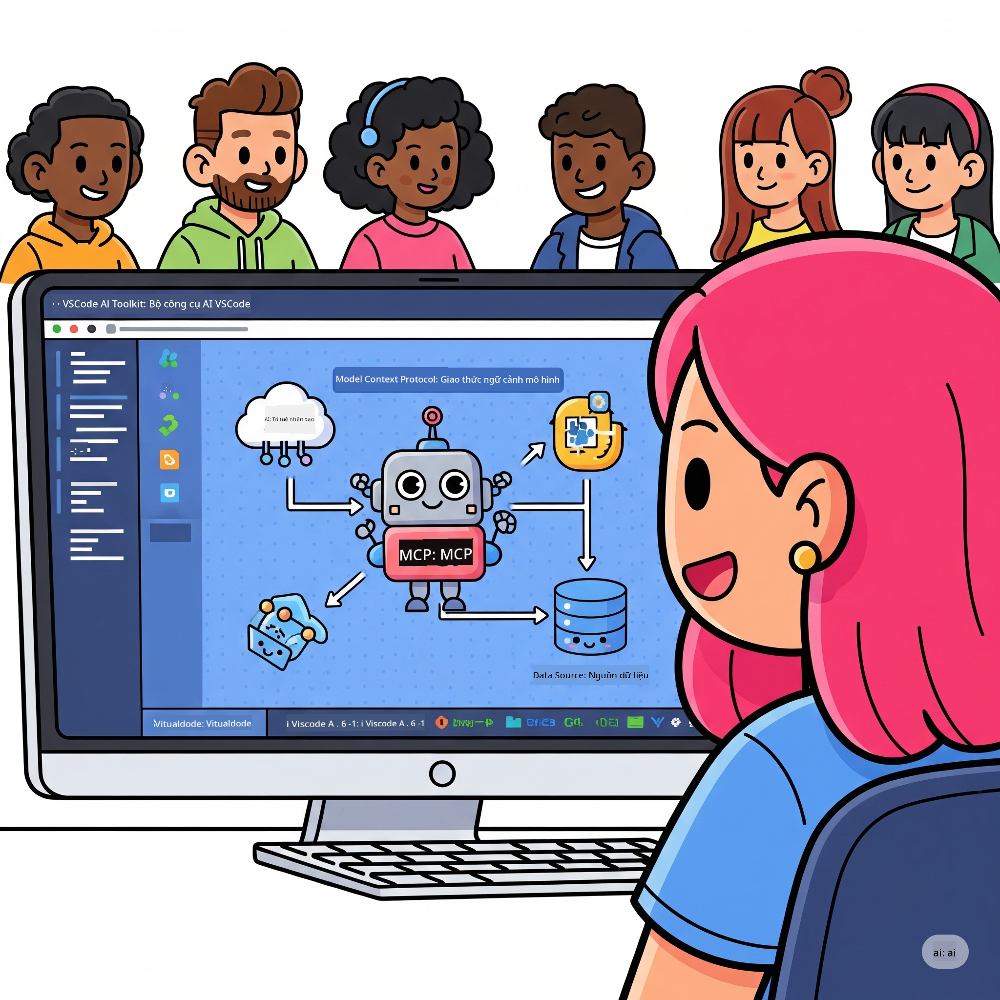

<!--
CO_OP_TRANSLATOR_METADATA:
{
  "original_hash": "787440926586cd064b0899fd1c514f52",
  "translation_date": "2025-07-14T07:10:37+00:00",
  "source_file": "10-StreamliningAIWorkflowsBuildingAnMCPServerWithAIToolkit/README.md",
  "language_code": "vi"
}
-->
# Tinh giản Quy trình AI: Xây dựng Máy chủ MCP với AI Toolkit

## 🎯 Tổng quan

Chào mừng bạn đến với **Hội thảo Model Context Protocol (MCP)**! Buổi workshop thực hành toàn diện này kết hợp hai công nghệ tiên tiến để cách mạng hóa phát triển ứng dụng AI:

- **🔗 Model Context Protocol (MCP)**: Chuẩn mở cho tích hợp công cụ AI liền mạch
- **🛠️ AI Toolkit cho Visual Studio Code (AITK)**: Tiện ích mở rộng phát triển AI mạnh mẽ của Microsoft

### 🎓 Bạn sẽ học được gì

Kết thúc workshop, bạn sẽ thành thạo cách xây dựng các ứng dụng thông minh kết nối mô hình AI với các công cụ và dịch vụ thực tế. Từ kiểm thử tự động đến tích hợp API tùy chỉnh, bạn sẽ có kỹ năng thực tiễn để giải quyết các thách thức kinh doanh phức tạp.

## 🏗️ Công nghệ sử dụng

### 🔌 Model Context Protocol (MCP)

MCP là **"USB-C cho AI"** - một chuẩn kết nối phổ quát giúp liên kết mô hình AI với các công cụ và nguồn dữ liệu bên ngoài.

**✨ Tính năng chính:**
- 🔄 **Tích hợp chuẩn hóa**: Giao diện chung cho kết nối công cụ AI
- 🏛️ **Kiến trúc linh hoạt**: Máy chủ cục bộ & từ xa qua giao thức stdio/SSE
- 🧰 **Hệ sinh thái phong phú**: Công cụ, prompt và tài nguyên trong cùng một giao thức
- 🔒 **Sẵn sàng doanh nghiệp**: Bảo mật và độ tin cậy tích hợp sẵn

**🎯 Tại sao MCP quan trọng:**
Giống như USB-C đã loại bỏ sự lộn xộn của dây cáp, MCP giúp đơn giản hóa việc tích hợp AI. Một giao thức, vô vàn khả năng.

### 🤖 AI Toolkit cho Visual Studio Code (AITK)

Tiện ích mở rộng phát triển AI chủ lực của Microsoft biến VS Code thành trung tâm AI mạnh mẽ.

**🚀 Khả năng cốt lõi:**
- 📦 **Danh mục mô hình**: Truy cập mô hình từ Azure AI, GitHub, Hugging Face, Ollama
- ⚡ **Suy luận cục bộ**: Thực thi tối ưu ONNX trên CPU/GPU/NPU
- 🏗️ **Agent Builder**: Phát triển agent AI trực quan tích hợp MCP
- 🎭 **Đa phương thức**: Hỗ trợ văn bản, hình ảnh và đầu ra có cấu trúc

**💡 Lợi ích phát triển:**
- Triển khai mô hình không cần cấu hình
- Thiết kế prompt trực quan
- Môi trường thử nghiệm thời gian thực
- Tích hợp máy chủ MCP mượt mà

## 📚 Hành trình học tập

### [🚀 Module 1: Kiến thức cơ bản AI Toolkit](./lab1/README.md)
**Thời lượng**: 15 phút
- 🛠️ Cài đặt và cấu hình AI Toolkit cho VS Code
- 🗂️ Khám phá Danh mục Mô hình (hơn 100 mô hình từ GitHub, ONNX, OpenAI, Anthropic, Google)
- 🎮 Làm chủ Interactive Playground để thử nghiệm mô hình thời gian thực
- 🤖 Xây dựng agent AI đầu tiên với Agent Builder
- 📊 Đánh giá hiệu suất mô hình với các chỉ số tích hợp (F1, độ liên quan, tương đồng, mạch lạc)
- ⚡ Tìm hiểu xử lý theo lô và hỗ trợ đa phương thức

**🎯 Kết quả học tập**: Tạo agent AI hoạt động với hiểu biết toàn diện về khả năng của AITK

### [🌐 Module 2: MCP với Kiến thức cơ bản AI Toolkit](./lab2/README.md)
**Thời lượng**: 20 phút
- 🧠 Nắm vững kiến trúc và khái niệm Model Context Protocol (MCP)
- 🌐 Khám phá hệ sinh thái máy chủ MCP của Microsoft
- 🤖 Xây dựng agent tự động trình duyệt sử dụng Playwright MCP server
- 🔧 Tích hợp máy chủ MCP với AI Toolkit Agent Builder
- 📊 Cấu hình và kiểm thử công cụ MCP trong agent của bạn
- 🚀 Xuất và triển khai agent sử dụng MCP cho môi trường sản xuất

**🎯 Kết quả học tập**: Triển khai agent AI được tăng cường công cụ bên ngoài qua MCP

### [🔧 Module 3: Phát triển MCP nâng cao với AI Toolkit](./lab3/README.md)
**Thời lượng**: 20 phút
- 💻 Tạo máy chủ MCP tùy chỉnh bằng AI Toolkit
- 🐍 Cấu hình và sử dụng MCP Python SDK mới nhất (v1.9.3)
- 🔍 Thiết lập và sử dụng MCP Inspector để gỡ lỗi
- 🛠️ Xây dựng Weather MCP Server với quy trình gỡ lỗi chuyên nghiệp
- 🧪 Gỡ lỗi máy chủ MCP trong cả môi trường Agent Builder và Inspector

**🎯 Kết quả học tập**: Phát triển và gỡ lỗi máy chủ MCP tùy chỉnh với công cụ hiện đại

### [🐙 Module 4: Phát triển MCP thực tiễn - Máy chủ GitHub Clone tùy chỉnh](./lab4/README.md)
**Thời lượng**: 30 phút
- 🏗️ Xây dựng máy chủ GitHub Clone MCP thực tế cho quy trình phát triển
- 🔄 Triển khai sao chép kho thông minh với xác thực và xử lý lỗi
- 📁 Tạo quản lý thư mục thông minh và tích hợp VS Code
- 🤖 Sử dụng GitHub Copilot Agent Mode với công cụ MCP tùy chỉnh
- 🛡️ Áp dụng độ tin cậy sẵn sàng sản xuất và tương thích đa nền tảng

**🎯 Kết quả học tập**: Triển khai máy chủ MCP sẵn sàng sản xuất giúp tối ưu quy trình phát triển thực tế

## 💡 Ứng dụng thực tế & Tác động

### 🏢 Trường hợp sử dụng doanh nghiệp

#### 🔄 Tự động hóa DevOps
Biến đổi quy trình phát triển với tự động hóa thông minh:
- **Quản lý kho thông minh**: Đánh giá và quyết định hợp nhất mã bằng AI
- **CI/CD thông minh**: Tối ưu pipeline tự động dựa trên thay đổi mã
- **Phân loại lỗi tự động**: Phân loại và phân công lỗi tự động

#### 🧪 Cách mạng Đảm bảo chất lượng
Nâng cao kiểm thử với tự động hóa AI:
- **Tạo test thông minh**: Tự động tạo bộ kiểm thử toàn diện
- **Kiểm thử hồi quy hình ảnh**: Phát hiện thay đổi giao diện bằng AI
- **Giám sát hiệu năng**: Phát hiện và xử lý sự cố chủ động

#### 📊 Trí tuệ quy trình dữ liệu
Xây dựng quy trình xử lý dữ liệu thông minh hơn:
- **Quy trình ETL thích ứng**: Tự tối ưu hóa biến đổi dữ liệu
- **Phát hiện bất thường**: Giám sát chất lượng dữ liệu thời gian thực
- **Định tuyến thông minh**: Quản lý luồng dữ liệu hiệu quả

#### 🎧 Nâng cao trải nghiệm khách hàng
Tạo tương tác khách hàng xuất sắc:
- **Hỗ trợ theo ngữ cảnh**: Agent AI truy cập lịch sử khách hàng
- **Giải quyết vấn đề chủ động**: Dịch vụ khách hàng dự đoán
- **Tích hợp đa kênh**: Trải nghiệm AI thống nhất trên nhiều nền tảng

## 🛠️ Yêu cầu & Cài đặt

### 💻 Yêu cầu hệ thống

| Thành phần           | Yêu cầu             | Ghi chú                  |
|---------------------|---------------------|--------------------------|
| **Hệ điều hành**     | Windows 10+, macOS 10.15+, Linux | Bất kỳ hệ điều hành hiện đại nào |
| **Visual Studio Code** | Phiên bản ổn định mới nhất | Cần thiết cho AITK       |
| **Node.js**          | v18.0+ và npm       | Dùng cho phát triển máy chủ MCP |
| **Python**           | 3.10+               | Tùy chọn cho máy chủ MCP Python |
| **Bộ nhớ**           | Tối thiểu 8GB RAM   | Khuyến nghị 16GB cho mô hình cục bộ |

### 🔧 Môi trường phát triển

#### Tiện ích mở rộng VS Code được khuyến nghị
- **AI Toolkit** (ms-windows-ai-studio.windows-ai-studio)
- **Python** (ms-python.python)
- **Python Debugger** (ms-python.debugpy)
- **GitHub Copilot** (GitHub.copilot) - Tùy chọn nhưng hữu ích

#### Công cụ tùy chọn
- **uv**: Trình quản lý gói Python hiện đại
- **MCP Inspector**: Công cụ gỡ lỗi trực quan cho máy chủ MCP
- **Playwright**: Ví dụ tự động hóa web

## 🎖️ Kết quả học tập & Lộ trình chứng nhận

### 🏆 Danh sách kỹ năng đạt được

Hoàn thành workshop này, bạn sẽ thành thạo:

#### 🎯 Năng lực cốt lõi
- [ ] **Thành thạo giao thức MCP**: Hiểu sâu kiến trúc và mẫu triển khai
- [ ] **Thành thạo AITK**: Sử dụng AI Toolkit chuyên nghiệp để phát triển nhanh
- [ ] **Phát triển máy chủ tùy chỉnh**: Xây dựng, triển khai và duy trì máy chủ MCP sản xuất
- [ ] **Tích hợp công cụ xuất sắc**: Kết nối AI với quy trình phát triển hiện có một cách liền mạch
- [ ] **Ứng dụng giải quyết vấn đề**: Áp dụng kỹ năng vào thách thức kinh doanh thực tế

#### 🔧 Kỹ năng kỹ thuật
- [ ] Cài đặt và cấu hình AI Toolkit trong VS Code
- [ ] Thiết kế và triển khai máy chủ MCP tùy chỉnh
- [ ] Tích hợp mô hình GitHub với kiến trúc MCP
- [ ] Xây dựng quy trình kiểm thử tự động với Playwright
- [ ] Triển khai agent AI cho môi trường sản xuất
- [ ] Gỡ lỗi và tối ưu hiệu suất máy chủ MCP

#### 🚀 Khả năng nâng cao
- [ ] Thiết kế tích hợp AI quy mô doanh nghiệp
- [ ] Thực hiện các thực hành bảo mật tốt nhất cho ứng dụng AI
- [ ] Thiết kế kiến trúc máy chủ MCP có khả năng mở rộng
- [ ] Tạo chuỗi công cụ tùy chỉnh cho các lĩnh vực cụ thể
- [ ] Hướng dẫn người khác phát triển AI bản địa

## 📖 Tài nguyên bổ sung
- [MCP Specification](https://modelcontextprotocol.io/docs)
- [AI Toolkit GitHub Repository](https://github.com/microsoft/vscode-ai-toolkit)
- [Sample MCP Servers Collection](https://github.com/modelcontextprotocol/servers)
- [Best Practices Guide](https://modelcontextprotocol.io/docs/best-practices)

---

**🚀 Sẵn sàng cách mạng hóa quy trình phát triển AI của bạn?**

Hãy cùng xây dựng tương lai của các ứng dụng thông minh với MCP và AI Toolkit!

**Tuyên bố từ chối trách nhiệm**:  
Tài liệu này đã được dịch bằng dịch vụ dịch thuật AI [Co-op Translator](https://github.com/Azure/co-op-translator). Mặc dù chúng tôi cố gắng đảm bảo độ chính xác, xin lưu ý rằng bản dịch tự động có thể chứa lỗi hoặc không chính xác. Tài liệu gốc bằng ngôn ngữ gốc của nó nên được coi là nguồn chính xác và đáng tin cậy. Đối với các thông tin quan trọng, nên sử dụng dịch vụ dịch thuật chuyên nghiệp do con người thực hiện. Chúng tôi không chịu trách nhiệm về bất kỳ sự hiểu lầm hoặc giải thích sai nào phát sinh từ việc sử dụng bản dịch này.