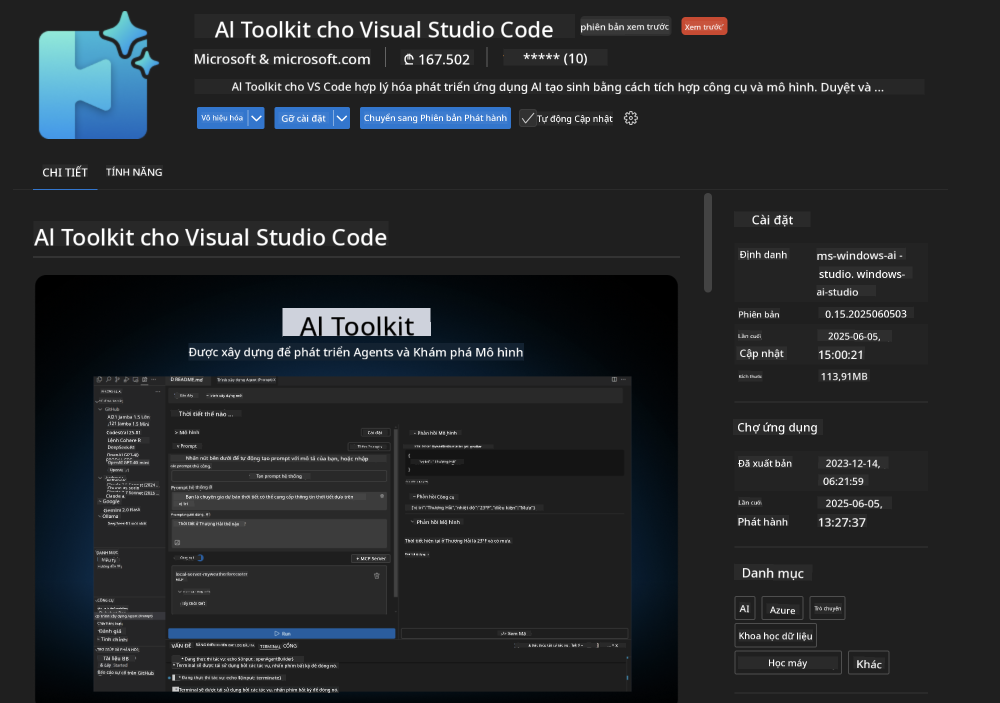
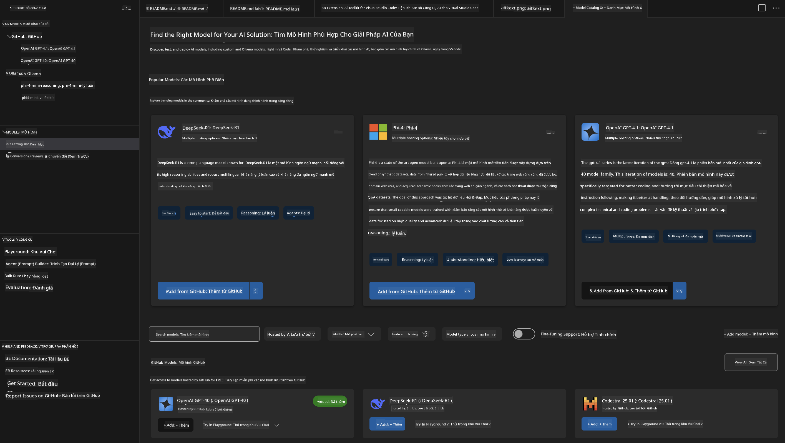
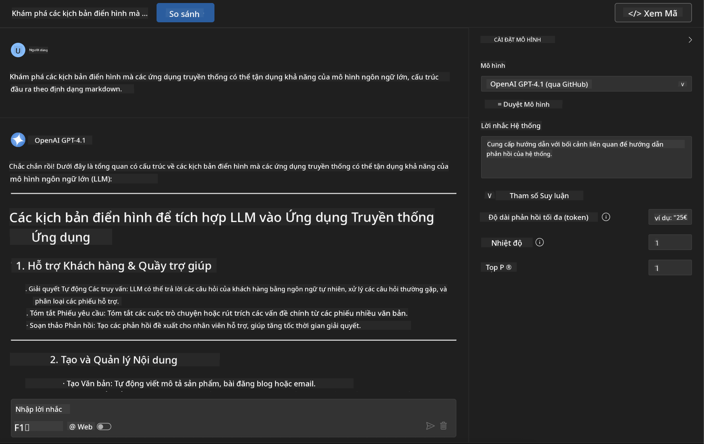
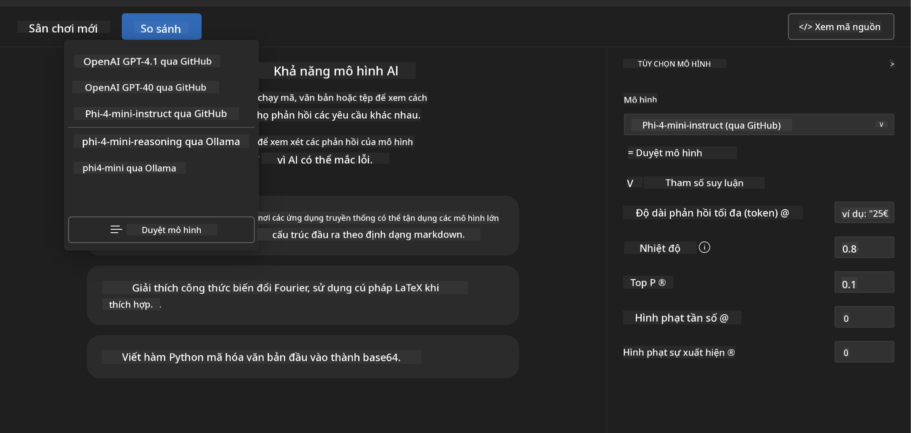
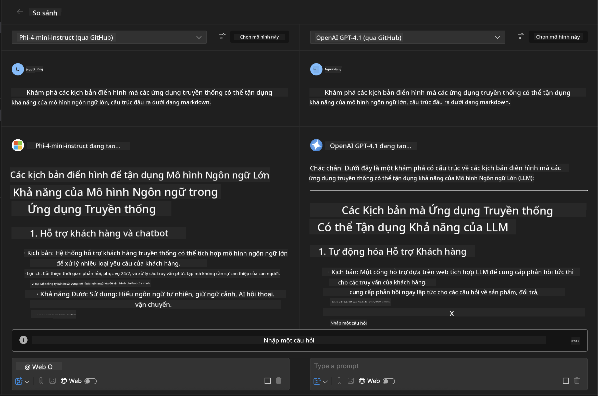
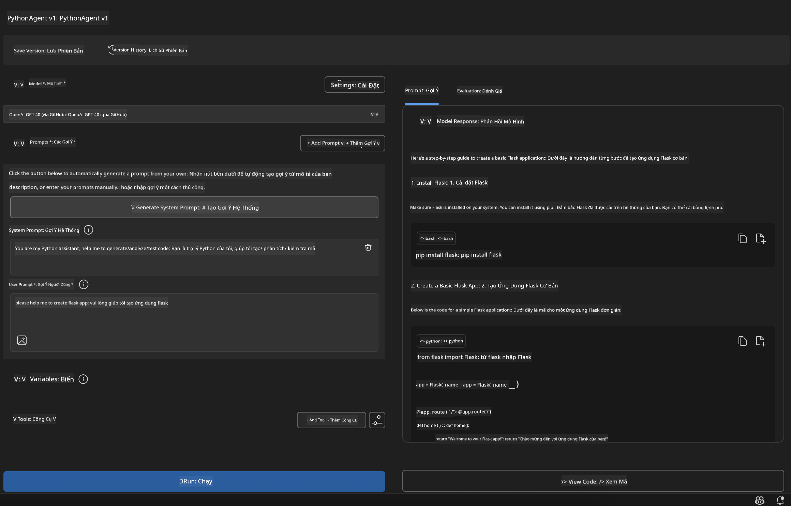

<!--
CO_OP_TRANSLATOR_METADATA:
{
  "original_hash": "2aa9dbc165e104764fa57e8a0d3f1c73",
  "translation_date": "2025-07-14T07:30:42+00:00",
  "source_file": "10-StreamliningAIWorkflowsBuildingAnMCPServerWithAIToolkit/lab1/README.md",
  "language_code": "vi"
}
-->
# 🚀 Module 1: Những Kiến Thức Cơ Bản về AI Toolkit

[]()
[]()
[]()

## 📋 Mục Tiêu Học Tập

Kết thúc module này, bạn sẽ có thể:
- ✅ Cài đặt và cấu hình AI Toolkit cho Visual Studio Code
- ✅ Duyệt qua Model Catalog và hiểu về các nguồn mô hình khác nhau
- ✅ Sử dụng Playground để thử nghiệm và kiểm tra mô hình
- ✅ Tạo các agent AI tùy chỉnh bằng Agent Builder
- ✅ So sánh hiệu suất mô hình giữa các nhà cung cấp khác nhau
- ✅ Áp dụng các phương pháp tốt nhất trong kỹ thuật prompt

## 🧠 Giới Thiệu về AI Toolkit (AITK)

**AI Toolkit cho Visual Studio Code** là tiện ích mở rộng chủ lực của Microsoft, biến VS Code thành một môi trường phát triển AI toàn diện. Nó kết nối giữa nghiên cứu AI và phát triển ứng dụng thực tiễn, giúp AI sinh tạo trở nên dễ tiếp cận với mọi nhà phát triển ở mọi trình độ.

### 🌟 Các Tính Năng Chính

| Tính Năng | Mô Tả | Trường Hợp Sử Dụng |
|---------|-------------|----------|
| **🗂️ Model Catalog** | Truy cập hơn 100 mô hình từ GitHub, ONNX, OpenAI, Anthropic, Google | Khám phá và lựa chọn mô hình |
| **🔌 BYOM Support** | Tích hợp mô hình riêng của bạn (cục bộ/đám mây) | Triển khai mô hình tùy chỉnh |
| **🎮 Interactive Playground** | Thử nghiệm mô hình thời gian thực với giao diện chat | Phát triển nhanh và kiểm thử |
| **📎 Multi-Modal Support** | Xử lý văn bản, hình ảnh và tệp đính kèm | Ứng dụng AI phức tạp |
| **⚡ Batch Processing** | Chạy nhiều prompt cùng lúc | Quy trình kiểm thử hiệu quả |
| **📊 Model Evaluation** | Các chỉ số tích hợp (F1, độ liên quan, tương đồng, mạch lạc) | Đánh giá hiệu suất |

### 🎯 Tại Sao AI Toolkit Quan Trọng

- **🚀 Phát Triển Nhanh**: Từ ý tưởng đến nguyên mẫu chỉ trong vài phút
- **🔄 Quy Trình Thống Nhất**: Một giao diện cho nhiều nhà cung cấp AI
- **🧪 Thử Nghiệm Dễ Dàng**: So sánh mô hình mà không cần cấu hình phức tạp
- **📈 Sẵn Sàng Triển Khai**: Chuyển đổi mượt mà từ nguyên mẫu sang sản xuất

## 🛠️ Yêu Cầu & Cài Đặt

### 📦 Cài Đặt Tiện Ích Mở Rộng AI Toolkit

**Bước 1: Truy cập Extensions Marketplace**
1. Mở Visual Studio Code
2. Vào phần Extensions (`Ctrl+Shift+X` hoặc `Cmd+Shift+X`)
3. Tìm kiếm "AI Toolkit"

**Bước 2: Chọn Phiên Bản**
- **🟢 Release**: Khuyến nghị dùng cho môi trường sản xuất
- **🔶 Pre-release**: Truy cập sớm các tính năng mới nhất

**Bước 3: Cài Đặt và Kích Hoạt**



### ✅ Danh Sách Kiểm Tra Xác Nhận
- [ ] Biểu tượng AI Toolkit xuất hiện trên thanh bên VS Code
- [ ] Tiện ích được bật và kích hoạt
- [ ] Không có lỗi cài đặt trong bảng đầu ra

## 🧪 Bài Tập Thực Hành 1: Khám Phá Các Mô Hình trên GitHub

**🎯 Mục Tiêu**: Thành thạo Model Catalog và thử nghiệm mô hình AI đầu tiên của bạn

### 📊 Bước 1: Duyệt Model Catalog

Model Catalog là cổng vào hệ sinh thái AI. Nó tổng hợp các mô hình từ nhiều nhà cung cấp, giúp bạn dễ dàng khám phá và so sánh.

**🔍 Hướng Dẫn Duyệt:**

Nhấn vào **MODELS - Catalog** trong thanh bên AI Toolkit



**💡 Mẹo**: Tìm các mô hình có khả năng phù hợp với nhu cầu của bạn (ví dụ: tạo mã, viết sáng tạo, phân tích).

**⚠️ Lưu ý**: Các mô hình lưu trữ trên GitHub (GitHub Models) miễn phí sử dụng nhưng bị giới hạn về số lượng yêu cầu và token. Nếu bạn muốn truy cập các mô hình không thuộc GitHub (ví dụ mô hình bên ngoài được lưu trữ qua Azure AI hoặc các endpoint khác), bạn cần cung cấp khóa API hoặc xác thực phù hợp.

### 🚀 Bước 2: Thêm và Cấu Hình Mô Hình Đầu Tiên

**Chiến Lược Lựa Chọn Mô Hình:**
- **GPT-4.1**: Tốt nhất cho các tác vụ phân tích và suy luận phức tạp
- **Phi-4-mini**: Nhẹ, phản hồi nhanh cho các tác vụ đơn giản

**Quy Trình Cấu Hình:**
1. Chọn **OpenAI GPT-4.1** từ catalog
2. Nhấn **Add to My Models** - đăng ký mô hình để sử dụng
3. Chọn **Try in Playground** để mở môi trường thử nghiệm
4. Chờ mô hình khởi tạo (lần đầu có thể mất chút thời gian)


**⚙️ Hiểu Các Tham Số Mô Hình:**
- **Temperature**: Điều chỉnh độ sáng tạo (0 = cố định, 1 = sáng tạo)
- **Max Tokens**: Độ dài tối đa của phản hồi
- **Top-p**: Phương pháp lấy mẫu đa dạng phản hồi

### 🎯 Bước 3: Làm Chủ Giao Diện Playground

Playground là phòng thí nghiệm thử nghiệm AI của bạn. Đây là cách tận dụng tối đa:

**🎨 Các Thực Hành Tốt Nhất Khi Kỹ Thuật Prompt:**
1. **Cụ thể**: Hướng dẫn rõ ràng, chi tiết cho kết quả tốt hơn
2. **Cung cấp bối cảnh**: Bao gồm thông tin liên quan
3. **Dùng ví dụ**: Cho mô hình thấy bạn muốn gì qua ví dụ
4. **Lặp lại**: Tinh chỉnh prompt dựa trên kết quả ban đầu

**🧪 Các Kịch Bản Thử Nghiệm:**
```markdown
# Example 1: Code Generation
"Write a Python function that calculates the factorial of a number using recursion. Include error handling and docstrings."

# Example 2: Creative Writing
"Write a professional email to a client explaining a project delay, maintaining a positive tone while being transparent about challenges."

# Example 3: Data Analysis
"Analyze this sales data and provide insights: [paste your data]. Focus on trends, anomalies, and actionable recommendations."
```



### 🏆 Bài Tập Thách Thức: So Sánh Hiệu Suất Mô Hình

**🎯 Mục Tiêu**: So sánh các mô hình khác nhau với cùng một prompt để hiểu điểm mạnh của từng mô hình

**📋 Hướng Dẫn:**
1. Thêm **Phi-4-mini** vào workspace của bạn
2. Dùng cùng một prompt cho cả GPT-4.1 và Phi-4-mini



3. So sánh chất lượng phản hồi, tốc độ và độ chính xác
4. Ghi lại kết quả trong phần kết quả



**💡 Những Điều Quan Trọng Cần Khám Phá:**
- Khi nào nên dùng LLM so với SLM
- Cân bằng chi phí và hiệu suất
- Các khả năng chuyên biệt của từng mô hình

## 🤖 Bài Tập Thực Hành 2: Tạo Agent Tùy Chỉnh với Agent Builder

**🎯 Mục Tiêu**: Tạo các agent AI chuyên biệt cho các tác vụ và quy trình làm việc cụ thể

### 🏗️ Bước 1: Hiểu Về Agent Builder

Agent Builder là điểm mạnh thực sự của AI Toolkit. Nó cho phép bạn tạo các trợ lý AI được thiết kế riêng, kết hợp sức mạnh của các mô hình ngôn ngữ lớn với hướng dẫn tùy chỉnh, tham số cụ thể và kiến thức chuyên sâu.

**🧠 Các Thành Phần Kiến Trúc Agent:**
- **Core Model**: Mô hình nền tảng (GPT-4, Groks, Phi, v.v.)
- **System Prompt**: Định nghĩa tính cách và hành vi của agent
- **Parameters**: Cài đặt tinh chỉnh để đạt hiệu suất tối ưu
- **Tools Integration**: Kết nối với API bên ngoài và dịch vụ MCP
- **Memory**: Lưu giữ ngữ cảnh hội thoại và phiên làm việc


### ⚙️ Bước 2: Tìm Hiểu Cấu Hình Agent

**🎨 Tạo System Prompt Hiệu Quả:**
```markdown
# Template Structure:
## Role Definition
You are a [specific role] with expertise in [domain].

## Capabilities
- List specific abilities
- Define scope of knowledge
- Clarify limitations

## Behavior Guidelines
- Response style (formal, casual, technical)
- Output format preferences
- Error handling approach

## Examples
Provide 2-3 examples of ideal interactions
```

*Dĩ nhiên, bạn cũng có thể dùng Generate System Prompt để AI hỗ trợ tạo và tối ưu prompt*

**🔧 Tối Ưu Tham Số:**
| Tham Số | Khoảng Khuyến Nghị | Trường Hợp Sử Dụng |
|-----------|------------------|----------|
| **Temperature** | 0.1-0.3 | Phản hồi kỹ thuật/chính xác |
| **Temperature** | 0.7-0.9 | Tác vụ sáng tạo/động não |
| **Max Tokens** | 500-1000 | Phản hồi ngắn gọn |
| **Max Tokens** | 2000-4000 | Giải thích chi tiết |

### 🐍 Bước 3: Bài Tập Thực Tế - Agent Lập Trình Python

**🎯 Nhiệm Vụ**: Tạo trợ lý lập trình Python chuyên biệt

**📋 Các Bước Cấu Hình:**

1. **Chọn Mô Hình**: Chọn **Claude 3.5 Sonnet** (rất tốt cho lập trình)

2. **Thiết Kế System Prompt**:
```markdown
# Python Programming Expert Agent

## Role
You are a senior Python developer with 10+ years of experience. You excel at writing clean, efficient, and well-documented Python code.

## Capabilities
- Write production-ready Python code
- Debug complex issues
- Explain code concepts clearly
- Suggest best practices and optimizations
- Provide complete working examples

## Response Format
- Always include docstrings
- Add inline comments for complex logic
- Suggest testing approaches
- Mention relevant libraries when applicable

## Code Quality Standards
- Follow PEP 8 style guidelines
- Use type hints where appropriate
- Handle exceptions gracefully
- Write readable, maintainable code
```

3. **Cấu Hình Tham Số**:
   - Temperature: 0.2 (cho mã ổn định, đáng tin cậy)
   - Max Tokens: 2000 (giải thích chi tiết)
   - Top-p: 0.9 (cân bằng sáng tạo)



### 🧪 Bước 4: Thử Nghiệm Agent Python

**Kịch Bản Thử Nghiệm:**
1. **Chức Năng Cơ Bản**: "Tạo hàm tìm số nguyên tố"
2. **Thuật Toán Phức Tạp**: "Triển khai cây tìm kiếm nhị phân với các phương thức chèn, xóa và tìm kiếm"
3. **Vấn Đề Thực Tế**: "Xây dựng trình thu thập dữ liệu web xử lý giới hạn tốc độ và thử lại"
4. **Gỡ Lỗi**: "Sửa đoạn mã này [dán mã lỗi]"

**🏆 Tiêu Chí Thành Công:**
- ✅ Mã chạy không lỗi
- ✅ Có tài liệu hướng dẫn đầy đủ
- ✅ Tuân thủ các thực hành tốt nhất của Python
- ✅ Giải thích rõ ràng
- ✅ Đề xuất cải tiến

## 🎓 Tổng Kết Module 1 & Các Bước Tiếp Theo

### 📊 Kiểm Tra Kiến Thức

Kiểm tra sự hiểu biết của bạn:
- [ ] Bạn có thể giải thích sự khác biệt giữa các mô hình trong catalog không?
- [ ] Bạn đã tạo và thử nghiệm thành công một agent tùy chỉnh chưa?
- [ ] Bạn có hiểu cách tối ưu tham số cho các trường hợp sử dụng khác nhau không?
- [ ] Bạn có thể thiết kế các system prompt hiệu quả không?

### 📚 Tài Nguyên Bổ Sung

- **Tài liệu AI Toolkit**: [Official Microsoft Docs](https://github.com/microsoft/vscode-ai-toolkit)
- **Hướng dẫn Prompt Engineering**: [Best Practices](https://platform.openai.com/docs/guides/prompt-engineering)
- **Các mô hình trong AI Toolkit**: [Models in Develpment](https://github.com/microsoft/vscode-ai-toolkit/blob/main/doc/models.md)

**🎉 Chúc mừng!** Bạn đã nắm vững những kiến thức cơ bản về AI Toolkit và sẵn sàng xây dựng các ứng dụng AI nâng cao hơn!

### 🔜 Tiếp Tục Sang Module Tiếp Theo

Sẵn sàng khám phá các tính năng nâng cao? Hãy tiếp tục với **[Module 2: MCP with AI Toolkit Fundamentals](../lab2/README.md)**, nơi bạn sẽ học cách:
- Kết nối agent với các công cụ bên ngoài qua Model Context Protocol (MCP)
- Xây dựng agent tự động hóa trình duyệt với Playwright
- Tích hợp MCP server với các agent AI Toolkit của bạn
- Tăng cường agent với dữ liệu và khả năng bên ngoài

**Tuyên bố từ chối trách nhiệm**:  
Tài liệu này đã được dịch bằng dịch vụ dịch thuật AI [Co-op Translator](https://github.com/Azure/co-op-translator). Mặc dù chúng tôi cố gắng đảm bảo độ chính xác, xin lưu ý rằng bản dịch tự động có thể chứa lỗi hoặc không chính xác. Tài liệu gốc bằng ngôn ngữ gốc của nó nên được coi là nguồn chính xác và đáng tin cậy. Đối với các thông tin quan trọng, nên sử dụng dịch vụ dịch thuật chuyên nghiệp do con người thực hiện. Chúng tôi không chịu trách nhiệm về bất kỳ sự hiểu lầm hoặc giải thích sai nào phát sinh từ việc sử dụng bản dịch này.