<!--
CO_OP_TRANSLATOR_METADATA:
{
  "original_hash": "a22b7dd11cd7690f99f9195877cafdc3",
  "translation_date": "2025-07-14T07:57:02+00:00",
  "source_file": "10-StreamliningAIWorkflowsBuildingAnMCPServerWithAIToolkit/lab2/README.md",
  "language_code": "vi"
}
-->
# 🌐 Module 2: MCP với Kiến thức Cơ bản về AI Toolkit

[]()
[]()
[]()

## 📋 Mục tiêu học tập

Kết thúc module này, bạn sẽ có thể:
- ✅ Hiểu kiến trúc và lợi ích của Model Context Protocol (MCP)
- ✅ Khám phá hệ sinh thái máy chủ MCP của Microsoft
- ✅ Tích hợp các máy chủ MCP với AI Toolkit Agent Builder
- ✅ Xây dựng một agent tự động trình duyệt hoạt động bằng Playwright MCP
- ✅ Cấu hình và kiểm tra các công cụ MCP trong agent của bạn
- ✅ Xuất và triển khai các agent sử dụng MCP cho môi trường sản xuất

## 🎯 Xây dựng dựa trên Module 1

Trong Module 1, chúng ta đã làm chủ các kiến thức cơ bản về AI Toolkit và tạo agent Python đầu tiên. Giờ đây, chúng ta sẽ **nâng cấp mạnh mẽ** các agent bằng cách kết nối chúng với các công cụ và dịch vụ bên ngoài thông qua giao thức cách mạng **Model Context Protocol (MCP)**.

Hãy tưởng tượng đây là việc nâng cấp từ một chiếc máy tính bỏ túi đơn giản lên một chiếc máy tính hoàn chỉnh - các agent AI của bạn sẽ có khả năng:
- 🌐 Duyệt và tương tác với các trang web
- 📁 Truy cập và thao tác với các tập tin
- 🔧 Tích hợp với các hệ thống doanh nghiệp
- 📊 Xử lý dữ liệu thời gian thực từ các API

## 🧠 Hiểu về Model Context Protocol (MCP)

### 🔍 MCP là gì?

Model Context Protocol (MCP) là **"USB-C dành cho các ứng dụng AI"** - một chuẩn mở cách mạng kết nối các Large Language Models (LLMs) với các công cụ, nguồn dữ liệu và dịch vụ bên ngoài. Giống như USB-C đã loại bỏ sự lộn xộn của các loại cáp bằng một kết nối duy nhất, MCP cũng loại bỏ sự phức tạp trong tích hợp AI bằng một giao thức chuẩn hóa duy nhất.

### 🎯 Vấn đề MCP giải quyết

**Trước MCP:**
- 🔧 Tích hợp tùy chỉnh cho từng công cụ
- 🔄 Bị khóa nhà cung cấp với các giải pháp độc quyền
- 🔒 Lỗ hổng bảo mật do kết nối tùy tiện
- ⏱️ Mất hàng tháng để phát triển các tích hợp cơ bản

**Với MCP:**
- ⚡ Tích hợp công cụ cắm là chạy
- 🔄 Kiến trúc không phụ thuộc nhà cung cấp
- 🛡️ Thực hành bảo mật tích hợp sẵn
- 🚀 Thêm tính năng mới chỉ trong vài phút

### 🏗️ Khám phá kiến trúc MCP

MCP theo kiến trúc **client-server** tạo ra một hệ sinh thái an toàn và có thể mở rộng:

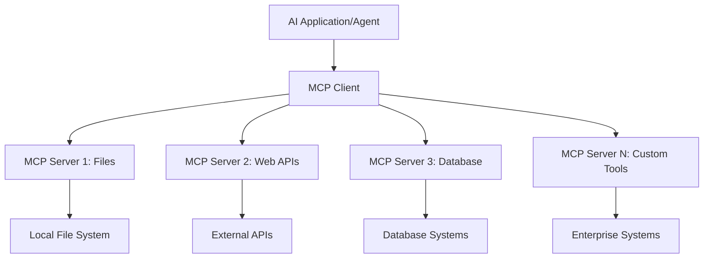

**🔧 Các thành phần chính:**

| Thành phần | Vai trò | Ví dụ |
|------------|---------|-------|
| **MCP Hosts** | Ứng dụng sử dụng dịch vụ MCP | Claude Desktop, VS Code, AI Toolkit |
| **MCP Clients** | Bộ xử lý giao thức (1:1 với server) | Tích hợp trong ứng dụng host |
| **MCP Servers** | Cung cấp các khả năng qua giao thức chuẩn | Playwright, Files, Azure, GitHub |
| **Transport Layer** | Phương thức giao tiếp | stdio, HTTP, WebSockets |

## 🏢 Hệ sinh thái máy chủ MCP của Microsoft

Microsoft dẫn đầu hệ sinh thái MCP với bộ máy chủ cấp doanh nghiệp toàn diện đáp ứng các nhu cầu kinh doanh thực tế.

### 🌟 Các máy chủ MCP nổi bật của Microsoft

#### 1. ☁️ Azure MCP Server  
**🔗 Repository**: [azure/azure-mcp](https://github.com/azure/azure-mcp)  
**🎯 Mục đích**: Quản lý tài nguyên Azure toàn diện với tích hợp AI

**✨ Tính năng chính:**
- Cung cấp hạ tầng theo khai báo
- Giám sát tài nguyên theo thời gian thực
- Đề xuất tối ưu chi phí
- Kiểm tra tuân thủ bảo mật

**🚀 Trường hợp sử dụng:**
- Hạ tầng dưới dạng mã với trợ giúp AI
- Tự động mở rộng tài nguyên
- Tối ưu chi phí đám mây
- Tự động hóa quy trình DevOps

#### 2. 📊 Microsoft Dataverse MCP  
**📚 Tài liệu**: [Microsoft Dataverse Integration](https://go.microsoft.com/fwlink/?linkid=2320176)  
**🎯 Mục đích**: Giao diện ngôn ngữ tự nhiên cho dữ liệu doanh nghiệp

**✨ Tính năng chính:**
- Truy vấn cơ sở dữ liệu bằng ngôn ngữ tự nhiên
- Hiểu ngữ cảnh kinh doanh
- Mẫu prompt tùy chỉnh
- Quản trị dữ liệu doanh nghiệp

**🚀 Trường hợp sử dụng:**
- Báo cáo thông minh doanh nghiệp
- Phân tích dữ liệu khách hàng
- Hiểu biết về pipeline bán hàng
- Truy vấn dữ liệu tuân thủ

#### 3. 🌐 Playwright MCP Server  
**🔗 Repository**: [microsoft/playwright-mcp](https://github.com/microsoft/playwright-mcp)  
**🎯 Mục đích**: Tự động hóa trình duyệt và tương tác web

**✨ Tính năng chính:**
- Tự động hóa đa trình duyệt (Chrome, Firefox, Safari)
- Phát hiện phần tử thông minh
- Chụp ảnh màn hình và tạo PDF
- Giám sát lưu lượng mạng

**🚀 Trường hợp sử dụng:**
- Quy trình kiểm thử tự động
- Thu thập dữ liệu web
- Giám sát UI/UX
- Tự động phân tích đối thủ

#### 4. 📁 Files MCP Server  
**🔗 Repository**: [microsoft/files-mcp-server](https://github.com/microsoft/files-mcp-server)  
**🎯 Mục đích**: Thao tác hệ thống tập tin thông minh

**✨ Tính năng chính:**
- Quản lý tập tin theo khai báo
- Đồng bộ nội dung
- Tích hợp kiểm soát phiên bản
- Trích xuất metadata

**🚀 Trường hợp sử dụng:**
- Quản lý tài liệu
- Tổ chức kho mã nguồn
- Quy trình xuất bản nội dung
- Xử lý tập tin trong pipeline dữ liệu

#### 5. 📝 MarkItDown MCP Server  
**🔗 Repository**: [microsoft/markitdown](https://github.com/microsoft/markitdown)  
**🎯 Mục đích**: Xử lý và thao tác Markdown nâng cao

**✨ Tính năng chính:**
- Phân tích Markdown phong phú
- Chuyển đổi định dạng (MD ↔ HTML ↔ PDF)
- Phân tích cấu trúc nội dung
- Xử lý mẫu

**🚀 Trường hợp sử dụng:**
- Quy trình tài liệu kỹ thuật
- Hệ thống quản lý nội dung
- Tạo báo cáo
- Tự động hóa cơ sở tri thức

#### 6. 📈 Clarity MCP Server  
**📦 Package**: [@microsoft/clarity-mcp-server](https://www.npmjs.com/package/@microsoft/clarity-mcp-server)  
**🎯 Mục đích**: Phân tích web và hiểu hành vi người dùng

**✨ Tính năng chính:**
- Phân tích dữ liệu heatmap
- Ghi lại phiên người dùng
- Chỉ số hiệu suất
- Phân tích kênh chuyển đổi

**🚀 Trường hợp sử dụng:**
- Tối ưu hóa website
- Nghiên cứu trải nghiệm người dùng
- Phân tích A/B testing
- Bảng điều khiển thông minh doanh nghiệp

### 🌍 Hệ sinh thái cộng đồng

Ngoài các máy chủ của Microsoft, hệ sinh thái MCP còn bao gồm:  
- **🐙 GitHub MCP**: Quản lý kho mã và phân tích code  
- **🗄️ Database MCPs**: Tích hợp PostgreSQL, MySQL, MongoDB  
- **☁️ Cloud Provider MCPs**: Công cụ AWS, GCP, Digital Ocean  
- **📧 Communication MCPs**: Tích hợp Slack, Teams, Email  

## 🛠️ Thực hành: Xây dựng agent tự động trình duyệt

**🎯 Mục tiêu dự án**: Tạo một agent tự động trình duyệt thông minh sử dụng máy chủ Playwright MCP có thể duyệt web, trích xuất thông tin và thực hiện các tương tác phức tạp trên web.

### 🚀 Giai đoạn 1: Thiết lập nền tảng agent

#### Bước 1: Khởi tạo agent của bạn
1. **Mở AI Toolkit Agent Builder**  
2. **Tạo Agent Mới** với cấu hình sau:  
   - **Tên**: `BrowserAgent`  
   - **Model**: Chọn GPT-4o  

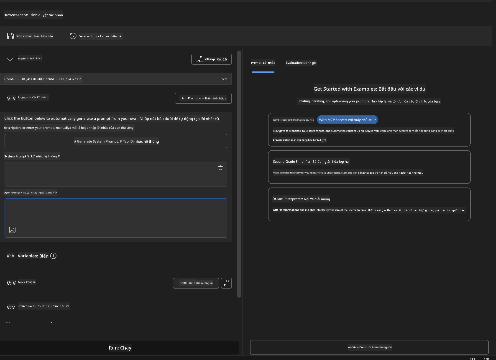

### 🔧 Giai đoạn 2: Quy trình tích hợp MCP

#### Bước 3: Thêm tích hợp máy chủ MCP
1. **Đi tới phần Tools** trong Agent Builder  
2. **Nhấn "Add Tool"** để mở menu tích hợp  
3. **Chọn "MCP Server"** trong các tùy chọn có sẵn  

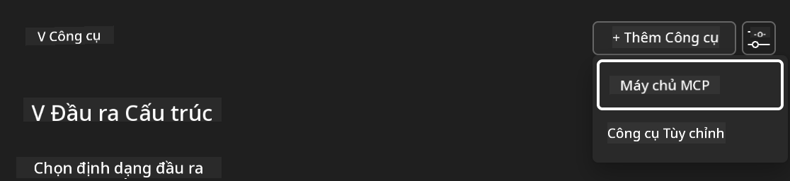

**🔍 Hiểu về các loại công cụ:**  
- **Built-in Tools**: Các chức năng AI Toolkit được cấu hình sẵn  
- **MCP Servers**: Tích hợp dịch vụ bên ngoài  
- **Custom APIs**: Các endpoint dịch vụ riêng của bạn  
- **Function Calling**: Truy cập trực tiếp các hàm của model  

#### Bước 4: Chọn máy chủ MCP
1. **Chọn tùy chọn "MCP Server"** để tiếp tục  
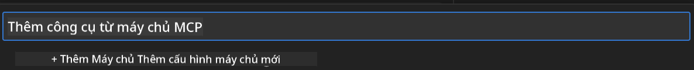

2. **Duyệt danh mục MCP** để khám phá các tích hợp có sẵn  
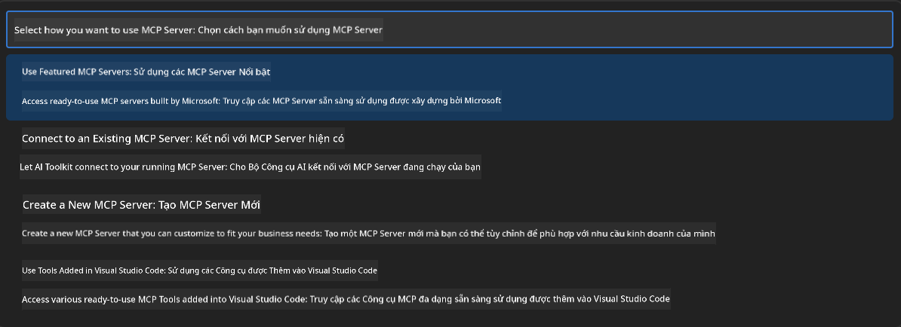

### 🎮 Giai đoạn 3: Cấu hình Playwright MCP

#### Bước 5: Chọn và cấu hình Playwright
1. **Nhấn "Use Featured MCP Servers"** để truy cập các máy chủ được Microsoft xác thực  
2. **Chọn "Playwright"** trong danh sách nổi bật  
3. **Chấp nhận MCP ID mặc định** hoặc tùy chỉnh theo môi trường của bạn  

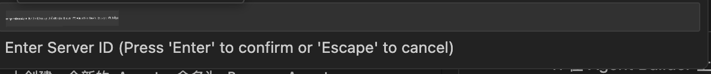

#### Bước 6: Kích hoạt các khả năng của Playwright
**🔑 Bước quan trọng**: Chọn **TẤT CẢ** các phương thức Playwright có sẵn để có chức năng tối đa  

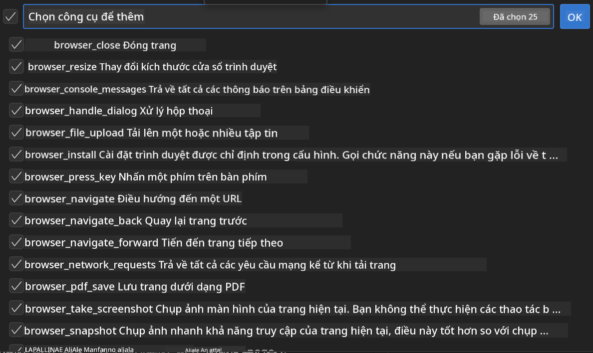

**🛠️ Các công cụ Playwright thiết yếu:**  
- **Điều hướng**: `goto`, `goBack`, `goForward`, `reload`  
- **Tương tác**: `click`, `fill`, `press`, `hover`, `drag`  
- **Trích xuất**: `textContent`, `innerHTML`, `getAttribute`  
- **Xác thực**: `isVisible`, `isEnabled`, `waitForSelector`  
- **Chụp ảnh**: `screenshot`, `pdf`, `video`  
- **Mạng**: `setExtraHTTPHeaders`, `route`, `waitForResponse`  

#### Bước 7: Xác nhận tích hợp thành công
**✅ Dấu hiệu thành công:**  
- Tất cả công cụ hiển thị trong giao diện Agent Builder  
- Không có thông báo lỗi trong bảng tích hợp  
- Trạng thái máy chủ Playwright hiển thị "Connected"  

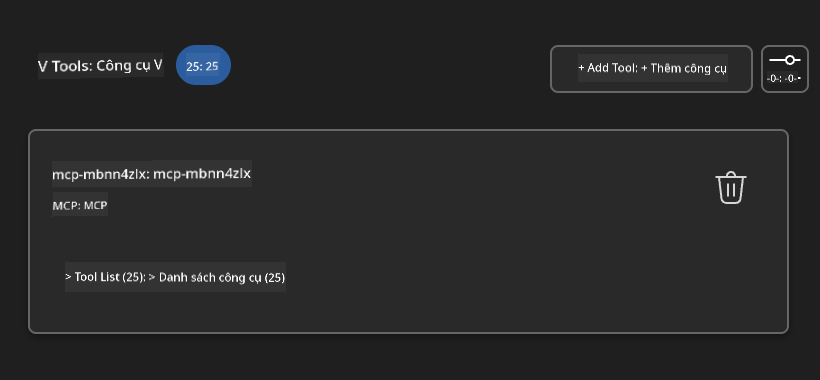

**🔧 Khắc phục sự cố phổ biến:**  
- **Kết nối thất bại**: Kiểm tra kết nối internet và cài đặt tường lửa  
- **Thiếu công cụ**: Đảm bảo đã chọn đầy đủ các khả năng trong quá trình thiết lập  
- **Lỗi quyền truy cập**: Xác nhận VS Code có quyền hệ thống cần thiết  

### 🎯 Giai đoạn 4: Kỹ thuật prompt nâng cao

#### Bước 8: Thiết kế prompt hệ thống thông minh
Tạo các prompt tinh vi tận dụng toàn bộ khả năng của Playwright:

```markdown
# Web Automation Expert System Prompt

## Core Identity
You are an advanced web automation specialist with deep expertise in browser automation, web scraping, and user experience analysis. You have access to Playwright tools for comprehensive browser control.

## Capabilities & Approach
### Navigation Strategy
- Always start with screenshots to understand page layout
- Use semantic selectors (text content, labels) when possible
- Implement wait strategies for dynamic content
- Handle single-page applications (SPAs) effectively

### Error Handling
- Retry failed operations with exponential backoff
- Provide clear error descriptions and solutions
- Suggest alternative approaches when primary methods fail
- Always capture diagnostic screenshots on errors

### Data Extraction
- Extract structured data in JSON format when possible
- Provide confidence scores for extracted information
- Validate data completeness and accuracy
- Handle pagination and infinite scroll scenarios

### Reporting
- Include step-by-step execution logs
- Provide before/after screenshots for verification
- Suggest optimizations and alternative approaches
- Document any limitations or edge cases encountered

## Ethical Guidelines
- Respect robots.txt and rate limiting
- Avoid overloading target servers
- Only extract publicly available information
- Follow website terms of service
```

#### Bước 9: Tạo prompt người dùng động
Thiết kế các prompt minh họa nhiều khả năng khác nhau:

**🌐 Ví dụ phân tích web:**  
```markdown
Navigate to github.com/kinfey and provide a comprehensive analysis including:
1. Repository structure and organization
2. Recent activity and contribution patterns  
3. Documentation quality assessment
4. Technology stack identification
5. Community engagement metrics
6. Notable projects and their purposes

Include screenshots at key steps and provide actionable insights.
```

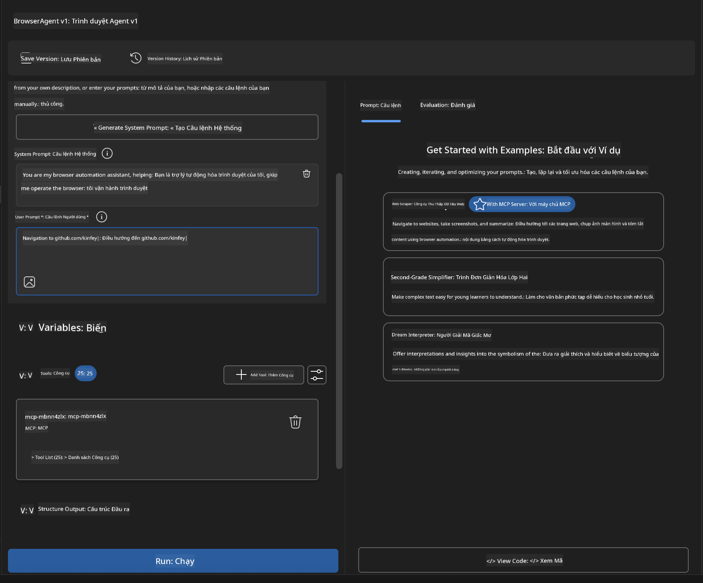

### 🚀 Giai đoạn 5: Thực thi và kiểm thử

#### Bước 10: Thực thi tự động hóa đầu tiên
1. **Nhấn "Run"** để bắt đầu chuỗi tự động hóa  
2. **Theo dõi thực thi thời gian thực**:  
   - Trình duyệt Chrome tự động mở  
   - Agent điều hướng đến trang web mục tiêu  
   - Chụp ảnh màn hình từng bước chính  
   - Kết quả phân tích được truyền trực tiếp  

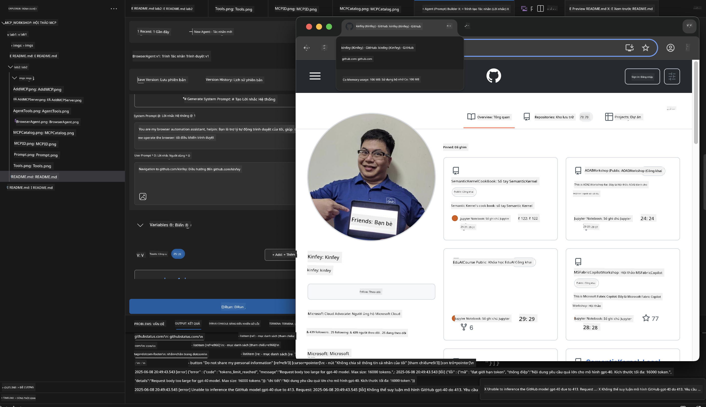

#### Bước 11: Phân tích kết quả và thông tin
Xem lại phân tích chi tiết trong giao diện Agent Builder:

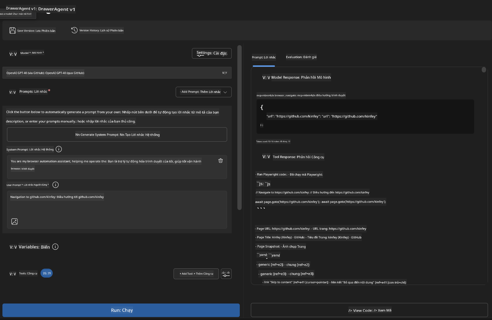

### 🌟 Giai đoạn 6: Khả năng nâng cao và triển khai

#### Bước 12: Xuất và triển khai sản xuất
Agent Builder hỗ trợ nhiều tùy chọn triển khai:

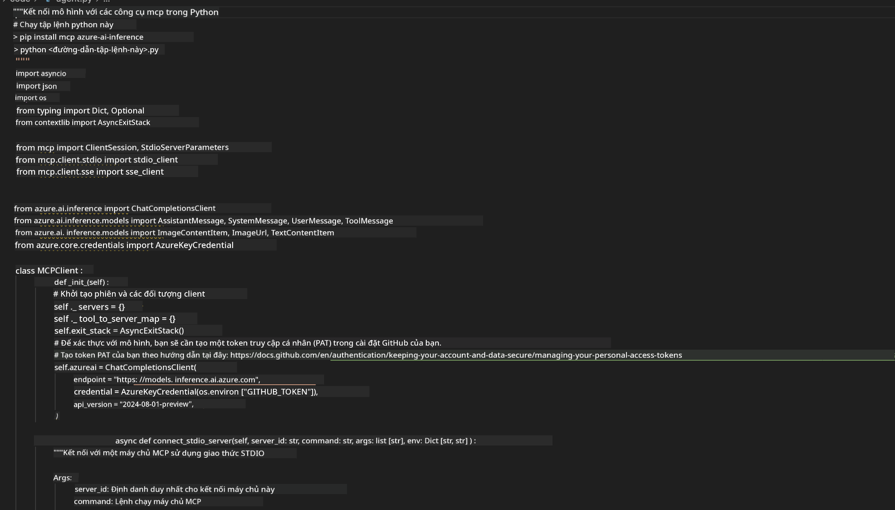

## 🎓 Tóm tắt Module 2 & Các bước tiếp theo

### 🏆 Thành tựu đạt được: Làm chủ tích hợp MCP

**✅ Kỹ năng đã thành thạo:**  
- [ ] Hiểu kiến trúc và lợi ích MCP  
- [ ] Điều hướng hệ sinh thái máy chủ MCP của Microsoft  
- [ ] Tích hợp Playwright MCP với AI Toolkit  
- [ ] Xây dựng agent tự động trình duyệt tinh vi  
- [ ] Kỹ thuật prompt nâng cao cho tự động hóa web  

### 📚 Tài nguyên bổ sung

- **🔗 MCP Specification**: [Tài liệu giao thức chính thức](https://modelcontextprotocol.io/)  
- **🛠️ Playwright API**: [Tham khảo phương thức đầy đủ](https://playwright.dev/docs/api/class-playwright)  
- **🏢 Microsoft MCP Servers**: [Hướng dẫn tích hợp doanh nghiệp](https://github.com/microsoft/mcp-servers)  
- **🌍 Community Examples**: [Thư viện máy chủ MCP](https://github.com/modelcontextprotocol/servers)  

**🎉 Chúc mừng!** Bạn đã thành công làm chủ tích hợp MCP và giờ có thể xây dựng các agent AI sẵn sàng sản xuất với khả năng sử dụng công cụ bên ngoài!

### 🔜 Tiếp tục sang Module tiếp theo

Sẵn sàng nâng cao kỹ năng MCP? Hãy tiếp tục với **[Module 3: Phát triển MCP nâng cao với AI Toolkit](../lab3/README.md)**, nơi bạn sẽ học cách:  
- Tạo máy chủ MCP tùy chỉnh của riêng bạn  
- Cấu hình và sử dụng SDK MCP Python mới nhất  
- Thiết lập MCP Inspector để gỡ lỗi  
- Làm chủ quy trình phát triển máy chủ MCP nâng cao
- Xây dựng một Máy chủ MCP Thời tiết từ đầu

**Tuyên bố từ chối trách nhiệm**:  
Tài liệu này đã được dịch bằng dịch vụ dịch thuật AI [Co-op Translator](https://github.com/Azure/co-op-translator). Mặc dù chúng tôi cố gắng đảm bảo độ chính xác, xin lưu ý rằng các bản dịch tự động có thể chứa lỗi hoặc không chính xác. Tài liệu gốc bằng ngôn ngữ gốc của nó nên được coi là nguồn chính xác và đáng tin cậy. Đối với các thông tin quan trọng, nên sử dụng dịch vụ dịch thuật chuyên nghiệp do con người thực hiện. Chúng tôi không chịu trách nhiệm về bất kỳ sự hiểu lầm hoặc giải thích sai nào phát sinh từ việc sử dụng bản dịch này.