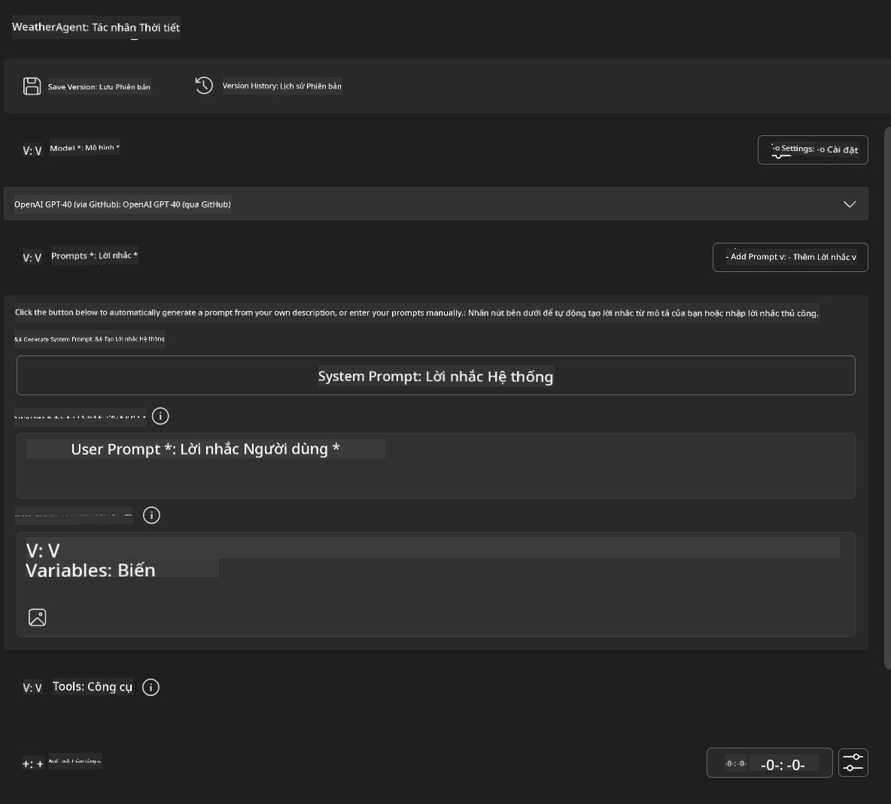
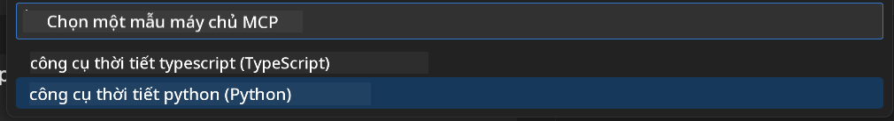
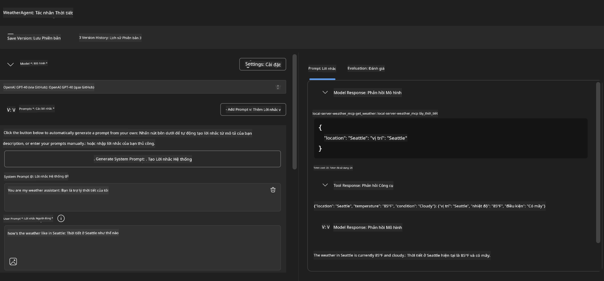
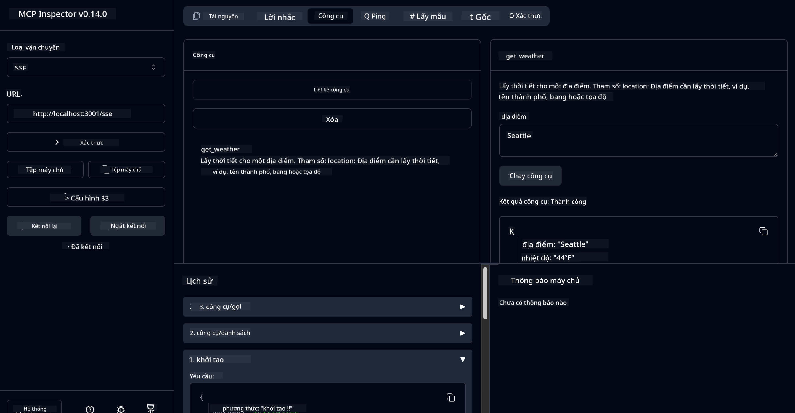

<!--
CO_OP_TRANSLATOR_METADATA:
{
  "original_hash": "dd8da3f75addcef453fe11f02a270217",
  "translation_date": "2025-07-14T08:16:37+00:00",
  "source_file": "10-StreamliningAIWorkflowsBuildingAnMCPServerWithAIToolkit/lab3/README.md",
  "language_code": "vi"
}
-->
# 🔧 Module 3: Phát Triển MCP Nâng Cao với AI Toolkit


## 🎯 Mục Tiêu Học Tập

Kết thúc bài lab này, bạn sẽ có khả năng:

- ✅ Tạo các server MCP tùy chỉnh bằng AI Toolkit
- ✅ Cấu hình và sử dụng MCP Python SDK mới nhất (v1.9.3)
- ✅ Thiết lập và sử dụng MCP Inspector để gỡ lỗi
- ✅ Gỡ lỗi server MCP trong cả môi trường Agent Builder và Inspector
- ✅ Hiểu quy trình phát triển server MCP nâng cao

## 📋 Yêu Cầu Tiên Quyết

- Hoàn thành Lab 2 (Kiến Thức Cơ Bản về MCP)
- VS Code đã cài đặt extension AI Toolkit
- Môi trường Python 3.10 trở lên
- Node.js và npm để thiết lập Inspector

## 🏗️ Những Gì Bạn Sẽ Xây Dựng

Trong bài lab này, bạn sẽ tạo một **Weather MCP Server** thể hiện:

- Triển khai server MCP tùy chỉnh
- Tích hợp với AI Toolkit Agent Builder
- Quy trình gỡ lỗi chuyên nghiệp
- Mẫu sử dụng MCP SDK hiện đại

---

## 🔧 Tổng Quan Các Thành Phần Chính

### 🐍 MCP Python SDK  
Model Context Protocol Python SDK cung cấp nền tảng để xây dựng các server MCP tùy chỉnh. Bạn sẽ sử dụng phiên bản 1.9.3 với khả năng gỡ lỗi nâng cao.

### 🔍 MCP Inspector  
Công cụ gỡ lỗi mạnh mẽ cung cấp:

- Giám sát server theo thời gian thực
- Hiển thị quá trình thực thi công cụ
- Kiểm tra các yêu cầu/phản hồi mạng
- Môi trường thử nghiệm tương tác

---

## 📖 Hướng Dẫn Thực Hiện Từng Bước

### Bước 1: Tạo WeatherAgent trong Agent Builder

1. **Khởi động Agent Builder** trong VS Code qua extension AI Toolkit  
2. **Tạo một agent mới** với cấu hình sau:  
   - Tên agent: `WeatherAgent`



### Bước 2: Khởi Tạo Dự Án MCP Server

1. **Đi tới Tools** → **Add Tool** trong Agent Builder  
2. **Chọn "MCP Server"** trong các tùy chọn có sẵn  
3. **Chọn "Create A new MCP Server"**  
4. **Chọn mẫu `python-weather`**  
5. **Đặt tên server:** `weather_mcp`



### Bước 3: Mở và Xem Xét Dự Án

1. **Mở dự án đã tạo** trong VS Code  
2. **Xem cấu trúc dự án:**  
   ```
   weather_mcp/
   ├── src/
   │   ├── __init__.py
   │   └── server.py
   ├── inspector/
   │   ├── package.json
   │   └── package-lock.json
   ├── .vscode/
   │   ├── launch.json
   │   └── tasks.json
   ├── pyproject.toml
   └── README.md
   ```

### Bước 4: Nâng Cấp Lên MCP SDK Mới Nhất

> **🔍 Tại sao cần nâng cấp?** Chúng ta muốn sử dụng MCP SDK mới nhất (v1.9.3) và dịch vụ Inspector (0.14.0) để có thêm tính năng và khả năng gỡ lỗi tốt hơn.

#### 4a. Cập nhật các phụ thuộc Python

**Chỉnh sửa `pyproject.toml`:** cập nhật [./code/weather_mcp/pyproject.toml](../../../../10-StreamliningAIWorkflowsBuildingAnMCPServerWithAIToolkit/lab3/code/weather_mcp/pyproject.toml)

#### 4b. Cập nhật cấu hình Inspector

**Chỉnh sửa `inspector/package.json`:** cập nhật [./code/weather_mcp/inspector/package.json](../../../../10-StreamliningAIWorkflowsBuildingAnMCPServerWithAIToolkit/lab3/code/weather_mcp/inspector/package.json)

#### 4c. Cập nhật các phụ thuộc Inspector

**Chỉnh sửa `inspector/package-lock.json`:** cập nhật [./code/weather_mcp/inspector/package-lock.json](../../../../10-StreamliningAIWorkflowsBuildingAnMCPServerWithAIToolkit/lab3/code/weather_mcp/inspector/package-lock.json)

> **📝 Lưu ý:** File này chứa định nghĩa phụ thuộc rất chi tiết. Dưới đây là cấu trúc chính - nội dung đầy đủ đảm bảo việc giải quyết phụ thuộc chính xác.

> **⚡ Toàn bộ package-lock:** File package-lock.json đầy đủ có khoảng 3000 dòng định nghĩa phụ thuộc. Phần trên chỉ thể hiện cấu trúc chính - hãy dùng file cung cấp để giải quyết phụ thuộc đầy đủ.

### Bước 5: Cấu Hình Gỡ Lỗi VS Code

*Lưu ý: Vui lòng sao chép file trong đường dẫn được chỉ định để thay thế file tương ứng trên máy*

#### 5a. Cập nhật cấu hình khởi chạy

**Chỉnh sửa `.vscode/launch.json`:**

```json
{
  "version": "0.2.0",
  "configurations": [
    {
      "name": "Attach to Local MCP",
      "type": "debugpy",
      "request": "attach",
      "connect": {
        "host": "localhost",
        "port": 5678
      },
      "presentation": {
        "hidden": true
      },
      "internalConsoleOptions": "neverOpen",
      "postDebugTask": "Terminate All Tasks"
    },
    {
      "name": "Launch Inspector (Edge)",
      "type": "msedge",
      "request": "launch",
      "url": "http://localhost:6274?timeout=60000&serverUrl=http://localhost:3001/sse#tools",
      "cascadeTerminateToConfigurations": [
        "Attach to Local MCP"
      ],
      "presentation": {
        "hidden": true
      },
      "internalConsoleOptions": "neverOpen"
    },
    {
      "name": "Launch Inspector (Chrome)",
      "type": "chrome",
      "request": "launch",
      "url": "http://localhost:6274?timeout=60000&serverUrl=http://localhost:3001/sse#tools",
      "cascadeTerminateToConfigurations": [
        "Attach to Local MCP"
      ],
      "presentation": {
        "hidden": true
      },
      "internalConsoleOptions": "neverOpen"
    }
  ],
  "compounds": [
    {
      "name": "Debug in Agent Builder",
      "configurations": [
        "Attach to Local MCP"
      ],
      "preLaunchTask": "Open Agent Builder",
    },
    {
      "name": "Debug in Inspector (Edge)",
      "configurations": [
        "Launch Inspector (Edge)",
        "Attach to Local MCP"
      ],
      "preLaunchTask": "Start MCP Inspector",
      "stopAll": true
    },
    {
      "name": "Debug in Inspector (Chrome)",
      "configurations": [
        "Launch Inspector (Chrome)",
        "Attach to Local MCP"
      ],
      "preLaunchTask": "Start MCP Inspector",
      "stopAll": true
    }
  ]
}
```

**Chỉnh sửa `.vscode/tasks.json`:**

```
{
  "version": "2.0.0",
  "tasks": [
    {
      "label": "Start MCP Server",
      "type": "shell",
      "command": "python -m debugpy --listen 127.0.0.1:5678 src/__init__.py sse",
      "isBackground": true,
      "options": {
        "cwd": "${workspaceFolder}",
        "env": {
          "PORT": "3001"
        }
      },
      "problemMatcher": {
        "pattern": [
          {
            "regexp": "^.*$",
            "file": 0,
            "location": 1,
            "message": 2
          }
        ],
        "background": {
          "activeOnStart": true,
          "beginsPattern": ".*",
          "endsPattern": "Application startup complete|running"
        }
      }
    },
    {
      "label": "Start MCP Inspector",
      "type": "shell",
      "command": "npm run dev:inspector",
      "isBackground": true,
      "options": {
        "cwd": "${workspaceFolder}/inspector",
        "env": {
          "CLIENT_PORT": "6274",
          "SERVER_PORT": "6277",
        }
      },
      "problemMatcher": {
        "pattern": [
          {
            "regexp": "^.*$",
            "file": 0,
            "location": 1,
            "message": 2
          }
        ],
        "background": {
          "activeOnStart": true,
          "beginsPattern": "Starting MCP inspector",
          "endsPattern": "Proxy server listening on port"
        }
      },
      "dependsOn": [
        "Start MCP Server"
      ]
    },
    {
      "label": "Open Agent Builder",
      "type": "shell",
      "command": "echo ${input:openAgentBuilder}",
      "presentation": {
        "reveal": "never"
      },
      "dependsOn": [
        "Start MCP Server"
      ],
    },
    {
      "label": "Terminate All Tasks",
      "command": "echo ${input:terminate}",
      "type": "shell",
      "problemMatcher": []
    }
  ],
  "inputs": [
    {
      "id": "openAgentBuilder",
      "type": "command",
      "command": "ai-mlstudio.agentBuilder",
      "args": {
        "initialMCPs": [ "local-server-weather_mcp" ],
        "triggeredFrom": "vsc-tasks"
      }
    },
    {
      "id": "terminate",
      "type": "command",
      "command": "workbench.action.tasks.terminate",
      "args": "terminateAll"
    }
  ]
}
```

---

## 🚀 Chạy và Kiểm Tra MCP Server

### Bước 6: Cài Đặt Phụ Thuộc

Sau khi thay đổi cấu hình, chạy các lệnh sau:

**Cài đặt phụ thuộc Python:**  
```bash
uv sync
```

**Cài đặt phụ thuộc Inspector:**  
```bash
cd inspector
npm install
```

### Bước 7: Gỡ Lỗi với Agent Builder

1. **Nhấn F5** hoặc chọn cấu hình **"Debug in Agent Builder"**  
2. **Chọn cấu hình compound** trong bảng debug  
3. **Chờ server khởi động** và Agent Builder mở ra  
4. **Thử nghiệm server weather MCP** với các truy vấn ngôn ngữ tự nhiên

Nhập prompt như sau

SYSTEM_PROMPT

```
You are my weather assistant
```

USER_PROMPT

```
How's the weather like in Seattle
```



### Bước 8: Gỡ Lỗi với MCP Inspector

1. **Sử dụng cấu hình "Debug in Inspector"** (trình duyệt Edge hoặc Chrome)  
2. **Mở giao diện Inspector** tại `http://localhost:6274`  
3. **Khám phá môi trường thử nghiệm tương tác:**  
   - Xem các công cụ có sẵn  
   - Thử thực thi công cụ  
   - Giám sát các yêu cầu mạng  
   - Gỡ lỗi phản hồi server



---

## 🎯 Kết Quả Học Tập Chính

Sau khi hoàn thành bài lab, bạn đã:

- [x] **Tạo server MCP tùy chỉnh** bằng mẫu AI Toolkit  
- [x] **Nâng cấp lên MCP SDK mới nhất** (v1.9.3) để có tính năng nâng cao  
- [x] **Cấu hình quy trình gỡ lỗi chuyên nghiệp** cho cả Agent Builder và Inspector  
- [x] **Thiết lập MCP Inspector** để thử nghiệm server tương tác  
- [x] **Thành thạo cấu hình gỡ lỗi VS Code** cho phát triển MCP

## 🔧 Các Tính Năng Nâng Cao Đã Khám Phá

| Tính Năng | Mô Tả | Trường Hợp Sử Dụng |
|-----------|--------|---------------------|
| **MCP Python SDK v1.9.3** | Phiên bản giao thức mới nhất | Phát triển server hiện đại |
| **MCP Inspector 0.14.0** | Công cụ gỡ lỗi tương tác | Thử nghiệm server theo thời gian thực |
| **Gỡ lỗi VS Code** | Môi trường phát triển tích hợp | Quy trình gỡ lỗi chuyên nghiệp |
| **Tích hợp Agent Builder** | Kết nối trực tiếp AI Toolkit | Thử nghiệm agent đầu-cuối |

## 📚 Tài Nguyên Tham Khảo Thêm

- [MCP Python SDK Documentation](https://modelcontextprotocol.io/docs/sdk/python)  
- [AI Toolkit Extension Guide](https://code.visualstudio.com/docs/ai/ai-toolkit)  
- [VS Code Debugging Documentation](https://code.visualstudio.com/docs/editor/debugging)  
- [Model Context Protocol Specification](https://modelcontextprotocol.io/docs/concepts/architecture)

---

**🎉 Chúc mừng!** Bạn đã hoàn thành thành công Lab 3 và giờ có thể tạo, gỡ lỗi và triển khai các server MCP tùy chỉnh theo quy trình phát triển chuyên nghiệp.

### 🔜 Tiếp Tục Sang Module Tiếp Theo

Sẵn sàng áp dụng kỹ năng MCP vào quy trình phát triển thực tế? Tiếp tục với **[Module 4: Phát Triển MCP Thực Tiễn - Server Clone GitHub Tùy Chỉnh](../lab4/README.md)**, nơi bạn sẽ:

- Xây dựng server MCP sẵn sàng sản xuất tự động hóa các thao tác kho GitHub  
- Triển khai chức năng clone kho GitHub qua MCP  
- Tích hợp server MCP tùy chỉnh với VS Code và GitHub Copilot Agent Mode  
- Thử nghiệm và triển khai server MCP tùy chỉnh trong môi trường sản xuất  
- Học cách tự động hóa quy trình làm việc thực tế cho nhà phát triển

**Tuyên bố từ chối trách nhiệm**:  
Tài liệu này đã được dịch bằng dịch vụ dịch thuật AI [Co-op Translator](https://github.com/Azure/co-op-translator). Mặc dù chúng tôi cố gắng đảm bảo độ chính xác, xin lưu ý rằng các bản dịch tự động có thể chứa lỗi hoặc không chính xác. Tài liệu gốc bằng ngôn ngữ gốc của nó nên được coi là nguồn chính xác và đáng tin cậy. Đối với các thông tin quan trọng, nên sử dụng dịch vụ dịch thuật chuyên nghiệp do con người thực hiện. Chúng tôi không chịu trách nhiệm về bất kỳ sự hiểu lầm hoặc giải thích sai nào phát sinh từ việc sử dụng bản dịch này.