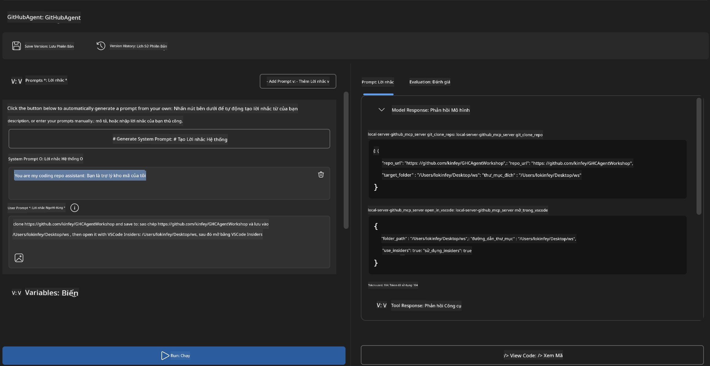
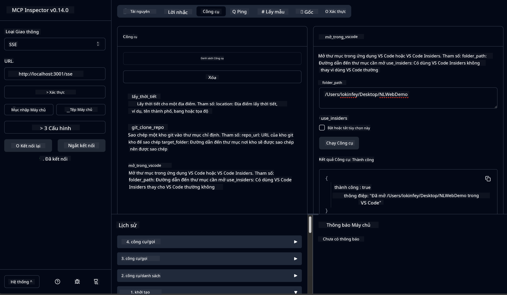

<!--
CO_OP_TRANSLATOR_METADATA:
{
  "original_hash": "f83bc722dc758efffd68667d6a1db470",
  "translation_date": "2025-06-10T06:53:36+00:00",
  "source_file": "10-StreamliningAIWorkflowsBuildingAnMCPServerWithAIToolkit/lab4/README.md",
  "language_code": "vi"
}
-->
# 🐙 Mô-đun 4: Phát triển MCP Thực tế - Máy chủ GitHub Clone Tùy chỉnh


> **⚡ Bắt đầu nhanh:** Xây dựng máy chủ MCP sẵn sàng sản xuất tự động hóa việc clone kho GitHub và tích hợp VS Code chỉ trong 30 phút!

## 🎯 Mục tiêu học tập

Sau khi hoàn thành bài lab này, bạn sẽ có thể:

- ✅ Tạo máy chủ MCP tùy chỉnh cho quy trình phát triển thực tế
- ✅ Triển khai chức năng clone kho GitHub qua MCP
- ✅ Tích hợp máy chủ MCP tùy chỉnh với VS Code và Agent Builder
- ✅ Sử dụng GitHub Copilot Agent Mode với các công cụ MCP tùy chỉnh
- ✅ Kiểm thử và triển khai máy chủ MCP tùy chỉnh trong môi trường sản xuất

## 📋 Yêu cầu trước

- Hoàn thành Labs 1-3 (cơ bản và phát triển nâng cao MCP)
- Đăng ký GitHub Copilot ([đăng ký miễn phí tại đây](https://github.com/github-copilot/signup))
- VS Code với AI Toolkit và các extension GitHub Copilot
- Git CLI đã được cài đặt và cấu hình

## 🏗️ Tổng quan dự án

### **Thử thách phát triển thực tế**
Là nhà phát triển, chúng ta thường xuyên dùng GitHub để clone kho và mở chúng trong VS Code hoặc VS Code Insiders. Quy trình thủ công này bao gồm:
1. Mở terminal hoặc command prompt
2. Điều hướng đến thư mục mong muốn
3. Chạy lệnh `git clone`
4. Mở VS Code trong thư mục đã clone

**Giải pháp MCP của chúng ta sẽ gom tất cả bước này thành một lệnh thông minh duy nhất!**

### **Bạn sẽ xây dựng gì**
Một **GitHub Clone MCP Server** (`git_mcp_server`) cung cấp:

| Tính năng | Mô tả | Lợi ích |
|---------|-------------|---------|
| 🔄 **Clone kho thông minh** | Clone kho GitHub kèm xác thực | Tự động kiểm tra lỗi |
| 📁 **Quản lý thư mục thông minh** | Kiểm tra và tạo thư mục an toàn | Ngăn chặn ghi đè dữ liệu |
| 🚀 **Tích hợp VS Code đa nền tảng** | Mở dự án trên VS Code/Insiders | Chuyển đổi quy trình làm việc mượt mà |
| 🛡️ **Xử lý lỗi vững chắc** | Xử lý lỗi mạng, quyền truy cập và đường dẫn | Đảm bảo độ tin cậy trong môi trường sản xuất |

---

## 📖 Triển khai từng bước

### Bước 1: Tạo GitHub Agent trong Agent Builder

1. **Khởi chạy Agent Builder** qua extension AI Toolkit
2. **Tạo agent mới** với cấu hình sau:
   ```
   Agent Name: GitHubAgent
   ```

3. **Khởi tạo máy chủ MCP tùy chỉnh:**
   - Vào **Tools** → **Add Tool** → **MCP Server**
   - Chọn **"Create A new MCP Server"**
   - Chọn **mẫu Python** để linh hoạt tối đa
   - **Tên máy chủ:** `git_mcp_server`

### Bước 2: Cấu hình GitHub Copilot Agent Mode

1. **Mở GitHub Copilot** trong VS Code (Ctrl/Cmd + Shift + P → "GitHub Copilot: Open")
2. **Chọn Agent Model** trong giao diện Copilot
3. **Chọn mô hình Claude 3.7** để tăng cường khả năng suy luận
4. **Bật tích hợp MCP** để truy cập công cụ

> **💡 Mẹo chuyên gia:** Claude 3.7 giúp hiểu sâu quy trình phát triển và các mẫu xử lý lỗi.

### Bước 3: Triển khai chức năng chính của máy chủ MCP

**Sử dụng prompt chi tiết dưới đây với GitHub Copilot Agent Mode:**

```
Create two MCP tools with the following comprehensive requirements:

🔧 TOOL A: clone_repository
Requirements:
- Clone any GitHub repository to a specified local folder
- Return the absolute path of the successfully cloned project
- Implement comprehensive validation:
  ✓ Check if target directory already exists (return error if exists)
  ✓ Validate GitHub URL format (https://github.com/user/repo)
  ✓ Verify git command availability (prompt installation if missing)
  ✓ Handle network connectivity issues
  ✓ Provide clear error messages for all failure scenarios

🚀 TOOL B: open_in_vscode
Requirements:
- Open specified folder in VS Code or VS Code Insiders
- Cross-platform compatibility (Windows/Linux/macOS)
- Use direct application launch (not terminal commands)
- Auto-detect available VS Code installations
- Handle cases where VS Code is not installed
- Provide user-friendly error messages

Additional Requirements:
- Follow MCP 1.9.3 best practices
- Include proper type hints and documentation
- Implement logging for debugging purposes
- Add input validation for all parameters
- Include comprehensive error handling
```

### Bước 4: Kiểm thử máy chủ MCP của bạn

#### 4a. Kiểm thử trong Agent Builder

1. **Khởi chạy cấu hình debug** trong Agent Builder
2. **Cấu hình agent với prompt hệ thống này:**

```
SYSTEM_PROMPT:
You are my intelligent coding repository assistant. You help developers efficiently clone GitHub repositories and set up their development environment. Always provide clear feedback about operations and handle errors gracefully.
```

3. **Kiểm thử với các kịch bản người dùng thực tế:**

```
USER_PROMPT EXAMPLES:

Scenario : Basic Clone and Open
"Clone {Your GitHub Repo link such as https://github.com/kinfey/GHCAgentWorkshop
 } and save to {The global path you specify}, then open it with VS Code Insiders"
```



**Kết quả mong đợi:**
- ✅ Clone thành công và xác nhận đường dẫn
- ✅ Tự động mở VS Code
- ✅ Thông báo lỗi rõ ràng với các tình huống không hợp lệ
- ✅ Xử lý chính xác các trường hợp đặc biệt

#### 4b. Kiểm thử trong MCP Inspector



---

**🎉 Chúc mừng!** Bạn đã tạo thành công máy chủ MCP thực tế, sẵn sàng sản xuất, giải quyết các thách thức trong quy trình phát triển thực tế. Máy chủ clone GitHub tùy chỉnh của bạn thể hiện sức mạnh của MCP trong tự động hóa và nâng cao hiệu suất làm việc của nhà phát triển.

### 🏆 Thành tích đạt được:
- ✅ **MCP Developer** - Tạo máy chủ MCP tùy chỉnh
- ✅ **Workflow Automator** - Tinh giản quy trình phát triển  
- ✅ **Integration Expert** - Kết nối nhiều công cụ phát triển
- ✅ **Production Ready** - Xây dựng giải pháp sẵn sàng triển khai

---

## 🎓 Hoàn thành Workshop: Hành trình với Model Context Protocol

**Bạn tham gia Workshop thân mến,**

Chúc mừng bạn đã hoàn thành đầy đủ 4 mô-đun của workshop Model Context Protocol! Bạn đã tiến xa từ việc hiểu các khái niệm cơ bản về AI Toolkit đến xây dựng các máy chủ MCP sẵn sàng sản xuất, giải quyết thách thức thực tế trong phát triển.

### 🚀 Tóm tắt hành trình học tập:

**[Mô-đun 1](../lab1/README.md)**: Bạn bắt đầu với các kiến thức cơ bản về AI Toolkit, thử nghiệm mô hình và tạo agent AI đầu tiên.

**[Mô-đun 2](../lab2/README.md)**: Bạn học về kiến trúc MCP, tích hợp Playwright MCP và xây dựng agent tự động trình duyệt đầu tiên.

**[Mô-đun 3](../lab3/README.md)**: Bạn tiến tới phát triển máy chủ MCP tùy chỉnh với Weather MCP server và làm chủ các công cụ debug.

**[Mô-đun 4](../lab4/README.md)**: Bạn áp dụng tất cả để tạo công cụ tự động hóa quy trình làm việc với kho GitHub thực tế.

### 🌟 Những gì bạn đã làm chủ:

- ✅ **Hệ sinh thái AI Toolkit**: Mô hình, agent và mẫu tích hợp
- ✅ **Kiến trúc MCP**: Thiết kế client-server, giao thức truyền tải và bảo mật
- ✅ **Công cụ phát triển**: Từ Playground đến Inspector và triển khai sản xuất
- ✅ **Phát triển tùy chỉnh**: Xây dựng, kiểm thử và triển khai máy chủ MCP của riêng bạn
- ✅ **Ứng dụng thực tế**: Giải quyết các thách thức quy trình làm việc với AI

### 🔮 Bước tiếp theo của bạn:

1. **Xây dựng máy chủ MCP riêng**: Áp dụng kỹ năng để tự động hóa quy trình độc đáo của bạn
2. **Tham gia cộng đồng MCP**: Chia sẻ sản phẩm và học hỏi từ người khác
3. **Khám phá tích hợp nâng cao**: Kết nối máy chủ MCP với hệ thống doanh nghiệp
4. **Đóng góp mã nguồn mở**: Giúp cải thiện công cụ và tài liệu MCP

Hãy nhớ rằng, workshop này chỉ là khởi đầu. Hệ sinh thái Model Context Protocol đang phát triển nhanh chóng, và bạn giờ đây đã được trang bị để dẫn đầu các công cụ phát triển AI.

**Cảm ơn bạn đã tham gia và nỗ lực học tập!**

Chúng tôi hy vọng workshop đã truyền cảm hứng để bạn thay đổi cách xây dựng và tương tác với công cụ AI trong hành trình phát triển của mình.

**Chúc bạn code vui vẻ!**

---

**Tuyên bố từ chối trách nhiệm**:  
Tài liệu này đã được dịch bằng dịch vụ dịch thuật AI [Co-op Translator](https://github.com/Azure/co-op-translator). Mặc dù chúng tôi cố gắng đảm bảo độ chính xác, xin lưu ý rằng các bản dịch tự động có thể chứa lỗi hoặc không chính xác. Tài liệu gốc bằng ngôn ngữ gốc nên được xem là nguồn tham khảo chính xác nhất. Đối với các thông tin quan trọng, nên sử dụng dịch vụ dịch thuật chuyên nghiệp do con người thực hiện. Chúng tôi không chịu trách nhiệm về bất kỳ sự hiểu lầm hoặc giải thích sai nào phát sinh từ việc sử dụng bản dịch này.