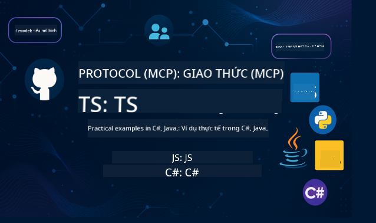

<!--
CO_OP_TRANSLATOR_METADATA:
{
  "original_hash": "e5fedda7171780db663f0845c39d8d72",
  "translation_date": "2025-05-19T17:02:11+00:00",
  "source_file": "README.md",
  "language_code": "vi"
}
-->
 

Làm theo các bước sau để bắt đầu sử dụng các tài nguyên này:
1. **Fork Repository**: Nhấn vào 
2. **Clone Repository**:   `git clone https://github.com/microsoft/mcp-for-beginners.git`
3. [**Tham gia Azure AI Foundry Discord để gặp gỡ các chuyên gia và đồng phát triển**](https://discord.com/invite/ByRwuEEgH4)

### 🌐 Hỗ trợ đa ngôn ngữ

#### Hỗ trợ qua GitHub Action (Tự động & Luôn cập nhật)
[Pháp](../fr/README.md) | [Tây Ban Nha](../es/README.md) | [Đức](../de/README.md) | [Nga](../ru/README.md) | [Ả Rập](../ar/README.md) | [Ba Tư (Farsi)](../fa/README.md) | [Urdu](../ur/README.md) | [Trung Quốc (Giản thể)](../zh/README.md) | [Trung Quốc (Phồn thể, Macau)](../mo/README.md) | [Trung Quốc (Phồn thể, Hồng Kông)](../hk/README.md) | [Trung Quốc (Phồn thể, Đài Loan)](../tw/README.md) | [Nhật Bản](../ja/README.md) | [Hàn Quốc](../ko/README.md) | [Ấn Độ](../hi/README.md) | [Bengali](../bn/README.md) | [Marathi](../mr/README.md) | [Nepali](../ne/README.md) | [Punjabi (Gurmukhi)](../pa/README.md) | [Bồ Đào Nha (Bồ Đào Nha)](../pt/README.md) | [Bồ Đào Nha (Brazil)](../br/README.md) | [Ý](../it/README.md) | [Ba Lan](../pl/README.md) | [Thổ Nhĩ Kỳ](../tr/README.md) | [Hy Lạp](../el/README.md) | [Thái](../th/README.md) | [Thụy Điển](../sv/README.md) | [Đan Mạch](../da/README.md) | [Na Uy](../no/README.md) | [Phần Lan](../fi/README.md) | [Hà Lan](../nl/README.md) | [Do Thái](../he/README.md) | [Tiếng Việt](./README.md) | [Indonesia](../id/README.md) | [Mã Lai](../ms/README.md) | [Tagalog (Philippines)](../tl/README.md) | [Swahili](../sw/README.md) | [Hungary](../hu/README.md) | [Séc](../cs/README.md) | [Slovakia](../sk/README.md) | [Romania](../ro/README.md) | [Bulgaria](../bg/README.md) | [Serbia (Cyrillic)](../sr/README.md) | [Croatia](../hr/README.md) | [Slovenia](../sl/README.md)
# 🚀 Hướng Dẫn Toàn Diện về Chương Trình Model Context Protocol (MCP) cho Người Mới Bắt Đầu

## **Học MCP với Ví Dụ Mã Thực Hành bằng C#, Java, JavaScript, Python và TypeScript**

## 🧠 Tổng Quan về Chương Trình Model Context Protocol

**Model Context Protocol (MCP)** là một khuôn khổ tiên tiến được thiết kế để chuẩn hóa các tương tác giữa các mô hình AI và ứng dụng khách. Chương trình mã nguồn mở này cung cấp một lộ trình học tập có cấu trúc, kèm theo các ví dụ mã thực tế và các trường hợp sử dụng thực tiễn, trải dài trên các ngôn ngữ lập trình phổ biến như C#, Java, JavaScript, TypeScript và Python.

Dù bạn là nhà phát triển AI, kiến trúc sư hệ thống hay kỹ sư phần mềm, hướng dẫn này sẽ là tài nguyên toàn diện giúp bạn nắm vững các kiến thức cơ bản và chiến lược triển khai MCP.

## 🔗 Tài Nguyên Chính Thức của MCP

- 📘 [MCP Documentation](https://modelcontextprotocol.io/) – Hướng dẫn chi tiết và tài liệu người dùng  
- 📜 [MCP Specification](https://spec.modelcontextprotocol.io/) – Kiến trúc giao thức và tài liệu kỹ thuật  
- 🧑‍💻 [MCP GitHub Repository](https://github.com/modelcontextprotocol) – SDK mã nguồn mở, công cụ và ví dụ mã  

## 🧭 Cấu Trúc Toàn Bộ Chương Trình MCP

| Tiêu đề | Mô tả | Liên kết |
|--|--|--|
| **00 - Giới thiệu về MCP** | Tổng quan về Model Context Protocol và tầm quan trọng của nó trong các pipeline AI, bao gồm MCP là gì, tại sao chuẩn hóa lại quan trọng và các trường hợp sử dụng cùng lợi ích thực tế | [Introduction](./00-Introduction/README.md) |
| **01 - Giải thích các khái niệm cốt lõi** | Khám phá sâu các khái niệm cốt lõi của MCP, bao gồm kiến trúc client-server, các thành phần chính của giao thức và các mẫu tin nhắn | [Core Concepts](./01-CoreConcepts/README.md) |
| **02 - Bảo mật trong MCP** | Nhận diện các mối đe dọa bảo mật trong hệ thống dựa trên MCP, kỹ thuật và các phương pháp hay nhất để bảo vệ triển khai | [Security](/02-Security/readme.md) |
| **03 - Bắt đầu với MCP** | Thiết lập môi trường và cấu hình, tạo các server và client MCP cơ bản, tích hợp MCP với ứng dụng hiện có | [Getting Started](./03-GettingStarted/README.md) |
| **3.1 - Server đầu tiên** | Thiết lập một server cơ bản sử dụng giao thức MCP, hiểu cách tương tác giữa server và client, và kiểm tra server | [First Server](./03-GettingStarted/01-first-server/README.md) |
| **3.2 - Client đầu tiên**  | Thiết lập một client cơ bản sử dụng giao thức MCP, hiểu cách tương tác giữa client và server, và kiểm tra client | [First Client](./03-GettingStarted/02-client/README.md) |
| **3.3 - Client với LLM**  | Thiết lập client sử dụng giao thức MCP với Mô hình Ngôn ngữ Lớn (LLM) | [Client with LLM](./03-GettingStarted/03-llm-client/README.md) |
| **3.4 - Sử dụng Visual Studio Code để kết nối server** | Thiết lập Visual Studio Code để sử dụng các server theo giao thức MCP | [Consuming a server with Visual Studio Code](./03-GettingStarted/04-vscode/README.md) |
| **3.5 - Tạo server sử dụng SSE** | SSE giúp chúng ta công khai server ra Internet. Phần này sẽ hướng dẫn bạn tạo server dùng SSE | [Creating a server using SSE](./03-GettingStarted/05-sse-server/README.md) |
| **3.6 - Sử dụng AI Toolkit** | AI toolkit là công cụ tuyệt vời giúp bạn quản lý quy trình AI và MCP của mình. | [Use AI Toolkit](./03-GettingStarted/06-aitk/README.md) |
| **3.7 - Kiểm thử server của bạn** | Kiểm thử là phần quan trọng trong quá trình phát triển. Phần này sẽ giúp bạn sử dụng nhiều công cụ khác nhau để kiểm thử. | [Testing your server](./03-GettingStarted/07-testing/README.md) |
| **3.8 - Triển khai server của bạn** | Làm thế nào để chuyển từ phát triển cục bộ sang môi trường sản xuất? Phần này sẽ giúp bạn phát triển và triển khai server. | [Deploy your server](./03-GettingStarted/08-deployment/README.md) |
| **04 - Triển khai thực tế** | Sử dụng SDK trên nhiều ngôn ngữ, gỡ lỗi, kiểm thử và xác nhận, tạo các mẫu prompt và quy trình làm việc có thể tái sử dụng | [Practical Implementation](./04-PracticalImplementation/README.md) |
| **05 - Các chủ đề nâng cao trong MCP** | Quy trình AI đa phương thức và khả năng mở rộng, chiến lược mở rộng an toàn, MCP trong hệ sinh thái doanh nghiệp | [Advanced Topics](./05-AdvancedTopics/README.md) |
| **06 - Đóng góp từ cộng đồng** | Cách đóng góp mã và tài liệu, hợp tác qua GitHub, cải tiến và phản hồi từ cộng đồng | [Community Contributions](./06-CommunityContributions/README.md) |
| **07 - Những bài học từ việc áp dụng sớm** | Triển khai thực tế và những gì đã thành công, xây dựng và triển khai giải pháp dựa trên MCP, xu hướng và lộ trình tương lai | [Insights](./07-LessonsFromEarlyAdoption/README.md) |
| **08 - Thực hành tốt nhất cho MCP** | Tối ưu hiệu suất, thiết kế hệ thống MCP chịu lỗi, chiến lược kiểm thử và tăng cường độ bền bỉ | [Best Practices](./08-BestPractices/README.md) |
| **09 - Nghiên cứu tình huống MCP** | Phân tích sâu kiến trúc giải pháp MCP, bản thiết kế triển khai và mẹo tích hợp, sơ đồ chú thích và hướng dẫn dự án | [Case Studies](./09-CaseStudy/README.md) |

## Dự Án Mẫu

### 🧮 Dự Án Mẫu Máy Tính MCP:

  
<strong>Khám phá các bản triển khai mã theo ngôn ngữ</strong>

  - [C# MCP Server Example](./03-GettingStarted/samples/csharp/README.md)
  - [Java MCP Calculator](./03-GettingStarted/samples/java/calculator/README.md)
  - [JavaScript MCP Demo](./03-GettingStarted/samples/javascript/README.md)
  - [Python MCP Server](../../03-GettingStarted/samples/python/mcp_calculator_server.py)
  - [TypeScript MCP Example](./03-GettingStarted/samples/typescript/README.md)

### 💡 Dự Án Máy Tính Nâng Cao MCP:

  
<strong>Khám phá các mẫu nâng cao</strong>

  - [Advanced C# Sample](./04-PracticalImplementation/samples/csharp/README.md)
  - [Java Container App Example](./04-PracticalImplementation/samples/java/containerapp/README.md)
  - [JavaScript Advanced Sample](./04-PracticalImplementation/samples/javascript/README.md)
  - [Python Complex Implementation](../../04-PracticalImplementation/samples/python/mcp_sample.py)
- [TypeScript Container Sample](./04-PracticalImplementation/samples/typescript/README.md)

## 🎯 Các Yêu Cầu Cơ Bản Để Học MCP

Để tận dụng tối đa chương trình học này, bạn nên có:

- Kiến thức cơ bản về C#, Java hoặc Python
- Hiểu biết về mô hình client-server và API
- (Tùy chọn) Quen thuộc với các khái niệm về machine learning

## 🛠️ Cách Sử Dụng Chương Trình Học Này Hiệu Quả

Mỗi bài học trong hướng dẫn này bao gồm:

1. Giải thích rõ ràng về các khái niệm MCP  
2. Ví dụ mã nguồn trực tiếp bằng nhiều ngôn ngữ  
3. Bài tập để xây dựng các ứng dụng MCP thực tế  
4. Tài nguyên bổ sung dành cho người học nâng cao  

## 📜 Thông Tin Giấy Phép

Nội dung này được cấp phép theo **MIT License**. Để xem các điều khoản, hãy tham khảo [LICENSE](../../LICENSE).

## 🤝 Hướng Dẫn Đóng Góp

Dự án này hoan nghênh các đóng góp và đề xuất. Hầu hết các đóng góp yêu cầu bạn đồng ý với một
Thỏa Thuận Cấp Phép Đóng Góp (CLA) xác nhận rằng bạn có quyền, và thực sự đồng ý, cấp cho chúng tôi
quyền sử dụng đóng góp của bạn. Chi tiết xem tại <https://cla.opensource.microsoft.com>.

Khi bạn gửi một pull request, bot CLA sẽ tự động xác định xem bạn có cần cung cấp
CLA hay không và đánh dấu PR phù hợp (ví dụ: kiểm tra trạng thái, bình luận). Chỉ cần làm theo hướng dẫn
do bot cung cấp. Bạn chỉ cần làm điều này một lần cho tất cả các repo sử dụng CLA của chúng tôi.

Dự án này đã áp dụng [Microsoft Open Source Code of Conduct](https://opensource.microsoft.com/codeofconduct/).
Để biết thêm thông tin, xem [Code of Conduct FAQ](https://opensource.microsoft.com/codeofconduct/faq/) hoặc
liên hệ [opencode@microsoft.com](mailto:opencode@microsoft.com) nếu có câu hỏi hoặc góp ý thêm.

## 🎒 Các Khóa Học Khác
Nhóm của chúng tôi còn sản xuất các khóa học khác! Hãy xem:

- [AI Agents For Beginners](https://github.com/microsoft/ai-agents-beginners?WT.mc_id=academic-105485-koreyst)
- [Generative AI for Beginners using .NET](https://github.com/microsoft/Generative-AI-for-beginners-dotnet?WT.mc_id=academic-105485-koreyst)
- [Generative AI for Beginners](https://github.com/microsoft/generative-ai-for-beginners?WT.mc_id=academic-105485-koreyst)
- [ML for Beginners](https://aka.ms/ml-beginners?WT.mc_id=academic-105485-koreyst)
- [Data Science for Beginners](https://aka.ms/datascience-beginners?WT.mc_id=academic-105485-koreyst)
- [AI for Beginners](https://aka.ms/ai-beginners?WT.mc_id=academic-105485-koreyst)
- [Cybersecurity for Beginners](https://github.com/microsoft/Security-101??WT.mc_id=academic-96948-sayoung)
- [Web Dev for Beginners](https://aka.ms/webdev-beginners?WT.mc_id=academic-105485-koreyst)
- [IoT for Beginners](https://aka.ms/iot-beginners?WT.mc_id=academic-105485-koreyst)
- [XR Development for Beginners](https://github.com/microsoft/xr-development-for-beginners?WT.mc_id=academic-105485-koreyst)
- [Mastering GitHub Copilot for AI Paired Programming](https://aka.ms/GitHubCopilotAI?WT.mc_id=academic-105485-koreyst)
- [Mastering GitHub Copilot for C#/.NET Developers](https://github.com/microsoft/mastering-github-copilot-for-dotnet-csharp-developers?WT.mc_id=academic-105485-koreyst)
- [Choose Your Own Copilot Adventure](https://github.com/microsoft/CopilotAdventures?WT.mc_id=academic-105485-koreyst)

## ™️ Thông Báo Nhãn Hiệu

Dự án này có thể chứa các nhãn hiệu hoặc logo của các dự án, sản phẩm, hoặc dịch vụ. Việc sử dụng nhãn hiệu hoặc logo Microsoft
phải tuân theo và không được vi phạm
[Microsoft's Trademark & Brand Guidelines](https://www.microsoft.com/legal/intellectualproperty/trademarks/usage/general).
Việc sử dụng nhãn hiệu hoặc logo Microsoft trong các phiên bản sửa đổi của dự án này không được gây nhầm lẫn hoặc ngụ ý Microsoft tài trợ.
Bất kỳ việc sử dụng nhãn hiệu hoặc logo của bên thứ ba đều phải tuân theo chính sách của các bên thứ ba đó.

**Tuyên bố từ chối trách nhiệm**:  
Tài liệu này đã được dịch bằng dịch vụ dịch thuật AI [Co-op Translator](https://github.com/Azure/co-op-translator). Mặc dù chúng tôi cố gắng đảm bảo độ chính xác, xin lưu ý rằng các bản dịch tự động có thể chứa lỗi hoặc không chính xác. Tài liệu gốc bằng ngôn ngữ nguyên bản nên được coi là nguồn chính xác và đáng tin cậy. Đối với các thông tin quan trọng, nên sử dụng dịch vụ dịch thuật chuyên nghiệp do con người thực hiện. Chúng tôi không chịu trách nhiệm về bất kỳ sự hiểu lầm hoặc diễn giải sai nào phát sinh từ việc sử dụng bản dịch này.