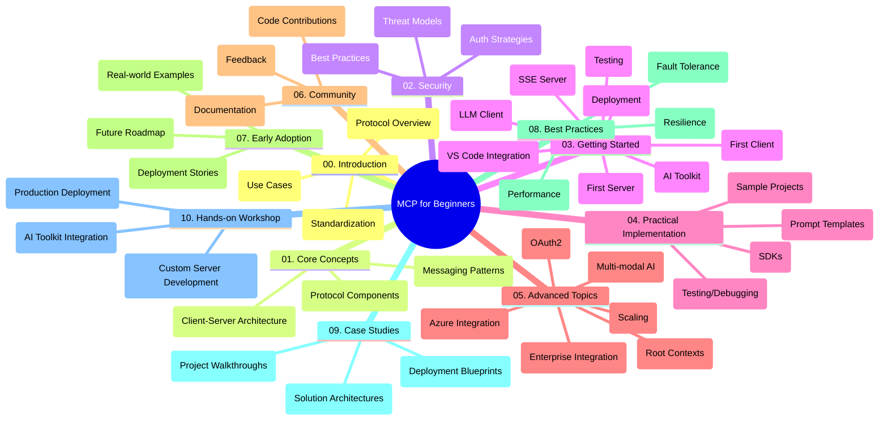

<!--
CO_OP_TRANSLATOR_METADATA:
{
  "original_hash": "a607d4febc94caee9a12b77795f7fc9a",
  "translation_date": "2025-06-11T16:47:27+00:00",
  "source_file": "study_guide.md",
  "language_code": "vi"
}
-->
# Model Context Protocol (MCP) cho Người Mới Bắt Đầu - Hướng Dẫn Học Tập

Hướng dẫn này cung cấp cái nhìn tổng quan về cấu trúc và nội dung của kho lưu trữ cho chương trình "Model Context Protocol (MCP) cho Người Mới Bắt Đầu". Hãy sử dụng hướng dẫn này để điều hướng kho lưu trữ một cách hiệu quả và tận dụng tối đa các tài nguyên có sẵn.

## Tổng Quan Kho Lưu Trữ

Model Context Protocol (MCP) là một khung chuẩn hóa cho các tương tác giữa các mô hình AI và ứng dụng khách. Kho lưu trữ này cung cấp một chương trình học toàn diện với các ví dụ mã thực hành bằng C#, Java, JavaScript, Python và TypeScript, dành cho các nhà phát triển AI, kiến trúc sư hệ thống và kỹ sư phần mềm.

## Bản Đồ Chương Trình Học Trực Quan

## Cấu Trúc Kho Lưu Trữ

Kho lưu trữ được tổ chức thành mười phần chính, mỗi phần tập trung vào các khía cạnh khác nhau của MCP:

1. **Introduction (00-Introduction/)**
   - Tổng quan về Model Context Protocol
   - Tại sao việc chuẩn hóa lại quan trọng trong các pipeline AI
   - Các trường hợp sử dụng thực tế và lợi ích

2. **Core Concepts (01-CoreConcepts/)**
   - Kiến trúc client-server
   - Các thành phần chính của protocol
   - Các mẫu tin nhắn trong MCP

3. **Security (02-Security/)**
   - Các mối đe dọa bảo mật trong hệ thống dựa trên MCP
   - Các thực hành tốt nhất để bảo vệ triển khai
   - Chiến lược xác thực và phân quyền

4. **Getting Started (03-GettingStarted/)**
   - Thiết lập và cấu hình môi trường
   - Tạo các server và client MCP cơ bản
   - Tích hợp với các ứng dụng hiện có
   - Các phần con cho server đầu tiên, client đầu tiên, client LLM, tích hợp VS Code, server SSE, AI Toolkit, kiểm thử và triển khai

5. **Practical Implementation (04-PracticalImplementation/)**
   - Sử dụng SDK trên nhiều ngôn ngữ lập trình khác nhau
   - Kỹ thuật gỡ lỗi, kiểm thử và xác thực
   - Tạo các mẫu prompt và workflow có thể tái sử dụng
   - Các dự án mẫu với ví dụ triển khai

6. **Advanced Topics (05-AdvancedTopics/)**
   - Các workflow AI đa phương thức và khả năng mở rộng
   - Chiến lược mở rộng an toàn
   - MCP trong hệ sinh thái doanh nghiệp
   - Các chủ đề chuyên sâu bao gồm tích hợp Azure, đa phương thức, OAuth2, root contexts, routing, sampling, scaling, bảo mật, tích hợp tìm kiếm web và streaming.

7. **Community Contributions (06-CommunityContributions/)**
   - Cách đóng góp mã và tài liệu
   - Hợp tác qua GitHub
   - Các cải tiến và phản hồi do cộng đồng thúc đẩy

8. **Lessons from Early Adoption (07-LessonsfromEarlyAdoption/)**
   - Các triển khai thực tế và câu chuyện thành công
   - Xây dựng và triển khai các giải pháp dựa trên MCP
   - Xu hướng và lộ trình tương lai

9. **Best Practices (08-BestPractices/)**
   - Tối ưu hiệu suất và điều chỉnh
   - Thiết kế hệ thống MCP chịu lỗi
   - Chiến lược kiểm thử và tăng cường độ bền

10. **Case Studies (09-CaseStudy/)**
    - Phân tích sâu về kiến trúc giải pháp MCP
    - Bản thiết kế triển khai và mẹo tích hợp
    - Sơ đồ chú thích và hướng dẫn dự án

11. **Hands-on Workshop (10-StreamliningAIWorkflowsBuildingAnMCPServerWithAIToolkit/)**
    - Workshop thực hành toàn diện kết hợp MCP với AI Toolkit của Microsoft dành cho VS Code
    - Xây dựng ứng dụng thông minh kết nối mô hình AI với các công cụ thực tế
    - Các mô-đun thực tiễn bao gồm các kiến thức cơ bản, phát triển server tùy chỉnh và chiến lược triển khai sản xuất

## Các Dự Án Mẫu

Kho lưu trữ bao gồm nhiều dự án mẫu minh họa việc triển khai MCP trên các ngôn ngữ lập trình khác nhau:

### Mẫu Máy Tính MCP Cơ Bản
- Ví dụ Server MCP C#
- Máy tính MCP Java
- Demo MCP JavaScript
- Server MCP Python
- Ví dụ MCP TypeScript

### Dự Án Máy Tính MCP Nâng Cao
- Mẫu C# Nâng Cao
- Ví dụ Ứng Dụng Container Java
- Mẫu Nâng Cao JavaScript
- Triển khai Phức Tạp Python
- Mẫu Container TypeScript

## Tài Nguyên Bổ Sung

Kho lưu trữ bao gồm các tài nguyên hỗ trợ:

- **Thư mục Images**: Chứa các sơ đồ và hình minh họa sử dụng xuyên suốt chương trình học
- **Translations**: Hỗ trợ đa ngôn ngữ với bản dịch tài liệu tự động
- **Tài nguyên MCP Chính Thức**:
  - [MCP Documentation](https://modelcontextprotocol.io/)
  - [MCP Specification](https://spec.modelcontextprotocol.io/)
  - [MCP GitHub Repository](https://github.com/modelcontextprotocol)

## Cách Sử Dụng Kho Lưu Trữ Này

1. **Học Theo Trình Tự**: Theo dõi các chương từ 00 đến 10 để có trải nghiệm học tập có cấu trúc.
2. **Tập Trung Theo Ngôn Ngữ**: Nếu bạn quan tâm đến một ngôn ngữ lập trình cụ thể, hãy khám phá thư mục mẫu cho các triển khai bằng ngôn ngữ bạn chọn.
3. **Triển Khai Thực Tế**: Bắt đầu với phần "Getting Started" để thiết lập môi trường và tạo server, client MCP đầu tiên.
4. **Khám Phá Nâng Cao**: Khi đã nắm vững cơ bản, hãy tìm hiểu các chủ đề nâng cao để mở rộng kiến thức.
5. **Tham Gia Cộng Đồng**: Tham gia [Azure AI Foundry Discord](https://discord.com/invite/ByRwuEEgH4) để kết nối với các chuyên gia và nhà phát triển khác.

## Đóng Góp

Kho lưu trữ này hoan nghênh các đóng góp từ cộng đồng. Xem phần Community Contributions để biết hướng dẫn cách đóng góp.

---

*Hướng dẫn học tập này được tạo vào ngày 11 tháng 6 năm 2025, cung cấp cái nhìn tổng quan về kho lưu trữ tính đến thời điểm đó. Nội dung kho lưu trữ có thể đã được cập nhật kể từ đó.*

**Tuyên bố từ chối trách nhiệm**:  
Tài liệu này đã được dịch bằng dịch vụ dịch thuật AI [Co-op Translator](https://github.com/Azure/co-op-translator). Mặc dù chúng tôi cố gắng đảm bảo độ chính xác, xin lưu ý rằng bản dịch tự động có thể chứa lỗi hoặc sai sót. Tài liệu gốc bằng ngôn ngữ bản địa nên được coi là nguồn chính xác và đáng tin cậy. Đối với thông tin quan trọng, nên sử dụng dịch vụ dịch thuật chuyên nghiệp do con người thực hiện. Chúng tôi không chịu trách nhiệm về bất kỳ sự hiểu lầm hay giải thích sai nào phát sinh từ việc sử dụng bản dịch này.