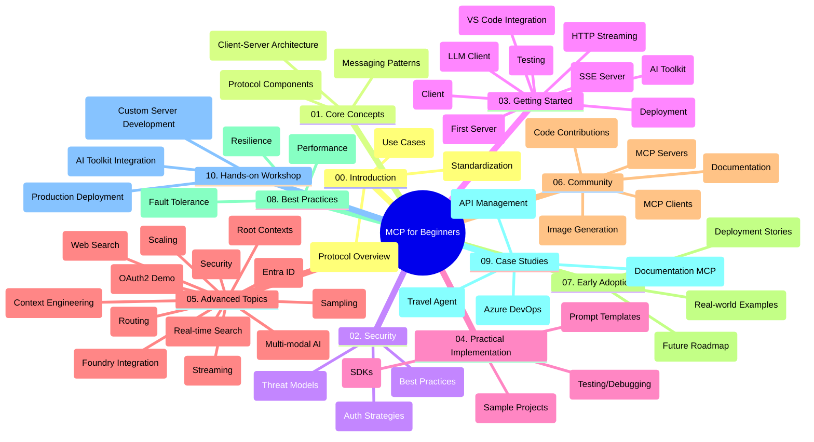

<!--
CO_OP_TRANSLATOR_METADATA:
{
  "original_hash": "5f321ea583cf087a94e47ee74c62b504",
  "translation_date": "2025-07-17T07:32:16+00:00",
  "source_file": "study_guide.md",
  "language_code": "vi"
}
-->
# Model Context Protocol (MCP) cho Người Mới Bắt Đầu - Hướng Dẫn Học Tập

Hướng dẫn học tập này cung cấp tổng quan về cấu trúc và nội dung của kho lưu trữ cho chương trình "Model Context Protocol (MCP) cho Người Mới Bắt Đầu". Sử dụng hướng dẫn này để điều hướng kho lưu trữ một cách hiệu quả và tận dụng tối đa các tài nguyên có sẵn.

## Tổng Quan Kho Lưu Trữ

Model Context Protocol (MCP) là một khuôn khổ chuẩn hóa cho các tương tác giữa các mô hình AI và ứng dụng khách. Ban đầu được tạo ra bởi Anthropic, MCP hiện được duy trì bởi cộng đồng MCP rộng lớn hơn thông qua tổ chức GitHub chính thức. Kho lưu trữ này cung cấp một chương trình học toàn diện với các ví dụ mã thực hành bằng C#, Java, JavaScript, Python và TypeScript, dành cho các nhà phát triển AI, kiến trúc sư hệ thống và kỹ sư phần mềm.

## Bản Đồ Chương Trình Học Trực Quan

## Cấu Trúc Kho Lưu Trữ

Kho lưu trữ được tổ chức thành mười phần chính, mỗi phần tập trung vào các khía cạnh khác nhau của MCP:

1. **Giới thiệu (00-Introduction/)**
   - Tổng quan về Model Context Protocol
   - Tại sao việc chuẩn hóa lại quan trọng trong các pipeline AI
   - Các trường hợp sử dụng thực tế và lợi ích

2. **Khái Niệm Cốt Lõi (01-CoreConcepts/)**
   - Kiến trúc client-server
   - Các thành phần chính của giao thức
   - Các mẫu tin nhắn trong MCP

3. **Bảo Mật (02-Security/)**
   - Các mối đe dọa bảo mật trong hệ thống dựa trên MCP
   - Các thực hành tốt nhất để bảo vệ triển khai
   - Chiến lược xác thực và phân quyền

4. **Bắt Đầu (03-GettingStarted/)**
   - Thiết lập môi trường và cấu hình
   - Tạo server và client MCP cơ bản
   - Tích hợp với các ứng dụng hiện có
   - Bao gồm các phần:
     - Triển khai server đầu tiên
     - Phát triển client
     - Tích hợp client LLM
     - Tích hợp VS Code
     - Server-Sent Events (SSE) server
     - HTTP streaming
     - Tích hợp AI Toolkit
     - Chiến lược kiểm thử
     - Hướng dẫn triển khai

5. **Triển Khai Thực Tế (04-PracticalImplementation/)**
   - Sử dụng SDK trên các ngôn ngữ lập trình khác nhau
   - Kỹ thuật gỡ lỗi, kiểm thử và xác thực
   - Tạo các mẫu prompt và workflow có thể tái sử dụng
   - Các dự án mẫu với ví dụ triển khai

6. **Chủ Đề Nâng Cao (05-AdvancedTopics/)**
   - Kỹ thuật kỹ thuật ngữ cảnh (context engineering)
   - Tích hợp agent Foundry
   - Workflow AI đa phương thức
   - Demo xác thực OAuth2
   - Tính năng tìm kiếm thời gian thực
   - Streaming thời gian thực
   - Triển khai root contexts
   - Chiến lược định tuyến
   - Kỹ thuật sampling
   - Phương pháp mở rộng quy mô
   - Các cân nhắc về bảo mật
   - Tích hợp bảo mật Entra ID
   - Tích hợp tìm kiếm web

7. **Đóng Góp Cộng Đồng (06-CommunityContributions/)**
   - Cách đóng góp mã và tài liệu
   - Hợp tác qua GitHub
   - Các cải tiến và phản hồi do cộng đồng thúc đẩy
   - Sử dụng các client MCP khác nhau (Claude Desktop, Cline, VSCode)
   - Làm việc với các server MCP phổ biến bao gồm tạo hình ảnh

8. **Bài Học Từ Việc Áp Dụng Sớm (07-LessonsfromEarlyAdoption/)**
   - Các triển khai thực tế và câu chuyện thành công
   - Xây dựng và triển khai các giải pháp dựa trên MCP
   - Xu hướng và lộ trình tương lai

9. **Thực Hành Tốt Nhất (08-BestPractices/)**
   - Tối ưu hiệu suất và điều chỉnh
   - Thiết kế hệ thống MCP chịu lỗi
   - Chiến lược kiểm thử và độ bền bỉ

10. **Nghiên Cứu Tình Huống (09-CaseStudy/)**
    - Nghiên cứu tình huống: Tích hợp Azure API Management
    - Nghiên cứu tình huống: Triển khai đại lý du lịch
    - Nghiên cứu tình huống: Tích hợp Azure DevOps với YouTube
    - Ví dụ triển khai kèm tài liệu chi tiết

11. **Workshop Thực Hành (10-StreamliningAIWorkflowsBuildingAnMCPServerWithAIToolkit/)**
    - Workshop thực hành toàn diện kết hợp MCP với AI Toolkit
    - Xây dựng ứng dụng thông minh kết nối mô hình AI với công cụ thực tế
    - Các module thực tế bao gồm kiến thức cơ bản, phát triển server tùy chỉnh và chiến lược triển khai sản xuất
    - Phương pháp học qua phòng lab với hướng dẫn từng bước

## Tài Nguyên Bổ Sung

Kho lưu trữ bao gồm các tài nguyên hỗ trợ:

- **Thư mục Images**: Chứa các sơ đồ và hình minh họa sử dụng trong chương trình học
- **Bản dịch**: Hỗ trợ đa ngôn ngữ với các bản dịch tự động của tài liệu
- **Tài nguyên MCP chính thức**:
  - [MCP Documentation](https://modelcontextprotocol.io/)
  - [MCP Specification](https://spec.modelcontextprotocol.io/)
  - [MCP GitHub Repository](https://github.com/modelcontextprotocol)

## Cách Sử Dụng Kho Lưu Trữ Này

1. **Học theo thứ tự**: Theo dõi các chương từ 00 đến 10 để có trải nghiệm học tập có cấu trúc.
2. **Tập trung theo ngôn ngữ**: Nếu bạn quan tâm đến một ngôn ngữ lập trình cụ thể, hãy khám phá thư mục mẫu để xem các triển khai bằng ngôn ngữ bạn chọn.
3. **Triển khai thực tế**: Bắt đầu với phần "Getting Started" để thiết lập môi trường và tạo server, client MCP đầu tiên.
4. **Khám phá nâng cao**: Khi đã nắm vững cơ bản, hãy tìm hiểu các chủ đề nâng cao để mở rộng kiến thức.
5. **Tham gia cộng đồng**: Tham gia cộng đồng MCP qua các cuộc thảo luận trên GitHub và kênh Discord để kết nối với các chuyên gia và nhà phát triển khác.

## Các Client và Công Cụ MCP

Chương trình học bao gồm nhiều client và công cụ MCP:

1. **Client chính thức**:
   - Visual Studio Code
   - MCP trong Visual Studio Code
   - Claude Desktop
   - Claude trong VSCode
   - Claude API

2. **Client cộng đồng**:
   - Cline (dựa trên terminal)
   - Cursor (trình soạn thảo mã)
   - ChatMCP
   - Windsurf

3. **Công cụ quản lý MCP**:
   - MCP CLI
   - MCP Manager
   - MCP Linker
   - MCP Router

## Các Server MCP Phổ Biến

Kho lưu trữ giới thiệu nhiều server MCP khác nhau, bao gồm:

1. **Server tham chiếu chính thức**:
   - Filesystem
   - Fetch
   - Memory
   - Sequential Thinking

2. **Tạo hình ảnh**:
   - Azure OpenAI DALL-E 3
   - Stable Diffusion WebUI
   - Replicate

3. **Công cụ phát triển**:
   - Git MCP
   - Terminal Control
   - Code Assistant

4. **Server chuyên biệt**:
   - Salesforce
   - Microsoft Teams
   - Jira & Confluence

## Đóng Góp

Kho lưu trữ này hoan nghênh các đóng góp từ cộng đồng. Xem phần Đóng Góp Cộng Đồng để biết hướng dẫn cách đóng góp hiệu quả cho hệ sinh thái MCP.

## Nhật Ký Thay Đổi

| Ngày | Thay Đổi |
|------|----------|
| 16 tháng 7, 2025 | - Cập nhật cấu trúc kho lưu trữ để phản ánh nội dung hiện tại - Thêm phần Client và Công Cụ MCP - Thêm phần Server MCP Phổ Biến - Cập nhật Bản Đồ Chương Trình Học với tất cả các chủ đề hiện tại - Mở rộng phần Chủ Đề Nâng Cao với tất cả các lĩnh vực chuyên biệt - Cập nhật Nghiên Cứu Tình Huống với các ví dụ thực tế - Làm rõ nguồn gốc MCP do Anthropic tạo ra |
| 11 tháng 6, 2025 | - Tạo hướng dẫn học tập ban đầu - Thêm Bản Đồ Chương Trình Học Trực Quan - Phác thảo cấu trúc kho lưu trữ - Bao gồm các dự án mẫu và tài nguyên bổ sung |

---

*Hướng dẫn học tập này được cập nhật vào ngày 16 tháng 7 năm 2025 và cung cấp tổng quan về kho lưu trữ tính đến ngày đó. Nội dung kho lưu trữ có thể được cập nhật sau ngày này.*

**Tuyên bố từ chối trách nhiệm**:  
Tài liệu này đã được dịch bằng dịch vụ dịch thuật AI [Co-op Translator](https://github.com/Azure/co-op-translator). Mặc dù chúng tôi cố gắng đảm bảo độ chính xác, xin lưu ý rằng bản dịch tự động có thể chứa lỗi hoặc không chính xác. Tài liệu gốc bằng ngôn ngữ gốc của nó nên được coi là nguồn chính xác và đáng tin cậy. Đối với các thông tin quan trọng, nên sử dụng dịch vụ dịch thuật chuyên nghiệp do con người thực hiện. Chúng tôi không chịu trách nhiệm về bất kỳ sự hiểu lầm hoặc giải thích sai nào phát sinh từ việc sử dụng bản dịch này.