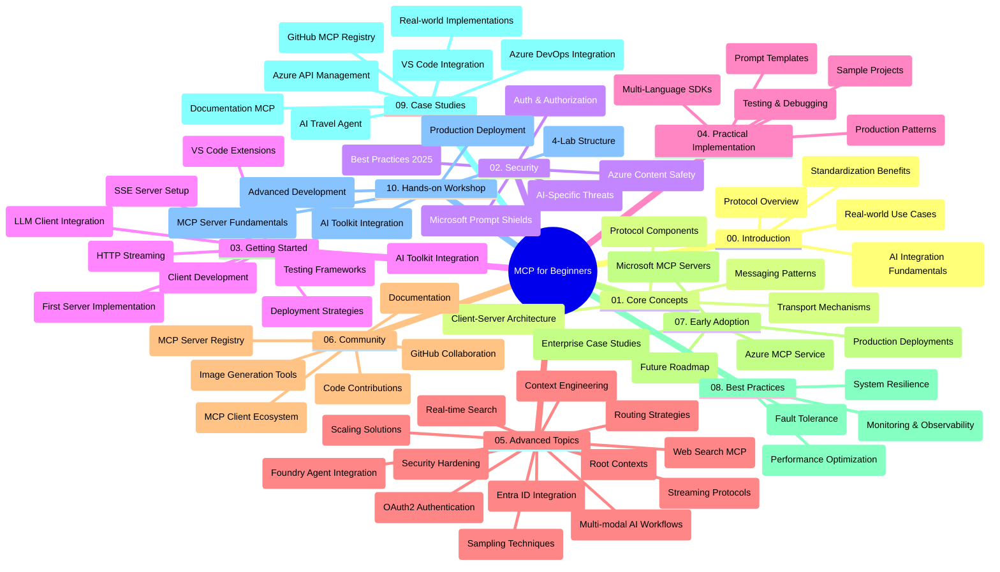

<!--
CO_OP_TRANSLATOR_METADATA:
{
  "original_hash": "719117a0a5f34ade7b5dfb61ee06fb13",
  "translation_date": "2025-09-26T18:44:23+00:00",
  "source_file": "study_guide.md",
  "language_code": "vi"
}
-->
# Hướng Dẫn Học Tập - Giao Thức Ngữ Cảnh Mô Hình (MCP) Dành Cho Người Mới Bắt Đầu

Hướng dẫn học tập này cung cấp cái nhìn tổng quan về cấu trúc và nội dung của kho lưu trữ dành cho chương trình học "Giao Thức Ngữ Cảnh Mô Hình (MCP) Dành Cho Người Mới Bắt Đầu". Sử dụng hướng dẫn này để điều hướng kho lưu trữ một cách hiệu quả và tận dụng tối đa các tài nguyên có sẵn.

## Tổng Quan Về Kho Lưu Trữ

Giao Thức Ngữ Cảnh Mô Hình (MCP) là một khung chuẩn hóa cho các tương tác giữa các mô hình AI và ứng dụng khách. Ban đầu được tạo bởi Anthropic, MCP hiện được duy trì bởi cộng đồng MCP rộng lớn hơn thông qua tổ chức GitHub chính thức. Kho lưu trữ này cung cấp một chương trình học toàn diện với các ví dụ mã thực hành bằng C#, Java, JavaScript, Python và TypeScript, được thiết kế cho các nhà phát triển AI, kiến trúc sư hệ thống và kỹ sư phần mềm.

## Bản Đồ Chương Trình Học Trực Quan

## Cấu Trúc Kho Lưu Trữ

Kho lưu trữ được tổ chức thành mười phần chính, mỗi phần tập trung vào các khía cạnh khác nhau của MCP:

1. **Giới Thiệu (00-Introduction/)**
   - Tổng quan về Giao Thức Ngữ Cảnh Mô Hình
   - Tại sao chuẩn hóa lại quan trọng trong các quy trình AI
   - Các trường hợp sử dụng thực tế và lợi ích

2. **Các Khái Niệm Cốt Lõi (01-CoreConcepts/)**
   - Kiến trúc máy khách-máy chủ
   - Các thành phần chính của giao thức
   - Các mẫu tin nhắn trong MCP

3. **Bảo Mật (02-Security/)**
   - Các mối đe dọa bảo mật trong hệ thống dựa trên MCP
   - Các thực hành tốt nhất để bảo mật triển khai
   - Chiến lược xác thực và ủy quyền
   - **Tài Liệu Bảo Mật Toàn Diện**:
     - Thực Hành Tốt Nhất Về Bảo Mật MCP 2025
     - Hướng Dẫn Triển Khai An Toàn Nội Dung Azure
     - Kiểm Soát và Kỹ Thuật Bảo Mật MCP
     - Tham Khảo Nhanh Thực Hành Tốt Nhất MCP
   - **Các Chủ Đề Bảo Mật Chính**:
     - Tấn công tiêm lệnh và làm hỏng công cụ
     - Chiếm quyền phiên và vấn đề đại diện nhầm lẫn
     - Lỗ hổng truyền token
     - Quyền hạn quá mức và kiểm soát truy cập
     - Bảo mật chuỗi cung ứng cho các thành phần AI
     - Tích hợp Microsoft Prompt Shields

4. **Bắt Đầu (03-GettingStarted/)**
   - Thiết lập và cấu hình môi trường
   - Tạo máy chủ và máy khách MCP cơ bản
   - Tích hợp với các ứng dụng hiện có
   - Bao gồm các phần:
     - Triển khai máy chủ đầu tiên
     - Phát triển máy khách
     - Tích hợp máy khách LLM
     - Tích hợp VS Code
     - Máy chủ Server-Sent Events (SSE)
     - Truyền HTTP
     - Tích hợp AI Toolkit
     - Chiến lược kiểm thử
     - Hướng dẫn triển khai

5. **Triển Khai Thực Tế (04-PracticalImplementation/)**
   - Sử dụng SDK trên các ngôn ngữ lập trình khác nhau
   - Kỹ thuật gỡ lỗi, kiểm thử và xác thực
   - Tạo mẫu prompt và quy trình làm việc có thể tái sử dụng
   - Các dự án mẫu với ví dụ triển khai

6. **Chủ Đề Nâng Cao (05-AdvancedTopics/)**
   - Kỹ thuật kỹ sư ngữ cảnh
   - Tích hợp tác nhân Foundry
   - Quy trình làm việc AI đa phương thức
   - Demo xác thực OAuth2
   - Khả năng tìm kiếm thời gian thực
   - Truyền phát thời gian thực
   - Triển khai ngữ cảnh gốc
   - Chiến lược định tuyến
   - Kỹ thuật lấy mẫu
   - Phương pháp mở rộng quy mô
   - Cân nhắc về bảo mật
   - Tích hợp bảo mật Entra ID
   - Tích hợp tìm kiếm web

7. **Đóng Góp Cộng Đồng (06-CommunityContributions/)**
   - Cách đóng góp mã và tài liệu
   - Hợp tác qua GitHub
   - Cải tiến và phản hồi do cộng đồng dẫn dắt
   - Sử dụng các máy khách MCP khác nhau (Claude Desktop, Cline, VSCode)
   - Làm việc với các máy chủ MCP phổ biến bao gồm tạo hình ảnh

8. **Bài Học Từ Việc Áp Dụng Sớm (07-LessonsfromEarlyAdoption/)**
   - Các triển khai thực tế và câu chuyện thành công
   - Xây dựng và triển khai các giải pháp dựa trên MCP
   - Xu hướng và lộ trình tương lai
   - **Hướng Dẫn Máy Chủ MCP Microsoft**: Hướng dẫn toàn diện về 10 máy chủ MCP sẵn sàng sản xuất của Microsoft bao gồm:
     - Máy Chủ MCP Tài Liệu Học Tập Microsoft
     - Máy Chủ MCP Azure (15+ kết nối chuyên biệt)
     - Máy Chủ MCP GitHub
     - Máy Chủ MCP Azure DevOps
     - Máy Chủ MCP MarkItDown
     - Máy Chủ MCP SQL Server
     - Máy Chủ MCP Playwright
     - Máy Chủ MCP Dev Box
     - Máy Chủ MCP Azure AI Foundry
     - Máy Chủ MCP Bộ Công Cụ Tác Nhân Microsoft 365

9. **Thực Hành Tốt Nhất (08-BestPractices/)**
   - Tối ưu hóa và điều chỉnh hiệu suất
   - Thiết kế hệ thống MCP chịu lỗi
   - Chiến lược kiểm thử và khả năng phục hồi

10. **Nghiên Cứu Tình Huống (09-CaseStudy/)**
    - **Bảy nghiên cứu tình huống toàn diện** minh họa tính linh hoạt của MCP trong các kịch bản đa dạng:
    - **Đại Lý Du Lịch AI Azure**: Điều phối đa tác nhân với Azure OpenAI và AI Search
    - **Tích Hợp Azure DevOps**: Tự động hóa quy trình làm việc với cập nhật dữ liệu YouTube
    - **Truy Xuất Tài Liệu Thời Gian Thực**: Máy khách console Python với HTTP streaming
    - **Trình Tạo Kế Hoạch Học Tập Tương Tác**: Ứng dụng web Chainlit với AI hội thoại
    - **Tài Liệu Trong Trình Soạn Thảo**: Tích hợp VS Code với quy trình làm việc GitHub Copilot
    - **Quản Lý API Azure**: Tích hợp API doanh nghiệp với việc tạo máy chủ MCP
    - **Đăng Ký MCP GitHub**: Phát triển hệ sinh thái và nền tảng tích hợp tác nhân
    - Các ví dụ triển khai trải dài từ tích hợp doanh nghiệp, năng suất nhà phát triển đến phát triển hệ sinh thái

11. **Hội Thảo Thực Hành (10-StreamliningAIWorkflowsBuildingAnMCPServerWithAIToolkit/)**
    - Hội thảo thực hành toàn diện kết hợp MCP với AI Toolkit
    - Xây dựng ứng dụng thông minh kết nối các mô hình AI với công cụ thực tế
    - Các mô-đun thực hành bao gồm các nguyên tắc cơ bản, phát triển máy chủ tùy chỉnh và chiến lược triển khai sản xuất
    - **Cấu Trúc Phòng Thí Nghiệm**:
      - Phòng Thí Nghiệm 1: Nguyên Tắc Cơ Bản Về Máy Chủ MCP
      - Phòng Thí Nghiệm 2: Phát Triển Máy Chủ MCP Nâng Cao
      - Phòng Thí Nghiệm 3: Tích Hợp AI Toolkit
      - Phòng Thí Nghiệm 4: Triển Khai Sản Xuất và Mở Rộng Quy Mô
    - Phương pháp học tập dựa trên phòng thí nghiệm với hướng dẫn từng bước

## Tài Nguyên Bổ Sung

Kho lưu trữ bao gồm các tài nguyên hỗ trợ:

- **Thư mục hình ảnh**: Chứa các sơ đồ và minh họa được sử dụng trong toàn bộ chương trình học
- **Bản dịch**: Hỗ trợ đa ngôn ngữ với các bản dịch tài liệu tự động
- **Tài Nguyên Chính Thức MCP**:
  - [Tài Liệu MCP](https://modelcontextprotocol.io/)
  - [Đặc Tả MCP](https://spec.modelcontextprotocol.io/)
  - [Kho Lưu Trữ GitHub MCP](https://github.com/modelcontextprotocol)

## Cách Sử Dụng Kho Lưu Trữ Này

1. **Học Theo Thứ Tự**: Theo dõi các chương theo thứ tự (00 đến 10) để có trải nghiệm học tập có cấu trúc.
2. **Tập Trung Vào Ngôn Ngữ Cụ Thể**: Nếu bạn quan tâm đến một ngôn ngữ lập trình cụ thể, hãy khám phá các thư mục mẫu để tìm các triển khai bằng ngôn ngữ bạn ưa thích.
3. **Triển Khai Thực Tế**: Bắt đầu với phần "Bắt Đầu" để thiết lập môi trường và tạo máy chủ và máy khách MCP đầu tiên của bạn.
4. **Khám Phá Nâng Cao**: Khi đã quen thuộc với các kiến thức cơ bản, hãy đi sâu vào các chủ đề nâng cao để mở rộng kiến thức của bạn.
5. **Tham Gia Cộng Đồng**: Tham gia cộng đồng MCP qua các cuộc thảo luận trên GitHub và các kênh Discord để kết nối với các chuyên gia và nhà phát triển khác.

## Các Máy Khách và Công Cụ MCP

Chương trình học bao gồm các máy khách và công cụ MCP khác nhau:

1. **Máy Khách Chính Thức**:
   - Visual Studio Code 
   - MCP trong Visual Studio Code
   - Claude Desktop
   - Claude trong VSCode 
   - Claude API

2. **Máy Khách Cộng Đồng**:
   - Cline (dựa trên terminal)
   - Cursor (trình soạn thảo mã)
   - ChatMCP
   - Windsurf

3. **Công Cụ Quản Lý MCP**:
   - MCP CLI
   - MCP Manager
   - MCP Linker
   - MCP Router

## Các Máy Chủ MCP Phổ Biến

Kho lưu trữ giới thiệu các máy chủ MCP khác nhau, bao gồm:

1. **Máy Chủ MCP Chính Thức Của Microsoft**:
   - Máy Chủ MCP Tài Liệu Học Tập Microsoft
   - Máy Chủ MCP Azure (15+ kết nối chuyên biệt)
   - Máy Chủ MCP GitHub
   - Máy Chủ MCP Azure DevOps
   - Máy Chủ MCP MarkItDown
   - Máy Chủ MCP SQL Server
   - Máy Chủ MCP Playwright
   - Máy Chủ MCP Dev Box
   - Máy Chủ MCP Azure AI Foundry
   - Máy Chủ MCP Bộ Công Cụ Tác Nhân Microsoft 365

2. **Máy Chủ Tham Chiếu Chính Thức**:
   - Filesystem
   - Fetch
   - Memory
   - Sequential Thinking

3. **Tạo Hình Ảnh**:
   - Azure OpenAI DALL-E 3
   - Stable Diffusion WebUI
   - Replicate

4. **Công Cụ Phát Triển**:
   - Git MCP
   - Terminal Control
   - Code Assistant

5. **Máy Chủ Chuyên Biệt**:
   - Salesforce
   - Microsoft Teams
   - Jira & Confluence

## Đóng Góp

Kho lưu trữ này hoan nghênh các đóng góp từ cộng đồng. Xem phần Đóng Góp Cộng Đồng để biết hướng dẫn về cách đóng góp hiệu quả vào hệ sinh thái MCP.

## Nhật Ký Thay Đổi

| Ngày | Thay Đổi |
|------|----------|
| 26 Tháng 9, 2025 | - Thêm nghiên cứu tình huống Đăng Ký MCP GitHub vào phần 09-CaseStudy - Cập nhật Nghiên Cứu Tình Huống để phản ánh bảy nghiên cứu tình huống toàn diện - Nâng cao mô tả nghiên cứu tình huống với chi tiết triển khai cụ thể - Cập nhật Bản Đồ Chương Trình Học Trực Quan để bao gồm Đăng Ký MCP GitHub - Sửa đổi cấu trúc hướng dẫn học tập để phản ánh trọng tâm phát triển hệ sinh thái |
| 18 Tháng 7, 2025 | - Cập nhật cấu trúc kho lưu trữ để bao gồm Hướng Dẫn Máy Chủ MCP Microsoft - Thêm danh sách toàn diện 10 máy chủ MCP sẵn sàng sản xuất của Microsoft - Nâng cao phần Các Máy Chủ MCP Phổ Biến với Máy Chủ MCP Chính Thức Của Microsoft - Cập nhật phần Nghiên Cứu Tình Huống với các ví dụ tệp thực tế - Thêm chi tiết Cấu Trúc Phòng Thí Nghiệm cho Hội Thảo Thực Hành |
| 16 Tháng 7, 2025 | - Cập nhật cấu trúc kho lưu trữ để phản ánh nội dung hiện tại - Thêm phần Các Máy Khách và Công Cụ MCP - Thêm phần Các Máy Chủ MCP Phổ Biến - Cập nhật Bản Đồ Chương Trình Học Trực Quan với tất cả các chủ đề hiện tại - Nâng cao phần Chủ Đề Nâng Cao với tất cả các lĩnh vực chuyên biệt - Cập nhật Nghiên Cứu Tình Huống để phản ánh các ví dụ thực tế - Làm rõ nguồn gốc MCP được tạo bởi Anthropic |
| 11 Tháng 6, 2025 | - Tạo hướng dẫn học tập ban đầu - Thêm Bản Đồ Chương Trình Học Trực Quan - Phác thảo cấu trúc kho lưu trữ - Bao gồm các dự án mẫu và tài nguyên bổ sung |

---

*Hướng dẫn học tập này được cập nhật vào ngày 26 Tháng 9, 2025, và cung cấp cái nhìn tổng quan về kho lưu trữ tính đến ngày đó. Nội dung kho lưu trữ có thể được cập nhật sau ngày này.*

---

