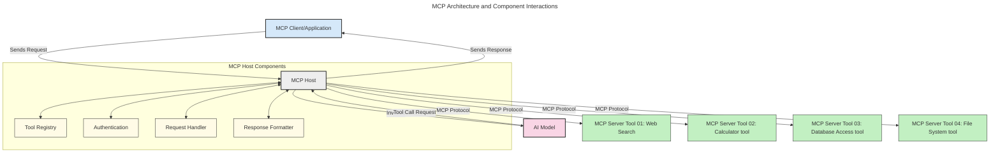
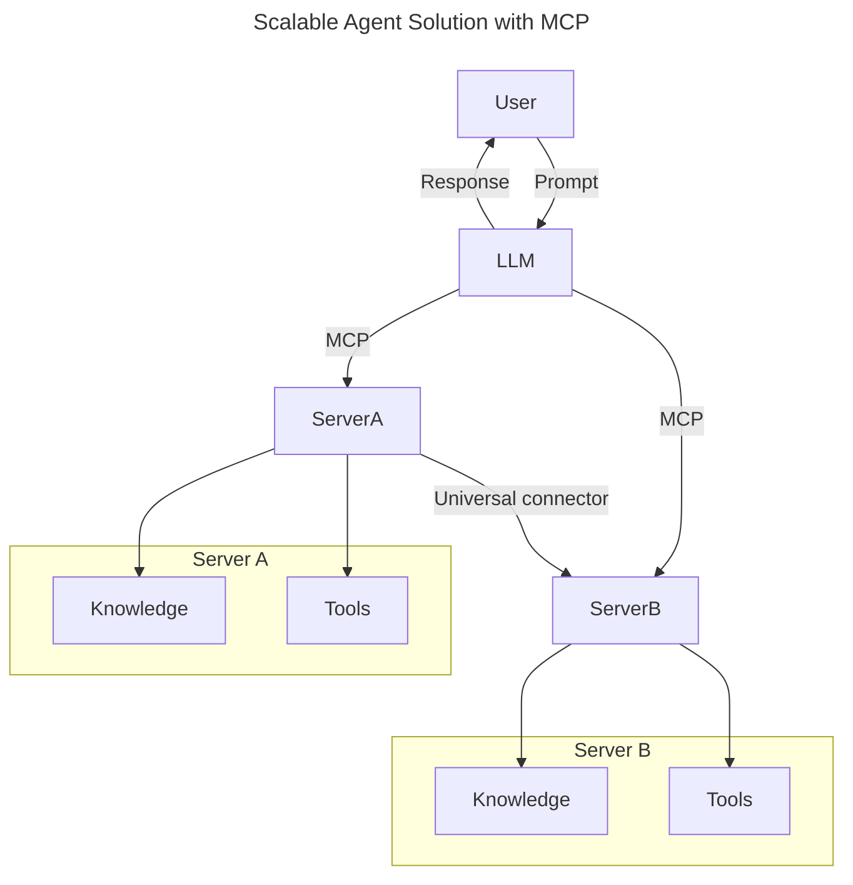
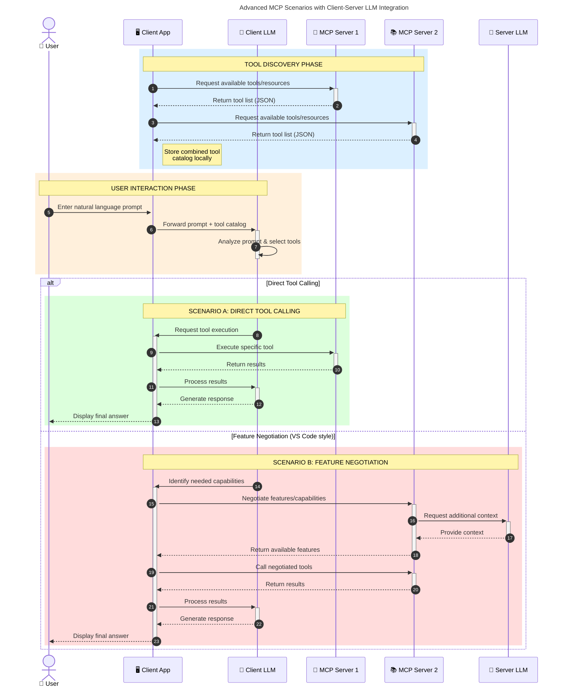

<!--
CO_OP_TRANSLATOR_METADATA:
{
  "original_hash": "0df1ee78a6dd8300f3a040ca5b411c2e",
  "translation_date": "2025-08-12T07:29:57+00:00",
  "source_file": "00-Introduction/README.md",
  "language_code": "zh"
}
-->
# 模型上下文协议（MCP）简介：为什么它对可扩展的AI应用至关重要

_（点击上方图片观看本课视频）_

生成式AI应用是一个巨大的进步，因为它们通常允许用户通过自然语言提示与应用程序交互。然而，随着在这些应用上投入更多的时间和资源，你需要确保能够轻松集成功能和资源，使其易于扩展，让你的应用能够支持多个模型，并处理各种模型的复杂性。简而言之，构建生成式AI应用在开始时很容易，但随着它们的增长和复杂化，你需要开始定义架构，并可能需要依赖一个标准来确保你的应用以一致的方式构建。这就是MCP的作用，它帮助组织并提供一个标准。

---

## **🔍 什么是模型上下文协议（MCP）？**

**模型上下文协议（MCP）**是一个**开放的标准化接口**，允许大型语言模型（LLMs）与外部工具、API和数据源无缝交互。它提供了一种一致的架构，增强AI模型超越其训练数据的功能，从而构建更智能、更可扩展、更响应迅速的AI系统。

---

## **🎯 为什么AI标准化很重要**

随着生成式AI应用变得越来越复杂，采用标准以确保**可扩展性、可扩展性、可维护性**以及**避免供应商锁定**变得至关重要。MCP解决了这些需求：

- 统一模型与工具的集成
- 减少脆弱的、一次性定制解决方案
- 允许来自不同供应商的多个模型共存于一个生态系统中

**注意：** 虽然MCP自称为一个开放标准，但目前没有计划通过任何现有的标准组织（如IEEE、IETF、W3C、ISO或其他标准组织）对MCP进行标准化。

---

## **📚 学习目标**

阅读本文后，你将能够：

- 定义**模型上下文协议（MCP）**及其使用场景
- 理解MCP如何标准化模型与工具的通信
- 识别MCP架构的核心组件
- 探索MCP在企业和开发环境中的实际应用

---

## **💡 为什么模型上下文协议（MCP）是一个革命性突破**

### **🔗 MCP解决了AI交互中的碎片化问题**

在MCP出现之前，模型与工具的集成需要：

- 每个工具-模型对的定制代码
- 每个供应商的非标准API
- 因更新而频繁中断
- 随着工具数量增加而难以扩展

### **✅ MCP标准化的优势**

| **优势**                  | **描述**                                                                      |
|--------------------------|------------------------------------------------------------------------------|
| 互操作性                 | LLMs可以与不同供应商的工具无缝协作                                           |
| 一致性                   | 在平台和工具之间实现统一行为                                                 |
| 可重用性                 | 一次构建的工具可以在多个项目和系统中使用                                     |
| 加速开发                 | 通过使用标准化的即插即用接口减少开发时间                                     |

---

## **🧱 MCP架构概览**

MCP遵循**客户端-服务器模型**，其中：

- **MCP主机**运行AI模型
- **MCP客户端**发起请求
- **MCP服务器**提供上下文、工具和功能

### **核心组件：**

- **资源** – 模型使用的静态或动态数据  
- **提示** – 用于引导生成的预定义工作流  
- **工具** – 可执行功能，如搜索、计算  
- **采样** – 通过递归交互实现代理行为  

---

## MCP服务器如何工作

MCP服务器的操作流程如下：

- **请求流程**：
    1. 请求由最终用户或代表用户操作的软件发起。
    2. **MCP客户端**将请求发送到**MCP主机**，后者管理AI模型的运行时。
    3. **AI模型**接收用户提示，并可能通过一个或多个工具调用请求访问外部工具或数据。
    4. **MCP主机**（而非模型本身）使用标准化协议与适当的**MCP服务器**通信。
- **MCP主机功能**：
    - **工具注册表**：维护可用工具及其功能的目录。
    - **认证**：验证工具访问权限。
    - **请求处理器**：处理模型发来的工具请求。
    - **响应格式化器**：将工具输出结构化为模型可理解的格式。
- **MCP服务器执行**：
    - **MCP主机**将工具调用路由到一个或多个**MCP服务器**，每个服务器提供专门的功能（如搜索、计算、数据库查询）。
    - **MCP服务器**执行各自的操作，并以一致的格式将结果返回给**MCP主机**。
    - **MCP主机**格式化并将这些结果传递给**AI模型**。
- **响应完成**：
    - **AI模型**将工具输出整合到最终响应中。
    - **MCP主机**将响应发送回**MCP客户端**，后者将其交付给最终用户或调用软件。

## 👨‍💻 如何构建MCP服务器（附示例）

MCP服务器允许你通过提供数据和功能来扩展LLM的能力。

准备好尝试了吗？以下是基于不同语言/技术栈的SDK及创建简单MCP服务器的示例：

- **Python SDK**: https://github.com/modelcontextprotocol/python-sdk

- **TypeScript SDK**: https://github.com/modelcontextprotocol/typescript-sdk

- **Java SDK**: https://github.com/modelcontextprotocol/java-sdk

- **C#/.NET SDK**: https://github.com/modelcontextprotocol/csharp-sdk

---

## 🌍 MCP的实际应用场景

MCP通过扩展AI能力支持广泛的应用：

| **应用场景**               | **描述**                                                                      |
|----------------------------|------------------------------------------------------------------------------|
| 企业数据集成               | 将LLMs连接到数据库、CRM或内部工具                                            |
| 代理型AI系统               | 通过工具访问和决策工作流实现自主代理                                         |
| 多模态应用                 | 在单一AI应用中结合文本、图像和音频工具                                       |
| 实时数据集成               | 将实时数据引入AI交互以提供更准确、最新的输出                                  |

### 🧠 MCP = AI交互的通用标准

模型上下文协议（MCP）充当AI交互的通用标准，就像USB-C标准化了设备的物理连接。在AI领域，MCP提供了一致的接口，使模型（客户端）能够与外部工具和数据提供者（服务器）无缝集成。这消除了为每个API或数据源设计多样化定制协议的需求。

在MCP框架下，一个兼容MCP的工具（称为MCP服务器）遵循统一标准。这些服务器可以列出它们提供的工具或操作，并在AI代理请求时执行这些操作。支持MCP的AI代理平台能够通过标准协议发现服务器提供的工具并调用它们。

### 💡 促进知识访问

除了提供工具，MCP还促进知识访问。它通过将大型语言模型（LLMs）与各种数据源连接，为应用程序提供上下文。例如，一个MCP服务器可能代表公司的文档库，允许代理按需检索相关信息。另一个服务器可能处理特定操作，如发送电子邮件或更新记录。从代理的角度来看，这些只是它可以使用的工具——一些工具返回数据（知识上下文），而另一些工具执行操作。MCP高效地管理两者。

一个连接到MCP服务器的代理可以通过标准格式自动了解服务器的可用功能和可访问数据。这种标准化实现了动态工具的可用性。例如，向代理系统添加一个新的MCP服务器后，其功能可以立即使用，而无需进一步定制代理的指令。

这种简化的集成与以下图示中的流程一致，服务器提供工具和知识，确保系统间的无缝协作。

### 👉 示例：可扩展的代理解决方案

### 🔄 客户端侧LLM集成的高级MCP场景

除了基本的MCP架构，还有一些高级场景，其中客户端和服务器都包含LLM，从而实现更复杂的交互。在下图中，**客户端应用**可以是一个IDE，提供多个MCP工具供LLM使用：

---

## 🔐 MCP的实际优势

以下是使用MCP的实际优势：

- **信息更新**：模型可以访问超出其训练数据的最新信息
- **能力扩展**：模型可以利用专门的工具完成其未训练的任务
- **减少幻觉**：外部数据源提供事实依据
- **隐私保护**：敏感数据可以保留在安全环境中，而不是嵌入到提示中

---

## 📌 关键要点

以下是使用MCP的关键要点：

- **MCP**标准化了AI模型与工具和数据的交互方式
- 促进**可扩展性、一致性和互操作性**
- MCP帮助**减少开发时间、提高可靠性并扩展模型能力**
- 客户端-服务器架构**支持灵活、可扩展的AI应用**

---

## 🧠 练习

思考一个你感兴趣的AI应用：

- 哪些**外部工具或数据**可以增强其功能？
- MCP如何使集成**更简单、更可靠**？

---

## 其他资源

- [MCP GitHub仓库](https://github.com/modelcontextprotocol)

---

## 下一步

下一章：[第1章：核心概念](../01-CoreConcepts/README.md)

**免责声明**：  
本文档使用AI翻译服务[Co-op Translator](https://github.com/Azure/co-op-translator)进行翻译。尽管我们努力确保准确性，但请注意，自动翻译可能包含错误或不准确之处。应以原始语言的文档作为权威来源。对于关键信息，建议使用专业人工翻译。对于因使用本翻译而引起的任何误解或误读，我们概不负责。