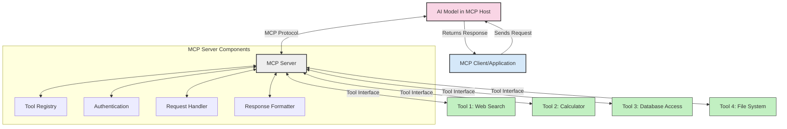
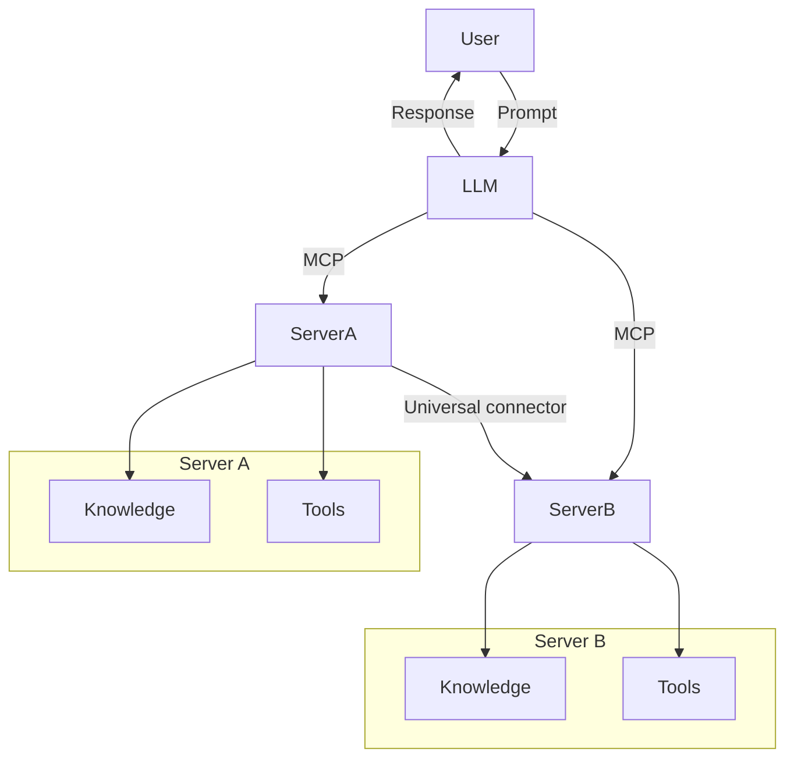

<!--
CO_OP_TRANSLATOR_METADATA:
{
  "original_hash": "02301140adbd807ecf0f17720fa307bc",
  "translation_date": "2025-05-16T14:33:18+00:00",
  "source_file": "00-Introduction/README.md",
  "language_code": "zh"
}
-->
# 模型上下文协议（MCP）简介：为何它对可扩展的 AI 应用至关重要

生成式 AI 应用是一个巨大进步，因为它们通常允许用户通过自然语言提示与应用交互。然而，随着投入更多时间和资源到这些应用中，你需要确保能够轻松集成功能和资源，使其易于扩展，能够支持多模型同时使用及其复杂性。简而言之，构建生成式 AI 应用起步简单，但随着规模和复杂度增加，你需要开始定义架构，并很可能需要依赖一个标准来确保应用构建的一致性。MCP 就是在这里发挥作用，帮助组织结构，提供一个标准。

---

## **🔍 什么是模型上下文协议（MCP）？**

**模型上下文协议（MCP）** 是一个 **开放的、标准化的接口**，允许大型语言模型（LLM）无缝地与外部工具、API 和数据源交互。它提供了一种一致的架构，增强 AI 模型在训练数据之外的功能，实现更智能、可扩展且响应更快的 AI 系统。

---

## **🎯 为什么 AI 标准化很重要**

随着生成式 AI 应用变得越来越复杂，采用标准以确保 **可扩展性、可扩展性（扩展性）** 和 **可维护性** 变得至关重要。MCP 通过以下方式满足这些需求：

- 统一模型与工具的集成
- 减少脆弱的、一次性的定制解决方案
- 允许多个模型在同一生态系统中共存

---

## **📚 学习目标**

阅读本文后，你将能够：

- 定义 **模型上下文协议（MCP）** 及其使用场景
- 理解 MCP 如何标准化模型与工具之间的通信
- 识别 MCP 架构的核心组件
- 探索 MCP 在企业和开发环境中的实际应用

---

## **💡 为什么模型上下文协议（MCP）是颠覆性技术**

### **🔗 MCP 解决了 AI 交互的碎片化问题**

在 MCP 出现之前，模型与工具的集成需要：

- 针对每个工具-模型对编写定制代码
- 每个厂商使用非标准 API
- 更新频繁导致集成中断
- 难以随着工具数量增加而扩展

### **✅ MCP 标准化的优势**

| **优势**                 | **描述**                                                               |
|--------------------------|------------------------------------------------------------------------|
| 互操作性                 | LLM 能无缝连接不同厂商的工具                                           |
| 一致性                   | 跨平台和工具表现统一                                                   |
| 可复用性                 | 工具一次构建，可在多个项目和系统中复用                                 |
| 加速开发                 | 通过标准化的即插即用接口减少开发时间                                   |

---

## **🧱 MCP 高级架构概览**

MCP 采用 **客户端-服务器模型**，其中：

- **MCP Hosts** 运行 AI 模型
- **MCP Clients** 发起请求
- **MCP Servers** 提供上下文、工具和能力

### **关键组件：**

- **资源** – 提供给模型的静态或动态数据  
- **提示** – 预定义的工作流程，用于引导生成  
- **工具** – 可执行的功能，如搜索、计算  
- **采样** – 通过递归交互实现代理行为

---

## MCP 服务器如何工作

MCP 服务器的工作流程如下：

- **请求流程**：  
    1. MCP 客户端向运行在 MCP Host 上的 AI 模型发送请求。  
    2. AI 模型识别需要外部工具或数据时。  
    3. 模型使用标准化协议与 MCP 服务器通信。

- **MCP 服务器功能**：  
    - 工具注册表：维护可用工具及其功能的目录。  
    - 认证：验证工具访问权限。  
    - 请求处理器：处理模型发起的工具请求。  
    - 响应格式化器：将工具输出结构化为模型可理解的格式。

- **工具执行**：  
    - 服务器将请求路由到相应的外部工具。  
    - 工具执行其特定功能（搜索、计算、数据库查询等）。  
    - 结果以一致格式返回给模型。

- **响应完成**：  
    - AI 模型将工具输出整合进响应中。  
    - 最终响应返回给客户端应用。

## 👨‍💻 如何构建 MCP 服务器（示例）

MCP 服务器允许你通过提供数据和功能来扩展 LLM 的能力。

准备试试吗？以下是在不同语言中创建简单 MCP 服务器的示例：

- **Python 示例**：https://github.com/modelcontextprotocol/python-sdk

- **TypeScript 示例**：https://github.com/modelcontextprotocol/typescript-sdk

- **Java 示例**：https://github.com/modelcontextprotocol/java-sdk

- **C#/.NET 示例**：https://github.com/modelcontextprotocol/csharp-sdk

## 🌍 MCP 的实际应用场景

MCP 通过扩展 AI 能力支持各种应用：

| **应用场景**               | **描述**                                                                |
|----------------------------|------------------------------------------------------------------------|
| 企业数据集成               | 将 LLM 连接到数据库、CRM 或内部工具                                     |
| 代理 AI 系统               | 使自治代理具备工具访问和决策工作流                                      |
| 多模态应用                 | 在单一统一 AI 应用中结合文本、图像和音频工具                           |
| 实时数据集成               | 将实时数据引入 AI 交互，实现更准确、及时的输出                         |

### 🧠 MCP = AI 交互的通用标准

模型上下文协议（MCP）就像 USB-C 标准化了设备的物理连接一样，成为 AI 交互的通用标准。在 AI 领域，MCP 提供了一致的接口，使模型（客户端）能够无缝集成外部工具和数据提供者（服务器）。这避免了为每个 API 或数据源设计多样化定制协议的需求。

在 MCP 规范下，兼容 MCP 的工具（称为 MCP 服务器）遵循统一标准。这些服务器能够列出它们提供的工具或操作，并在 AI 代理请求时执行这些操作。支持 MCP 的 AI 代理平台能够发现服务器上的可用工具，并通过该标准协议调用它们。

### 💡 便捷访问知识

除了提供工具，MCP 还促进知识访问。它使应用能够通过连接各种数据源，为大型语言模型（LLM）提供上下文。例如，某个 MCP 服务器可能代表公司的文档库，允许代理按需检索相关信息。另一个服务器可能处理发送邮件或更新记录等具体操作。从代理的角度看，这些都是它可以使用的工具——有些工具返回数据（知识上下文），有些执行操作。MCP 高效管理这两种情况。

连接到 MCP 服务器的代理会通过标准格式自动了解服务器的可用能力和可访问数据。这种标准化实现了动态工具可用性。例如，向代理系统添加新的 MCP 服务器，其功能即可立即使用，无需对代理指令进行额外定制。

这种简化的集成符合下方流程图所示的流程，服务器同时提供工具和知识，确保系统间的无缝协作。

### 👉 示例：可扩展代理解决方案

## 🔐 MCP 的实际好处

使用 MCP 的一些实际好处包括：

- **信息新鲜度**：模型可访问训练数据之外的最新信息  
- **能力扩展**：模型可利用专门工具完成未受训任务  
- **减少幻觉**：外部数据源提供事实依据  
- **隐私保护**：敏感数据可保留在安全环境中，无需嵌入提示中

## 📌 关键总结

使用 MCP 的关键点：

- **MCP** 标准化 AI 模型与工具和数据的交互方式  
- 促进 **可扩展性、一致性和互操作性**  
- MCP 有助于 **缩短开发时间、提升可靠性和扩展模型能力**  
- 客户端-服务器架构支持灵活且可扩展的 AI 应用

## 🧠 练习

思考你感兴趣的 AI 应用：

- 哪些 **外部工具或数据** 能增强其能力？  
- MCP 如何使集成变得 **更简单、更可靠**？

## 额外资源

- [MCP GitHub 仓库](https://github.com/modelcontextprotocol)

## 接下来

下一章：[第1章：核心概念](/01-CoreConcepts/README.md)

**免责声明**：  
本文件使用 AI 翻译服务 [Co-op Translator](https://github.com/Azure/co-op-translator) 进行翻译。尽管我们力求准确，但请注意自动翻译可能包含错误或不准确之处。原始文件的原文版本应被视为权威来源。对于重要信息，建议采用专业人工翻译。因使用本翻译而产生的任何误解或曲解，我们不承担任何责任。