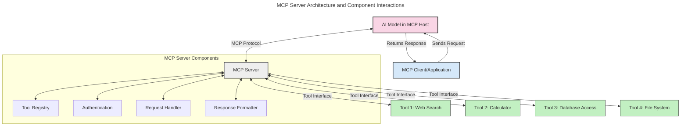
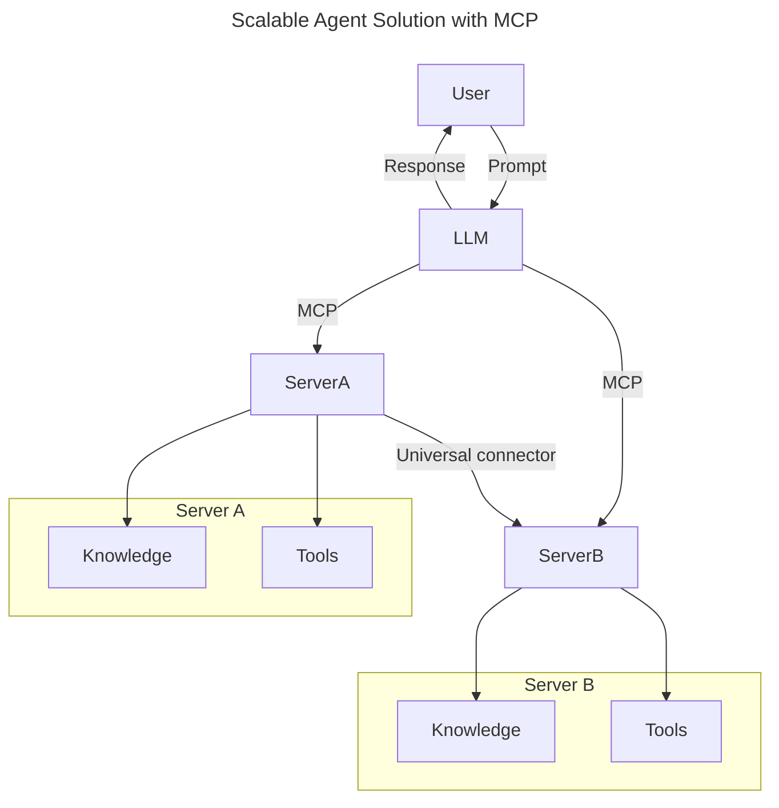
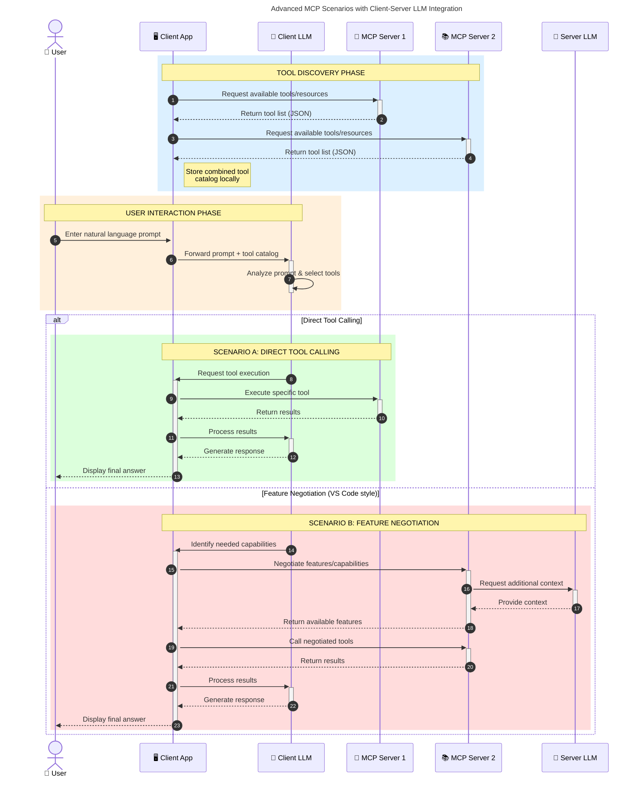

<!--
CO_OP_TRANSLATOR_METADATA:
{
  "original_hash": "2bbbcded256d46a24e3f448384a2b4a2",
  "translation_date": "2025-07-28T23:24:15+00:00",
  "source_file": "00-Introduction/README.md",
  "language_code": "zh"
}
-->
# 模型上下文协议 (MCP) 简介：为什么它对可扩展的 AI 应用至关重要

_（点击上方图片观看本课视频）_

生成式 AI 应用是一个巨大的进步，因为它们通常允许用户通过自然语言提示与应用交互。然而，随着在这些应用上投入的时间和资源越来越多，你需要确保能够轻松集成功能和资源，使其易于扩展，能够支持多个模型的使用，并处理各种模型的复杂性。简而言之，构建生成式 AI 应用一开始可能很简单，但随着它们的增长和复杂化，你需要开始定义架构，并可能需要依赖一个标准来确保应用以一致的方式构建。这就是 MCP 的作用所在，它帮助组织并提供一个标准。

---

## **🔍 什么是模型上下文协议 (MCP)?**

**模型上下文协议 (MCP)** 是一个**开放的、标准化的接口**，允许大型语言模型 (LLMs) 无缝地与外部工具、API 和数据源交互。它提供了一种一致的架构，增强了 AI 模型超越其训练数据的功能，从而实现更智能、更可扩展、更具响应性的 AI 系统。

---

## **🎯 为什么 AI 标准化很重要**

随着生成式 AI 应用变得越来越复杂，采用能够确保**可扩展性、可扩展性**和**可维护性**的标准至关重要。MCP 通过以下方式满足这些需求：

- 统一模型与工具的集成
- 减少脆弱的、一次性的定制解决方案
- 允许多个模型在一个生态系统中共存

---

## **📚 学习目标**

阅读本文后，你将能够：

- 定义 **模型上下文协议 (MCP)** 及其使用场景
- 理解 MCP 如何标准化模型与工具的通信
- 识别 MCP 架构的核心组件
- 探索 MCP 在企业和开发环境中的实际应用

---

## **💡 为什么模型上下文协议 (MCP) 是一个颠覆性创新**

### **🔗 MCP 解决了 AI 交互中的碎片化问题**

在 MCP 出现之前，模型与工具的集成需要：

- 每个工具-模型对的定制代码
- 每个供应商的非标准化 API
- 因更新而频繁中断
- 随着工具数量增加而难以扩展

### **✅ MCP 标准化的优势**

| **优势**                  | **描述**                                                                        |
|--------------------------|--------------------------------------------------------------------------------|
| 互操作性                 | LLMs 能够无缝地与不同供应商的工具协作                                           |
| 一致性                   | 在平台和工具之间实现统一的行为                                                  |
| 可重用性                 | 一次构建的工具可以在多个项目和系统中使用                                         |
| 加速开发                 | 通过使用标准化的即插即用接口减少开发时间                                         |

---

## **🧱 MCP 架构概览**

MCP 遵循**客户端-服务器模型**，其中：

- **MCP 主机** 运行 AI 模型
- **MCP 客户端** 发起请求
- **MCP 服务器** 提供上下文、工具和功能

### **关键组件：**

- **资源** – 模型使用的静态或动态数据  
- **提示** – 用于引导生成的预定义工作流  
- **工具** – 可执行的功能，如搜索、计算  
- **采样** – 通过递归交互实现的代理行为  

---

## MCP 服务器的工作原理

MCP 服务器的操作方式如下：

- **请求流程**：  
    1. MCP 客户端向运行在 MCP 主机上的 AI 模型发送请求。  
    2. AI 模型识别何时需要外部工具或数据。  
    3. 模型通过标准化协议与 MCP 服务器通信。

- **MCP 服务器功能**：  
    - 工具注册表：维护可用工具及其功能的目录。  
    - 身份验证：验证工具访问权限。  
    - 请求处理器：处理来自模型的工具请求。  
    - 响应格式化器：将工具输出结构化为模型可理解的格式。

- **工具执行**：  
    - 服务器将请求路由到相应的外部工具。  
    - 工具执行其专门功能（如搜索、计算、数据库查询等）。  
    - 结果以一致的格式返回给模型。

- **响应完成**：  
    - AI 模型将工具输出整合到其响应中。  
    - 最终响应返回给客户端应用。

## 👨‍💻 如何构建 MCP 服务器（附示例）

MCP 服务器允许你通过提供数据和功能来扩展 LLM 的能力。

准备好尝试了吗？以下是用不同语言创建简单 MCP 服务器的示例：

- **Python 示例**: https://github.com/modelcontextprotocol/python-sdk  
- **TypeScript 示例**: https://github.com/modelcontextprotocol/typescript-sdk  
- **Java 示例**: https://github.com/modelcontextprotocol/java-sdk  
- **C#/.NET 示例**: https://github.com/modelcontextprotocol/csharp-sdk  

---

## 🌍 MCP 的实际应用场景

MCP 通过扩展 AI 的能力支持广泛的应用：

| **应用场景**               | **描述**                                                                        |
|---------------------------|--------------------------------------------------------------------------------|
| 企业数据集成              | 将 LLMs 连接到数据库、CRM 或内部工具                                            |
| 代理型 AI 系统            | 通过工具访问和决策工作流实现自主代理                                            |
| 多模态应用                | 在单一 AI 应用中结合文本、图像和音频工具                                         |
| 实时数据集成              | 将实时数据引入 AI 交互中，以提供更准确、最新的输出                                |

### 🧠 MCP = AI 交互的通用标准

模型上下文协议 (MCP) 是 AI 交互的通用标准，就像 USB-C 标准化了设备的物理连接一样。在 AI 领域，MCP 提供了一种一致的接口，使模型（客户端）能够无缝集成外部工具和数据提供者（服务器）。这消除了为每个 API 或数据源设计多样化定制协议的需求。

在 MCP 下，兼容 MCP 的工具（称为 MCP 服务器）遵循统一的标准。这些服务器可以列出它们提供的工具或操作，并在 AI 代理请求时执行这些操作。支持 MCP 的 AI 代理平台能够通过此标准协议发现服务器提供的工具并调用它们。

### 💡 促进知识访问

除了提供工具，MCP 还促进了知识访问。它通过将应用程序与各种数据源连接，为大型语言模型 (LLMs) 提供上下文。例如，一个 MCP 服务器可能代表公司的文档存储库，允许代理按需检索相关信息。另一个服务器可能处理特定操作，如发送电子邮件或更新记录。从代理的角度来看，这些只是它可以使用的工具——有些工具返回数据（知识上下文），而另一些执行操作。MCP 高效地管理了这两者。

连接到 MCP 服务器的代理可以通过标准格式自动了解服务器的可用功能和可访问数据。这种标准化实现了动态工具的可用性。例如，将一个新的 MCP 服务器添加到代理系统中，其功能可以立即使用，而无需进一步定制代理的指令。

这种简化的集成与 mermaid 图中描述的流程一致，服务器提供工具和知识，确保系统间的无缝协作。

### 👉 示例：可扩展的代理解决方案

### 🔄 客户端 LLM 集成的高级 MCP 场景

除了基本的 MCP 架构，还有一些高级场景，其中客户端和服务器都包含 LLM，从而实现更复杂的交互：

---

## 🔐 MCP 的实际优势

以下是使用 MCP 的实际优势：

- **信息新鲜度**：模型可以访问超出其训练数据的最新信息  
- **能力扩展**：模型可以利用专用工具完成其未训练的任务  
- **减少幻觉**：外部数据源提供事实依据  
- **隐私保护**：敏感数据可以保留在安全环境中，而不是嵌入到提示中  

---

## 📌 关键要点

以下是使用 MCP 的关键要点：

- **MCP** 标准化了 AI 模型与工具和数据的交互  
- 促进了**可扩展性、一致性和互操作性**  
- MCP 有助于**减少开发时间、提高可靠性并扩展模型能力**  
- 客户端-服务器架构**支持灵活、可扩展的 AI 应用**  

---

## 🧠 练习

思考一个你感兴趣构建的 AI 应用。

- 哪些**外部工具或数据**可以增强其功能？  
- MCP 如何使集成**更简单、更可靠**？  

---

## 其他资源

- [MCP GitHub 仓库](https://github.com/modelcontextprotocol)

---

## 接下来

下一步：[第 1 章：核心概念](../01-CoreConcepts/README.md)

**免责声明**：  
本文档使用AI翻译服务[Co-op Translator](https://github.com/Azure/co-op-translator)进行翻译。尽管我们努力确保翻译的准确性，但请注意，自动翻译可能包含错误或不准确之处。原始语言的文档应被视为权威来源。对于关键信息，建议使用专业人工翻译。我们对因使用此翻译而产生的任何误解或误读不承担责任。