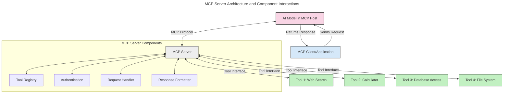
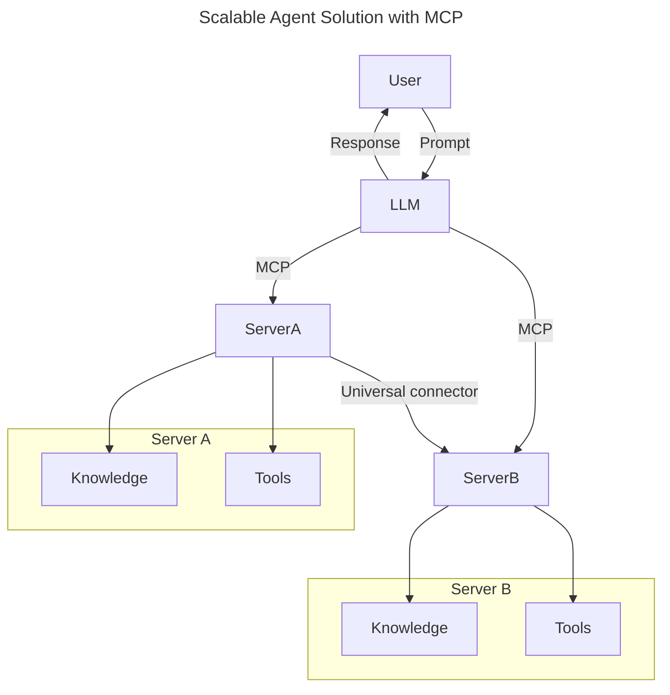
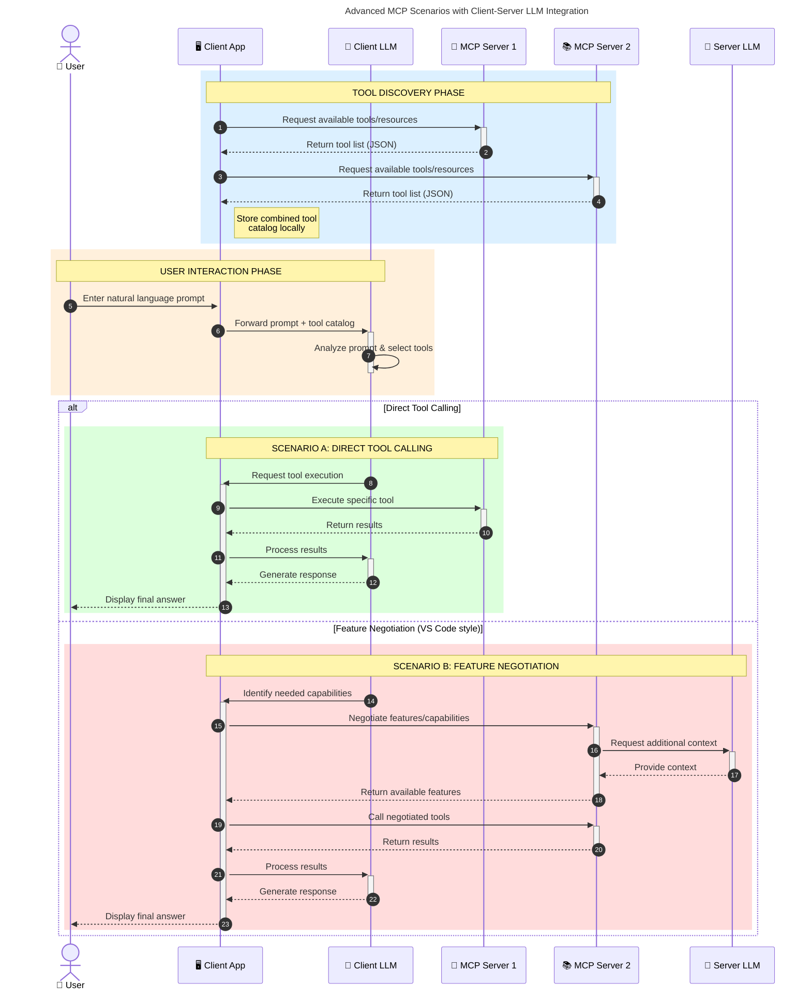

<!--
CO_OP_TRANSLATOR_METADATA:
{
  "original_hash": "1446979020432f512c883848d7eca144",
  "translation_date": "2025-05-29T21:42:23+00:00",
  "source_file": "00-Introduction/README.md",
  "language_code": "zh"
}
-->
# 模型上下文协议（MCP）简介：为何它对可扩展的 AI 应用至关重要

生成式 AI 应用是一个重要的进步，因为它们通常允许用户通过自然语言提示与应用互动。然而，随着投入更多时间和资源，您需要确保功能和资源能够轻松集成，便于扩展，支持多模型共存，并处理各种模型的复杂性。简言之，构建生成式 AI 应用起步容易，但随着应用规模和复杂度增加，您需要开始定义架构，并可能依赖某种标准来确保应用的一致构建。这正是 MCP 发挥作用、提供标准的地方。

---

## **🔍 什么是模型上下文协议（MCP）？**

**模型上下文协议（MCP）**是一种**开放的、标准化的接口**，允许大型语言模型（LLM）与外部工具、API 和数据源无缝交互。它提供了一种统一的架构，增强 AI 模型在训练数据之外的功能，使 AI 系统更智能、更具扩展性和响应性。

---

## **🎯 为什么 AI 领域需要标准化**

随着生成式 AI 应用变得越来越复杂，采用标准来保证**可扩展性、可扩展性和可维护性**变得至关重要。MCP 通过以下方式满足这些需求：

- 统一模型与工具的集成
- 减少脆弱且一次性的定制解决方案
- 允许多个模型在同一生态系统中共存

---

## **📚 学习目标**

阅读完本文后，您将能够：

- 定义**模型上下文协议（MCP）**及其应用场景
- 理解 MCP 如何标准化模型与工具之间的通信
- 识别 MCP 架构的核心组件
- 探索 MCP 在企业和开发环境中的实际应用

---

## **💡 为什么模型上下文协议（MCP）是一个变革者**

### **🔗 MCP 解决了 AI 交互中的碎片化问题**

在 MCP 出现之前，模型与工具的集成需要：

- 针对每对工具和模型编写定制代码
- 各供应商采用非标准 API
- 更新频繁导致集成中断
- 难以随着工具数量增加而扩展

### **✅ MCP 标准化的优势**

| **优势**              | **描述**                                                                    |
|-----------------------|-----------------------------------------------------------------------------|
| 互操作性              | LLM 能与不同供应商的工具无缝协作                                            |
| 一致性                | 在不同平台和工具间保持统一行为                                              |
| 可重用性              | 工具一次构建，可在多个项目和系统中复用                                        |
| 加速开发              | 通过标准化、即插即用接口减少开发时间                                          |

---

## **🧱 MCP 高层架构概览**

MCP 采用**客户端-服务器模型**，其中：

- **MCP Hosts** 运行 AI 模型
- **MCP Clients** 发起请求
- **MCP Servers** 提供上下文、工具和能力

### **关键组件：**

- **资源** – 模型使用的静态或动态数据  
- **提示** – 预定义的工作流以指导生成  
- **工具** – 可执行功能，如搜索、计算  
- **采样** – 通过递归交互实现的代理行为

---

## MCP 服务器如何工作

MCP 服务器的工作流程如下：

- **请求流程**：  
    1. MCP 客户端向运行在 MCP Host 上的 AI 模型发送请求。  
    2. AI 模型识别出需要外部工具或数据的时机。  
    3. 模型使用标准协议与 MCP 服务器通信。

- **MCP 服务器功能**：  
    - 工具注册表：维护可用工具及其功能目录。  
    - 认证：验证工具访问权限。  
    - 请求处理器：处理模型发出的工具请求。  
    - 响应格式化器：将工具输出结构化为模型可理解的格式。

- **工具执行**：  
    - 服务器将请求路由到相应的外部工具  
    - 工具执行其专门功能（搜索、计算、数据库查询等）  
    - 结果以统一格式返回给模型。

- **响应完成**：  
    - AI 模型将工具输出整合到响应中。  
    - 最终响应返回给客户端应用。

## 👨‍💻 如何构建 MCP 服务器（附示例）

MCP 服务器允许您通过提供数据和功能扩展 LLM 的能力。

准备好尝试了吗？以下是用不同语言创建简单 MCP 服务器的示例：

- **Python 示例**: https://github.com/modelcontextprotocol/python-sdk

- **TypeScript 示例**: https://github.com/modelcontextprotocol/typescript-sdk

- **Java 示例**: https://github.com/modelcontextprotocol/java-sdk

- **C#/.NET 示例**: https://github.com/modelcontextprotocol/csharp-sdk

## 🌍 MCP 的实际应用场景

MCP 通过扩展 AI 功能支持广泛的应用：

| **应用场景**              | **描述**                                                                    |
|---------------------------|-----------------------------------------------------------------------------|
| 企业数据集成              | 将 LLM 连接到数据库、CRM 或内部工具                                          |
| 代理式 AI 系统            | 支持具有工具访问和决策工作流的自主代理                                        |
| 多模态应用                | 在单一统一 AI 应用中结合文本、图像和音频工具                                  |
| 实时数据集成              | 将实时数据引入 AI 交互，实现更准确、最新的输出                                |

### 🧠 MCP = AI 交互的通用标准

模型上下文协议（MCP）就像 USB-C 统一了设备的物理连接一样，成为 AI 交互的通用标准。在 AI 领域，MCP 提供了一个一致的接口，使模型（客户端）能够无缝集成外部工具和数据提供者（服务器）。这消除了为每个 API 或数据源设计不同定制协议的需求。

根据 MCP，兼容的工具（称为 MCP 服务器）遵循统一标准。这些服务器可以列出它们提供的工具或操作，并在 AI 代理请求时执行。支持 MCP 的 AI 代理平台能够发现服务器上的可用工具，并通过标准协议调用它们。

### 💡 促进知识访问

除了提供工具，MCP 还促进了知识的访问。它使应用能够通过连接各种数据源，为大型语言模型（LLM）提供上下文。例如，某个 MCP 服务器可能代表公司的文档库，允许代理按需检索相关信息。另一个服务器可能处理特定操作，如发送电子邮件或更新记录。对代理来说，这些都只是它可以使用的工具——有些工具返回数据（知识上下文），有些执行操作。MCP 高效地管理这两者。

代理连接到 MCP 服务器时，会通过标准格式自动了解服务器的可用功能和数据。这种标准化支持动态工具的可用性。例如，将新 MCP 服务器添加到代理系统后，其功能即可立即使用，无需额外定制代理指令。

这种简化的集成流程与下方的 mermaid 图示相符，服务器既提供工具也提供知识，确保系统间的无缝协作。

### 👉 示例：可扩展的代理解决方案

### 🔄 具备客户端 LLM 集成的高级 MCP 场景

除了基本的 MCP 架构，还有更高级的场景，客户端和服务器都包含 LLM，实现更复杂的交互：

## 🔐 MCP 的实际优势

使用 MCP 的实际好处包括：

- **信息新鲜度**：模型能访问训练数据之外的最新信息  
- **能力扩展**：模型可利用专门工具完成未训练任务  
- **减少幻觉**：外部数据源提供事实依据  
- **隐私保护**：敏感数据留在安全环境中，不嵌入提示中

## 📌 关键总结

使用 MCP 的关键点：

- **MCP** 标准化 AI 模型与工具和数据的交互方式  
- 促进**可扩展性、一致性和互操作性**  
- MCP 有助于**减少开发时间、提升可靠性、扩展模型能力**  
- 客户端-服务器架构支持灵活且可扩展的 AI 应用

## 🧠 练习

思考一个您感兴趣的 AI 应用。

- 哪些**外部工具或数据**可以增强它的能力？  
- MCP 如何使集成**更简单、更可靠**？

## 额外资源

- [MCP GitHub 仓库](https://github.com/modelcontextprotocol)

## 接下来

下一章：[第1章：核心概念](/01-CoreConcepts/README.md)

**免责声明**：  
本文件使用AI翻译服务[Co-op Translator](https://github.com/Azure/co-op-translator)进行翻译。虽然我们力求准确，但请注意自动翻译可能包含错误或不准确之处。原始语言版本的文件应被视为权威来源。对于重要信息，建议使用专业人工翻译。我们不对因使用本翻译而产生的任何误解或误释承担责任。