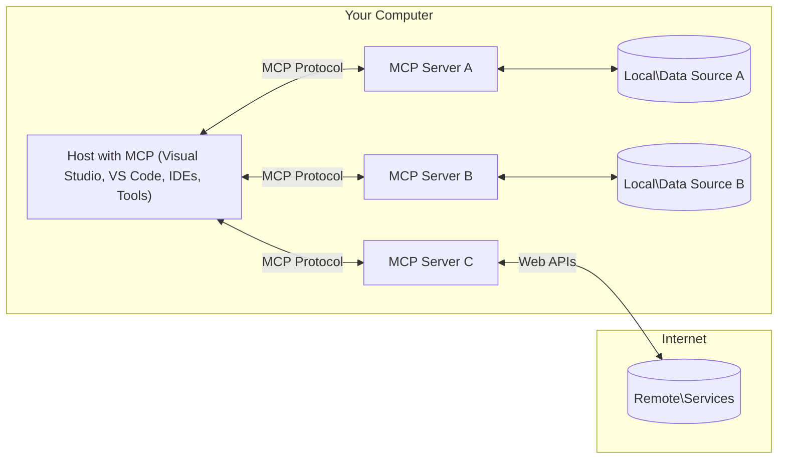

<!--
CO_OP_TRANSLATOR_METADATA:
{
  "original_hash": "904b59de1de9264801242d90a42cdd9d",
  "translation_date": "2025-09-05T10:25:07+00:00",
  "source_file": "01-CoreConcepts/README.md",
  "language_code": "zh"
}
-->
# MCP核心概念：掌握模型上下文协议以实现AI集成

[](https://youtu.be/earDzWGtE84)

_（点击上方图片观看本课视频）_

[模型上下文协议（MCP）](https://github.com/modelcontextprotocol) 是一个强大的标准化框架，用于优化大型语言模型（LLMs）与外部工具、应用程序和数据源之间的通信。本指南将带您了解MCP的核心概念，包括其客户端-服务器架构、基本组件、通信机制以及实施最佳实践。

- **明确用户同意**：所有数据访问和操作在执行前都需要用户明确批准。用户必须清楚了解将访问哪些数据以及将执行哪些操作，并对权限和授权进行细粒度控制。

- **数据隐私保护**：用户数据仅在明确同意的情况下暴露，并且在整个交互生命周期中必须通过强大的访问控制进行保护。实施必须防止未经授权的数据传输，并保持严格的隐私边界。

- **工具执行安全性**：每次工具调用都需要用户明确同意，并清楚了解工具的功能、参数和潜在影响。必须建立强大的安全边界以防止意外、不安全或恶意的工具执行。

- **传输层安全性**：所有通信渠道应使用适当的加密和认证机制。远程连接应实施安全传输协议和正确的凭证管理。

#### 实施指南：

- **权限管理**：实施细粒度的权限系统，允许用户控制哪些服务器、工具和资源可访问
- **认证与授权**：使用安全的认证方法（如OAuth、API密钥）并正确管理令牌和过期时间  
- **输入验证**：根据定义的模式验证所有参数和数据输入，以防止注入攻击
- **审计日志**：维护全面的操作日志以进行安全监控和合规性检查

## 概述

本课将探讨构成模型上下文协议（MCP）生态系统的基本架构和组件。您将了解MCP的客户端-服务器架构、关键组件以及驱动MCP交互的通信机制。

## 关键学习目标

通过本课学习，您将能够：

- 理解MCP的客户端-服务器架构。
- 识别主机、客户端和服务器的角色和职责。
- 分析使MCP成为灵活集成层的核心功能。
- 学习信息在MCP生态系统中的流动方式。
- 通过.NET、Java、Python和JavaScript的代码示例获得实践见解。

## MCP架构：深入探讨

MCP生态系统基于客户端-服务器模型构建。这种模块化结构使AI应用程序能够高效地与工具、数据库、API和上下文资源交互。让我们将此架构分解为核心组件。

MCP的核心是一个客户端-服务器架构，其中主机应用程序可以连接到多个服务器：



- **MCP主机**：如VSCode、Claude Desktop、IDE或希望通过MCP访问数据的AI工具
- **MCP客户端**：维护与服务器的一对一连接的协议客户端
- **MCP服务器**：轻量级程序，通过标准化的模型上下文协议暴露特定功能
- **本地数据源**：MCP服务器可以安全访问的计算机文件、数据库和服务
- **远程服务**：MCP服务器可以通过API连接的互联网外部系统

MCP协议是一个使用基于日期的版本控制（YYYY-MM-DD格式）的不断发展的标准。当前协议版本为**2025-06-18**。您可以查看[协议规范](https://modelcontextprotocol.io/specification/2025-06-18/)的最新更新。

### 1. 主机

在模型上下文协议（MCP）中，**主机**是AI应用程序，作为用户与协议交互的主要界面。主机通过为每个服务器连接创建专用的MCP客户端来协调和管理与多个MCP服务器的连接。主机示例包括：

- **AI应用程序**：Claude Desktop、Visual Studio Code、Claude Code
- **开发环境**：集成MCP的IDE和代码编辑器  
- **自定义应用程序**：专门构建的AI代理和工具

**主机**是协调AI模型交互的应用程序。它们：

- **协调AI模型**：执行或与LLMs交互以生成响应并协调AI工作流
- **管理客户端连接**：为每个MCP服务器连接创建并维护一个MCP客户端
- **控制用户界面**：处理对话流程、用户交互和响应展示  
- **实施安全性**：控制权限、安全约束和认证
- **处理用户同意**：管理用户对数据共享和工具执行的批准

### 2. 客户端

**客户端**是维持主机与MCP服务器之间专用一对一连接的关键组件。每个MCP客户端由主机实例化，用于连接到特定的MCP服务器，确保组织良好且安全的通信渠道。多个客户端使主机能够同时连接到多个服务器。

**客户端**是主机应用程序中的连接器组件。它们：

- **协议通信**：使用JSON-RPC 2.0向服务器发送请求，包括提示和指令
- **功能协商**：在初始化期间与服务器协商支持的功能和协议版本
- **工具执行**：管理来自模型的工具执行请求并处理响应
- **实时更新**：处理来自服务器的通知和实时更新
- **响应处理**：处理并格式化服务器响应以供用户展示

### 3. 服务器

**服务器**是为MCP客户端提供上下文、工具和功能的程序。它们可以在本地（与主机在同一台机器上）或远程（在外部平台上）执行，负责处理客户端请求并提供结构化响应。服务器通过标准化的模型上下文协议暴露特定功能。

**服务器**是提供上下文和功能的服务。它们：

- **功能注册**：向客户端注册并暴露可用的原语（资源、提示、工具）
- **请求处理**：接收并执行来自客户端的工具调用、资源请求和提示请求
- **上下文提供**：提供上下文信息和数据以增强模型响应
- **状态管理**：维护会话状态并在需要时处理有状态交互
- **实时通知**：向连接的客户端发送功能变化和更新的通知

服务器可以由任何人开发，以通过专门的功能扩展模型能力，并支持本地和远程部署场景。

### 4. 服务器原语

模型上下文协议（MCP）中的服务器提供三种核心**原语**，定义了客户端、主机和语言模型之间丰富交互的基本构建块。这些原语指定了协议中可用的上下文信息和操作类型。

MCP服务器可以暴露以下三种核心原语的任意组合：

#### 资源

**资源**是为AI应用程序提供上下文信息的数据源。它们代表静态或动态内容，可增强模型的理解和决策能力：

- **上下文数据**：为AI模型消费的结构化信息和上下文
- **知识库**：文档库、文章、手册和研究论文
- **本地数据源**：文件、数据库和本地系统信息  
- **外部数据**：API响应、网络服务和远程系统数据
- **动态内容**：根据外部条件更新的实时数据

资源通过URI标识，并支持通过`resources/list`发现和通过`resources/read`方法检索：

```text
file://documents/project-spec.md
database://production/users/schema
api://weather/current
```

#### 提示

**提示**是帮助结构化与语言模型交互的可重用模板。它们提供标准化的交互模式和模板化工作流：

- **基于模板的交互**：预先结构化的消息和对话启动器
- **工作流模板**：常见任务和交互的标准化序列
- **少样本示例**：基于示例的模型指令模板
- **系统提示**：定义模型行为和上下文的基础提示
- **动态模板**：根据特定上下文调整的参数化提示

提示支持变量替换，并可通过`prompts/list`发现和通过`prompts/get`检索：

```markdown
Generate a {{task_type}} for {{product}} targeting {{audience}} with the following requirements: {{requirements}}
```

#### 工具

**工具**是AI模型可以调用以执行特定操作的可执行功能。它们代表MCP生态系统的“动词”，使模型能够与外部系统交互：

- **可执行功能**：模型可以用特定参数调用的离散操作
- **外部系统集成**：API调用、数据库查询、文件操作、计算
- **唯一标识**：每个工具都有独特的名称、描述和参数模式
- **结构化输入/输出**：工具接受验证的参数并返回结构化、类型化的响应
- **操作能力**：使模型能够执行现实世界的操作并检索实时数据

工具通过JSON Schema定义参数验证，并可通过`tools/list`发现和通过`tools/call`执行：

```typescript
server.tool(
  "search_products", 
  {
    query: z.string().describe("Search query for products"),
    category: z.string().optional().describe("Product category filter"),
    max_results: z.number().default(10).describe("Maximum results to return")
  }, 
  async (params) => {
    // Execute search and return structured results
    return await productService.search(params);
  }
);
```

## 客户端原语

在模型上下文协议（MCP）中，**客户端**可以暴露原语，使服务器能够从主机应用程序请求额外的功能。这些客户端原语允许更丰富、更互动的服务器实现，能够访问AI模型功能和用户交互。

### 采样

**采样**允许服务器从客户端的AI应用程序请求语言模型补全。此原语使服务器能够访问LLM功能，而无需嵌入自己的模型依赖项：

- **模型独立访问**：服务器可以请求补全，而无需包含LLM SDK或管理模型访问
- **服务器发起AI**：使服务器能够自主使用客户端的AI模型生成内容
- **递归LLM交互**：支持服务器需要AI协助处理的复杂场景
- **动态内容生成**：允许服务器使用主机的模型创建上下文响应

采样通过`sampling/complete`方法发起，服务器向客户端发送补全请求。

### 引导

**引导**使服务器能够通过客户端界面请求用户的额外信息或确认：

- **用户输入请求**：服务器可以在工具执行时需要时请求额外信息
- **确认对话框**：请求用户批准敏感或有影响的操作
- **互动工作流**：使服务器能够创建逐步的用户交互
- **动态参数收集**：在工具执行期间收集缺失或可选参数

引导请求通过`elicitation/request`方法发起，以通过客户端界面收集用户输入。

### 日志记录

**日志记录**允许服务器向客户端发送结构化日志消息，用于调试、监控和操作可见性：

- **调试支持**：使服务器能够提供详细的执行日志以进行故障排除
- **操作监控**：向客户端发送状态更新和性能指标
- **错误报告**：提供详细的错误上下文和诊断信息
- **审计追踪**：创建服务器操作和决策的全面日志

日志消息发送到客户端，以提供服务器操作的透明性并促进调试。

## MCP中的信息流

模型上下文协议（MCP）定义了主机、客户端、服务器和模型之间的信息流结构。理解此流动有助于明确用户请求如何处理以及外部工具和数据如何集成到模型响应中。

- **主机发起连接**  
  主机应用程序（如IDE或聊天界面）通过STDIO、WebSocket或其他支持的传输方式建立与MCP服务器的连接。

- **功能协商**  
  嵌入在主机中的客户端与服务器交换有关其支持的功能、工具、资源和协议版本的信息。这确保双方了解会话中可用的功能。

- **用户请求**  
  用户与主机交互（例如输入提示或命令）。主机收集此输入并将其传递给客户端进行处理。

- **资源或工具使用**  
  - 客户端可能会向服务器请求额外的上下文或资源（如文件、数据库条目或知识库文章），以丰富模型的理解。
  - 如果模型确定需要工具（例如获取数据、执行计算或调用API），客户端会向服务器发送工具调用请求，指定工具名称和参数。

- **服务器执行**  
  服务器接收资源或工具请求，执行必要的操作（如运行函数、查询数据库或检索文件），并以结构化格式将结果返回给客户端。

- **响应生成**  
  客户端将服务器的响应（资源数据、工具输出等）集成到正在进行的模型交互中。模型使用这些信息生成全面且上下文相关的响应。

- **结果展示**  
  主机从客户端接收最终输出，并将其展示给用户，通常包括模型生成的文本以及工具执行或资源查找的结果。

此流程使MCP能够通过无缝连接模型与外部工具和数据源，支持高级、互动和上下文感知的AI应用程序。

## 协议架构与层次

MCP由两个独立的架构层组成，它们协同工作以提供完整的通信框架：

### 数据层

**数据层**使用**JSON-RPC 2.0**作为基础实现核心MCP协议。此层定义消息结构、语义和交互模式：

#### 核心组件：
- **JSON-RPC 2.0 协议**：所有通信均使用标准化的 JSON-RPC 2.0 消息格式进行方法调用、响应和通知  
- **生命周期管理**：处理客户端与服务器之间的连接初始化、能力协商和会话终止  
- **服务器原语**：使服务器能够通过工具、资源和提示提供核心功能  
- **客户端原语**：使服务器能够请求从 LLM 采样、获取用户输入并发送日志消息  
- **实时通知**：支持异步通知，实现动态更新，无需轮询  

#### 主要功能：

- **协议版本协商**：使用基于日期的版本控制（YYYY-MM-DD）以确保兼容性  
- **能力发现**：客户端和服务器在初始化期间交换支持的功能信息  
- **有状态会话**：在多次交互中维护连接状态，以确保上下文连续性  

### 传输层

**传输层**管理 MCP 参与者之间的通信通道、消息框架和身份验证：

#### 支持的传输机制：

1. **STDIO 传输**：
   - 使用标准输入/输出流进行直接的进程通信  
   - 最适合在同一台机器上运行的本地进程，无网络开销  
   - 常用于本地 MCP 服务器实现  

2. **可流式 HTTP 传输**：
   - 使用 HTTP POST 发送客户端到服务器的消息  
   - 可选的服务器发送事件（SSE）用于服务器到客户端的流式通信  
   - 支持跨网络的远程服务器通信  
   - 支持标准 HTTP 身份验证（Bearer 令牌、API 密钥、自定义头部）  
   - MCP 推荐使用 OAuth 进行安全的基于令牌的身份验证  

#### 传输抽象：

传输层将通信细节从数据层中抽象出来，使所有传输机制均可使用相同的 JSON-RPC 2.0 消息格式。这种抽象允许应用程序在本地和远程服务器之间无缝切换。

### 安全性考量

MCP 实现必须遵循若干关键安全原则，以确保所有协议操作的安全性、可信性和可靠性：

- **用户同意与控制**：在访问任何数据或执行任何操作之前，用户必须明确同意。用户应能够清楚地控制共享的数据和授权的操作，并通过直观的用户界面审查和批准活动。  

- **数据隐私**：用户数据仅在明确同意的情况下暴露，并且必须通过适当的访问控制进行保护。MCP 实现必须防止未经授权的数据传输，并确保在所有交互中维护隐私。  

- **工具安全性**：在调用任何工具之前，必须获得用户的明确同意。用户应清楚了解每个工具的功能，并强制执行强大的安全边界，以防止意外或不安全的工具执行。  

通过遵循这些安全原则，MCP 确保在实现强大的 AI 集成的同时，维护用户的信任、隐私和安全。

## 代码示例：关键组件

以下是几个流行编程语言的代码示例，展示了如何实现 MCP 服务器的关键组件和工具。

### .NET 示例：创建一个简单的 MCP 服务器及工具

以下是一个实用的 .NET 代码示例，展示了如何实现一个带有自定义工具的简单 MCP 服务器。此示例展示了如何定义和注册工具、处理请求以及通过模型上下文协议连接服务器。

```csharp
using System;
using System.Threading.Tasks;
using ModelContextProtocol.Server;
using ModelContextProtocol.Server.Transport;
using ModelContextProtocol.Server.Tools;

public class WeatherServer
{
    public static async Task Main(string[] args)
    {
        // Create an MCP server
        var server = new McpServer(
            name: "Weather MCP Server",
            version: "1.0.0"
        );
        
        // Register our custom weather tool
        server.AddTool<string, WeatherData>("weatherTool", 
            description: "Gets current weather for a location",
            execute: async (location) => {
                // Call weather API (simplified)
                var weatherData = await GetWeatherDataAsync(location);
                return weatherData;
            });
        
        // Connect the server using stdio transport
        var transport = new StdioServerTransport();
        await server.ConnectAsync(transport);
        
        Console.WriteLine("Weather MCP Server started");
        
        // Keep the server running until process is terminated
        await Task.Delay(-1);
    }
    
    private static async Task<WeatherData> GetWeatherDataAsync(string location)
    {
        // This would normally call a weather API
        // Simplified for demonstration
        await Task.Delay(100); // Simulate API call
        return new WeatherData { 
            Temperature = 72.5,
            Conditions = "Sunny",
            Location = location
        };
    }
}

public class WeatherData
{
    public double Temperature { get; set; }
    public string Conditions { get; set; }
    public string Location { get; set; }
}
```

### Java 示例：MCP 服务器组件

此示例展示了与上述 .NET 示例相同的 MCP 服务器和工具注册，但使用 Java 实现。

```java
import io.modelcontextprotocol.server.McpServer;
import io.modelcontextprotocol.server.McpToolDefinition;
import io.modelcontextprotocol.server.transport.StdioServerTransport;
import io.modelcontextprotocol.server.tool.ToolExecutionContext;
import io.modelcontextprotocol.server.tool.ToolResponse;

public class WeatherMcpServer {
    public static void main(String[] args) throws Exception {
        // Create an MCP server
        McpServer server = McpServer.builder()
            .name("Weather MCP Server")
            .version("1.0.0")
            .build();
            
        // Register a weather tool
        server.registerTool(McpToolDefinition.builder("weatherTool")
            .description("Gets current weather for a location")
            .parameter("location", String.class)
            .execute((ToolExecutionContext ctx) -> {
                String location = ctx.getParameter("location", String.class);
                
                // Get weather data (simplified)
                WeatherData data = getWeatherData(location);
                
                // Return formatted response
                return ToolResponse.content(
                    String.format("Temperature: %.1f°F, Conditions: %s, Location: %s", 
                    data.getTemperature(), 
                    data.getConditions(), 
                    data.getLocation())
                );
            })
            .build());
        
        // Connect the server using stdio transport
        try (StdioServerTransport transport = new StdioServerTransport()) {
            server.connect(transport);
            System.out.println("Weather MCP Server started");
            // Keep server running until process is terminated
            Thread.currentThread().join();
        }
    }
    
    private static WeatherData getWeatherData(String location) {
        // Implementation would call a weather API
        // Simplified for example purposes
        return new WeatherData(72.5, "Sunny", location);
    }
}

class WeatherData {
    private double temperature;
    private String conditions;
    private String location;
    
    public WeatherData(double temperature, String conditions, String location) {
        this.temperature = temperature;
        this.conditions = conditions;
        this.location = location;
    }
    
    public double getTemperature() {
        return temperature;
    }
    
    public String getConditions() {
        return conditions;
    }
    
    public String getLocation() {
        return location;
    }
}
```

### Python 示例：构建 MCP 服务器

此示例使用 fastmcp，请确保首先安装它：

```python
pip install fastmcp
```  
代码示例：

```python
#!/usr/bin/env python3
import asyncio
from fastmcp import FastMCP
from fastmcp.transports.stdio import serve_stdio

# Create a FastMCP server
mcp = FastMCP(
    name="Weather MCP Server",
    version="1.0.0"
)

@mcp.tool()
def get_weather(location: str) -> dict:
    """Gets current weather for a location."""
    return {
        "temperature": 72.5,
        "conditions": "Sunny",
        "location": location
    }

# Alternative approach using a class
class WeatherTools:
    @mcp.tool()
    def forecast(self, location: str, days: int = 1) -> dict:
        """Gets weather forecast for a location for the specified number of days."""
        return {
            "location": location,
            "forecast": [
                {"day": i+1, "temperature": 70 + i, "conditions": "Partly Cloudy"}
                for i in range(days)
            ]
        }

# Register class tools
weather_tools = WeatherTools()

# Start the server
if __name__ == "__main__":
    asyncio.run(serve_stdio(mcp))
```

### JavaScript 示例：创建 MCP 服务器

此示例展示了如何在 JavaScript 中创建 MCP 服务器并注册两个与天气相关的工具。

```javascript
// Using the official Model Context Protocol SDK
import { McpServer } from "@modelcontextprotocol/sdk/server/mcp.js";
import { StdioServerTransport } from "@modelcontextprotocol/sdk/server/stdio.js";
import { z } from "zod"; // For parameter validation

// Create an MCP server
const server = new McpServer({
  name: "Weather MCP Server",
  version: "1.0.0"
});

// Define a weather tool
server.tool(
  "weatherTool",
  {
    location: z.string().describe("The location to get weather for")
  },
  async ({ location }) => {
    // This would normally call a weather API
    // Simplified for demonstration
    const weatherData = await getWeatherData(location);
    
    return {
      content: [
        { 
          type: "text", 
          text: `Temperature: ${weatherData.temperature}°F, Conditions: ${weatherData.conditions}, Location: ${weatherData.location}` 
        }
      ]
    };
  }
);

// Define a forecast tool
server.tool(
  "forecastTool",
  {
    location: z.string(),
    days: z.number().default(3).describe("Number of days for forecast")
  },
  async ({ location, days }) => {
    // This would normally call a weather API
    // Simplified for demonstration
    const forecast = await getForecastData(location, days);
    
    return {
      content: [
        { 
          type: "text", 
          text: `${days}-day forecast for ${location}: ${JSON.stringify(forecast)}` 
        }
      ]
    };
  }
);

// Helper functions
async function getWeatherData(location) {
  // Simulate API call
  return {
    temperature: 72.5,
    conditions: "Sunny",
    location: location
  };
}

async function getForecastData(location, days) {
  // Simulate API call
  return Array.from({ length: days }, (_, i) => ({
    day: i + 1,
    temperature: 70 + Math.floor(Math.random() * 10),
    conditions: i % 2 === 0 ? "Sunny" : "Partly Cloudy"
  }));
}

// Connect the server using stdio transport
const transport = new StdioServerTransport();
server.connect(transport).catch(console.error);

console.log("Weather MCP Server started");
```

此 JavaScript 示例展示了如何创建一个 MCP 客户端，连接到服务器，发送提示，并处理包括工具调用在内的响应。

## 安全性与授权

MCP 包含多个内置概念和机制，用于在协议中管理安全性和授权：

1. **工具权限控制**：  
   客户端可以指定模型在会话期间允许使用的工具。这确保只有明确授权的工具可用，从而降低意外或不安全操作的风险。权限可以根据用户偏好、组织政策或交互上下文动态配置。  

2. **身份验证**：  
   服务器可以在授予工具、资源或敏感操作的访问权限之前要求身份验证。这可能涉及 API 密钥、OAuth 令牌或其他身份验证方案。适当的身份验证确保只有受信任的客户端和用户能够调用服务器端功能。  

3. **验证**：  
   所有工具调用都强制执行参数验证。每个工具定义其参数的预期类型、格式和约束，服务器会相应地验证传入请求。这可以防止格式错误或恶意输入到达工具实现，并有助于维护操作的完整性。  

4. **速率限制**：  
   为防止滥用并确保服务器资源的公平使用，MCP 服务器可以对工具调用和资源访问实施速率限制。速率限制可以按用户、会话或全局应用，有助于防止拒绝服务攻击或过度资源消耗。  

通过结合这些机制，MCP 为将语言模型与外部工具和数据源集成提供了安全的基础，同时为用户和开发者提供了对访问和使用的细粒度控制。

## 协议消息与通信流程

MCP 通信使用结构化的 **JSON-RPC 2.0** 消息，以便在主机、客户端和服务器之间实现清晰可靠的交互。协议为不同类型的操作定义了特定的消息模式：

### 核心消息类型：

#### **初始化消息**
- **`initialize` 请求**：建立连接并协商协议版本和能力  
- **`initialize` 响应**：确认支持的功能和服务器信息  
- **`notifications/initialized`**：表示初始化完成，会话已准备就绪  

#### **发现消息**
- **`tools/list` 请求**：发现服务器提供的可用工具  
- **`resources/list` 请求**：列出可用资源（数据源）  
- **`prompts/list` 请求**：检索可用的提示模板  

#### **执行消息**  
- **`tools/call` 请求**：使用提供的参数执行特定工具  
- **`resources/read` 请求**：从特定资源中检索内容  
- **`prompts/get` 请求**：获取带有可选参数的提示模板  

#### **客户端消息**
- **`sampling/complete` 请求**：服务器请求客户端完成 LLM 采样  
- **`elicitation/request`**：服务器通过客户端界面请求用户输入  
- **日志消息**：服务器向客户端发送结构化日志消息  

#### **通知消息**
- **`notifications/tools/list_changed`**：服务器通知客户端工具列表发生变化  
- **`notifications/resources/list_changed`**：服务器通知客户端资源列表发生变化  
- **`notifications/prompts/list_changed`**：服务器通知客户端提示列表发生变化  

### 消息结构：

所有 MCP 消息均遵循 JSON-RPC 2.0 格式，包括：  
- **请求消息**：包含 `id`、`method` 和可选的 `params`  
- **响应消息**：包含 `id` 和 `result` 或 `error`  
- **通知消息**：包含 `method` 和可选的 `params`（无 `id`，不期望响应）  

这种结构化通信确保了可靠、可追踪和可扩展的交互，支持高级场景如实时更新、工具链和健壮的错误处理。

## 关键要点

- **架构**：MCP 使用客户端-服务器架构，主机管理多个客户端与服务器的连接  
- **参与者**：生态系统包括主机（AI 应用）、客户端（协议连接器）和服务器（能力提供者）  
- **传输机制**：通信支持 STDIO（本地）和可流式 HTTP（远程，带可选 SSE）  
- **核心原语**：服务器暴露工具（可执行函数）、资源（数据源）和提示（模板）  
- **客户端原语**：服务器可以请求采样（LLM 完成）、引导（用户输入）和日志记录  
- **协议基础**：基于 JSON-RPC 2.0，使用基于日期的版本控制（当前版本：2025-06-18）  
- **实时能力**：支持通知以实现动态更新和实时同步  
- **安全优先**：明确的用户同意、数据隐私保护和安全传输是核心要求  

## 练习

设计一个在您的领域中有用的简单 MCP 工具。定义：  
1. 工具的名称  
2. 接受的参数  
3. 返回的输出  
4. 模型如何使用该工具解决用户问题  

---

## 接下来

下一步：[第 2 章：安全性](../02-Security/README.md)  

---

**免责声明**：  
本文档使用AI翻译服务[Co-op Translator](https://github.com/Azure/co-op-translator)进行翻译。尽管我们努力确保准确性，但请注意，自动翻译可能包含错误或不准确之处。应以原始语言的文档作为权威来源。对于关键信息，建议使用专业人工翻译。对于因使用本翻译而引起的任何误解或误读，我们概不负责。