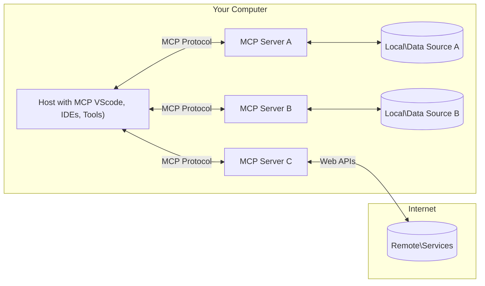

<!--
CO_OP_TRANSLATOR_METADATA:
{
  "original_hash": "355b12a5970c5c9e6db0bee970c751ba",
  "translation_date": "2025-07-04T15:54:34+00:00",
  "source_file": "01-CoreConcepts/README.md",
  "language_code": "zh"
}
-->
# 📖 MCP 核心概念：掌握模型上下文协议以实现 AI 集成

[Model Context Protocol (MCP)](https://github.com/modelcontextprotocol) 是一个强大且标准化的框架，优化了大型语言模型（LLM）与外部工具、应用程序和数据源之间的通信。本文将带你深入了解 MCP 的核心概念，确保你理解其客户端-服务器架构、关键组件、通信机制及最佳实现实践。

## 概述

本课将探讨构成模型上下文协议（MCP）生态系统的基础架构和组件。你将了解客户端-服务器架构、关键组件以及驱动 MCP 交互的通信机制。

## 👩‍🎓 主要学习目标

完成本课后，你将能够：

- 理解 MCP 的客户端-服务器架构。
- 明确 Hosts、Clients 和 Servers 的角色与职责。
- 分析使 MCP 成为灵活集成层的核心特性。
- 掌握 MCP 生态系统中的信息流动。
- 通过 .NET、Java、Python 和 JavaScript 的代码示例获得实用见解。

## 🔎 MCP 架构：深入解析

MCP 生态系统基于客户端-服务器模型构建。这种模块化结构使 AI 应用能够高效地与工具、数据库、API 及上下文资源交互。下面我们将拆解这一架构的核心组件。

MCP 核心遵循客户端-服务器架构，主机应用可以连接多个服务器：



- **MCP Hosts**：如 VSCode、Claude Desktop、IDE 或希望通过 MCP 访问数据的 AI 工具等程序
- **MCP Clients**：与服务器保持一对一连接的协议客户端
- **MCP Servers**：通过标准化的模型上下文协议暴露特定功能的轻量级程序
- **本地数据源**：MCP 服务器可以安全访问的计算机文件、数据库和服务
- **远程服务**：MCP 服务器可通过 API 连接的互联网外部系统

MCP 协议是一个不断发展的标准，最新更新可见于[协议规范](https://modelcontextprotocol.io/specification/2025-06-18/)

### 1. Hosts

在模型上下文协议（MCP）中，Hosts 扮演着用户与协议交互的主要接口角色。Hosts 是启动与 MCP 服务器连接以访问数据、工具和提示的应用或环境。Hosts 的例子包括集成开发环境（IDE）如 Visual Studio Code、AI 工具如 Claude Desktop，或为特定任务定制的代理程序。

**Hosts** 是启动连接的 LLM 应用。它们：

- 执行或与 AI 模型交互以生成响应。
- 发起与 MCP 服务器的连接。
- 管理对话流程和用户界面。
- 控制权限和安全限制。
- 处理用户对数据共享和工具执行的同意。

### 2. Clients

Clients 是促进 Hosts 与 MCP 服务器交互的重要组件。Clients 作为中介，使 Hosts 能够访问和利用 MCP 服务器提供的功能。它们在确保 MCP 架构内通信顺畅和数据高效交换中发挥关键作用。

**Clients** 是主机应用内的连接器。它们：

- 向服务器发送带有提示/指令的请求。
- 与服务器协商功能。
- 管理模型发起的工具执行请求。
- 处理并向用户展示响应。

### 3. Servers

Servers 负责处理来自 MCP clients 的请求并提供相应的响应。它们管理数据检索、工具执行和提示生成等多种操作。Servers 确保客户端与 Hosts 之间的通信高效且可靠，维护交互过程的完整性。

**Servers** 是提供上下文和功能的服务。它们：

- 注册可用功能（资源、提示、工具）
- 接收并执行来自客户端的工具调用
- 提供上下文信息以增强模型响应
- 将输出返回给客户端
- 在需要时维护交互状态

任何人都可以开发服务器，以专门功能扩展模型能力。

### 4. Server Features

模型上下文协议（MCP）中的服务器提供了基本构建模块，使客户端、主机和语言模型之间的交互更加丰富。这些功能旨在通过提供结构化的上下文、工具和提示来增强 MCP 的能力。

MCP 服务器可以提供以下任意功能：

#### 📑 资源

模型上下文协议（MCP）中的资源涵盖用户或 AI 模型可利用的各种上下文和数据类型，包括：

- **上下文数据**：用户或 AI 模型可用于决策和任务执行的信息和背景。
- **知识库和文档库**：结构化和非结构化数据集合，如文章、手册和研究论文，提供有价值的见解和信息。
- **本地文件和数据库**：存储在设备或数据库中的数据，可供处理和分析。
- **API 和网络服务**：提供额外数据和功能的外部接口和服务，实现与各种在线资源和工具的集成。

资源示例可以是数据库模式或可通过如下方式访问的文件：

```text
file://log.txt
database://schema
```

### 🤖 提示

模型上下文协议（MCP）中的提示包括各种预定义模板和交互模式，旨在简化用户工作流程并增强沟通效果。这些包括：

- **模板化消息和工作流**：预先结构化的消息和流程，引导用户完成特定任务和交互。
- **预定义交互模式**：标准化的动作和响应序列，促进一致且高效的沟通。
- **专用对话模板**：针对特定类型对话定制的模板，确保相关且符合上下文的交互。

提示模板示例如下：

```markdown
Generate a product slogan based on the following {{product}} with the following {{keywords}}
```

#### ⛏️ 工具

模型上下文协议（MCP）中的工具是 AI 模型可执行以完成特定任务的函数。这些工具旨在通过提供结构化且可靠的操作来增强 AI 模型的能力。关键点包括：

- **供 AI 模型执行的函数**：工具是 AI 模型可调用以执行各种任务的可执行函数。
- **唯一名称和描述**：每个工具都有独特名称和详细描述，说明其用途和功能。
- **参数和输出**：工具接受特定参数并返回结构化输出，确保结果一致且可预测。
- **独立功能**：工具执行独立功能，如网页搜索、计算和数据库查询。

工具示例可能如下：

```typescript
server.tool(
  "GetProducts",
  {
    pageSize: z.string().optional(),
    pageCount: z.string().optional()
  }, () => {
    // return results from API
  }
)
```

## Client Features

在模型上下文协议（MCP）中，客户端为服务器提供多项关键功能，增强协议内的整体功能和交互。其中一个显著功能是采样（Sampling）。

### 👉 采样

- **服务器发起的自主行为**：客户端使服务器能够自主发起特定动作或行为，增强系统的动态能力。
- **递归 LLM 交互**：此功能支持与大型语言模型（LLM）的递归交互，实现更复杂和迭代的任务处理。
- **请求额外模型补全**：服务器可以请求模型提供额外的补全，确保响应全面且符合上下文。

## MCP 中的信息流

模型上下文协议（MCP）定义了 Hosts、Clients、Servers 和模型之间的结构化信息流。理解此流程有助于理清用户请求的处理方式以及外部工具和数据如何融入模型响应。

- **Host 发起连接**  
  Host 应用（如 IDE 或聊天界面）通过 STDIO、WebSocket 或其他支持的传输方式与 MCP 服务器建立连接。

- **功能协商**  
  嵌入在 Host 中的客户端与服务器交换支持的功能、工具、资源和协议版本信息，确保双方了解会话可用的能力。

- **用户请求**  
  用户与 Host 交互（例如输入提示或命令）。Host 收集输入并传递给客户端处理。

- **资源或工具使用**  
  - 客户端可能向服务器请求额外上下文或资源（如文件、数据库条目或知识库文章），以丰富模型理解。
  - 如果模型判断需要工具（如获取数据、执行计算或调用 API），客户端会向服务器发送工具调用请求，指定工具名称和参数。

- **服务器执行**  
  服务器接收资源或工具请求，执行必要操作（如运行函数、查询数据库或检索文件），并以结构化格式将结果返回给客户端。

- **响应生成**  
  客户端将服务器响应（资源数据、工具输出等）整合进模型交互中。模型利用这些信息生成全面且符合上下文的响应。

- **结果呈现**  
  Host 接收客户端的最终输出并展示给用户，通常包括模型生成的文本及任何工具执行或资源查询的结果。

此流程使 MCP 能够通过无缝连接模型与外部工具和数据源，支持高级、交互式和上下文感知的 AI 应用。

## 协议细节

MCP（模型上下文协议）基于[JSON-RPC 2.0](https://www.jsonrpc.org/)构建，提供标准化、语言无关的消息格式，用于 Hosts、Clients 和 Servers 之间的通信。该基础确保跨平台和多编程语言的可靠、结构化且可扩展的交互。

### 关键协议特性

MCP 在 JSON-RPC 2.0 基础上扩展了工具调用、资源访问和提示管理的约定。支持多种传输层（STDIO、WebSocket、SSE），实现组件间安全、可扩展且语言无关的通信。

#### 🧢 基础协议

- **JSON-RPC 消息格式**：所有请求和响应均遵循 JSON-RPC 2.0 规范，确保方法调用、参数、结果和错误处理结构一致。
- **有状态连接**：MCP 会话在多次请求间保持状态，支持持续对话、上下文积累和资源管理。
- **功能协商**：连接建立时，客户端和服务器交换支持的功能、协议版本、可用工具和资源信息，确保双方理解彼此能力并能相应调整。

#### ➕ 额外工具

以下是 MCP 提供的一些额外工具和协议扩展，旨在提升开发者体验并支持高级场景：

- **配置选项**：MCP 允许动态配置会话参数，如工具权限、资源访问和模型设置，针对每次交互进行定制。
- **进度跟踪**：长时间运行的操作可报告进度更新，支持响应式用户界面和更佳用户体验。
- **请求取消**：客户端可取消正在进行的请求，允许用户中断不再需要或耗时过长的操作。
- **错误报告**：标准化的错误消息和代码有助于诊断问题、优雅处理失败并向用户和开发者提供可操作反馈。
- **日志记录**：客户端和服务器均可生成结构化日志，用于审计、调试和监控协议交互。

通过利用这些协议特性，MCP 确保语言模型与外部工具或数据源之间的通信稳健、安全且灵活。

### 🔐 安全注意事项

MCP 实现应遵循若干关键安全原则，确保交互安全可信：

- **用户同意与控制**：在访问任何数据或执行操作前，必须获得用户明确同意。用户应清楚掌控共享的数据和授权的操作，并通过直观的用户界面审查和批准活动。
- **数据隐私**：用户数据仅在明确同意下暴露，且必须通过适当访问控制保护。MCP 实现需防止未经授权的数据传输，确保所有交互中隐私得到维护。
- **工具安全**：调用任何工具前需获得明确用户同意。用户应充分了解每个工具的功能，且必须强制执行严格的安全边界，防止工具被误用或执行不安全操作。

遵循这些原则，MCP 确保在所有协议交互中维护用户信任、隐私和安全。

## 代码示例：关键组件

以下是几个流行编程语言的代码示例，展示如何实现 MCP 服务器的关键组件和工具。

### .NET 示例：创建带工具的简单 MCP 服务器

这是一个实用的 .NET 代码示例，演示如何实现带自定义工具的简单 MCP 服务器。示例展示了如何定义和注册工具、处理请求以及使用模型上下文协议连接服务器。

```csharp
using System;
using System.Threading.Tasks;
using ModelContextProtocol.Server;
using ModelContextProtocol.Server.Transport;
using ModelContextProtocol.Server.Tools;

public class WeatherServer
{
    public static async Task Main(string[] args)
    {
        // Create an MCP server
        var server = new McpServer(
            name: "Weather MCP Server",
            version: "1.0.0"
        );
        
        // Register our custom weather tool
        server.AddTool<string, WeatherData>("weatherTool", 
            description: "Gets current weather for a location",
            execute: async (location) => {
                // Call weather API (simplified)
                var weatherData = await GetWeatherDataAsync(location);
                return weatherData;
            });
        
        // Connect the server using stdio transport
        var transport = new StdioServerTransport();
        await server.ConnectAsync(transport);
        
        Console.WriteLine("Weather MCP Server started");
        
        // Keep the server running until process is terminated
        await Task.Delay(-1);
    }
    
    private static async Task<WeatherData> GetWeatherDataAsync(string location)
    {
        // This would normally call a weather API
        // Simplified for demonstration
        await Task.Delay(100); // Simulate API call
        return new WeatherData { 
            Temperature = 72.5,
            Conditions = "Sunny",
            Location = location
        };
    }
}

public class WeatherData
{
    public double Temperature { get; set; }
    public string Conditions { get; set; }
    public string Location { get; set; }
}
```

### Java 示例：MCP 服务器组件

此示例展示了与上述 .NET 示例相同的 MCP 服务器和工具注册，但用 Java 实现。

```java
import io.modelcontextprotocol.server.McpServer;
import io.modelcontextprotocol.server.McpToolDefinition;
import io.modelcontextprotocol.server.transport.StdioServerTransport;
import io.modelcontextprotocol.server.tool.ToolExecutionContext;
import io.modelcontextprotocol.server.tool.ToolResponse;

public class WeatherMcpServer {
    public static void main(String[] args) throws Exception {
        // Create an MCP server
        McpServer server = McpServer.builder()
            .name("Weather MCP Server")
            .version("1.0.0")
            .build();
            
        // Register a weather tool
        server.registerTool(McpToolDefinition.builder("weatherTool")
            .description("Gets current weather for a location")
            .parameter("location", String.class)
            .execute((ToolExecutionContext ctx) -> {
                String location = ctx.getParameter("location", String.class);
                
                // Get weather data (simplified)
                WeatherData data = getWeatherData(location);
                
                // Return formatted response
                return ToolResponse.content(
                    String.format("Temperature: %.1f°F, Conditions: %s, Location: %s", 
                    data.getTemperature(), 
                    data.getConditions(), 
                    data.getLocation())
                );
            })
            .build());
        
        // Connect the server using stdio transport
        try (StdioServerTransport transport = new StdioServerTransport()) {
            server.connect(transport);
            System.out.println("Weather MCP Server started");
            // Keep server running until process is terminated
            Thread.currentThread().join();
        }
    }
    
    private static WeatherData getWeatherData(String location) {
        // Implementation would call a weather API
        // Simplified for example purposes
        return new WeatherData(72.5, "Sunny", location);
    }
}

class WeatherData {
    private double temperature;
    private String conditions;
    private String location;
    
    public WeatherData(double temperature, String conditions, String location) {
        this.temperature = temperature;
        this.conditions = conditions;
        this.location = location;
    }
    
    public double getTemperature() {
        return temperature;
    }
    
    public String getConditions() {
        return conditions;
    }
    
    public String getLocation() {
        return location;
    }
}
```

### Python 示例：构建 MCP 服务器

本示例展示如何用 Python 构建 MCP 服务器，并演示两种创建工具的不同方法。

```python
#!/usr/bin/env python3
import asyncio
from mcp.server.fastmcp import FastMCP
from mcp.server.transports.stdio import serve_stdio

# Create a FastMCP server
mcp = FastMCP(
    name="Weather MCP Server",
    version="1.0.0"
)

@mcp.tool()
def get_weather(location: str) -> dict:
    """Gets current weather for a location."""
    # This would normally call a weather API
    # Simplified for demonstration
    return {
        "temperature": 72.5,
        "conditions": "Sunny",
        "location": location
    }

# Alternative approach using a class
class WeatherTools:
    @mcp.tool()
    def forecast(self, location: str, days: int = 1) -> dict:
        """Gets weather forecast for a location for the specified number of days."""
        # This would normally call a weather API forecast endpoint
        # Simplified for demonstration
        return {
            "location": location,
            "forecast": [
                {"day": i+1, "temperature": 70 + i, "conditions": "Partly Cloudy"}
                for i in range(days)
            ]
        }

# Instantiate the class to register its tools
weather_tools = WeatherTools()

# Start the server using stdio transport
if __name__ == "__main__":
    asyncio.run(serve_stdio(mcp))
```

### JavaScript 示例：创建 MCP 服务器

此示例展示了如何用 JavaScript 创建 MCP 服务器，并注册两个与天气相关的工具。

```javascript
// Using the official Model Context Protocol SDK
import { McpServer } from "@modelcontextprotocol/sdk/server/mcp.js";
import { StdioServerTransport } from "@modelcontextprotocol/sdk/server/stdio.js";
import { z } from "zod"; // For parameter validation

// Create an MCP server
const server = new McpServer({
  name: "Weather MCP Server",
  version: "1.0.0"
});

// Define a weather tool
server.tool(
  "weatherTool",
  {
    location: z.string().describe("The location to get weather for")
  },
  async ({ location }) => {
    // This would normally call a weather API
    // Simplified for demonstration
    const weatherData = await getWeatherData(location);
    
    return {
      content: [
        { 
          type: "text", 
          text: `Temperature: ${weatherData.temperature}°F, Conditions: ${weatherData.conditions}, Location: ${weatherData.location}` 
        }
      ]
    };
  }
);

// Define a forecast tool
server.tool(
  "forecastTool",
  {
    location: z.string(),
    days: z.number().default(3).describe("Number of days for forecast")
  },
  async ({ location, days }) => {
    // This would normally call a weather API
    // Simplified for demonstration
    const forecast = await getForecastData(location, days);
    
    return {
      content: [
        { 
          type: "text", 
          text: `${days}-day forecast for ${location}: ${JSON.stringify(forecast)}` 
        }
      ]
    };
  }
);

// Helper functions
async function getWeatherData(location) {
  // Simulate API call
  return {
    temperature: 72.5,
    conditions: "Sunny",
    location: location
  };
}

async function getForecastData(location, days) {
  // Simulate API call
  return Array.from({ length: days }, (_, i) => ({
    day: i + 1,
    temperature: 70 + Math.floor(Math.random() * 10),
    conditions: i % 2 === 0 ? "Sunny" : "Partly Cloudy"
  }));
}

// Connect the server using stdio transport
const transport = new StdioServerTransport();
server.connect(transport).catch(console.error);

console.log("Weather MCP Server started");
```

该 JavaScript 示例演示如何创建 MCP 客户端，连接服务器，发送提示，并处理包括工具调用在内的响应。

## 安全与授权
MCP 包含了多个内置的概念和机制，用于在整个协议中管理安全性和授权：

1. **工具权限控制**：  
  客户端可以指定模型在会话期间允许使用哪些工具。这确保只有明确授权的工具可以被访问，降低了意外或不安全操作的风险。权限可以根据用户偏好、组织政策或交互上下文动态配置。

2. **身份验证**：  
  服务器可以要求在授予工具、资源或敏感操作访问权限之前进行身份验证。这可能涉及 API 密钥、OAuth 令牌或其他身份验证方案。正确的身份验证确保只有受信任的客户端和用户能够调用服务器端功能。

3. **验证**：  
  对所有工具调用都强制执行参数验证。每个工具定义其参数的预期类型、格式和约束，服务器会相应地验证传入请求。这防止了格式错误或恶意输入进入工具实现，有助于维护操作的完整性。

4. **速率限制**：  
  为防止滥用并确保服务器资源的公平使用，MCP 服务器可以对工具调用和资源访问实施速率限制。速率限制可以针对每个用户、每个会话或全局应用，有助于防范拒绝服务攻击或过度资源消耗。

通过结合这些机制，MCP 为将语言模型与外部工具和数据源集成提供了安全的基础，同时赋予用户和开发者对访问和使用的细粒度控制。

## 协议消息

MCP 通信使用结构化的 JSON 消息，促进客户端、服务器和模型之间的清晰且可靠的交互。主要消息类型包括：

- **客户端请求**  
  由客户端发送到服务器，通常包含：
  - 用户的提示或命令
  - 用于上下文的对话历史
  - 工具配置和权限
  - 任何额外的元数据或会话信息

- **模型响应**  
  由模型（通过客户端）返回，包含：
  - 基于提示和上下文生成的文本或完成内容
  - 如果模型判断需要调用工具，则包含可选的工具调用指令
  - 需要时的资源引用或额外上下文

- **工具请求**  
  当需要执行工具时，由客户端发送到服务器。该消息包括：
  - 要调用的工具名称
  - 工具所需的参数（根据工具的模式进行验证）
  - 用于跟踪请求的上下文信息或标识符

- **工具响应**  
  服务器执行工具后返回。该消息提供：
  - 工具执行结果（结构化数据或内容）
  - 如果工具调用失败，包含任何错误或状态信息
  - 可选的与执行相关的额外元数据或日志

这些结构化消息确保 MCP 工作流程中的每一步都是明确、可追踪且可扩展的，支持多轮对话、工具链和健壮的错误处理等高级场景。

## 关键要点

- MCP 使用客户端-服务器架构将模型与外部能力连接
- 生态系统由客户端、主机、服务器、工具和数据源组成
- 通信可以通过 STDIO、SSE 或 WebSockets 进行
- 工具是向模型暴露的基本功能单元
- 结构化通信协议确保交互的一致性

## 练习

设计一个在你的领域中有用的简单 MCP 工具。定义：
1. 工具名称
2. 接受的参数
3. 返回的输出
4. 模型如何使用该工具解决用户问题


---

## 接下来

下一章：[Chapter 2: Security](../02-Security/README.md)

**免责声明**：  
本文件使用 AI 翻译服务 [Co-op Translator](https://github.com/Azure/co-op-translator) 进行翻译。虽然我们力求准确，但请注意，自动翻译可能包含错误或不准确之处。原始语言的文档应被视为权威来源。对于重要信息，建议使用专业人工翻译。对于因使用本翻译而产生的任何误解或误释，我们不承担任何责任。