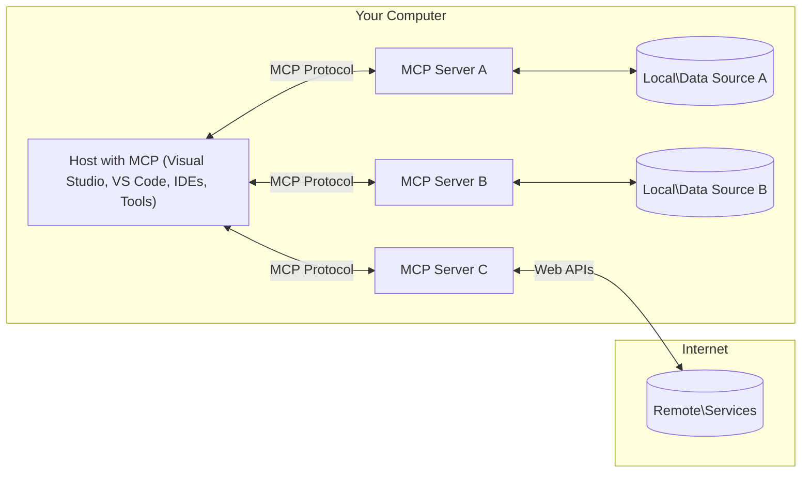

<!--
CO_OP_TRANSLATOR_METADATA:
{
  "original_hash": "11010ad254e48628bb6a457be2211640",
  "translation_date": "2025-08-12T07:28:38+00:00",
  "source_file": "01-CoreConcepts/README.md",
  "language_code": "zh"
}
-->
# 📖 MCP 核心概念：掌握模型上下文协议以实现 AI 集成

[](https://youtu.be/earDzWGtE84)

_（点击上方图片观看本课视频）_

[模型上下文协议 (MCP)](https://github.com/modelcontextprotocol) 是一个强大且标准化的框架，用于优化大型语言模型（LLMs）与外部工具、应用程序和数据源之间的通信。本指南将带您深入了解 MCP 的核心概念，确保您掌握其客户端-服务器架构、关键组件、通信机制以及最佳实践。

## 概述

本课将探讨构成模型上下文协议 (MCP) 生态系统的基本架构和组件。您将学习 MCP 的客户端-服务器架构、关键角色以及驱动 MCP 交互的通信机制。

## 👩‍🎓 关键学习目标

通过本课学习，您将能够：

- 理解 MCP 的客户端-服务器架构。
- 明确 Hosts、Clients 和 Servers 的角色与职责。
- 分析 MCP 作为灵活集成层的核心特性。
- 学习 MCP 生态系统中的信息流动方式。
- 通过 .NET、Java、Python 和 JavaScript 的代码示例获得实践见解。

## 🔎 MCP 架构：深入解析

MCP 生态系统基于客户端-服务器模型。这种模块化结构使 AI 应用能够高效地与工具、数据库、API 和上下文资源交互。让我们将这一架构分解为核心组件。

MCP 的核心是一个客户端-服务器架构，其中主机应用程序可以连接到多个服务器：



- **MCP Hosts**：如 VSCode、Claude Desktop、IDE 或希望通过 MCP 访问数据的 AI 工具。
- **MCP Clients**：维护与服务器一对一连接的协议客户端。
- **MCP Servers**：轻量级程序，通过标准化的模型上下文协议提供特定功能。
- **本地数据源**：MCP 服务器可安全访问的计算机文件、数据库和服务。
- **远程服务**：MCP 服务器可通过 API 连接的互联网外部系统。

MCP 协议是一个不断发展的标准。您可以查看 [协议规范](https://modelcontextprotocol.io/specification/2025-06-18/) 的最新更新。

### 1. Hosts

在模型上下文协议 (MCP) 中，Hosts 是用户与协议交互的主要接口。Hosts 是发起与 MCP 服务器连接以访问数据、工具和提示的应用程序或环境。例如，Hosts 包括集成开发环境（如 Visual Studio Code）、AI 工具（如 Claude Desktop）或为特定任务设计的定制代理。

**Hosts** 是发起与 LLMs 连接的应用程序。它们：

- 执行或与 AI 模型交互以生成响应。
- 发起与 MCP 服务器的连接。
- 管理对话流程和用户界面。
- 控制权限和安全约束。
- 处理用户对数据共享和工具执行的同意。

### 2. Clients

Clients 是促进 Hosts 与 MCP 服务器交互的关键组件。它们充当中介，使 Hosts 能够访问和利用 MCP 服务器提供的功能。Clients 在确保 MCP 架构内的顺畅通信和高效数据交换方面发挥了重要作用。

**Clients** 是主机应用程序中的连接器。它们：

- 使用提示/指令向服务器发送请求。
- 与服务器协商功能。
- 管理模型的工具执行请求。
- 处理并向用户显示响应。

### 3. Servers

Servers 负责处理来自 MCP 客户端的请求并提供适当的响应。通常，Servers 作为工具，为 LLM 提供特定功能。它们管理数据检索、工具执行和提示生成等各种操作。Servers 确保客户端与 Hosts 之间的通信高效可靠，维护交互过程的完整性。

**Servers** 是提供上下文和功能的服务。它们：

- 注册可用功能（资源、提示、工具）。
- 接收并执行来自客户端的工具调用。
- 提供上下文信息以增强模型响应。
- 将输出返回给客户端。
- 在需要时维护交互状态。

任何人都可以开发 Servers，以通过专门的功能扩展模型能力。

### 4. Server 功能

MCP 中的 Servers 提供了丰富的交互基础模块，连接了客户端、Hosts 和语言模型。这些功能旨在通过提供结构化的上下文、工具和提示来增强 MCP 的能力。

MCP 服务器可以提供以下功能：

#### 📑 资源

MCP 中的资源包括用户或 AI 模型可利用的各种上下文和数据类型。这些资源包括：

- **上下文数据**：用户或 AI 模型可用于决策和任务执行的信息和上下文。
- **知识库和文档库**：结构化和非结构化数据集合，如文章、手册和研究论文，提供有价值的见解和信息。
- **本地文件和数据库**：存储在设备或数据库中的数据，可供处理和分析。
- **API 和 Web 服务**：提供额外数据和功能的外部接口和服务，支持与各种在线资源和工具的集成。

资源的一个示例可以是数据库架构或文件，访问方式如下：

```text
file://log.txt
database://schema
```

### 🤖 提示

MCP 中的提示包括各种预定义模板和交互模式，旨在简化用户工作流程并增强沟通。这些提示包括：

- **模板化消息和工作流程**：预先结构化的消息和流程，引导用户完成特定任务和交互。
- **预定义交互模式**：标准化的操作和响应序列，促进一致且高效的沟通。
- **专用对话模板**：为特定类型的对话量身定制的可自定义模板，确保相关且上下文适当的交互。

提示模板可能如下所示：

```markdown
Generate a product slogan based on the following {{product}} with the following {{keywords}}
```

#### ⛏️ 工具

MCP 中的工具是 AI 模型可执行的功能，用于完成特定任务。这些工具旨在通过提供结构化且可靠的操作来增强 AI 模型的能力。关键特性包括：

- **AI 模型可执行的功能**：工具是可调用的函数，AI 模型可以用来执行各种任务。
- **唯一名称和描述**：每个工具都有一个独特的名称和详细描述，解释其用途和功能。
- **参数和输出**：工具接受特定参数并返回结构化输出，确保结果一致且可预测。
- **离散功能**：工具执行离散功能，如网络搜索、计算和数据库查询。

一个工具示例如下：

```typescript
server.tool(
  "GetProducts",
  {
    pageSize: z.string().optional(),
    pageCount: z.string().optional()
  }, () => {
    // return results from API
  }
)
```

## 客户端功能

在 MCP 中，客户端为服务器提供了多项关键功能，增强了协议内的整体功能和交互。其中一个显著功能是 Sampling。

### 👉 Sampling

- **服务器发起的代理行为**：客户端允许服务器自主发起特定操作或行为，增强系统的动态能力。
- **递归 LLM 交互**：此功能支持与大型语言模型（LLMs）的递归交互，使任务处理更加复杂和迭代。
- **请求额外的模型补全**：服务器可以请求模型提供额外的补全，确保响应全面且上下文相关。

## MCP 中的信息流

MCP 定义了 Hosts、Clients、Servers 和模型之间的信息流结构。理解这一流程有助于澄清用户请求的处理方式以及外部工具和数据如何集成到模型响应中。

- **Host 发起连接**  
  主机应用程序（如 IDE 或聊天界面）通过 STDIO、WebSocket 或其他支持的传输方式与 MCP 服务器建立连接。

- **功能协商**  
  嵌入在主机中的客户端与服务器交换有关支持的功能、工具、资源和协议版本的信息。这确保双方了解会话中可用的功能。

- **用户请求**  
  用户与主机交互（例如输入提示或命令）。主机收集这些输入并将其传递给客户端进行处理。

- **资源或工具使用**  
  - 客户端可能会向服务器请求额外的上下文或资源（如文件、数据库条目或知识库文章），以丰富模型的理解。
  - 如果模型确定需要工具（例如获取数据、执行计算或调用 API），客户端会向服务器发送工具调用请求，指定工具名称和参数。

- **服务器执行**  
  服务器接收资源或工具请求，执行必要的操作（如运行函数、查询数据库或检索文件），并以结构化格式将结果返回给客户端。

- **响应生成**  
  客户端将服务器的响应（资源数据、工具输出等）集成到正在进行的模型交互中。模型使用这些信息生成全面且上下文相关的响应。

- **结果展示**  
  主机从客户端接收最终输出并呈现给用户，通常包括模型生成的文本以及工具执行或资源查找的结果。

这一流程使 MCP 能够通过无缝连接模型与外部工具和数据源，支持高级、交互式和上下文感知的 AI 应用。

## 协议详情

MCP（模型上下文协议）基于 [JSON-RPC 2.0](https://www.jsonrpc.org/)，提供了一个标准化、与语言无关的消息格式，用于 Hosts、Clients 和 Servers 之间的通信。这一基础支持跨多种平台和编程语言的可靠、结构化和可扩展交互。

### 协议关键特性

MCP 在 JSON-RPC 2.0 的基础上扩展了工具调用、资源访问和提示管理的约定。它支持多种传输层（STDIO、WebSocket、SSE），并实现了组件之间的安全、可扩展和语言无关的通信。

#### 🧢 基础协议

- **JSON-RPC 消息格式**：所有请求和响应均使用 JSON-RPC 2.0 规范，确保方法调用、参数、结果和错误处理的结构一致。
- **有状态连接**：MCP 会话在多个请求之间保持状态，支持持续对话、上下文积累和资源管理。
- **功能协商**：在连接设置期间，客户端和服务器交换有关支持的功能、协议版本、可用工具和资源的信息。这确保双方了解彼此的能力并能够相应调整。

#### ➕ 附加工具

以下是 MCP 提供的一些附加工具和协议扩展，用于增强开发者体验并支持高级场景：

- **配置选项**：MCP 允许动态配置会话参数，例如工具权限、资源访问和模型设置，以适应每次交互。
- **进度跟踪**：长时间运行的操作可以报告进度更新，从而在复杂任务期间提供响应式用户界面和更好的用户体验。
- **请求取消**：客户端可以取消正在进行的请求，允许用户中断不再需要或耗时过长的操作。
- **错误报告**：标准化的错误消息和代码有助于诊断问题、优雅处理失败，并为用户和开发者提供可操作的反馈。
- **日志记录**：客户端和服务器均可发出结构化日志，用于审计、调试和监控协议交互。

通过利用这些协议特性，MCP 确保语言模型与外部工具或数据源之间的通信稳健、安全且灵活。

### 🔐 安全注意事项

MCP 的实现应遵循以下关键安全原则，以确保交互的安全性和可信性：

- **用户同意与控制**：用户必须在访问任何数据或执行任何操作之前明确同意。用户应能够清楚地控制共享的数据和授权的操作，并通过直观的用户界面审查和批准活动。
- **数据隐私**：用户数据仅在明确同意的情况下暴露，并且必须通过适当的访问控制进行保护。MCP 的实现必须防止未经授权的数据传输，并确保在所有交互中维护隐私。
- **工具安全性**：在调用任何工具之前，必须获得用户的明确同意。用户应清楚了解每个工具的功能，并强制执行稳健的安全边界，以防止意外或不安全的工具执行。

通过遵循这些原则，MCP 确保在所有协议交互中维护用户的信任、隐私和安全。

## 代码示例：关键组件

以下是几个流行编程语言的代码示例，展示了如何实现 MCP 服务器的关键组件和工具。

### .NET 示例：创建一个简单的 MCP 服务器及工具

以下是一个实用的 .NET 代码示例，展示了如何实现一个带有自定义工具的简单 MCP 服务器。此示例展示了如何定义和注册工具、处理请求以及通过模型上下文协议连接服务器。

```csharp
using System;
using System.Threading.Tasks;
using ModelContextProtocol.Server;
using ModelContextProtocol.Server.Transport;
using ModelContextProtocol.Server.Tools;

public class WeatherServer
{
    public static async Task Main(string[] args)
    {
        // Create an MCP server
        var server = new McpServer(
            name: "Weather MCP Server",
            version: "1.0.0"
        );
        
        // Register our custom weather tool
        server.AddTool<string, WeatherData>("weatherTool", 
            description: "Gets current weather for a location",
            execute: async (location) => {
                // Call weather API (simplified)
                var weatherData = await GetWeatherDataAsync(location);
                return weatherData;
            });
        
        // Connect the server using stdio transport
        var transport = new StdioServerTransport();
        await server.ConnectAsync(transport);
        
        Console.WriteLine("Weather MCP Server started");
        
        // Keep the server running until process is terminated
        await Task.Delay(-1);
    }
    
    private static async Task<WeatherData> GetWeatherDataAsync(string location)
    {
        // This would normally call a weather API
        // Simplified for demonstration
        await Task.Delay(100); // Simulate API call
        return new WeatherData { 
            Temperature = 72.5,
            Conditions = "Sunny",
            Location = location
        };
    }
}

public class WeatherData
{
    public double Temperature { get; set; }
    public string Conditions { get; set; }
    public string Location { get; set; }
}
```

### Java 示例：MCP 服务器组件

此示例展示了与上述 .NET 示例相同的 MCP 服务器和工具注册，但使用 Java 实现。

```java
import io.modelcontextprotocol.server.McpServer;
import io.modelcontextprotocol.server.McpToolDefinition;
import io.modelcontextprotocol.server.transport.StdioServerTransport;
import io.modelcontextprotocol.server.tool.ToolExecutionContext;
import io.modelcontextprotocol.server.tool.ToolResponse;

public class WeatherMcpServer {
    public static void main(String[] args) throws Exception {
        // Create an MCP server
        McpServer server = McpServer.builder()
            .name("Weather MCP Server")
            .version("1.0.0")
            .build();
            
        // Register a weather tool
        server.registerTool(McpToolDefinition.builder("weatherTool")
            .description("Gets current weather for a location")
            .parameter("location", String.class)
            .execute((ToolExecutionContext ctx) -> {
                String location = ctx.getParameter("location", String.class);
                
                // Get weather data (simplified)
                WeatherData data = getWeatherData(location);
                
                // Return formatted response
                return ToolResponse.content(
                    String.format("Temperature: %.1f°F, Conditions: %s, Location: %s", 
                    data.getTemperature(), 
                    data.getConditions(), 
                    data.getLocation())
                );
            })
            .build());
        
        // Connect the server using stdio transport
        try (StdioServerTransport transport = new StdioServerTransport()) {
            server.connect(transport);
            System.out.println("Weather MCP Server started");
            // Keep server running until process is terminated
            Thread.currentThread().join();
        }
    }
    
    private static WeatherData getWeatherData(String location) {
        // Implementation would call a weather API
        // Simplified for example purposes
        return new WeatherData(72.5, "Sunny", location);
    }
}

class WeatherData {
    private double temperature;
    private String conditions;
    private String location;
    
    public WeatherData(double temperature, String conditions, String location) {
        this.temperature = temperature;
        this.conditions = conditions;
        this.location = location;
    }
    
    public double getTemperature() {
        return temperature;
    }
    
    public String getConditions() {
        return conditions;
    }
    
    public String getLocation() {
        return location;
    }
}
```

### Python 示例：构建 MCP 服务器

在此示例中，我们展示了如何在 Python 中构建 MCP 服务器。您还将看到两种不同的工具创建方式。

```python
#!/usr/bin/env python3
import asyncio
from mcp.server.fastmcp import FastMCP
from mcp.server.transports.stdio import serve_stdio

# Create a FastMCP server
mcp = FastMCP(
    name="Weather MCP Server",
    version="1.0.0"
)

@mcp.tool()
def get_weather(location: str) -> dict:
    """Gets current weather for a location."""
    # This would normally call a weather API
    # Simplified for demonstration
    return {
        "temperature": 72.5,
        "conditions": "Sunny",
        "location": location
    }

# Alternative approach using a class
class WeatherTools:
    @mcp.tool()
    def forecast(self, location: str, days: int = 1) -> dict:
        """Gets weather forecast for a location for the specified number of days."""
        # This would normally call a weather API forecast endpoint
        # Simplified for demonstration
        return {
            "location": location,
            "forecast": [
                {"day": i+1, "temperature": 70 + i, "conditions": "Partly Cloudy"}
                for i in range(days)
            ]
        }

# Instantiate the class to register its tools
weather_tools = WeatherTools()

# Start the server using stdio transport
if __name__ == "__main__":
    asyncio.run(serve_stdio(mcp))
```

### JavaScript 示例：创建 MCP 服务器
此示例展示了如何在 JavaScript 中创建 MCP 服务器，并注册两个与天气相关的工具。

```javascript
// Using the official Model Context Protocol SDK
import { McpServer } from "@modelcontextprotocol/sdk/server/mcp.js";
import { StdioServerTransport } from "@modelcontextprotocol/sdk/server/stdio.js";
import { z } from "zod"; // For parameter validation

// Create an MCP server
const server = new McpServer({
  name: "Weather MCP Server",
  version: "1.0.0"
});

// Define a weather tool
server.tool(
  "weatherTool",
  {
    location: z.string().describe("The location to get weather for")
  },
  async ({ location }) => {
    // This would normally call a weather API
    // Simplified for demonstration
    const weatherData = await getWeatherData(location);
    
    return {
      content: [
        { 
          type: "text", 
          text: `Temperature: ${weatherData.temperature}°F, Conditions: ${weatherData.conditions}, Location: ${weatherData.location}` 
        }
      ]
    };
  }
);

// Define a forecast tool
server.tool(
  "forecastTool",
  {
    location: z.string(),
    days: z.number().default(3).describe("Number of days for forecast")
  },
  async ({ location, days }) => {
    // This would normally call a weather API
    // Simplified for demonstration
    const forecast = await getForecastData(location, days);
    
    return {
      content: [
        { 
          type: "text", 
          text: `${days}-day forecast for ${location}: ${JSON.stringify(forecast)}` 
        }
      ]
    };
  }
);

// Helper functions
async function getWeatherData(location) {
  // Simulate API call
  return {
    temperature: 72.5,
    conditions: "Sunny",
    location: location
  };
}

async function getForecastData(location, days) {
  // Simulate API call
  return Array.from({ length: days }, (_, i) => ({
    day: i + 1,
    temperature: 70 + Math.floor(Math.random() * 10),
    conditions: i % 2 === 0 ? "Sunny" : "Partly Cloudy"
  }));
}

// Connect the server using stdio transport
const transport = new StdioServerTransport();
server.connect(transport).catch(console.error);

console.log("Weather MCP Server started");
```

此 JavaScript 示例演示了如何创建一个 MCP 客户端，该客户端连接到服务器，发送提示，并处理响应，包括任何工具调用。

## 安全性与授权

MCP 包含多个内置概念和机制，用于在协议中管理安全性和授权：

1. **工具权限控制**：  
   客户端可以指定模型在会话期间允许使用哪些工具。这确保只有明确授权的工具可以访问，从而降低意外或不安全操作的风险。权限可以根据用户偏好、组织政策或交互上下文动态配置。

2. **身份验证**：  
   服务器可以在授予工具、资源或敏感操作的访问权限之前要求身份验证。这可能涉及 API 密钥、OAuth 令牌或其他身份验证方案。适当的身份验证确保只有可信的客户端和用户可以调用服务器端功能。

3. **验证**：  
   所有工具调用都强制执行参数验证。每个工具定义其参数的预期类型、格式和约束，服务器会相应地验证传入请求。这可以防止格式错误或恶意输入到达工具实现，并有助于维护操作的完整性。

4. **速率限制**：  
   为防止滥用并确保公平使用服务器资源，MCP 服务器可以对工具调用和资源访问实施速率限制。速率限制可以按用户、会话或全局应用，有助于防止拒绝服务攻击或过度资源消耗。

通过结合这些机制，MCP 为将语言模型与外部工具和数据源集成提供了安全的基础，同时为用户和开发者提供了对访问和使用的细粒度控制。

## 协议消息

MCP 通信使用结构化的 JSON 消息，以促进客户端、服务器和模型之间清晰可靠的交互。主要消息类型包括：

- **客户端请求**  
  从客户端发送到服务器的消息，通常包括：
  - 用户的提示或命令
  - 用于上下文的对话历史
  - 工具配置和权限
  - 任何额外的元数据或会话信息

- **模型响应**  
  由模型（通过客户端）返回的消息，包含：
  - 根据提示和上下文生成的文本或完成内容
  - 如果模型确定需要调用工具，则包含可选的工具调用指令
  - 根据需要引用资源或额外的上下文

- **工具请求**  
  当需要执行工具时，从客户端发送到服务器的消息。此消息包括：
  - 要调用的工具名称
  - 工具所需的参数（根据工具的架构进行验证）
  - 用于跟踪请求的上下文信息或标识符

- **工具响应**  
  服务器在执行工具后返回的消息，提供：
  - 工具执行的结果（结构化数据或内容）
  - 如果工具调用失败，则提供任何错误或状态信息
  - 可选的与执行相关的额外元数据或日志

这些结构化消息确保 MCP 工作流中的每一步都是明确的、可追踪的和可扩展的，支持高级场景，例如多轮对话、工具链调用以及强大的错误处理。

## 关键要点

- MCP 使用客户端-服务器架构将模型与外部功能连接
- 生态系统由客户端、主机、服务器、工具和数据源组成
- 通信可以通过 STDIO、SSE 或 WebSockets 进行
- 工具是模型可访问的功能的基本单元
- 结构化通信协议确保一致的交互

## 练习

设计一个简单的 MCP 工具，该工具在您的领域中会很有用。定义：
1. 工具的名称
2. 工具接受的参数
3. 工具返回的输出
4. 模型如何使用此工具解决用户问题


---

## 下一步

下一章：[第 2 章：安全性](../02-Security/README.md)

**免责声明**：  
本文档使用AI翻译服务[Co-op Translator](https://github.com/Azure/co-op-translator)进行翻译。尽管我们努力确保准确性，但请注意，自动翻译可能包含错误或不准确之处。应以原始语言的文档作为权威来源。对于关键信息，建议使用专业人工翻译。因使用本翻译而引起的任何误解或误读，我们概不负责。