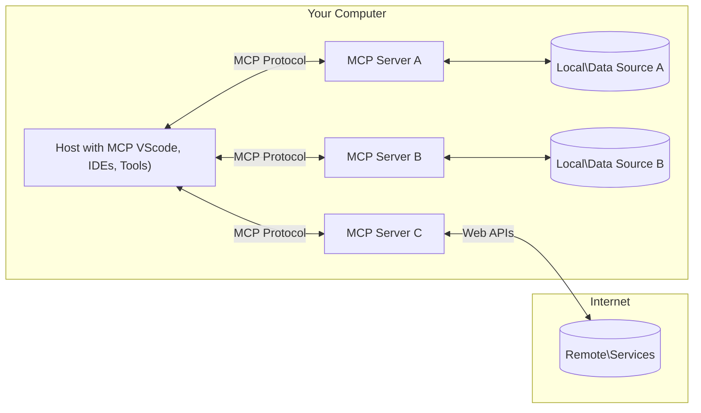

<!--
CO_OP_TRANSLATOR_METADATA:
{
  "original_hash": "b3b4a6ad10c3c0edbf7fa7cfa0ec496b",
  "translation_date": "2025-07-02T06:57:32+00:00",
  "source_file": "01-CoreConcepts/README.md",
  "language_code": "zh"
}
-->
# 📖 MCP 核心概念：掌握模型上下文协议实现 AI 集成

[Model Context Protocol (MCP)](https://github.com/modelcontextprotocol) 是一个强大且标准化的框架，用于优化大型语言模型（LLM）与外部工具、应用程序和数据源之间的通信。本文将通过 SEO 优化的指南带你深入了解 MCP 的核心概念，确保你理解其客户端-服务器架构、关键组件、通信机制以及最佳实现实践。

## 概述

本课将探讨构成模型上下文协议（MCP）生态系统的基础架构和组件。你将了解客户端-服务器架构、关键组件以及驱动 MCP 交互的通信机制。

## 👩‍🎓 主要学习目标

完成本课后，你将能够：

- 理解 MCP 的客户端-服务器架构。
- 识别 Hosts、Clients 和 Servers 的角色与职责。
- 分析使 MCP 成为灵活集成层的核心特性。
- 学习信息在 MCP 生态系统中的流动方式。
- 通过 .NET、Java、Python 和 JavaScript 的代码示例获得实用见解。

## 🔎 MCP 架构：深入解析

MCP 生态系统基于客户端-服务器模型构建。这种模块化结构使 AI 应用能够高效地与工具、数据库、API 及上下文资源交互。下面将把这一架构拆解为核心组件。

MCP 核心采用客户端-服务器架构，主机应用可以连接多个服务器：



- **MCP Hosts**：如 VSCode、Claude Desktop、IDE 或希望通过 MCP 访问数据的 AI 工具等程序
- **MCP Clients**：与服务器保持一对一连接的协议客户端
- **MCP Servers**：轻量级程序，通过标准化的模型上下文协议暴露特定功能
- **本地数据源**：计算机上的文件、数据库和服务，MCP 服务器可安全访问
- **远程服务**：通过互联网可用的外部系统，MCP 服务器可通过 API 连接

MCP 协议是一个不断发展的标准，最新更新可见于 [协议规范](https://modelcontextprotocol.io/specification/2025-06-18/)

### 1. Hosts

在模型上下文协议（MCP）中，Hosts 是用户与协议交互的主要接口，承担关键角色。Hosts 是发起与 MCP 服务器连接以访问数据、工具和提示的应用或环境。Hosts 示例包括集成开发环境（IDE）如 Visual Studio Code，AI 工具如 Claude Desktop，或为特定任务定制的代理程序。

**Hosts** 是启动连接的 LLM 应用。它们：

- 执行或与 AI 模型交互以生成响应。
- 发起与 MCP 服务器的连接。
- 管理对话流程和用户界面。
- 控制权限和安全约束。
- 处理用户对数据共享和工具执行的同意。

### 2. Clients

Clients 是促进 Hosts 与 MCP 服务器交互的关键组件。Clients 充当中介，使 Hosts 能够访问并利用 MCP 服务器提供的功能。它们在确保 MCP 架构内通信顺畅和数据高效交换方面起着重要作用。

**Clients** 是主机应用内的连接器。它们：

- 向服务器发送带有提示/指令的请求。
- 与服务器协商功能。
- 管理模型发起的工具执行请求。
- 处理并向用户展示响应。

### 3. Servers

Servers 负责处理来自 MCP clients 的请求并提供相应的响应。它们管理数据检索、工具执行和提示生成等各种操作。Servers 确保客户端和 Hosts 之间的通信高效且可靠，维护交互过程的完整性。

**Servers** 是提供上下文和功能的服务。它们：

- 注册可用功能（资源、提示、工具）
- 接收并执行来自客户端的工具调用
- 提供上下文信息以增强模型响应
- 将输出返回给客户端
- 必要时维护交互状态

任何人都可以开发服务器，以专门功能扩展模型能力。

### 4. Server Features

模型上下文协议（MCP）中的服务器提供基础构建模块，使客户端、主机和语言模型之间实现丰富交互。这些功能旨在通过提供结构化的上下文、工具和提示，增强 MCP 的能力。

MCP 服务器可以提供以下任一功能：

#### 📑 资源

MCP 中的资源涵盖各种可供用户或 AI 模型使用的上下文和数据类型，包括：

- **上下文数据**：用户或 AI 模型可用于决策和任务执行的信息和上下文。
- **知识库和文档库**：结构化和非结构化数据集合，如文章、手册和研究论文，提供有价值的见解和信息。
- **本地文件和数据库**：存储在设备或数据库中的数据，可供处理和分析。
- **API 和 Web 服务**：提供额外数据和功能的外部接口和服务，实现与各种在线资源和工具的集成。

资源示例可以是数据库模式或文件，访问方式如下：

```text
file://log.txt
database://schema
```

### 🤖 提示

MCP 中的提示包括各种预定义模板和交互模式，旨在简化用户工作流程并增强沟通。这些包括：

- **模板化消息和工作流程**：预先结构化的消息和流程，引导用户完成特定任务和交互。
- **预定义交互模式**：标准化的动作和响应序列，促进一致且高效的沟通。
- **专用对话模板**：针对特定对话类型定制的模板，确保相关且符合上下文的交互。

提示模板示例如下：

```markdown
Generate a product slogan based on the following {{product}} with the following {{keywords}}
```

#### ⛏️ 工具

MCP 中的工具是 AI 模型可执行以完成特定任务的函数。设计这些工具旨在通过提供结构化且可靠的操作，增强 AI 模型的能力。关键点包括：

- **供 AI 模型执行的函数**：工具是可调用的函数，AI 模型可用以执行多种任务。
- **唯一名称和描述**：每个工具都有独特名称和详细描述，说明其用途和功能。
- **参数和输出**：工具接受特定参数并返回结构化输出，确保结果一致且可预测。
- **独立功能**：工具执行独立功能，如网络搜索、计算和数据库查询。

工具示例可能如下：

```typescript
server.tool(
  "GetProducts",
  {
    pageSize: z.string().optional(),
    pageCount: z.string().optional()
  }, () => {
    // return results from API
  }
)
```

## 客户端功能

在 MCP 中，客户端向服务器提供多项关键功能，增强协议内的整体交互和功能。其中一个重要功能是采样。

### 👉 采样

- **服务器发起的自主行为**：客户端允许服务器自主发起特定动作或行为，提升系统的动态能力。
- **递归式 LLM 交互**：此功能支持与大型语言模型（LLM）的递归交互，实现更复杂和迭代的任务处理。
- **请求额外模型完成**：服务器可请求模型提供额外完成，确保响应详尽且符合上下文。

## MCP 中的信息流

模型上下文协议（MCP）定义了 Hosts、Clients、Servers 和模型之间结构化的信息流。理解此流程有助于澄清用户请求的处理方式以及外部工具和数据如何融入模型响应。

- **Host 发起连接**  
  Host 应用（如 IDE 或聊天界面）通过 STDIO、WebSocket 或其他支持的传输方式与 MCP 服务器建立连接。

- **能力协商**  
  嵌入 Host 的客户端与服务器交换关于支持的功能、工具、资源和协议版本的信息，确保双方明确会话可用能力。

- **用户请求**  
  用户与 Host 交互（例如输入提示或命令），Host 收集输入并传递给客户端处理。

- **资源或工具使用**  
  - 客户端可能请求服务器提供额外上下文或资源（如文件、数据库条目或知识库文章），以丰富模型理解。
  - 如果模型判断需要工具（如获取数据、执行计算或调用 API），客户端将发送工具调用请求给服务器，指定工具名称和参数。

- **服务器执行**  
  服务器接收资源或工具请求，执行必要操作（如运行函数、查询数据库或检索文件），并以结构化格式返回结果给客户端。

- **响应生成**  
  客户端将服务器响应（资源数据、工具输出等）整合进持续的模型交互中。模型利用这些信息生成全面且符合上下文的响应。

- **结果呈现**  
  Host 接收客户端的最终输出，并展示给用户，通常包括模型生成的文本及任何工具执行或资源查询的结果。

此流程使 MCP 能够支持先进、交互式且具上下文感知的 AI 应用，顺畅连接模型与外部工具及数据源。

## 协议细节

MCP（模型上下文协议）基于 [JSON-RPC 2.0](https://www.jsonrpc.org/) 构建，提供标准化、语言无关的消息格式，用于 Hosts、Clients 和 Servers 之间的通信。该基础确保跨多平台和编程语言的可靠、结构化和可扩展交互。

### 关键协议特性

MCP 在 JSON-RPC 2.0 基础上扩展了工具调用、资源访问和提示管理的约定。支持多种传输层（STDIO、WebSocket、SSE），实现组件间安全、可扩展且语言无关的通信。

#### 🧢 基础协议

- **JSON-RPC 消息格式**：所有请求和响应均采用 JSON-RPC 2.0 规范，确保方法调用、参数、结果和错误处理结构一致。
- **有状态连接**：MCP 会话在多次请求间保持状态，支持持续对话、上下文积累和资源管理。
- **能力协商**：连接建立时，客户端与服务器交换支持的功能、协议版本、可用工具和资源信息，确保双方理解彼此能力并作出相应调整。

#### ➕ 附加工具

以下是 MCP 提供的部分附加工具和协议扩展，旨在提升开发体验和支持高级场景：

- **配置选项**：MCP 支持动态配置会话参数，如工具权限、资源访问和模型设置，针对每次交互进行定制。
- **进度跟踪**：长时间运行的操作可报告进度更新，提升响应式用户界面和复杂任务的用户体验。
- **请求取消**：客户端可取消正在进行的请求，允许用户中断不再需要或耗时过长的操作。
- **错误报告**：标准化错误消息和代码帮助诊断问题，优雅处理失败，并向用户和开发者提供可操作反馈。
- **日志记录**：客户端和服务器均可输出结构化日志，用于审计、调试和监控协议交互。

借助这些协议特性，MCP 确保语言模型与外部工具或数据源之间的通信稳健、安全且灵活。

### 🔐 安全考虑

MCP 实现应遵循若干关键安全原则，确保交互安全可信：

- **用户同意与控制**：用户必须明确同意后，数据才可被访问或操作才可执行。应提供清晰的控制界面，让用户审查并批准数据共享和操作授权。
- **数据隐私**：用户数据仅在明确同意下暴露，并通过适当访问控制加以保护。MCP 实现必须防止未经授权的数据传输，确保隐私在整个交互过程中的维护。
- **工具安全**：调用任何工具前需获得用户明确同意。用户应清楚了解每个工具的功能，并强制执行严格安全边界，防止工具执行意外或不安全操作。

遵循这些原则，MCP 在所有协议交互中维护用户信任、隐私和安全。

## 代码示例：关键组件

以下是多个流行编程语言中的代码示例，展示如何实现 MCP 服务器关键组件和工具。

### .NET 示例：创建简单的 MCP 服务器及工具

这是一个实用的 .NET 代码示例，演示如何实现带自定义工具的简单 MCP 服务器。示例展示了如何定义和注册工具、处理请求以及使用模型上下文协议连接服务器。

```csharp
using System;
using System.Threading.Tasks;
using ModelContextProtocol.Server;
using ModelContextProtocol.Server.Transport;
using ModelContextProtocol.Server.Tools;

public class WeatherServer
{
    public static async Task Main(string[] args)
    {
        // Create an MCP server
        var server = new McpServer(
            name: "Weather MCP Server",
            version: "1.0.0"
        );
        
        // Register our custom weather tool
        server.AddTool<string, WeatherData>("weatherTool", 
            description: "Gets current weather for a location",
            execute: async (location) => {
                // Call weather API (simplified)
                var weatherData = await GetWeatherDataAsync(location);
                return weatherData;
            });
        
        // Connect the server using stdio transport
        var transport = new StdioServerTransport();
        await server.ConnectAsync(transport);
        
        Console.WriteLine("Weather MCP Server started");
        
        // Keep the server running until process is terminated
        await Task.Delay(-1);
    }
    
    private static async Task<WeatherData> GetWeatherDataAsync(string location)
    {
        // This would normally call a weather API
        // Simplified for demonstration
        await Task.Delay(100); // Simulate API call
        return new WeatherData { 
            Temperature = 72.5,
            Conditions = "Sunny",
            Location = location
        };
    }
}

public class WeatherData
{
    public double Temperature { get; set; }
    public string Conditions { get; set; }
    public string Location { get; set; }
}
```

### Java 示例：MCP 服务器组件

本示例演示与上述 .NET 示例相同的 MCP 服务器及工具注册，但使用 Java 实现。

```java
import io.modelcontextprotocol.server.McpServer;
import io.modelcontextprotocol.server.McpToolDefinition;
import io.modelcontextprotocol.server.transport.StdioServerTransport;
import io.modelcontextprotocol.server.tool.ToolExecutionContext;
import io.modelcontextprotocol.server.tool.ToolResponse;

public class WeatherMcpServer {
    public static void main(String[] args) throws Exception {
        // Create an MCP server
        McpServer server = McpServer.builder()
            .name("Weather MCP Server")
            .version("1.0.0")
            .build();
            
        // Register a weather tool
        server.registerTool(McpToolDefinition.builder("weatherTool")
            .description("Gets current weather for a location")
            .parameter("location", String.class)
            .execute((ToolExecutionContext ctx) -> {
                String location = ctx.getParameter("location", String.class);
                
                // Get weather data (simplified)
                WeatherData data = getWeatherData(location);
                
                // Return formatted response
                return ToolResponse.content(
                    String.format("Temperature: %.1f°F, Conditions: %s, Location: %s", 
                    data.getTemperature(), 
                    data.getConditions(), 
                    data.getLocation())
                );
            })
            .build());
        
        // Connect the server using stdio transport
        try (StdioServerTransport transport = new StdioServerTransport()) {
            server.connect(transport);
            System.out.println("Weather MCP Server started");
            // Keep server running until process is terminated
            Thread.currentThread().join();
        }
    }
    
    private static WeatherData getWeatherData(String location) {
        // Implementation would call a weather API
        // Simplified for example purposes
        return new WeatherData(72.5, "Sunny", location);
    }
}

class WeatherData {
    private double temperature;
    private String conditions;
    private String location;
    
    public WeatherData(double temperature, String conditions, String location) {
        this.temperature = temperature;
        this.conditions = conditions;
        this.location = location;
    }
    
    public double getTemperature() {
        return temperature;
    }
    
    public String getConditions() {
        return conditions;
    }
    
    public String getLocation() {
        return location;
    }
}
```

### Python 示例：构建 MCP 服务器

本示例展示如何使用 Python 构建 MCP 服务器，并介绍两种不同的创建工具方法。

```python
#!/usr/bin/env python3
import asyncio
from mcp.server.fastmcp import FastMCP
from mcp.server.transports.stdio import serve_stdio

# Create a FastMCP server
mcp = FastMCP(
    name="Weather MCP Server",
    version="1.0.0"
)

@mcp.tool()
def get_weather(location: str) -> dict:
    """Gets current weather for a location."""
    # This would normally call a weather API
    # Simplified for demonstration
    return {
        "temperature": 72.5,
        "conditions": "Sunny",
        "location": location
    }

# Alternative approach using a class
class WeatherTools:
    @mcp.tool()
    def forecast(self, location: str, days: int = 1) -> dict:
        """Gets weather forecast for a location for the specified number of days."""
        # This would normally call a weather API forecast endpoint
        # Simplified for demonstration
        return {
            "location": location,
            "forecast": [
                {"day": i+1, "temperature": 70 + i, "conditions": "Partly Cloudy"}
                for i in range(days)
            ]
        }

# Instantiate the class to register its tools
weather_tools = WeatherTools()

# Start the server using stdio transport
if __name__ == "__main__":
    asyncio.run(serve_stdio(mcp))
```

### JavaScript 示例：创建 MCP 服务器

本示例展示如何用 JavaScript 创建 MCP 服务器，并注册两个与天气相关的工具。

```javascript
// Using the official Model Context Protocol SDK
import { McpServer } from "@modelcontextprotocol/sdk/server/mcp.js";
import { StdioServerTransport } from "@modelcontextprotocol/sdk/server/stdio.js";
import { z } from "zod"; // For parameter validation

// Create an MCP server
const server = new McpServer({
  name: "Weather MCP Server",
  version: "1.0.0"
});

// Define a weather tool
server.tool(
  "weatherTool",
  {
    location: z.string().describe("The location to get weather for")
  },
  async ({ location }) => {
    // This would normally call a weather API
    // Simplified for demonstration
    const weatherData = await getWeatherData(location);
    
    return {
      content: [
        { 
          type: "text", 
          text: `Temperature: ${weatherData.temperature}°F, Conditions: ${weatherData.conditions}, Location: ${weatherData.location}` 
        }
      ]
    };
  }
);

// Define a forecast tool
server.tool(
  "forecastTool",
  {
    location: z.string(),
    days: z.number().default(3).describe("Number of days for forecast")
  },
  async ({ location, days }) => {
    // This would normally call a weather API
    // Simplified for demonstration
    const forecast = await getForecastData(location, days);
    
    return {
      content: [
        { 
          type: "text", 
          text: `${days}-day forecast for ${location}: ${JSON.stringify(forecast)}` 
        }
      ]
    };
  }
);

// Helper functions
async function getWeatherData(location) {
  // Simulate API call
  return {
    temperature: 72.5,
    conditions: "Sunny",
    location: location
  };
}

async function getForecastData(location, days) {
  // Simulate API call
  return Array.from({ length: days }, (_, i) => ({
    day: i + 1,
    temperature: 70 + Math.floor(Math.random() * 10),
    conditions: i % 2 === 0 ? "Sunny" : "Partly Cloudy"
  }));
}

// Connect the server using stdio transport
const transport = new StdioServerTransport();
server.connect(transport).catch(console.error);

console.log("Weather MCP Server started");
```

此 JavaScript 示例演示如何创建 MCP 客户端，连接服务器、发送提示并处理响应，包括任何工具调用。

## 安全与授权

MCP 包含多项内置概念和机制，用于管理协议中的安全和授权：

1. **工具权限控制**  
  客户端可指定模型在会话中允许使用的工具，确保仅授权工具可访问，降低意外或不安全操作风险。权限可根据用户偏好、组织策略或交互上下文动态配置。

2. **身份验证**  
  服务器可要求身份验证后才允许访问工具、资源或敏感操作，可能采用 API 密钥、OAuth 令牌等方式。有效身份验证确保只有可信客户端和用户能调用服务器功能。

3. **参数验证**  
  所有工具调用均强制参数验证。每个工具定义其参数的预期类型、格式和约束，服务器据此验证请求，防止格式错误或恶意输入影响工具实现，维护操作完整性。

4. **速率限制**  
  为防止滥用并保障服务器资源公平使用，MCP 服务器可对工具调用和资源访问实施速率限制。限制可按用户、会话或全局应用，有效防御拒绝服务攻击或过度资源消耗。

结合这些机制，MCP 为语言模型与外部工具及数据源集成提供安全基础，同时赋予用户和开发者细粒度访问和使用控制。

## 协议消息

MCP 通信使用结构化 JSON 消息，促进客户端、服务器和模型间清晰可靠的交互。主要消息类型包括：

- **客户端请求**  
  由客户端发送给服务器，通常包含：  
  - 用户的提示或命令  
  - 用于上下文的对话历史  
  - 工具配置和权限  
  - 任何附加的元数据或会话信息

- **模型响应**  
  由模型（通过客户端）返回，包含：  
  - 基于提示和上下文生成的文本或完成内容  
  - 如果模型判断需要调用工具，则包含工具调用指令  
  - 必要时的资源或额外上下文引用

- **工具请求**  
  当需要执行工具时，由客户端发送给服务器，包含：  
  - 要调用的工具名称  
  - 工具所需参数（已根据工具模式验证）  
  - 用于跟踪请求的上下文信息或标识符

- **工具响应**  
  服务器执行工具后返回，提供：  
  - 工具执行结果（结构化数据或内容）  
  - 如果调用失败，包含错误或状态信息  
  - 可选的执行相关元数据或日志

这些结构化消息确保 MCP 工作流程的每一步都明确、可追踪且可扩展，支持多轮对话、工具链和健壮的错误处理等高级场景。

## 关键要点

- MCP 采用客户端-服务器架构，将模型与外部能力连接
- 生态系统包含客户端、主机、服务器、工具和数据源
- 通信可通过 STDIO、SSE 或 WebSockets 进行
- 工具是向模型暴露的基本功能单元
- 结构化通信协议确保交互一致性

## 练习

设计一个适用于你领域的简单 MCP 工具。定义：

1. 工具名称
2. 接受的参数
3. 返回的输出
4. 模型如何使用此工具解决用户问题

---

## 接下来

下一章：[第 2 章：安全](/02-Security/README.md)

**免责声明**：  
本文件使用 AI 翻译服务 [Co-op Translator](https://github.com/Azure/co-op-translator) 进行翻译。尽管我们努力确保准确性，但请注意自动翻译可能包含错误或不准确之处。原始文件的母语版本应被视为权威来源。对于重要信息，建议采用专业人工翻译。我们不对因使用本翻译而产生的任何误解或错误解释承担责任。