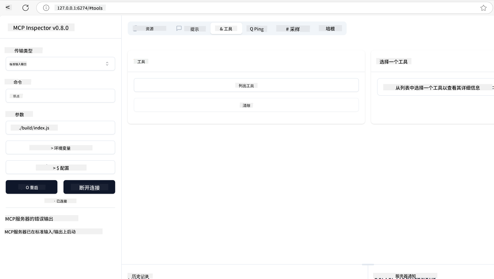
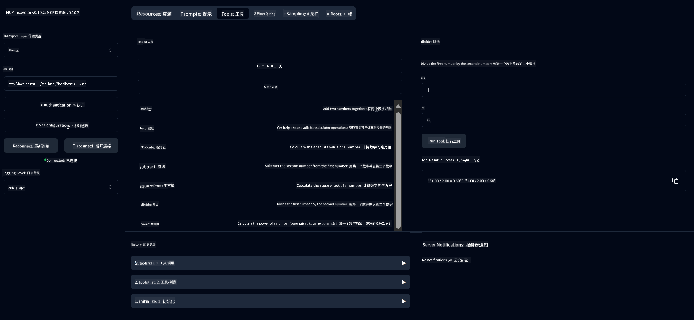
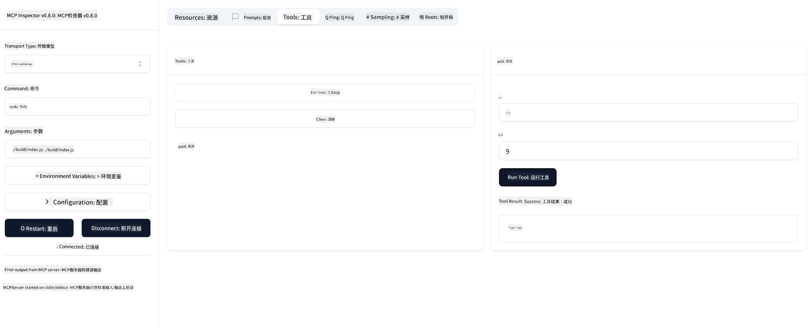

<!--
CO_OP_TRANSLATOR_METADATA:
{
  "original_hash": "fa635ae747c9b4d5c2f61c6c46cb695f",
  "translation_date": "2025-07-17T17:43:55+00:00",
  "source_file": "03-GettingStarted/01-first-server/README.md",
  "language_code": "zh"
}
-->
# MCP 入门指南

欢迎开始使用 Model Context Protocol (MCP)！无论你是 MCP 新手，还是想深入了解，这份指南都会带你完成基础的环境搭建和开发流程。你将了解 MCP 如何实现 AI 模型与应用的无缝集成，并学会如何快速准备环境，构建和测试基于 MCP 的解决方案。

> TLDR；如果你开发 AI 应用，你会知道可以为 LLM（大型语言模型）添加工具和其他资源，使模型更智能。但如果你把这些工具和资源放在服务器上，任何客户端，无论是否有 LLM，都能使用该应用和服务器的功能。

## 概述

本课将提供实用指导，帮助你搭建 MCP 环境并构建第一个 MCP 应用。你将学习如何安装必要的工具和框架，构建基础 MCP 服务器，创建宿主应用，并测试你的实现。

Model Context Protocol (MCP) 是一个开放协议，规范了应用如何向 LLM 提供上下文。可以把 MCP 想象成 AI 应用的 USB-C 接口——它为 AI 模型连接不同数据源和工具提供了标准化方式。

## 学习目标

完成本课后，你将能够：

- 在 C#、Java、Python、TypeScript 和 JavaScript 中搭建 MCP 开发环境
- 构建并部署带有自定义功能（资源、提示和工具）的基础 MCP 服务器
- 创建连接 MCP 服务器的宿主应用
- 测试和调试 MCP 实现

## 搭建 MCP 环境

开始 MCP 开发前，准备好开发环境并了解基本工作流程非常重要。本节将引导你完成初始设置，确保顺利开始 MCP 之旅。

### 前提条件

开始 MCP 开发前，请确保你具备：

- **开发环境**：针对你选择的语言（C#、Java、Python、TypeScript 或 JavaScript）
- **IDE/编辑器**：Visual Studio、Visual Studio Code、IntelliJ、Eclipse、PyCharm 或任何现代代码编辑器
- **包管理器**：NuGet、Maven/Gradle、pip 或 npm/yarn
- **API 密钥**：用于宿主应用中计划使用的任何 AI 服务

## 基础 MCP 服务器结构

一个 MCP 服务器通常包含：

- **服务器配置**：设置端口、认证及其他参数
- **资源**：提供给 LLM 的数据和上下文
- **工具**：模型可调用的功能
- **提示**：用于生成或组织文本的模板

下面是一个简化的 TypeScript 示例：

```typescript
import { Server, Tool, Resource } from "@modelcontextprotocol/typescript-server-sdk";

// Create a new MCP server
const server = new Server({
  port: 3000,
  name: "Example MCP Server",
  version: "1.0.0"
});

// Register a tool
server.registerTool({
  name: "calculator",
  description: "Performs basic calculations",
  parameters: {
    expression: {
      type: "string",
      description: "The math expression to evaluate"
    }
  },
  handler: async (params) => {
    const result = eval(params.expression);
    return { result };
  }
});

// Start the server
server.start();
```

在上述代码中，我们：

- 从 MCP TypeScript SDK 导入必要的类。
- 创建并配置一个新的 MCP 服务器实例。
- 注册了一个带有处理函数的自定义工具（`calculator`）。
- 启动服务器，监听传入的 MCP 请求。

## 测试与调试

开始测试 MCP 服务器前，了解可用工具和调试最佳实践很重要。有效的测试能确保服务器按预期运行，帮助你快速定位和解决问题。以下内容介绍了验证 MCP 实现的推荐方法。

MCP 提供了多种工具帮助你测试和调试服务器：

- **Inspector 工具**，这是一个图形界面，允许你连接服务器，测试工具、提示和资源。
- **curl**，你也可以使用命令行工具如 curl 或其他能发送 HTTP 请求的客户端连接服务器。

### 使用 MCP Inspector

[MCP Inspector](https://github.com/modelcontextprotocol/inspector) 是一个可视化测试工具，帮助你：

1. **发现服务器功能**：自动检测可用的资源、工具和提示
2. **测试工具执行**：尝试不同参数，实时查看响应
3. **查看服务器元数据**：检查服务器信息、模式和配置

```bash
# ex TypeScript, installing and running MCP Inspector
npx @modelcontextprotocol/inspector node build/index.js
```

运行上述命令后，MCP Inspector 会在浏览器中启动本地网页界面。你会看到一个仪表盘，显示已注册的 MCP 服务器及其可用的工具、资源和提示。该界面支持交互式测试工具执行、查看服务器元数据和实时响应，方便你验证和调试 MCP 服务器实现。

下面是界面截图示例：



## 常见设置问题及解决方案

| 问题 | 可能的解决方案 |
|-------|-------------------|
| 连接被拒绝 | 检查服务器是否运行，端口是否正确 |
| 工具执行错误 | 检查参数验证和错误处理 |
| 认证失败 | 验证 API 密钥和权限 |
| 模式验证错误 | 确保参数符合定义的模式 |
| 服务器无法启动 | 检查端口冲突或缺少依赖 |
| CORS 错误 | 配置正确的跨域请求头 |
| 认证问题 | 验证令牌有效性和权限 |

## 本地开发

本地开发和测试时，你可以直接在本机运行 MCP 服务器：

1. **启动服务器进程**：运行 MCP 服务器应用
2. **配置网络**：确保服务器在预期端口可访问
3. **连接客户端**：使用本地连接 URL，如 `http://localhost:3000`

```bash
# Example: Running a TypeScript MCP server locally
npm run start
# Server running at http://localhost:3000
```

## 构建你的第一个 MCP 服务器

我们之前已经讲解了[核心概念](/01-CoreConcepts/README.md)，现在是时候将知识付诸实践了。

### 服务器能做什么

在开始写代码前，先回顾一下服务器能做的事情：

MCP 服务器可以：

- 访问本地文件和数据库
- 连接远程 API
- 执行计算
- 集成其他工具和服务
- 提供用户交互界面

很好，既然知道了服务器的功能，开始编码吧。

## 练习：创建服务器

创建服务器需要按以下步骤操作：

- 安装 MCP SDK。
- 创建项目并搭建项目结构。
- 编写服务器代码。
- 测试服务器。

### -1- 安装 SDK

根据你选择的运行时，安装方式略有不同，请从以下选项中选择：

> [!NOTE]
> 对于 Python，我们先创建项目结构，再安装依赖。

### TypeScript

```sh
npm install @modelcontextprotocol/sdk zod
npm install -D @types/node typescript
```

### Python

```sh
# Create project dir
mkdir calculator-server
cd calculator-server
# Open the folder in Visual Studio Code - Skip this if you are using a different IDE
code .
```

### .NET

```sh
dotnet new console -n McpCalculatorServer
cd McpCalculatorServer
```

### Java

Java 请选择创建 Spring Boot 项目：

```bash
curl https://start.spring.io/starter.zip \
  -d dependencies=web \
  -d javaVersion=21 \
  -d type=maven-project \
  -d groupId=com.example \
  -d artifactId=calculator-server \
  -d name=McpServer \
  -d packageName=com.microsoft.mcp.sample.server \
  -o calculator-server.zip
```

解压 zip 文件：

```bash
unzip calculator-server.zip -d calculator-server
cd calculator-server
# optional remove the unused test
rm -rf src/test/java
```

将以下完整配置添加到你的 *pom.xml* 文件中：

```xml
<?xml version="1.0" encoding="UTF-8"?>
<project xmlns="http://maven.apache.org/POM/4.0.0"
    xmlns:xsi="http://www.w3.org/2001/XMLSchema-instance"
    xsi:schemaLocation="http://maven.apache.org/POM/4.0.0 http://maven.apache.org/xsd/maven-4.0.0.xsd">
    <modelVersion>4.0.0</modelVersion>
    
    <!-- Spring Boot parent for dependency management -->
    <parent>
        <groupId>org.springframework.boot</groupId>
        <artifactId>spring-boot-starter-parent</artifactId>
        <version>3.5.0</version>
        <relativePath />
    </parent>

    <!-- Project coordinates -->
    <groupId>com.example</groupId>
    <artifactId>calculator-server</artifactId>
    <version>0.0.1-SNAPSHOT</version>
    <name>Calculator Server</name>
    <description>Basic calculator MCP service for beginners</description>

    <!-- Properties -->
    <properties>
        <java.version>21</java.version>
        <maven.compiler.source>21</maven.compiler.source>
        <maven.compiler.target>21</maven.compiler.target>
    </properties>

    <!-- Spring AI BOM for version management -->
    <dependencyManagement>
        <dependencies>
            <dependency>
                <groupId>org.springframework.ai</groupId>
                <artifactId>spring-ai-bom</artifactId>
                <version>1.0.0-SNAPSHOT</version>
                <type>pom</type>
                <scope>import</scope>
            </dependency>
        </dependencies>
    </dependencyManagement>

    <!-- Dependencies -->
    <dependencies>
        <dependency>
            <groupId>org.springframework.ai</groupId>
            <artifactId>spring-ai-starter-mcp-server-webflux</artifactId>
        </dependency>
        <dependency>
            <groupId>org.springframework.boot</groupId>
            <artifactId>spring-boot-starter-actuator</artifactId>
        </dependency>
        <dependency>
         <groupId>org.springframework.boot</groupId>
         <artifactId>spring-boot-starter-test</artifactId>
         <scope>test</scope>
      </dependency>
    </dependencies>

    <!-- Build configuration -->
    <build>
        <plugins>
            <plugin>
                <groupId>org.springframework.boot</groupId>
                <artifactId>spring-boot-maven-plugin</artifactId>
            </plugin>
            <plugin>
                <groupId>org.apache.maven.plugins</groupId>
                <artifactId>maven-compiler-plugin</artifactId>
                <configuration>
                    <release>21</release>
                </configuration>
            </plugin>
        </plugins>
    </build>

    <!-- Repositories for Spring AI snapshots -->
    <repositories>
        <repository>
            <id>spring-milestones</id>
            <name>Spring Milestones</name>
            <url>https://repo.spring.io/milestone</url>
            <snapshots>
                <enabled>false</enabled>
            </snapshots>
        </repository>
        <repository>
            <id>spring-snapshots</id>
            <name>Spring Snapshots</name>
            <url>https://repo.spring.io/snapshot</url>
            <releases>
                <enabled>false</enabled>
            </releases>
        </repository>
    </repositories>
</project>
```

### -2- 创建项目

安装好 SDK 后，接下来创建项目：

### TypeScript

```sh
mkdir src
npm install -y
```

### Python

```sh
# Create a virtual env and install dependencies
python -m venv venv
venv\Scripts\activate
pip install "mcp[cli]"
```

### Java

```bash
cd calculator-server
./mvnw clean install -DskipTests
```

### -3- 创建项目文件

### TypeScript

创建 *package.json*，内容如下：

```json
{
   "type": "module",
   "bin": {
     "weather": "./build/index.js"
   },
   "scripts": {
     "build": "tsc && node build/index.js"
   },
   "files": [
     "build"
   ]
}
```

创建 *tsconfig.json*，内容如下：

```json
{
  "compilerOptions": {
    "target": "ES2022",
    "module": "Node16",
    "moduleResolution": "Node16",
    "outDir": "./build",
    "rootDir": "./src",
    "strict": true,
    "esModuleInterop": true,
    "skipLibCheck": true,
    "forceConsistentCasingInFileNames": true
  },
  "include": ["src/**/*"],
  "exclude": ["node_modules"]
}
```

### Python

创建文件 *server.py*

```sh
touch server.py
```

### .NET

安装所需的 NuGet 包：

```sh
dotnet add package ModelContextProtocol --prerelease
dotnet add package Microsoft.Extensions.Hosting
```

### Java

Java Spring Boot 项目结构会自动创建。

### -4- 编写服务器代码

### TypeScript

创建文件 *index.ts*，添加以下代码：

```typescript
import { McpServer, ResourceTemplate } from "@modelcontextprotocol/sdk/server/mcp.js";
import { StdioServerTransport } from "@modelcontextprotocol/sdk/server/stdio.js";
import { z } from "zod";
 
// Create an MCP server
const server = new McpServer({
  name: "Demo",
  version: "1.0.0"
});
```

现在你有了服务器，但功能有限，接下来完善它。

### Python

```python
# server.py
from mcp.server.fastmcp import FastMCP

# Create an MCP server
mcp = FastMCP("Demo")
```

### .NET

```csharp
using Microsoft.Extensions.DependencyInjection;
using Microsoft.Extensions.Hosting;
using Microsoft.Extensions.Logging;
using ModelContextProtocol.Server;
using System.ComponentModel;

var builder = Host.CreateApplicationBuilder(args);
builder.Logging.AddConsole(consoleLogOptions =>
{
    // Configure all logs to go to stderr
    consoleLogOptions.LogToStandardErrorThreshold = LogLevel.Trace;
});

builder.Services
    .AddMcpServer()
    .WithStdioServerTransport()
    .WithToolsFromAssembly();
await builder.Build().RunAsync();

// add features
```

### Java

为 Java 创建核心服务器组件。首先，修改主应用类：

*src/main/java/com/microsoft/mcp/sample/server/McpServerApplication.java*：

```java
package com.microsoft.mcp.sample.server;

import org.springframework.ai.tool.ToolCallbackProvider;
import org.springframework.ai.tool.method.MethodToolCallbackProvider;
import org.springframework.boot.SpringApplication;
import org.springframework.boot.autoconfigure.SpringBootApplication;
import org.springframework.context.annotation.Bean;
import com.microsoft.mcp.sample.server.service.CalculatorService;

@SpringBootApplication
public class McpServerApplication {

    public static void main(String[] args) {
        SpringApplication.run(McpServerApplication.class, args);
    }
    
    @Bean
    public ToolCallbackProvider calculatorTools(CalculatorService calculator) {
        return MethodToolCallbackProvider.builder().toolObjects(calculator).build();
    }
}
```

创建计算器服务 *src/main/java/com/microsoft/mcp/sample/server/service/CalculatorService.java*：

```java
package com.microsoft.mcp.sample.server.service;

import org.springframework.ai.tool.annotation.Tool;
import org.springframework.stereotype.Service;

/**
 * Service for basic calculator operations.
 * This service provides simple calculator functionality through MCP.
 */
@Service
public class CalculatorService {

    /**
     * Add two numbers
     * @param a The first number
     * @param b The second number
     * @return The sum of the two numbers
     */
    @Tool(description = "Add two numbers together")
    public String add(double a, double b) {
        double result = a + b;
        return formatResult(a, "+", b, result);
    }

    /**
     * Subtract one number from another
     * @param a The number to subtract from
     * @param b The number to subtract
     * @return The result of the subtraction
     */
    @Tool(description = "Subtract the second number from the first number")
    public String subtract(double a, double b) {
        double result = a - b;
        return formatResult(a, "-", b, result);
    }

    /**
     * Multiply two numbers
     * @param a The first number
     * @param b The second number
     * @return The product of the two numbers
     */
    @Tool(description = "Multiply two numbers together")
    public String multiply(double a, double b) {
        double result = a * b;
        return formatResult(a, "*", b, result);
    }

    /**
     * Divide one number by another
     * @param a The numerator
     * @param b The denominator
     * @return The result of the division
     */
    @Tool(description = "Divide the first number by the second number")
    public String divide(double a, double b) {
        if (b == 0) {
            return "Error: Cannot divide by zero";
        }
        double result = a / b;
        return formatResult(a, "/", b, result);
    }

    /**
     * Calculate the power of a number
     * @param base The base number
     * @param exponent The exponent
     * @return The result of raising the base to the exponent
     */
    @Tool(description = "Calculate the power of a number (base raised to an exponent)")
    public String power(double base, double exponent) {
        double result = Math.pow(base, exponent);
        return formatResult(base, "^", exponent, result);
    }

    /**
     * Calculate the square root of a number
     * @param number The number to find the square root of
     * @return The square root of the number
     */
    @Tool(description = "Calculate the square root of a number")
    public String squareRoot(double number) {
        if (number < 0) {
            return "Error: Cannot calculate square root of a negative number";
        }
        double result = Math.sqrt(number);
        return String.format("√%.2f = %.2f", number, result);
    }

    /**
     * Calculate the modulus (remainder) of division
     * @param a The dividend
     * @param b The divisor
     * @return The remainder of the division
     */
    @Tool(description = "Calculate the remainder when one number is divided by another")
    public String modulus(double a, double b) {
        if (b == 0) {
            return "Error: Cannot divide by zero";
        }
        double result = a % b;
        return formatResult(a, "%", b, result);
    }

    /**
     * Calculate the absolute value of a number
     * @param number The number to find the absolute value of
     * @return The absolute value of the number
     */
    @Tool(description = "Calculate the absolute value of a number")
    public String absolute(double number) {
        double result = Math.abs(number);
        return String.format("|%.2f| = %.2f", number, result);
    }

    /**
     * Get help about available calculator operations
     * @return Information about available operations
     */
    @Tool(description = "Get help about available calculator operations")
    public String help() {
        return "Basic Calculator MCP Service\n\n" +
               "Available operations:\n" +
               "1. add(a, b) - Adds two numbers\n" +
               "2. subtract(a, b) - Subtracts the second number from the first\n" +
               "3. multiply(a, b) - Multiplies two numbers\n" +
               "4. divide(a, b) - Divides the first number by the second\n" +
               "5. power(base, exponent) - Raises a number to a power\n" +
               "6. squareRoot(number) - Calculates the square root\n" + 
               "7. modulus(a, b) - Calculates the remainder of division\n" +
               "8. absolute(number) - Calculates the absolute value\n\n" +
               "Example usage: add(5, 3) will return 5 + 3 = 8";
    }

    /**
     * Format the result of a calculation
     */
    private String formatResult(double a, String operator, double b, double result) {
        return String.format("%.2f %s %.2f = %.2f", a, operator, b, result);
    }
}
```

**生产环境可选组件：**

创建启动配置 *src/main/java/com/microsoft/mcp/sample/server/config/StartupConfig.java*：

```java
package com.microsoft.mcp.sample.server.config;

import org.springframework.boot.CommandLineRunner;
import org.springframework.context.annotation.Bean;
import org.springframework.context.annotation.Configuration;

@Configuration
public class StartupConfig {
    
    @Bean
    public CommandLineRunner startupInfo() {
        return args -> {
            System.out.println("\n" + "=".repeat(60));
            System.out.println("Calculator MCP Server is starting...");
            System.out.println("SSE endpoint: http://localhost:8080/sse");
            System.out.println("Health check: http://localhost:8080/actuator/health");
            System.out.println("=".repeat(60) + "\n");
        };
    }
}
```

创建健康检查控制器 *src/main/java/com/microsoft/mcp/sample/server/controller/HealthController.java*：

```java
package com.microsoft.mcp.sample.server.controller;

import org.springframework.http.ResponseEntity;
import org.springframework.web.bind.annotation.GetMapping;
import org.springframework.web.bind.annotation.RestController;
import java.time.LocalDateTime;
import java.util.HashMap;
import java.util.Map;

@RestController
public class HealthController {
    
    @GetMapping("/health")
    public ResponseEntity<Map<String, Object>> healthCheck() {
        Map<String, Object> response = new HashMap<>();
        response.put("status", "UP");
        response.put("timestamp", LocalDateTime.now().toString());
        response.put("service", "Calculator MCP Server");
        return ResponseEntity.ok(response);
    }
}
```

创建异常处理器 *src/main/java/com/microsoft/mcp/sample/server/exception/GlobalExceptionHandler.java*：

```java
package com.microsoft.mcp.sample.server.exception;

import org.springframework.http.HttpStatus;
import org.springframework.http.ResponseEntity;
import org.springframework.web.bind.annotation.ExceptionHandler;
import org.springframework.web.bind.annotation.RestControllerAdvice;

@RestControllerAdvice
public class GlobalExceptionHandler {

    @ExceptionHandler(IllegalArgumentException.class)
    public ResponseEntity<ErrorResponse> handleIllegalArgumentException(IllegalArgumentException ex) {
        ErrorResponse error = new ErrorResponse(
            "Invalid_Input", 
            "Invalid input parameter: " + ex.getMessage());
        return new ResponseEntity<>(error, HttpStatus.BAD_REQUEST);
    }

    public static class ErrorResponse {
        private String code;
        private String message;

        public ErrorResponse(String code, String message) {
            this.code = code;
            this.message = message;
        }

        // Getters
        public String getCode() { return code; }
        public String getMessage() { return message; }
    }
}
```

创建自定义启动横幅 *src/main/resources/banner.txt*：

```text
_____      _            _       _             
 / ____|    | |          | |     | |            
| |     __ _| | ___ _   _| | __ _| |_ ___  _ __ 
| |    / _` | |/ __| | | | |/ _` | __/ _ \| '__|
| |___| (_| | | (__| |_| | | (_| | || (_) | |   
 \_____\__,_|_|\___|\__,_|_|\__,_|\__\___/|_|   
                                                
Calculator MCP Server v1.0
Spring Boot MCP Application
```

</details>

### -5- 添加工具和资源

通过添加以下代码，添加一个工具和一个资源：

### TypeScript

```typescript
  server.tool("add",
  { a: z.number(), b: z.number() },
  async ({ a, b }) => ({
    content: [{ type: "text", text: String(a + b) }]
  })
);

server.resource(
  "greeting",
  new ResourceTemplate("greeting://{name}", { list: undefined }),
  async (uri, { name }) => ({
    contents: [{
      uri: uri.href,
      text: `Hello, ${name}!`
    }]
  })
);
```

你的工具接收参数 `a` 和 `b`，执行一个函数，返回如下格式的响应：

```typescript
{
  contents: [{
    type: "text", content: "some content"
  }]
}
```

你的资源通过字符串 "greeting" 访问，接收参数 `name`，返回类似工具的响应：

```typescript
{
  uri: "<href>",
  text: "a text"
}
```

### Python

```python
# Add an addition tool
@mcp.tool()
def add(a: int, b: int) -> int:
    """Add two numbers"""
    return a + b


# Add a dynamic greeting resource
@mcp.resource("greeting://{name}")
def get_greeting(name: str) -> str:
    """Get a personalized greeting"""
    return f"Hello, {name}!"
```

上述代码中我们：

- 定义了一个名为 `add` 的工具，接收整数参数 `a` 和 `p`。
- 创建了一个名为 `greeting` 的资源，接收参数 `name`。

### .NET

将以下代码添加到 Program.cs 文件：

```csharp
[McpServerToolType]
public static class CalculatorTool
{
    [McpServerTool, Description("Adds two numbers")]
    public static string Add(int a, int b) => $"Sum {a + b}";
}
```

### Java

工具已在上一步创建。

### -6- 完整代码

添加启动服务器所需的最后代码：

### TypeScript

```typescript
// Start receiving messages on stdin and sending messages on stdout
const transport = new StdioServerTransport();
await server.connect(transport);
```

完整代码如下：

```typescript
// index.ts
import { McpServer, ResourceTemplate } from "@modelcontextprotocol/sdk/server/mcp.js";
import { StdioServerTransport } from "@modelcontextprotocol/sdk/server/stdio.js";
import { z } from "zod";

// Create an MCP server
const server = new McpServer({
  name: "Demo",
  version: "1.0.0"
});

// Add an addition tool
server.tool("add",
  { a: z.number(), b: z.number() },
  async ({ a, b }) => ({
    content: [{ type: "text", text: String(a + b) }]
  })
);

// Add a dynamic greeting resource
server.resource(
  "greeting",
  new ResourceTemplate("greeting://{name}", { list: undefined }),
  async (uri, { name }) => ({
    contents: [{
      uri: uri.href,
      text: `Hello, ${name}!`
    }]
  })
);

// Start receiving messages on stdin and sending messages on stdout
const transport = new StdioServerTransport();
await server.connect(transport);
```

### Python

```python
# server.py
from mcp.server.fastmcp import FastMCP

# Create an MCP server
mcp = FastMCP("Demo")


# Add an addition tool
@mcp.tool()
def add(a: int, b: int) -> int:
    """Add two numbers"""
    return a + b


# Add a dynamic greeting resource
@mcp.resource("greeting://{name}")
def get_greeting(name: str) -> str:
    """Get a personalized greeting"""
    return f"Hello, {name}!"

# Main execution block - this is required to run the server
if __name__ == "__main__":
    mcp.run()
```

### .NET

创建 Program.cs 文件，内容如下：

```csharp
using Microsoft.Extensions.DependencyInjection;
using Microsoft.Extensions.Hosting;
using Microsoft.Extensions.Logging;
using ModelContextProtocol.Server;
using System.ComponentModel;

var builder = Host.CreateApplicationBuilder(args);
builder.Logging.AddConsole(consoleLogOptions =>
{
    // Configure all logs to go to stderr
    consoleLogOptions.LogToStandardErrorThreshold = LogLevel.Trace;
});

builder.Services
    .AddMcpServer()
    .WithStdioServerTransport()
    .WithToolsFromAssembly();
await builder.Build().RunAsync();

[McpServerToolType]
public static class CalculatorTool
{
    [McpServerTool, Description("Adds two numbers")]
    public static string Add(int a, int b) => $"Sum {a + b}";
}
```

### Java

你的完整主应用类应如下所示：

```java
// McpServerApplication.java
package com.microsoft.mcp.sample.server;

import org.springframework.ai.tool.ToolCallbackProvider;
import org.springframework.ai.tool.method.MethodToolCallbackProvider;
import org.springframework.boot.SpringApplication;
import org.springframework.boot.autoconfigure.SpringBootApplication;
import org.springframework.context.annotation.Bean;
import com.microsoft.mcp.sample.server.service.CalculatorService;

@SpringBootApplication
public class McpServerApplication {

    public static void main(String[] args) {
        SpringApplication.run(McpServerApplication.class, args);
    }
    
    @Bean
    public ToolCallbackProvider calculatorTools(CalculatorService calculator) {
        return MethodToolCallbackProvider.builder().toolObjects(calculator).build();
    }
}
```

### -7- 测试服务器

使用以下命令启动服务器：

### TypeScript

```sh
npm run build
```

### Python

```sh
mcp run server.py
```

> 使用 MCP Inspector 时，运行 `mcp dev server.py` 会自动启动 Inspector 并提供所需的代理会话令牌。若使用 `mcp run server.py`，则需手动启动 Inspector 并配置连接。

### .NET

确保你在项目目录下：

```sh
cd McpCalculatorServer
dotnet run
```

### Java

```bash
./mvnw clean install -DskipTests
java -jar target/calculator-server-0.0.1-SNAPSHOT.jar
```

### -8- 使用 Inspector 运行

Inspector 是一个很棒的工具，可以启动服务器并让你与之交互，方便测试功能。现在启动它：

> [!NOTE]
> “command” 字段中的命令可能因你的运行时不同而有所差异。

### TypeScript

```sh
npx @modelcontextprotocol/inspector node build/index.js
```

或者将其添加到 *package.json* 中，如 `"inspector": "npx @modelcontextprotocol/inspector node build/index.js"`，然后运行 `npm run inspect`

Python 封装了一个名为 inspector 的 Node.js 工具，可以这样调用：

```sh
mcp dev server.py
```

但它没有实现该工具的所有方法，建议直接运行 Node.js 工具，如下：

```sh
npx @modelcontextprotocol/inspector mcp run server.py
```

如果你使用的工具或 IDE 允许配置运行脚本的命令和参数，  
请确保在“命令”字段填写 `python`，参数填写 `server.py`，以保证脚本正确运行。

### .NET

确保你在项目目录下：

```sh
cd McpCalculatorServer
npx @modelcontextprotocol/inspector dotnet run
```

### Java

确保计算器服务器正在运行  
然后启动 Inspector：

```cmd
npx @modelcontextprotocol/inspector
```

在 Inspector 网页界面：

1. 选择传输类型为 “SSE”
2. 设置 URL 为：`http://localhost:8080/sse`
3. 点击 “Connect”



**你已连接到服务器**  
**Java 服务器测试部分完成**

下一部分将介绍如何与服务器交互。

你应该看到如下界面：


1. 点击“Connect”按钮连接服务器  
  连接成功后，你会看到：

  

2. 选择“Tools”并点击“listTools”，你会看到“Add”工具，选择“Add”并填写参数值。

  你将看到如下响应，即“add”工具的结果：

  

恭喜，你已经成功创建并运行了第一个服务器！

### 官方 SDK

MCP 提供多语言官方 SDK：

- [C# SDK](https://github.com/modelcontextprotocol/csharp-sdk) - 与微软合作维护
- [Java SDK](https://github.com/modelcontextprotocol/java-sdk) - 与 Spring AI 合作维护
- [TypeScript SDK](https://github.com/modelcontextprotocol/typescript-sdk) - 官方 TypeScript 实现
- [Python SDK](https://github.com/modelcontextprotocol/python-sdk) - 官方 Python 实现
- [Kotlin SDK](https://github.com/modelcontextprotocol/kotlin-sdk) - 官方 Kotlin 实现
- [Swift SDK](https://github.com/modelcontextprotocol/swift-sdk) - 与 Loopwork AI 共同维护
- [Rust SDK](https://github.com/modelcontextprotocol/rust-sdk) - 官方 Rust 实现

## 主要内容总结

- 使用特定语言的 SDK，搭建 MCP 开发环境非常简单
- 构建 MCP 服务器需要创建并注册具有明确模式的工具
- 测试和调试对于实现可靠的 MCP 至关重要

## 示例

- [Java 计算器](../samples/java/calculator/README.md)
- [.Net 计算器](../../../../03-GettingStarted/samples/csharp)
- [JavaScript 计算器](../samples/javascript/README.md)
- [TypeScript 计算器](../samples/typescript/README.md)
- [Python 计算器](../../../../03-GettingStarted/samples/python)

## 任务

创建一个简单的 MCP 服务器，并使用你选择的工具：

1. 用你喜欢的语言实现该工具（.NET、Java、Python 或 JavaScript）。
2. 定义输入参数和返回值。
3. 运行 inspector 工具，确保服务器按预期工作。
4. 使用各种输入测试实现效果。

## 解决方案

[解决方案](./solution/README.md)

## 额外资源

- [在 Azure 上使用 Model Context Protocol 构建代理](https://learn.microsoft.com/azure/developer/ai/intro-agents-mcp)
- [使用 Azure Container Apps 远程运行 MCP（Node.js/TypeScript/JavaScript）](https://learn.microsoft.com/samples/azure-samples/mcp-container-ts/mcp-container-ts/)
- [.NET OpenAI MCP 代理](https://learn.microsoft.com/samples/azure-samples/openai-mcp-agent-dotnet/openai-mcp-agent-dotnet/)

## 接下来

下一步：[MCP 客户端入门](../02-client/README.md)

**免责声明**：  
本文件使用 AI 翻译服务 [Co-op Translator](https://github.com/Azure/co-op-translator) 进行翻译。虽然我们力求准确，但请注意自动翻译可能包含错误或不准确之处。原始文件的母语版本应被视为权威来源。对于重要信息，建议采用专业人工翻译。对于因使用本翻译而产生的任何误解或误释，我们概不负责。