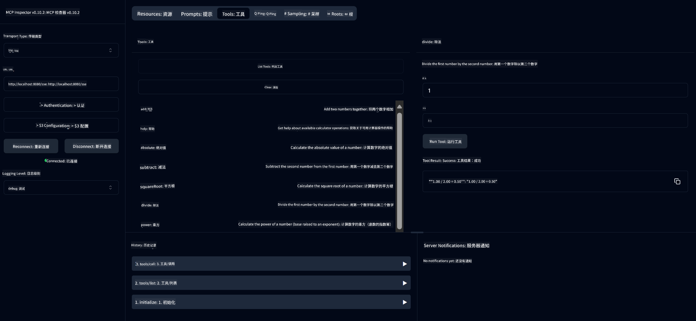

<!--
CO_OP_TRANSLATOR_METADATA:
{
  "original_hash": "ed9cab32cc67c12d8969b407aa47100a",
  "translation_date": "2025-07-13T17:52:22+00:00",
  "source_file": "03-GettingStarted/01-first-server/solution/java/README.md",
  "language_code": "zh"
}
-->
# 基础计算器 MCP 服务

该服务通过使用 Spring Boot 和 WebFlux 传输的模型上下文协议（MCP）提供基础计算器操作。它被设计为初学者学习 MCP 实现的简单示例。

更多信息，请参阅 [MCP Server Boot Starter](https://docs.spring.io/spring-ai/reference/api/mcp/mcp-server-boot-starter-docs.html) 参考文档。

## 使用该服务

该服务通过 MCP 协议暴露以下 API 端点：

- `add(a, b)`：将两个数字相加
- `subtract(a, b)`：用第一个数字减去第二个数字
- `multiply(a, b)`：将两个数字相乘
- `divide(a, b)`：用第一个数字除以第二个数字（带零值检查）
- `power(base, exponent)`：计算幂
- `squareRoot(number)`：计算平方根（带负数检查）
- `modulus(a, b)`：计算除法余数
- `absolute(number)`：计算绝对值

## 依赖项

该项目需要以下关键依赖：

```xml
<dependency>
    <groupId>org.springframework.ai</groupId>
    <artifactId>spring-ai-starter-mcp-server-webflux</artifactId>
</dependency>
```

## 构建项目

使用 Maven 构建项目：
```bash
./mvnw clean install -DskipTests
```

## 运行服务器

### 使用 Java

```bash
java -jar target/calculator-server-0.0.1-SNAPSHOT.jar
```

### 使用 MCP Inspector

MCP Inspector 是一个用于与 MCP 服务交互的实用工具。使用该计算器服务时：

1. **安装并运行 MCP Inspector**，在新终端窗口中执行：
   ```bash
   npx @modelcontextprotocol/inspector
   ```

2. **通过点击应用显示的 URL 访问网页界面**（通常是 http://localhost:6274）

3. **配置连接**：
   - 将传输类型设置为 “SSE”
   - 将 URL 设置为正在运行服务器的 SSE 端点：`http://localhost:8080/sse`
   - 点击 “Connect”

4. **使用工具**：
   - 点击 “List Tools” 查看可用的计算器操作
   - 选择一个工具并点击 “Run Tool” 执行操作



**免责声明**：  
本文件使用 AI 翻译服务 [Co-op Translator](https://github.com/Azure/co-op-translator) 进行翻译。虽然我们力求准确，但请注意，自动翻译可能包含错误或不准确之处。原始语言的原文应被视为权威来源。对于重要信息，建议使用专业人工翻译。我们不对因使用本翻译而产生的任何误解或误释承担责任。