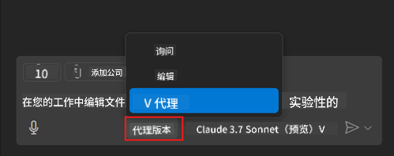
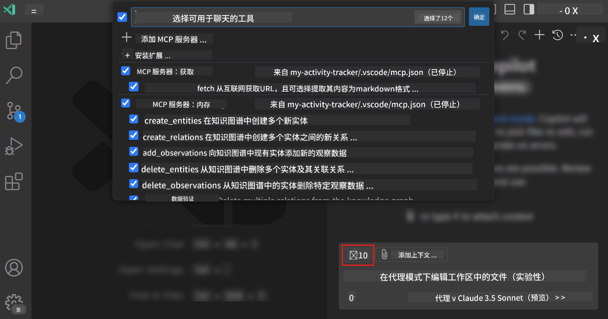
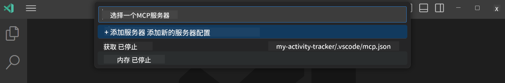
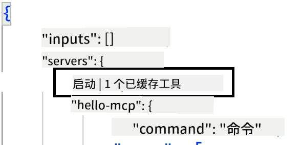
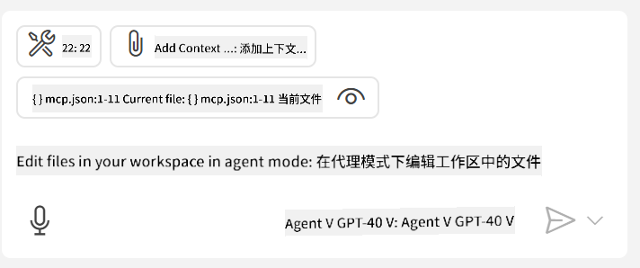

<!--
CO_OP_TRANSLATOR_METADATA:
{
  "original_hash": "d940b5e0af75e3a3a4d1c3179120d1d9",
  "translation_date": "2025-08-26T17:14:43+00:00",
  "source_file": "03-GettingStarted/04-vscode/README.md",
  "language_code": "zh"
}
-->
# 使用 GitHub Copilot Agent 模式连接服务器

Visual Studio Code 和 GitHub Copilot 可以作为客户端连接 MCP 服务器。你可能会问，为什么我们需要这样做？因为这意味着 MCP 服务器的所有功能现在都可以直接在你的 IDE 中使用。想象一下，比如添加 GitHub 的 MCP 服务器，这样你就可以通过提示来控制 GitHub，而不需要在终端中输入特定命令。或者，任何能够提升开发者体验的功能都可以通过自然语言来控制。现在你应该能看到其中的优势了吧？

## 概述

本课程讲解如何使用 Visual Studio Code 和 GitHub Copilot 的 Agent 模式作为 MCP 服务器的客户端。

## 学习目标

完成本课程后，你将能够：

- 通过 Visual Studio Code 使用 MCP 服务器。
- 使用 GitHub Copilot 运行工具等功能。
- 配置 Visual Studio Code 来发现和管理你的 MCP 服务器。

## 使用方法

你可以通过两种方式控制 MCP 服务器：

- 用户界面：稍后我们会在本章中展示如何操作。
- 终端：可以通过 `code` 可执行文件在终端中进行控制：

  要将 MCP 服务器添加到用户配置文件中，请使用 --add-mcp 命令行选项，并以 JSON 格式提供服务器配置，例如 {\"name\":\"server-name\",\"command\":...}。

  ```
  code --add-mcp "{\"name\":\"my-server\",\"command\": \"uvx\",\"args\": [\"mcp-server-fetch\"]}"
  ```

### 截图





接下来我们将详细讨论如何使用可视化界面。

## 方法

以下是我们需要采用的高层次方法：

- 配置文件以发现 MCP 服务器。
- 启动/连接服务器以列出其功能。
- 通过 GitHub Copilot 聊天界面使用这些功能。

很好，现在我们了解了流程，接下来通过一个练习尝试在 Visual Studio Code 中使用 MCP 服务器。

## 练习：连接服务器

在本练习中，我们将配置 Visual Studio Code 来发现你的 MCP 服务器，以便可以通过 GitHub Copilot 聊天界面使用它。

### -0- 前置步骤：启用 MCP 服务器发现

你可能需要启用 MCP 服务器的发现功能。

1. 在 Visual Studio Code 中，进入 `文件 -> 首选项 -> 设置`。

1. 搜索 "MCP"，并在 settings.json 文件中启用 `chat.mcp.discovery.enabled`。

### -1- 创建配置文件

首先在项目根目录中创建一个配置文件，你需要创建一个名为 MCP.json 的文件，并将其放置在 .vscode 文件夹中。文件内容如下：

```text
.vscode
|-- mcp.json
```

接下来，我们看看如何添加服务器条目。

### -2- 配置服务器

在 *mcp.json* 文件中添加以下内容：

```json
{
    "inputs": [],
    "servers": {
       "hello-mcp": {
           "command": "node",
           "args": [
               "build/index.js"
           ]
       }
    }
}
```

上面的示例展示了如何启动一个用 Node.js 编写的服务器，对于其他运行时，请指定正确的命令和参数来启动服务器。

### -3- 启动服务器

现在你已经添加了一个条目，接下来启动服务器：

1. 在 *mcp.json* 文件中找到你的条目，并确保找到 "播放" 图标：

    

1. 点击 "播放" 图标，你应该会看到 GitHub Copilot 聊天界面的工具图标显示可用工具数量增加。如果点击该工具图标，你会看到已注册工具的列表。你可以根据需要勾选/取消勾选每个工具，以决定是否让 GitHub Copilot 使用它们作为上下文：

  

1. 要运行工具，请输入一个与工具描述匹配的提示，例如 "将 22 加到 1"：

  

  你应该会看到一个响应，显示结果为 23。

## 作业

尝试向你的 *mcp.json* 文件添加一个服务器条目，并确保你可以启动/停止服务器。确保你还可以通过 GitHub Copilot 聊天界面与服务器上的工具进行通信。

## 解决方案

[解决方案](./solution/README.md)

## 关键点总结

本章的关键点如下：

- Visual Studio Code 是一个优秀的客户端，可以连接多个 MCP 服务器及其工具。
- GitHub Copilot 聊天界面是与服务器交互的方式。
- 你可以提示用户输入 API 密钥等信息，并在配置 *mcp.json* 文件中的服务器条目时将其传递给 MCP 服务器。

## 示例

- [Java 计算器](../samples/java/calculator/README.md)
- [.Net 计算器](../../../../03-GettingStarted/samples/csharp)
- [JavaScript 计算器](../samples/javascript/README.md)
- [TypeScript 计算器](../samples/typescript/README.md)
- [Python 计算器](../../../../03-GettingStarted/samples/python)

## 其他资源

- [Visual Studio 文档](https://code.visualstudio.com/docs/copilot/chat/mcp-servers)

## 下一步

- 下一章：[创建一个 stdio 服务器](../05-stdio-server/README.md)

---

**免责声明**：  
本文档使用AI翻译服务 [Co-op Translator](https://github.com/Azure/co-op-translator) 进行翻译。尽管我们努力确保翻译的准确性，但请注意，自动翻译可能包含错误或不准确之处。原始语言的文档应被视为权威来源。对于关键信息，建议使用专业人工翻译。我们不对因使用此翻译而产生的任何误解或误读承担责任。