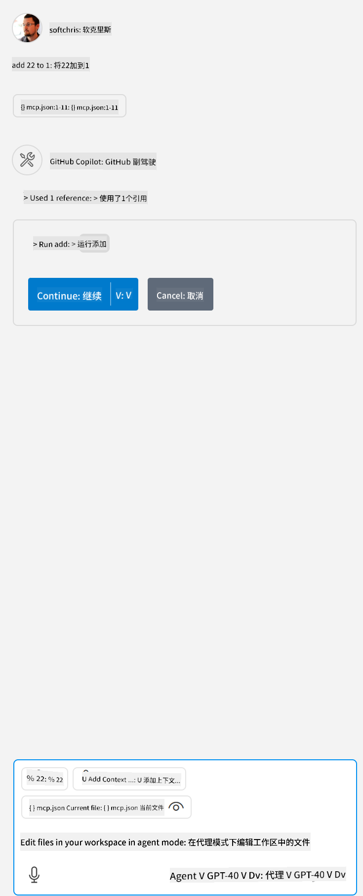

<!--
CO_OP_TRANSLATOR_METADATA:
{
  "original_hash": "5ef8f5821c1a04f7b1fc4f15098ecab8",
  "translation_date": "2025-07-13T19:39:34+00:00",
  "source_file": "03-GettingStarted/04-vscode/solution/README.md",
  "language_code": "zh"
}
-->
这相当于运行如下命令：`node build/index.js`。

- 根据你的服务器文件位置或所选运行时和服务器位置，修改此服务器条目以适应启动服务器所需的完整命令。

## 在服务器中使用功能

- 将 *mcp.json* 添加到 *./vscode* 文件夹后，点击 `play` 图标，

    你会看到工具图标发生变化，可用工具数量增加。工具图标位于 GitHub Copilot 聊天框上方。

## 运行工具

- 在聊天窗口输入与工具描述匹配的提示。例如，要触发 `add` 工具，可以输入类似“add 3 to 20”的内容。

    你会看到聊天文本框上方出现一个工具提示，提示你选择运行该工具，如下图所示：

    

    选择该工具后，如果你的提示如前所述，应该会得到一个数字结果“23”。

**免责声明**：  
本文件使用 AI 翻译服务 [Co-op Translator](https://github.com/Azure/co-op-translator) 进行翻译。虽然我们力求准确，但请注意，自动翻译可能包含错误或不准确之处。原始语言的原文应被视为权威来源。对于重要信息，建议采用专业人工翻译。对于因使用本翻译而产生的任何误解或误释，我们不承担任何责任。