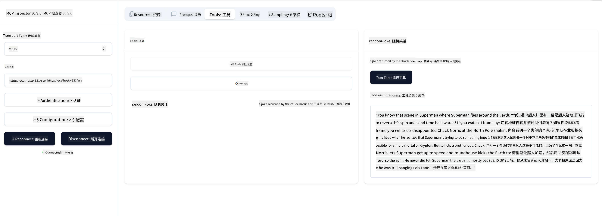

<!--
CO_OP_TRANSLATOR_METADATA:
{
  "original_hash": "64645691bf0985f1760b948123edf269",
  "translation_date": "2025-06-13T10:43:03+00:00",
  "source_file": "03-GettingStarted/05-sse-server/README.md",
  "language_code": "zh"
}
-->
现在我们对 SSE 有了更多了解，接下来让我们来构建一个 SSE 服务器。

## 练习：创建 SSE 服务器

创建服务器时，我们需要记住两点：

- 需要使用 Web 服务器来暴露连接和消息的端点。
- 像之前使用 stdio 时一样，使用工具、资源和提示来构建服务器。

### -1- 创建服务器实例

创建服务器时，我们使用与 stdio 相同的类型，但传输方式需要选择 SSE。

接下来让我们添加所需的路由。

### -2- 添加路由

接下来添加处理连接和传入消息的路由：

接下来为服务器添加功能。

### -3- 添加服务器功能

现在我们已经定义了所有 SSE 相关的内容，接下来添加服务器功能，如工具、提示和资源。

你的完整代码应该如下所示：

太好了，我们已经有了一个使用 SSE 的服务器，接下来让我们试运行一下。

## 练习：使用 Inspector 调试 SSE 服务器

Inspector 是一个很棒的工具，我们在之前的课程 [创建你的第一个服务器](/03-GettingStarted/01-first-server/README.md) 中已经见过。让我们看看是否能在这里也用 Inspector：

### -1- 运行 Inspector

要运行 Inspector，首先必须启动 SSE 服务器，所以我们先来启动服务器：

1. 启动服务器

1. 运行 Inspector

    > ![NOTE]
    > 请在与服务器不同的终端窗口中运行此命令。同时注意，你需要根据服务器运行的 URL 调整下面的命令。

    ```sh
    npx @modelcontextprotocol/inspector --cli http://localhost:8000/sse --method tools/list
    ```

    在所有运行时中，运行 Inspector 的方式都是一样的。注意，我们不是传入服务器的路径和启动服务器的命令，而是传入服务器运行的 URL，并指定 `/sse` 路由。

### -2- 试用该工具

选择下拉列表中的 SSE，并填写你的服务器运行的 URL，例如 http://localhost:4321/sse。然后点击“Connect”按钮。和之前一样，选择列出工具，选中一个工具并提供输入值。你应该会看到如下结果：



太棒了，你已经能使用 Inspector 了，接下来看看如何用 Visual Studio Code 来操作。

## 任务

尝试为你的服务器添加更多功能。参考[这个页面](https://api.chucknorris.io/)添加一个调用 API 的工具，具体服务器长什么样由你决定。玩得开心 :)

## 解决方案

[解决方案](./solution/README.md) 这里有一个可能的带有工作代码的解决方案。

## 主要收获

本章的主要收获如下：

- SSE 是继 stdio 之后支持的第二种传输方式。
- 支持 SSE 需要使用 Web 框架管理传入连接和消息。
- 你可以像使用 stdio 服务器一样使用 Inspector 和 Visual Studio Code 来消费 SSE 服务器。注意 stdio 和 SSE 之间有些许不同。对于 SSE，你需要单独启动服务器，然后再运行 Inspector 工具。Inspector 工具也有所不同，需要指定 URL。

## 示例

- [Java 计算器](../samples/java/calculator/README.md)
- [.Net 计算器](../../../../03-GettingStarted/samples/csharp)
- [JavaScript 计算器](../samples/javascript/README.md)
- [TypeScript 计算器](../samples/typescript/README.md)
- [Python 计算器](../../../../03-GettingStarted/samples/python)

## 额外资源

- [SSE](https://developer.mozilla.org/en-US/docs/Web/API/Server-sent_events)

## 接下来

- 下一步：[使用 MCP 的 HTTP 流 (可流式 HTTP)](/03-GettingStarted/06-http-streaming/README.md)

**免责声明**：  
本文件使用 AI 翻译服务 [Co-op Translator](https://github.com/Azure/co-op-translator) 进行翻译。尽管我们力求准确，但请注意自动翻译可能存在错误或不准确之处。原始语言版本的文件应被视为权威来源。对于重要信息，建议使用专业人工翻译。对于因使用本翻译而产生的任何误解或误释，我们概不负责。