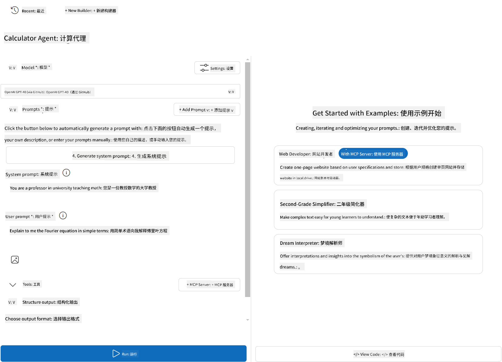

<!--
CO_OP_TRANSLATOR_METADATA:
{
  "original_hash": "af6cee6052e751674c1d9022a4b204e6",
  "translation_date": "2025-06-03T14:25:22+00:00",
  "source_file": "03-GettingStarted/06-aitk/README.md",
  "language_code": "zh"
}
-->
# 在 Visual Studio Code 的 AI Toolkit 扩展中使用服务器

当你构建一个 AI 代理时，不仅仅是生成智能回复，还需要让代理能够采取实际行动。这就是 Model Context Protocol (MCP) 的用武之地。MCP 让代理能够以统一的方式访问外部工具和服务。可以把它想象成给代理接入了一个真正能用的工具箱。

比如，你将代理连接到你的计算器 MCP 服务器。这样，代理就能通过接收“47 乘以 89 等于多少？”这样的提示来执行数学运算，而无需硬编码逻辑或构建自定义 API。

## 概述

本课介绍如何通过 Visual Studio Code 中的 [AI Toolkit](https://aka.ms/AIToolkit) 扩展，将计算器 MCP 服务器连接到代理，使代理能够通过自然语言执行加减乘除等数学运算。

AI Toolkit 是 Visual Studio Code 的强大扩展，简化了代理开发流程。AI 工程师可以轻松构建 AI 应用，开发和测试生成式 AI 模型，无论是在本地还是云端。该扩展支持目前大多数主流生成模型。

*注意*：AI Toolkit 当前支持 Python 和 TypeScript。

## 学习目标

完成本课后，你将能够：

- 通过 AI Toolkit 使用 MCP 服务器。
- 配置代理，使其能够发现并使用 MCP 服务器提供的工具。
- 通过自然语言调用 MCP 工具。

## 方法

整体流程如下：

- 创建代理并定义其系统提示。
- 创建带有计算器工具的 MCP 服务器。
- 将 Agent Builder 连接到 MCP 服务器。
- 通过自然语言测试代理调用工具的能力。

了解流程后，让我们开始配置 AI 代理，利用 MCP 调用外部工具，提升其能力吧！

## 前提条件

- [Visual Studio Code](https://code.visualstudio.com/)
- [Visual Studio Code 的 AI Toolkit](https://aka.ms/AIToolkit)

## 练习：使用服务器

本练习中，你将在 Visual Studio Code 内使用 AI Toolkit 构建、运行并增强一个带有 MCP 服务器工具的 AI 代理。

### -0- 预备步骤，将 OpenAI GPT-4o 模型添加到“我的模型”

本练习使用 **GPT-4o** 模型。请在创建代理之前，将该模型添加到“我的模型”列表中。


1. 从 **活动栏** 打开 **AI Toolkit** 扩展。
2. 在 **目录** 部分，选择 **Models** 打开 **模型目录**。选择后会在新的编辑器标签页中打开模型目录。
3. 在模型目录的搜索栏输入 **OpenAI GPT-4o**。
4. 点击 **+ 添加** 将模型加入你的“我的模型”列表。确保选择的是 **GitHub 托管** 的模型。
5. 在活动栏确认 **OpenAI GPT-4o** 模型已出现在列表中。

### -1- 创建代理

**Agent (Prompt) Builder** 允许你创建和定制自己的 AI 代理。本节将创建一个新代理，并为其分配对话所用的模型。



1. 从 **活动栏** 打开 **AI Toolkit** 扩展。
2. 在 **工具** 部分，选择 **Agent (Prompt) Builder**，会在新编辑器标签页打开该构建器。
3. 点击 **+ 新建代理** 按钮，扩展会通过 **命令面板** 启动设置向导。
4. 输入代理名称 **Calculator Agent**，按 **Enter**。
5. 在 **Agent (Prompt) Builder** 中，模型字段选择 **OpenAI GPT-4o (via GitHub)**。

### -2- 为代理创建系统提示

代理搭建完成后，接下来定义它的个性和用途。本节将使用 **生成系统提示** 功能，描述代理的预期行为（此处为计算器代理），并让模型帮你生成系统提示。


1. 在 **提示** 部分，点击 **生成系统提示** 按钮。该按钮会打开提示构建器，利用 AI 生成系统提示。
2. 在 **生成提示** 窗口中输入：`You are a helpful and efficient math assistant. When given a problem involving basic arithmetic, you respond with the correct result.`
3. 点击 **生成**。右下角会弹出通知，提示系统提示正在生成。生成完成后，提示会自动填入 **Agent (Prompt) Builder** 的系统提示字段。
4. 审核系统提示内容，如有需要可进行修改。

### -3- 创建 MCP 服务器

既然已经定义了代理的系统提示来指导其行为和回答，现在是时候赋予代理实用的能力了。本节将创建一个带有加减乘除计算工具的计算器 MCP 服务器。该服务器将使代理能够根据自然语言提示，实时执行数学运算。


AI Toolkit 提供了创建 MCP 服务器的模板。这里我们将使用 Python 模板创建计算器 MCP 服务器。

*注意*：AI Toolkit 当前支持 Python 和 TypeScript。

1. 在 **Agent (Prompt) Builder** 的 **工具** 部分，点击 **+ MCP 服务器** 按钮。扩展会通过 **命令面板** 启动设置向导。
2. 选择 **+ 添加服务器**。
3. 选择 **创建新的 MCP 服务器**。
4. 选择 **python-weather** 模板。
5. 选择 **默认文件夹** 保存 MCP 服务器模板。
6. 输入服务器名称：**Calculator**
7. 会打开一个新的 Visual Studio Code 窗口，选择 **是，我信任作者**。
8. 在终端（**终端** > **新建终端**）创建虚拟环境：`python -m venv .venv`
9. 在终端激活虚拟环境：
    1. Windows - `.venv\Scripts\activate`
    2. macOS/Linux - `source venv/bin/activate`
10. 在终端安装依赖：`pip install -e .[dev]`
11. 在 **活动栏** 的 **资源管理器** 视图中，展开 **src** 目录，选择 **server.py** 打开编辑器。
12. 用以下代码替换 **server.py** 文件内容并保存：

    ```python
    """
    Sample MCP Calculator Server implementation in Python.

    
    This module demonstrates how to create a simple MCP server with calculator tools
    that can perform basic arithmetic operations (add, subtract, multiply, divide).
    """
    
    from mcp.server.fastmcp import FastMCP
    
    server = FastMCP("calculator")
    
    @server.tool()
    def add(a: float, b: float) -> float:
        """Add two numbers together and return the result."""
        return a + b
    
    @server.tool()
    def subtract(a: float, b: float) -> float:
        """Subtract b from a and return the result."""
        return a - b
    
    @server.tool()
    def multiply(a: float, b: float) -> float:
        """Multiply two numbers together and return the result."""
        return a * b
    
    @server.tool()
    def divide(a: float, b: float) -> float:
        """
        Divide a by b and return the result.
        
        Raises:
            ValueError: If b is zero
        """
        if b == 0:
            raise ValueError("Cannot divide by zero")
        return a / b
    ```

### -4- 使用计算器 MCP 服务器运行代理

代理已有工具后，就可以使用它们了！本节将向代理提交提示，测试并验证代理是否能调用计算器 MCP 服务器中的合适工具。


你将在本地开发机上通过 **Agent Builder** 作为 MCP 客户端运行计算器 MCP 服务器。

1. 按 `F5` 运行代理。
2. 你可以提交提示，例如：` to start debugging the MCP server. The **Agent (Prompt) Builder** will open in a new editor tab. The status of the server is visible in the terminal.
1. In the **User prompt** field of the **Agent (Prompt) Builder**, enter the following prompt: `我买了3件商品，每件25美元，然后用了20美元的折扣。我实际支付了多少钱？`
1. Click the **Run** button to generate the agent's response.
1. Review the agent output. The model should conclude that you paid **$55**.
1. Here's a breakdown of what should occur:
    - The agent selects the **multiply** and **substract** tools to aid in the calculation.
    - The respective `a` and `b` values are assigned for the **multiply** tool.
    - The respective `a` and `b，分别为 **subtract** 工具的参数。
    - 每个工具的响应会显示在对应的 **工具响应** 区域。
    - 最终模型的输出显示在 **模型响应** 区域。
3. 你可以继续提交其他提示，进一步测试代理。只需点击 **用户提示** 字段，替换现有内容即可。
4. 测试完成后，可在终端按 **CTRL/CMD+C** 停止服务器。

## 任务

尝试在你的 **server.py** 文件中添加一个新工具（例如：计算数字的平方根）。提交需要代理调用你新工具（或已有工具）的提示。别忘了重启服务器以加载新添加的工具。

## 解决方案

[解决方案](./solution/README.md)

## 主要收获

本章的主要收获包括：

- AI Toolkit 扩展是一个优秀的客户端，支持你调用 MCP 服务器及其工具。
- 你可以向 MCP 服务器添加新工具，扩展代理能力以满足不断变化的需求。
- AI Toolkit 包含模板（如 Python MCP 服务器模板），简化自定义工具的创建。

## 额外资源

- [AI Toolkit 文档](https://aka.ms/AIToolkit/doc)

## 后续内容

下一课：[第4课 实践应用](/04-PracticalImplementation/README.md)

**免责声明**：  
本文件使用 AI 翻译服务 [Co-op Translator](https://github.com/Azure/co-op-translator) 进行翻译。尽管我们力求准确，但请注意，自动翻译可能包含错误或不准确之处。原始语言版本的文件应被视为权威来源。对于重要信息，建议采用专业人工翻译。对于因使用本翻译而产生的任何误解或误释，我们不承担任何责任。