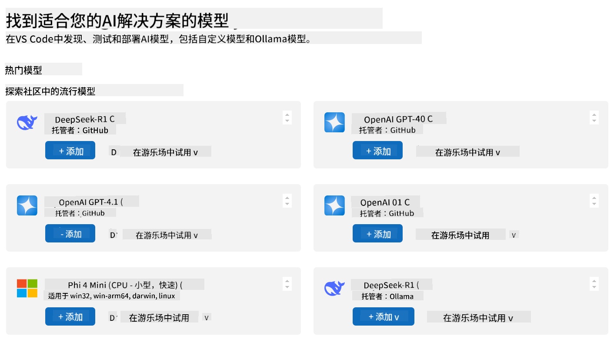
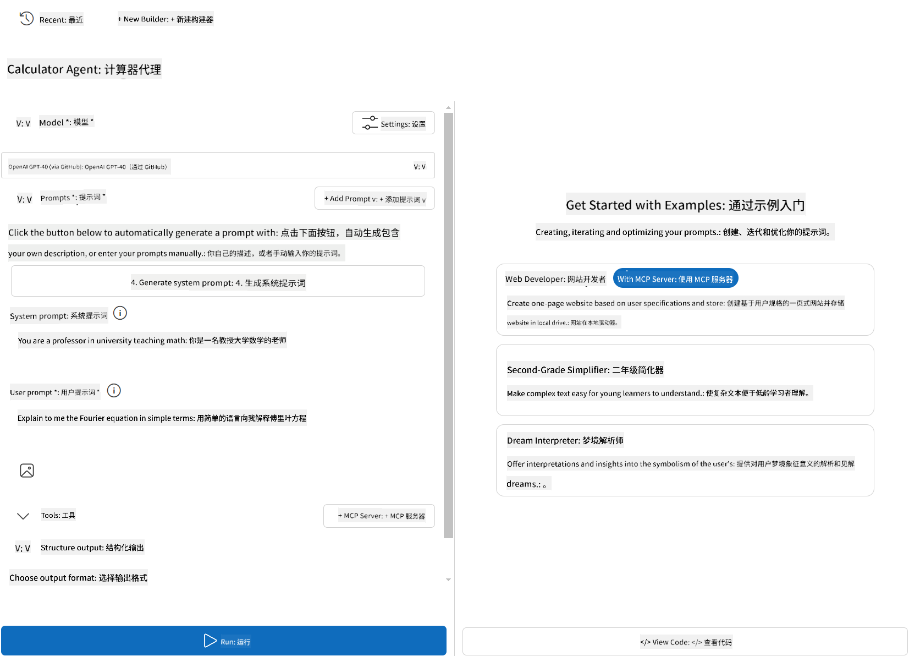
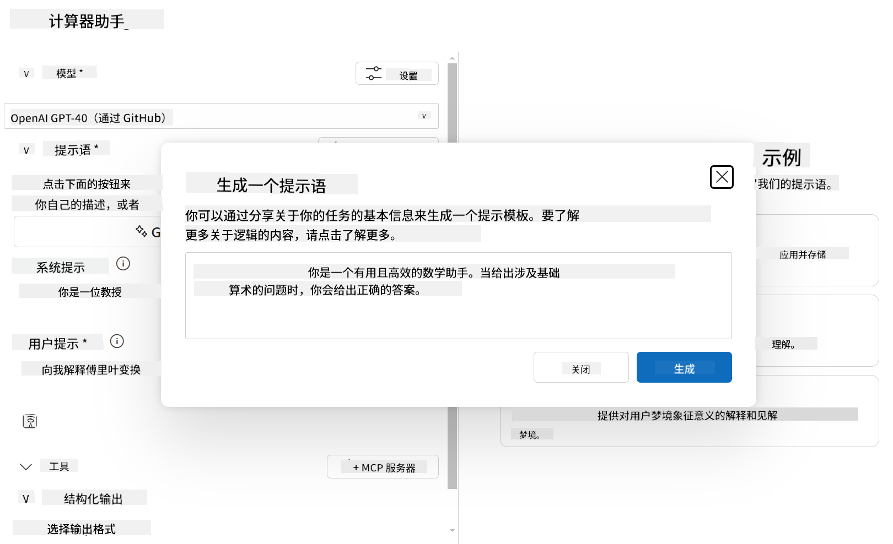

<!--
CO_OP_TRANSLATOR_METADATA:
{
  "original_hash": "98bcd044860716da5819e31c152813b7",
  "translation_date": "2025-08-11T09:40:53+00:00",
  "source_file": "03-GettingStarted/07-aitk/README.md",
  "language_code": "zh"
}
-->
# 使用 Visual Studio Code 的 AI Toolkit 扩展连接服务器

在构建 AI 代理时，不仅仅是生成智能响应，还需要赋予代理执行操作的能力。这就是模型上下文协议（MCP）的作用所在。MCP 使代理能够以一致的方式访问外部工具和服务。可以将其想象为将代理连接到一个它可以实际使用的工具箱。

假设你将代理连接到一个计算器 MCP 服务器。这样，代理就可以通过接收类似“47 乘以 89 等于多少？”的提示来执行数学运算，而无需硬编码逻辑或构建自定义 API。

## 概述

本课程介绍如何通过 Visual Studio Code 的 [AI Toolkit](https://aka.ms/AIToolkit) 扩展将计算器 MCP 服务器连接到代理，使代理能够通过自然语言执行加法、减法、乘法和除法等数学运算。

AI Toolkit 是一个功能强大的 Visual Studio Code 扩展，可以简化代理开发。AI 工程师可以轻松地通过本地或云端开发和测试生成式 AI 模型来构建 AI 应用程序。该扩展支持目前大多数主流的生成式模型。

*注意*：AI Toolkit 当前支持 Python 和 TypeScript。

## 学习目标

完成本课程后，你将能够：

- 使用 AI Toolkit 消耗 MCP 服务器。
- 配置代理以发现并使用 MCP 服务器提供的工具。
- 通过自然语言使用 MCP 工具。

## 方法

以下是我们需要采用的总体方法：

- 创建代理并定义其系统提示。
- 创建一个带有计算器工具的 MCP 服务器。
- 将代理构建器连接到 MCP 服务器。
- 通过自然语言测试代理的工具调用。

很好，现在我们已经了解了流程，接下来让我们配置一个 AI 代理，通过 MCP 利用外部工具，增强其能力！

## 前提条件

- [Visual Studio Code](https://code.visualstudio.com/)
- [Visual Studio Code 的 AI Toolkit](https://aka.ms/AIToolkit)

## 练习：连接服务器

> [!WARNING]
> macOS 用户注意：我们目前正在调查一个影响 macOS 上依赖项安装的问题。因此，macOS 用户暂时无法完成本教程。我们会在修复后更新说明。感谢你的耐心和理解！

在本练习中，你将使用 AI Toolkit 在 Visual Studio Code 中构建、运行并增强一个带有 MCP 服务器工具的 AI 代理。

### -0- 预备步骤，将 OpenAI GPT-4o 模型添加到“我的模型”

本练习使用 **GPT-4o** 模型。在创建代理之前，应将该模型添加到 **我的模型**。



1. 从 **活动栏** 打开 **AI Toolkit** 扩展。
1. 在 **目录** 部分选择 **模型**，以打开 **模型目录**。选择 **模型** 会在新的编辑器标签中打开 **模型目录**。
1. 在 **模型目录** 搜索栏中输入 **OpenAI GPT-4o**。
1. 点击 **+ 添加** 将模型添加到你的 **我的模型** 列表中。确保选择的是 **GitHub 托管** 的模型。
1. 在 **活动栏** 中确认 **OpenAI GPT-4o** 模型出现在列表中。

### -1- 创建代理

**代理（提示）构建器** 使你能够创建和自定义自己的 AI 驱动代理。在本节中，你将创建一个新代理并分配一个模型来支持对话。



1. 从 **活动栏** 打开 **AI Toolkit** 扩展。
1. 在 **工具** 部分选择 **代理（提示）构建器**。选择 **代理（提示）构建器** 会在新的编辑器标签中打开 **代理（提示）构建器**。
1. 点击 **+ 新代理** 按钮。扩展会通过 **命令面板** 启动设置向导。
1. 输入名称 **计算器代理** 并按 **Enter**。
1. 在 **代理（提示）构建器** 中的 **模型** 字段，选择 **OpenAI GPT-4o（通过 GitHub）** 模型。

### -2- 为代理创建系统提示

代理框架搭建完成后，是时候定义其个性和用途了。在本节中，你将使用 **生成系统提示** 功能来描述代理的预期行为（例如一个计算器代理），并让模型为你编写系统提示。



1. 在 **提示** 部分，点击 **生成系统提示** 按钮。此按钮会打开提示构建器，利用 AI 为代理生成系统提示。
1. 在 **生成提示** 窗口中输入以下内容：`你是一个乐于助人且高效的数学助手。当遇到涉及基本算术的问题时，你会提供正确的结果。`
1. 点击 **生成** 按钮。右下角会出现通知，确认系统提示正在生成。提示生成完成后，提示会出现在 **代理（提示）构建器** 的 **系统提示** 字段中。
1. 审核 **系统提示** 并根据需要进行修改。

### -3- 创建 MCP 服务器

现在你已经定义了代理的系统提示，指导其行为和响应，是时候为代理配备实际功能了。在本节中，你将创建一个带有加法、减法、乘法和除法计算工具的计算器 MCP 服务器。此服务器将使代理能够通过自然语言提示执行实时数学运算。


AI Toolkit 配备了模板，便于创建自己的 MCP 服务器。我们将使用 Python 模板来创建计算器 MCP 服务器。

*注意*：AI Toolkit 当前支持 Python 和 TypeScript。

1. 在 **代理（提示）构建器** 的 **工具** 部分，点击 **+ MCP 服务器** 按钮。扩展会通过 **命令面板** 启动设置向导。
1. 选择 **+ 添加服务器**。
1. 选择 **创建一个新的 MCP 服务器**。
1. 选择 **python-weather** 作为模板。
1. 选择 **默认文件夹** 保存 MCP 服务器模板。
1. 输入以下服务器名称：**计算器**
1. 一个新的 Visual Studio Code 窗口会打开。选择 **是，我信任作者**。
1. 使用终端（**终端** > **新终端**），创建虚拟环境：`python -m venv .venv`
1. 使用终端激活虚拟环境：
    1. Windows - `.venv\Scripts\activate`
    1. macOS/Linux - `source .venv/bin/activate`
1. 使用终端安装依赖项：`pip install -e .[dev]`
1. 在 **活动栏** 的 **资源管理器** 视图中，展开 **src** 目录并选择 **server.py**，在编辑器中打开文件。
1. 将 **server.py** 文件中的代码替换为以下内容并保存：

    ```python
    """
    Sample MCP Calculator Server implementation in Python.

    
    This module demonstrates how to create a simple MCP server with calculator tools
    that can perform basic arithmetic operations (add, subtract, multiply, divide).
    """
    
    from mcp.server.fastmcp import FastMCP
    
    server = FastMCP("calculator")
    
    @server.tool()
    def add(a: float, b: float) -> float:
        """Add two numbers together and return the result."""
        return a + b
    
    @server.tool()
    def subtract(a: float, b: float) -> float:
        """Subtract b from a and return the result."""
        return a - b
    
    @server.tool()
    def multiply(a: float, b: float) -> float:
        """Multiply two numbers together and return the result."""
        return a * b
    
    @server.tool()
    def divide(a: float, b: float) -> float:
        """
        Divide a by b and return the result.
        
        Raises:
            ValueError: If b is zero
        """
        if b == 0:
            raise ValueError("Cannot divide by zero")
        return a / b
    ```

### -4- 使用计算器 MCP 服务器运行代理

现在代理已经拥有工具，是时候使用它们了！在本节中，你将向代理提交提示，以测试并验证代理是否正确调用计算器 MCP 服务器中的工具。


你将在本地开发机器上通过 **代理构建器** 运行计算器 MCP 服务器作为 MCP 客户端。

1. 按 `F5` 启动 MCP 服务器调试。**代理（提示）构建器** 会在新的编辑器标签中打开。服务器状态在终端中可见。
1. 在 **代理（提示）构建器** 的 **用户提示** 字段中输入以下提示：`我买了 3 件每件价格为 $25 的商品，然后用了 $20 的折扣。我花了多少钱？`
1. 点击 **运行** 按钮生成代理的响应。
1. 审核代理输出。模型应得出你花了 **$55**。
1. 以下是应该发生的情况：
    - 代理选择 **乘法** 和 **减法** 工具来协助计算。
    - 分别为 **乘法** 工具分配 `a` 和 `b` 值。
    - 分别为 **减法** 工具分配 `a` 和 `b` 值。
    - 每个工具的响应在各自的 **工具响应** 中提供。
    - 模型的最终输出在 **模型响应** 中提供。
1. 提交其他提示以进一步测试代理。你可以通过点击 **用户提示** 字段并替换现有提示来修改提示。
1. 测试完成后，可以通过 **终端** 输入 **CTRL/CMD+C** 停止服务器。

## 作业

尝试向你的 **server.py** 文件添加一个额外的工具条目（例如：返回一个数字的平方根）。提交需要代理使用新工具（或现有工具）的额外提示。确保重新启动服务器以加载新添加的工具。

## 解决方案

[解决方案](./solution/README.md)

## 关键要点

本章的关键要点如下：

- AI Toolkit 扩展是一个很棒的客户端，可以让你使用 MCP 服务器及其工具。
- 你可以向 MCP 服务器添加新工具，扩展代理的能力以满足不断变化的需求。
- AI Toolkit 包括模板（例如 Python MCP 服务器模板），简化了自定义工具的创建。

## 其他资源

- [AI Toolkit 文档](https://aka.ms/AIToolkit/doc)

## 下一步
- 下一章：[测试与调试](../08-testing/README.md)

**免责声明**：  
本文档使用AI翻译服务 [Co-op Translator](https://github.com/Azure/co-op-translator) 进行翻译。尽管我们努力确保翻译的准确性，但请注意，自动翻译可能包含错误或不准确之处。应以原始语言的文档作为权威来源。对于重要信息，建议使用专业人工翻译。我们对因使用此翻译而产生的任何误解或误读不承担责任。