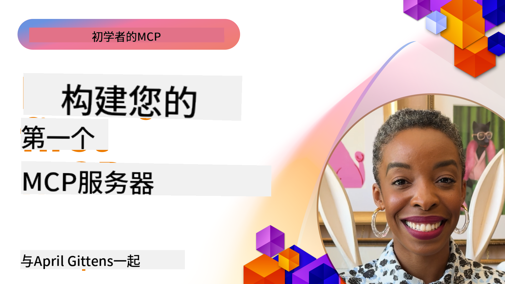

<!--
CO_OP_TRANSLATOR_METADATA:
{
  "original_hash": "1197b6dbde36773e04a5ae826557fdb9",
  "translation_date": "2025-08-26T17:14:26+00:00",
  "source_file": "03-GettingStarted/README.md",
  "language_code": "zh"
}
-->
## 入门  

_（点击上方图片观看本课视频）_

本部分包含以下几节课程：

- **1 第一个服务器**，在第一节课中，您将学习如何创建您的第一个服务器，并使用检查工具对其进行检查，这是一种测试和调试服务器的宝贵方法，[进入课程](01-first-server/README.md)

- **2 客户端**，在本节课中，您将学习如何编写一个可以连接到服务器的客户端，[进入课程](02-client/README.md)

- **3 带有 LLM 的客户端**，一种更好的编写客户端的方法是为其添加 LLM，使其能够与服务器“协商”要执行的操作，[进入课程](03-llm-client/README.md)

- **4 在 Visual Studio Code 中以 GitHub Copilot Agent 模式运行服务器**。在这里，我们将学习如何在 Visual Studio Code 中运行 MCP 服务器，[进入课程](04-vscode/README.md)

- **5 stdio 传输服务器**。stdio 传输是当前规范中推荐的 MCP 服务器与客户端通信标准，提供基于安全子进程的通信，[进入课程](05-stdio-server/README.md)

- **6 使用 MCP 的 HTTP 流式传输（可流式 HTTP）**。了解现代 HTTP 流式传输、进度通知，以及如何使用可流式 HTTP 实现可扩展的实时 MCP 服务器和客户端，[进入课程](06-http-streaming/README.md)

- **7 利用 VSCode 的 AI 工具包**来使用和测试您的 MCP 客户端和服务器，[进入课程](07-aitk/README.md)

- **8 测试**。在这里我们将特别关注如何以不同方式测试服务器和客户端，[进入课程](08-testing/README.md)

- **9 部署**。本章将探讨部署 MCP 解决方案的不同方法，[进入课程](09-deployment/README.md)

Model Context Protocol (MCP) 是一种开放协议，用于标准化应用程序向 LLM 提供上下文的方式。可以将 MCP 想象成 AI 应用程序的 USB-C 接口——它提供了一种标准化的方式，将 AI 模型连接到不同的数据源和工具。

## 学习目标

完成本课程后，您将能够：

- 为 MCP 设置开发环境（支持 C#、Java、Python、TypeScript 和 JavaScript）
- 构建和部署具有自定义功能（资源、提示和工具）的基本 MCP 服务器
- 创建连接到 MCP 服务器的主机应用程序
- 测试和调试 MCP 实现
- 理解常见的设置挑战及其解决方案
- 将您的 MCP 实现连接到流行的 LLM 服务

## 设置您的 MCP 环境

在开始使用 MCP 之前，准备好开发环境并了解基本工作流程非常重要。本部分将指导您完成初始设置步骤，以确保顺利开始使用 MCP。

### 前置条件

在开始 MCP 开发之前，请确保您具备以下条件：

- **开发环境**：支持您选择的编程语言（C#、Java、Python、TypeScript 或 JavaScript）
- **IDE/编辑器**：Visual Studio、Visual Studio Code、IntelliJ、Eclipse、PyCharm 或任何现代代码编辑器
- **包管理器**：NuGet、Maven/Gradle、pip 或 npm/yarn
- **API 密钥**：用于您计划在主机应用程序中使用的 AI 服务

### 官方 SDK

在接下来的章节中，您将看到使用 Python、TypeScript、Java 和 .NET 构建的解决方案。以下是所有官方支持的 SDK。

MCP 提供了多种语言的官方 SDK：
- [C# SDK](https://github.com/modelcontextprotocol/csharp-sdk) - 与 Microsoft 合作维护
- [Java SDK](https://github.com/modelcontextprotocol/java-sdk) - 与 Spring AI 合作维护
- [TypeScript SDK](https://github.com/modelcontextprotocol/typescript-sdk) - 官方 TypeScript 实现
- [Python SDK](https://github.com/modelcontextprotocol/python-sdk) - 官方 Python 实现
- [Kotlin SDK](https://github.com/modelcontextprotocol/kotlin-sdk) - 官方 Kotlin 实现
- [Swift SDK](https://github.com/modelcontextprotocol/swift-sdk) - 与 Loopwork AI 合作维护
- [Rust SDK](https://github.com/modelcontextprotocol/rust-sdk) - 官方 Rust 实现

## 关键要点

- 使用语言特定的 SDK 设置 MCP 开发环境非常简单
- 构建 MCP 服务器需要创建并注册具有清晰架构的工具
- MCP 客户端连接到服务器和模型以利用扩展功能
- 测试和调试对于可靠的 MCP 实现至关重要
- 部署选项包括本地开发和基于云的解决方案

## 实践

我们提供了一组样例，补充了本部分所有章节中的练习。此外，每章还包含自己的练习和作业。

- [Java 计算器](./samples/java/calculator/README.md)
- [.Net 计算器](../../../03-GettingStarted/samples/csharp)
- [JavaScript 计算器](./samples/javascript/README.md)
- [TypeScript 计算器](./samples/typescript/README.md)
- [Python 计算器](../../../03-GettingStarted/samples/python)

## 其他资源

- [在 Azure 上使用 Model Context Protocol 构建代理](https://learn.microsoft.com/azure/developer/ai/intro-agents-mcp)
- [使用 Azure 容器应用程序进行远程 MCP（Node.js/TypeScript/JavaScript）](https://learn.microsoft.com/samples/azure-samples/mcp-container-ts/mcp-container-ts/)
- [.NET OpenAI MCP Agent](https://learn.microsoft.com/samples/azure-samples/openai-mcp-agent-dotnet/openai-mcp-agent-dotnet/)

## 下一步

下一步：[创建您的第一个 MCP 服务器](01-first-server/README.md)

---

**免责声明**：  
本文档使用AI翻译服务 [Co-op Translator](https://github.com/Azure/co-op-translator) 进行翻译。尽管我们努力确保翻译的准确性，但请注意，自动翻译可能包含错误或不准确之处。原始语言的文档应被视为权威来源。对于关键信息，建议使用专业人工翻译。我们不对因使用此翻译而产生的任何误解或误读承担责任。