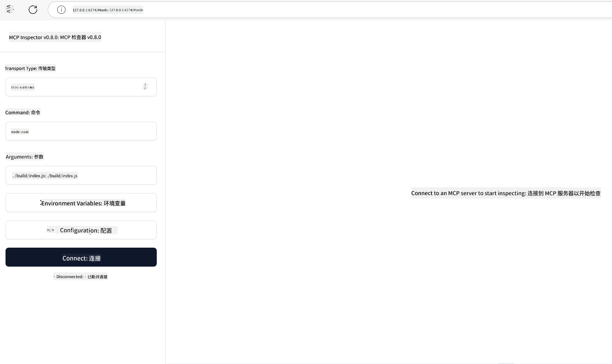

<!--
CO_OP_TRANSLATOR_METADATA:
{
  "original_hash": "83efa75a69bc831277263a6f1ae53669",
  "translation_date": "2025-08-11T09:37:34+00:00",
  "source_file": "04-PracticalImplementation/README.md",
  "language_code": "zh"
}
-->
# 实践应用

[](https://youtu.be/vCN9-mKBDfQ)

_（点击上方图片观看本课视频）_

实践应用是让模型上下文协议（MCP）的强大功能变得具体可见的地方。虽然理解 MCP 的理论和架构很重要，但真正的价值在于将这些概念应用于构建、测试和部署解决实际问题的解决方案。本章将理论知识与实际开发之间的鸿沟弥合，指导您如何将基于 MCP 的应用程序付诸实践。

无论您是在开发智能助手、将 AI 集成到业务工作流程中，还是构建用于数据处理的定制工具，MCP 都提供了一个灵活的基础。其与语言无关的设计以及针对流行编程语言的官方 SDK，使得 MCP 对各种开发者都易于使用。通过利用这些 SDK，您可以快速原型设计、迭代并在不同平台和环境中扩展您的解决方案。

在接下来的章节中，您将看到实践示例、代码样例和部署策略，展示如何在 C#、Java（结合 Spring）、TypeScript、JavaScript 和 Python 中实现 MCP。您还将学习如何调试和测试 MCP 服务器、管理 API，并使用 Azure 将解决方案部署到云端。这些实践资源旨在加速您的学习，帮助您自信地构建强大、可投入生产的 MCP 应用程序。

## 概述

本课重点介绍 MCP 在多种编程语言中的实践应用。我们将探索如何使用 MCP SDK 在 C#、Java（结合 Spring）、TypeScript、JavaScript 和 Python 中构建强大的应用程序，调试和测试 MCP 服务器，并创建可重用的资源、提示和工具。

## 学习目标

完成本课后，您将能够：

- 使用官方 SDK 在多种编程语言中实现 MCP 解决方案
- 系统地调试和测试 MCP 服务器
- 创建和使用服务器功能（资源、提示和工具）
- 为复杂任务设计有效的 MCP 工作流程
- 优化 MCP 实现以提高性能和可靠性

## 官方 SDK 资源

模型上下文协议提供了多种语言的官方 SDK：

- [C# SDK](https://github.com/modelcontextprotocol/csharp-sdk)
- [Java（结合 Spring）SDK](https://github.com/modelcontextprotocol/java-sdk) **注意：** 需要依赖 [Project Reactor](https://projectreactor.io)。（参见 [讨论问题 246](https://github.com/orgs/modelcontextprotocol/discussions/246)。）
- [TypeScript SDK](https://github.com/modelcontextprotocol/typescript-sdk)
- [Python SDK](https://github.com/modelcontextprotocol/python-sdk)
- [Kotlin SDK](https://github.com/modelcontextprotocol/kotlin-sdk)

## 使用 MCP SDK

本节提供了在多种编程语言中实现 MCP 的实践示例。您可以在 `samples` 目录中按语言找到代码样例。

### 可用样例

仓库中包含以下语言的[样例实现](../../../04-PracticalImplementation/samples)：

- [C#](./samples/csharp/README.md)
- [Java（结合 Spring）](./samples/java/containerapp/README.md)
- [TypeScript](./samples/typescript/README.md)
- [JavaScript](./samples/javascript/README.md)
- [Python](./samples/python/README.md)

每个样例都展示了该语言和生态系统中 MCP 的关键概念和实现模式。

## 核心服务器功能

MCP 服务器可以实现以下功能的任意组合：

### 资源

资源为用户或 AI 模型提供上下文和数据：

- 文档库
- 知识库
- 结构化数据源
- 文件系统

### 提示

提示是为用户设计的模板化消息和工作流程：

- 预定义的对话模板
- 引导式交互模式
- 专门化的对话结构

### 工具

工具是供 AI 模型执行的功能：

- 数据处理工具
- 外部 API 集成
- 计算能力
- 搜索功能

## 样例实现：C# 实现

官方 C# SDK 仓库包含多个样例实现，展示了 MCP 的不同方面：

- **基础 MCP 客户端**：展示如何创建 MCP 客户端并调用工具的简单示例
- **基础 MCP 服务器**：具有基本工具注册的最小服务器实现
- **高级 MCP 服务器**：功能齐全的服务器，包含工具注册、身份验证和错误处理
- **ASP.NET 集成**：展示与 ASP.NET Core 集成的示例
- **工具实现模式**：展示不同复杂度工具实现的各种模式

C# MCP SDK 目前处于预览阶段，API 可能会发生变化。我们将随着 SDK 的发展不断更新此博客。

### 关键功能

- [C# MCP Nuget ModelContextProtocol](https://www.nuget.org/packages/ModelContextProtocol)
- 构建您的 [第一个 MCP 服务器](https://devblogs.microsoft.com/dotnet/build-a-model-context-protocol-mcp-server-in-csharp/)。

有关完整的 C# 实现样例，请访问 [官方 C# SDK 样例仓库](https://github.com/modelcontextprotocol/csharp-sdk)。

## 样例实现：Java（结合 Spring）实现

Java（结合 Spring）SDK 提供了具有企业级功能的强大 MCP 实现选项。

### 关键功能

- Spring 框架集成
- 强类型安全
- 支持响应式编程
- 全面的错误处理

有关完整的 Java（结合 Spring）实现样例，请参见样例目录中的 [Java（结合 Spring）样例](samples/java/containerapp/README.md)。

## 样例实现：JavaScript 实现

JavaScript SDK 提供了一种轻量且灵活的 MCP 实现方法。

### 关键功能

- 支持 Node.js 和浏览器
- 基于 Promise 的 API
- 易于与 Express 和其他框架集成
- 支持 WebSocket 流式传输

有关完整的 JavaScript 实现样例，请参见样例目录中的 [JavaScript 样例](samples/javascript/README.md)。

## 样例实现：Python 实现

Python SDK 提供了一种符合 Python 习惯的 MCP 实现方法，并与优秀的机器学习框架集成。

### 关键功能

- 使用 asyncio 支持异步/等待
- FastAPI 集成
- 简单的工具注册
- 与流行的机器学习库原生集成

有关完整的 Python 实现样例，请参见样例目录中的 [Python 样例](samples/python/README.md)。

## API 管理

Azure API 管理是保护 MCP 服务器的绝佳解决方案。其核心思想是将 Azure API 管理实例置于 MCP 服务器前端，并让其处理您可能需要的功能，例如：

- 限流
- 令牌管理
- 监控
- 负载均衡
- 安全性

### Azure 样例

以下是一个 Azure 样例，展示了如何[创建 MCP 服务器并使用 Azure API 管理保护它](https://github.com/Azure-Samples/remote-mcp-apim-functions-python)。

请参见下图中的授权流程：


在上述图中，发生了以下情况：

- 使用 Microsoft Entra 进行身份验证/授权。
- Azure API 管理充当网关，并使用策略来引导和管理流量。
- Azure Monitor 记录所有请求以供进一步分析。

#### 授权流程

让我们更详细地了解授权流程：


#### MCP 授权规范

了解更多关于 [MCP 授权规范](https://modelcontextprotocol.io/specification/2025-03-26/basic/authorization#2-10-third-party-authorization-flow)。

## 将远程 MCP 服务器部署到 Azure

让我们看看是否可以部署前面提到的样例：

1. 克隆仓库

    ```bash
    git clone https://github.com/Azure-Samples/remote-mcp-apim-functions-python.git
    cd remote-mcp-apim-functions-python
    ```

1. 注册 `Microsoft.App` 资源提供者。

   - 如果您使用 Azure CLI，请运行 `az provider register --namespace Microsoft.App --wait`。
   - 如果您使用 Azure PowerShell，请运行 `Register-AzResourceProvider -ProviderNamespace Microsoft.App`。然后稍后运行 `(Get-AzResourceProvider -ProviderNamespace Microsoft.App).RegistrationState` 检查注册是否完成。

1. 运行此 [azd](https://aka.ms/azd) 命令以配置 API 管理服务、函数应用（包含代码）以及所有其他所需的 Azure 资源。

    ```shell
    azd up
    ```

    此命令应在 Azure 上部署所有云资源。

### 使用 MCP Inspector 测试您的服务器

1. 在**新终端窗口**中安装并运行 MCP Inspector

    ```shell
    npx @modelcontextprotocol/inspector
    ```

    您应该看到类似以下的界面：

    

1. 按住 CTRL 点击从应用显示的 URL 加载 MCP Inspector Web 应用（例如 [http://127.0.0.1:6274/#resources](http://127.0.0.1:6274/#resources)）。
1. 将传输类型设置为 `SSE`。
1. 将 URL 设置为运行的 API 管理 SSE 端点（在 `azd up` 后显示）并**连接**：

    ```shell
    https://<apim-servicename-from-azd-output>.azure-api.net/mcp/sse
    ```

1. **列出工具**。点击一个工具并**运行工具**。

如果所有步骤都成功，您现在应该已连接到 MCP 服务器，并能够调用工具。

## Azure 的 MCP 服务器

[Remote-mcp-functions](https://github.com/Azure-Samples/remote-mcp-functions-dotnet)：这组仓库是使用 Azure Functions 构建和部署自定义远程 MCP（模型上下文协议）服务器的快速入门模板，支持 Python、C# .NET 或 Node/TypeScript。

这些样例提供了一个完整的解决方案，允许开发者：

- 本地构建和运行：在本地机器上开发和调试 MCP 服务器
- 部署到 Azure：通过简单的 azd up 命令轻松部署到云端
- 从客户端连接：从各种客户端连接到 MCP 服务器，包括 VS Code 的 Copilot 代理模式和 MCP Inspector 工具

### 关键功能

- 设计安全性：MCP 服务器使用密钥和 HTTPS 进行保护
- 身份验证选项：支持使用内置身份验证和/或 API 管理的 OAuth
- 网络隔离：支持使用 Azure 虚拟网络（VNET）进行网络隔离
- 无服务器架构：利用 Azure Functions 实现可扩展的事件驱动执行
- 本地开发：全面的本地开发和调试支持
- 简单部署：简化的 Azure 部署流程

仓库包含所有必要的配置文件、源代码和基础设施定义，帮助您快速开始生产级 MCP 服务器实现。

- [Azure Remote MCP Functions Python](https://github.com/Azure-Samples/remote-mcp-functions-python) - 使用 Python 和 Azure Functions 实现 MCP 的样例

- [Azure Remote MCP Functions .NET](https://github.com/Azure-Samples/remote-mcp-functions-dotnet) - 使用 C# .NET 和 Azure Functions 实现 MCP 的样例

- [Azure Remote MCP Functions Node/Typescript](https://github.com/Azure-Samples/remote-mcp-functions-typescript) - 使用 Node/TypeScript 和 Azure Functions 实现 MCP 的样例。

## 关键要点

- MCP SDK 提供了语言特定的工具，用于实现强大的 MCP 解决方案
- 调试和测试过程对于可靠的 MCP 应用至关重要
- 可重用的提示模板能够实现一致的 AI 交互
- 精心设计的工作流程可以使用多个工具协调复杂任务
- 实现 MCP 解决方案需要考虑安全性、性能和错误处理

## 练习

设计一个解决您领域内实际问题的 MCP 工作流程：

1. 确定 3-4 个解决问题有用的工具
2. 创建一个工作流程图，展示这些工具如何交互
3. 使用您偏好的语言实现其中一个工具的基础版本
4. 创建一个提示模板，帮助模型有效使用您的工具

## 其他资源

---

下一步：[高级主题](../05-AdvancedTopics/README.md)

**免责声明**：  
本文档使用AI翻译服务[Co-op Translator](https://github.com/Azure/co-op-translator)进行翻译。尽管我们努力确保翻译的准确性，但请注意，自动翻译可能包含错误或不准确之处。原始语言的文档应被视为权威来源。对于关键信息，建议使用专业人工翻译。我们不对因使用此翻译而产生的任何误解或误读承担责任。