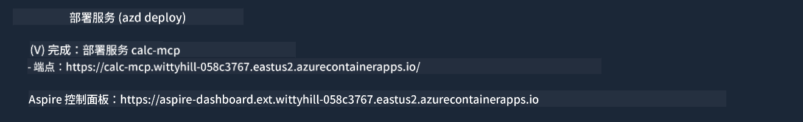

<!--
CO_OP_TRANSLATOR_METADATA:
{
  "original_hash": "5020a3e1a1c7f30c00f9e37f1fa208e3",
  "translation_date": "2025-05-16T15:41:21+00:00",
  "source_file": "04-PracticalImplementation/samples/csharp/README.md",
  "language_code": "zh"
}
-->
# 示例

前面的例子展示了如何使用本地的 .NET 项目和 `sdio` 类型，以及如何在容器中本地运行服务器。这在很多情况下都是一个不错的解决方案。不过，有时候让服务器远程运行，比如在云环境中，也很有用。这时就用到了 `http` 类型。

看看 `04-PracticalImplementation` 文件夹下的解决方案，可能看起来比之前复杂得多，但实际上并不是。仔细看项目 `src/mcpserver/mcpserver.csproj`，你会发现代码大部分和之前的例子相同。唯一的区别是我们使用了不同的库 `ModelContextProtocol.AspNetCore` 来处理 HTTP 请求，并且将方法 `IsPrime` 改成了私有方法，这只是为了演示代码中也可以有私有方法。其余代码和之前一样。

其他项目来自 [.NET Aspire](https://learn.microsoft.com/dotnet/aspire/get-started/aspire-overview)。将 .NET Aspire 纳入解决方案能提升开发和测试时的体验，并有助于可观测性。虽然运行服务器并非必须，但把它放进解决方案是个好习惯。

## 本地启动服务器

1. 在 VS Code（安装了 C# DevKit 扩展）中，打开解决方案 `04-PracticalImplementation\samples\csharp\src\Calculator-chap4.sln`。
2. 按下 `F5` 启动服务器。它会打开一个浏览器，显示 .NET Aspire 仪表盘。

或者

1. 在终端中，进入 `04-PracticalImplementation\samples\csharp\src` 文件夹
2. 执行以下命令启动服务器：
   ```bash
    dotnet run --project .\AppHost
   ```

3. 在仪表盘中，注意 `http` 的 URL。它应该类似于 `http://localhost:5058/`.

## Test `SSE`，带有 ModelContext 协议检查器。

如果你安装了 Node.js 22.7.5 或更高版本，可以使用 ModelContext 协议检查器来测试服务器。

启动服务器后，在终端运行以下命令：

```bash
npx @modelcontextprotocol/inspector@latest
```


- 选择 `SSE` as the Transport type. SSE stand for Server-Sent Events. 
- In the Url field, enter the URL of the server noted earlier,and append `/sse`。它应该是 `http`（而非 `https`) something like `http://localhost:5058/sse`.
- select the Connect button.

A nice thing about the Inspector is that it provide a nice visibility on what is happening.

- Try listing the availables tools
- Try some of them, it should works just like before.


## Test `SSE` with Github Copilot Chat in VS Code

To use the `SSE` transport with Github Copilot Chat, change the configuration of the `mcp-calc` 之前创建的服务器），看起来像这样：

```json
"mcp-calc": {
    "type": "sse",
    "url": "http://localhost:5058/sse"
}
```

做一些测试：
- 询问 6780 之后的 3 个质数。注意 Copilot 会使用新的工具 `NextFivePrimeNumbers`，只返回前三个质数。
- 询问 111 之后的 7 个质数，看看结果如何。

# 将服务器部署到 Azure

我们来把服务器部署到 Azure，让更多人可以使用。

在终端中，进入 `04-PracticalImplementation\samples\csharp\src` 文件夹，运行以下命令：

```bash
azd init
```

这会在本地创建一些文件，用来保存 Azure 资源配置和基础设施即代码（IaC）。

然后，运行以下命令将服务器部署到 Azure：

```bash
azd up
```

部署完成后，你应该会看到类似这样的提示：



打开 Aspire 仪表盘，记下 `HTTP` URL，方便在 MCP Inspector 和 Github Copilot Chat 中使用。

## 接下来做什么？

我们尝试了不同的传输类型和测试工具，也将 MCP 服务器部署到了 Azure。但如果服务器需要访问私有资源呢？比如数据库或私有 API？下一章我们将探讨如何提升服务器的安全性。

**免责声明**：  
本文件使用 AI 翻译服务 [Co-op Translator](https://github.com/Azure/co-op-translator) 进行翻译。虽然我们力求准确，但请注意，自动翻译可能包含错误或不准确之处。原始文件的母语版本应被视为权威来源。对于关键信息，建议使用专业人工翻译。因使用本翻译而产生的任何误解或曲解，我们概不负责。