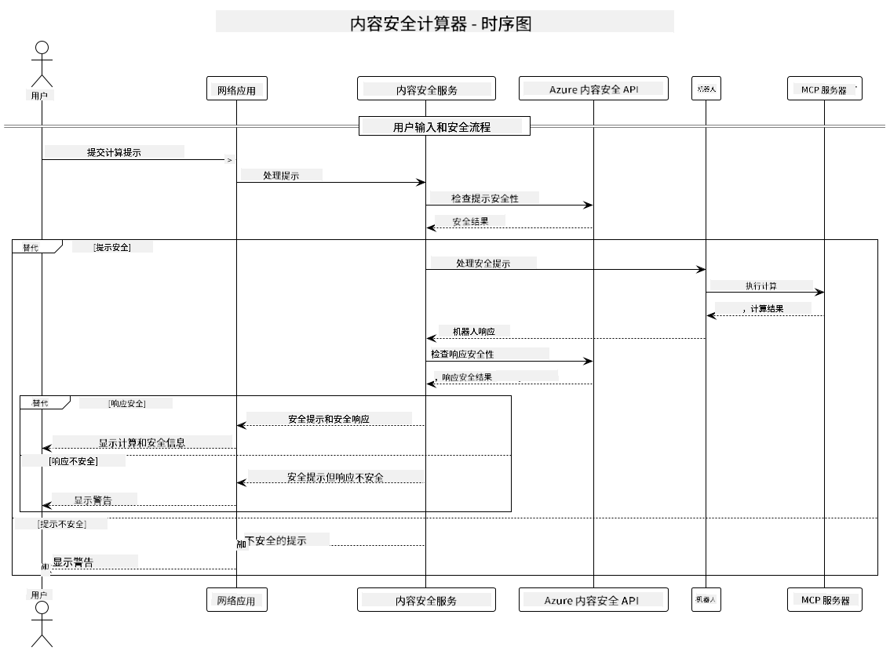

<!--
CO_OP_TRANSLATOR_METADATA:
{
  "original_hash": "e5ea5e7582f70008ea9bec3b3820f20a",
  "translation_date": "2025-07-13T23:12:40+00:00",
  "source_file": "04-PracticalImplementation/samples/java/containerapp/README.md",
  "language_code": "zh"
}
-->
## 系统架构

本项目展示了一个在将用户提示传递给计算器服务之前，先进行内容安全检查的网页应用，采用了模型上下文协议（MCP）。



### 工作原理

1. **用户输入**：用户在网页界面输入计算提示
2. **内容安全筛查（输入）**：提示通过 Azure Content Safety API 进行分析
3. **安全决策（输入）**：
   - 如果内容安全（所有类别的严重程度均低于2），则继续传递给计算器
   - 如果内容被标记为潜在有害，流程停止并返回警告
4. **计算器集成**：安全内容由 LangChain4j 处理，LangChain4j 与 MCP 计算器服务器通信
5. **内容安全筛查（输出）**：机器人回复通过 Azure Content Safety API 进行分析
6. **安全决策（输出）**：
   - 如果机器人回复安全，则显示给用户
   - 如果机器人回复被标记为潜在有害，则用警告信息替代
7. **响应**：结果（如果安全）显示给用户，同时展示输入和输出的安全分析

## 使用模型上下文协议（MCP）调用计算器服务

本项目演示了如何使用模型上下文协议（MCP）通过 LangChain4j 调用计算器 MCP 服务。实现中使用了本地运行在8080端口的 MCP 服务器来提供计算操作。

### 配置 Azure Content Safety 服务

在使用内容安全功能之前，需要创建一个 Azure Content Safety 服务资源：

1. 登录 [Azure 门户](https://portal.azure.com)
2. 点击“创建资源”，搜索“Content Safety”
3. 选择“Content Safety”，点击“创建”
4. 输入资源的唯一名称
5. 选择订阅和资源组（或新建资源组）
6. 选择支持的区域（详情请查看[区域可用性](https://azure.microsoft.com/en-us/global-infrastructure/services/?products=cognitive-services)）
7. 选择合适的定价层
8. 点击“创建”部署资源
9. 部署完成后，点击“转到资源”
10. 在左侧面板“资源管理”下选择“密钥和终结点”
11. 复制任一密钥和终结点 URL，供下一步使用

### 配置环境变量

为 GitHub 模型认证设置 `GITHUB_TOKEN` 环境变量：
```sh
export GITHUB_TOKEN=<your_github_token>
```

为内容安全功能设置：
```sh
export CONTENT_SAFETY_ENDPOINT=<your_content_safety_endpoint>
export CONTENT_SAFETY_KEY=<your_content_safety_key>
```

这些环境变量用于应用程序与 Azure Content Safety 服务的认证。如果未设置，应用将使用占位符值进行演示，但内容安全功能将无法正常工作。

### 启动计算器 MCP 服务器

在运行客户端之前，需要以 SSE 模式启动本地的计算器 MCP 服务器，监听 localhost:8080。

## 项目描述

本项目展示了模型上下文协议（MCP）与 LangChain4j 集成调用计算器服务的实现。主要功能包括：

- 使用 MCP 连接计算器服务，执行基础数学运算
- 对用户提示和机器人回复进行双层内容安全检查
- 通过 LangChain4j 集成 GitHub 的 gpt-4.1-nano 模型
- 使用服务器发送事件（SSE）作为 MCP 传输方式

## 内容安全集成

项目包含全面的内容安全功能，确保用户输入和系统响应均无有害内容：

1. **输入筛查**：所有用户提示在处理前均会被分析是否包含仇恨言论、暴力、自残、色情等有害内容类别。

2. **输出筛查**：即使使用可能未经过滤的模型，系统也会对所有生成的回复进行相同的内容安全过滤，确保展示给用户的内容安全可靠。

这种双层保护机制确保无论使用何种 AI 模型，系统都能保障用户免受有害输入和潜在问题的 AI 输出影响。

## 网页客户端

应用包含一个用户友好的网页界面，方便用户与内容安全计算器系统交互：

### 网页界面功能

- 简洁直观的计算提示输入表单
- 输入和输出的双层内容安全验证
- 对提示和回复的实时安全反馈
- 颜色编码的安全指示，便于理解
- 干净且响应式设计，适配多种设备
- 提供安全示例提示，帮助用户使用

### 使用网页客户端

1. 启动应用：
   ```sh
   mvn spring-boot:run
   ```

2. 打开浏览器，访问 `http://localhost:8087`

3. 在文本框中输入计算提示（例如：“计算24.5和17.3的和”）

4. 点击“提交”处理请求

5. 查看结果，包括：
   - 对提示的内容安全分析
   - 计算结果（如果提示安全）
   - 对机器人回复的内容安全分析
   - 如果输入或输出被标记，显示相应安全警告

网页客户端自动处理输入和输出的内容安全验证，确保所有交互安全合规，无论使用何种 AI 模型。

**免责声明**：  
本文件使用 AI 翻译服务 [Co-op Translator](https://github.com/Azure/co-op-translator) 进行翻译。虽然我们力求准确，但请注意，自动翻译可能包含错误或不准确之处。原始文件的母语版本应被视为权威来源。对于重要信息，建议采用专业人工翻译。对于因使用本翻译而产生的任何误解或误释，我们不承担任何责任。