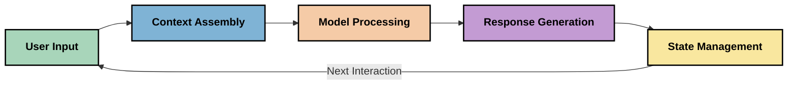
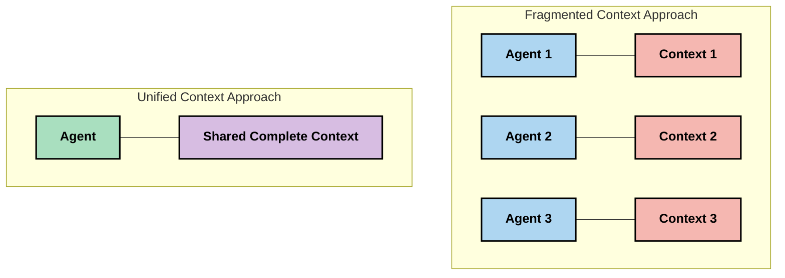
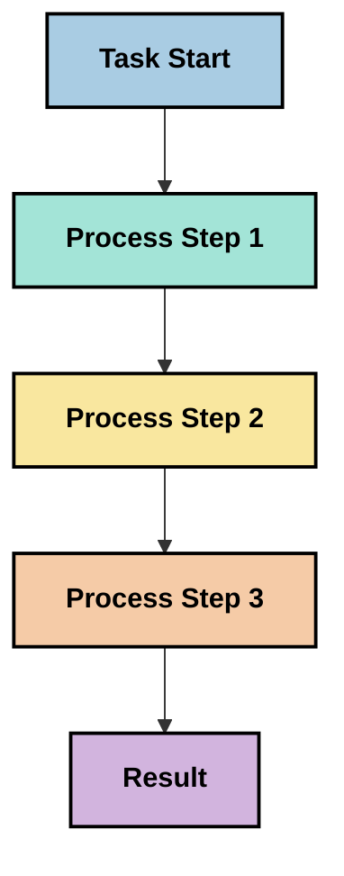
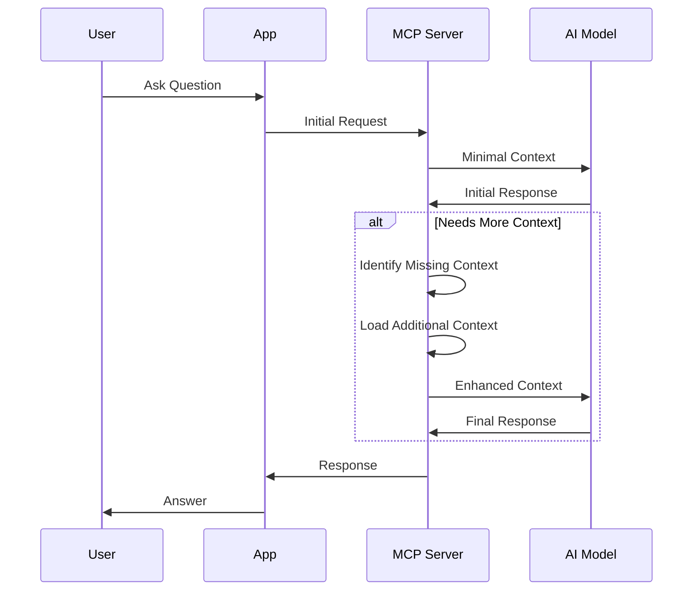
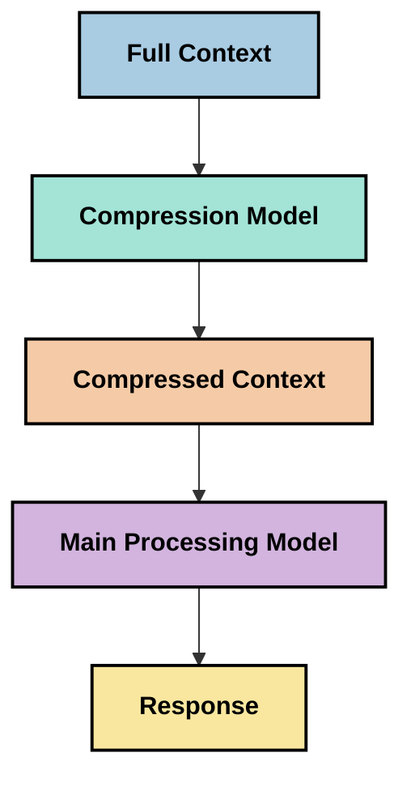
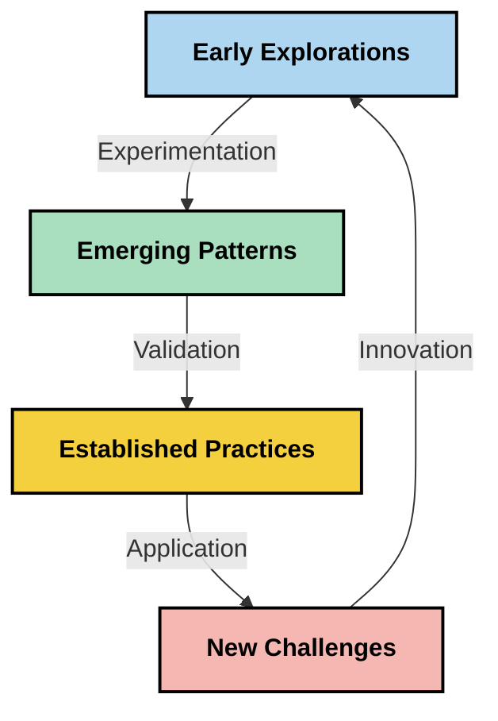

<!--
CO_OP_TRANSLATOR_METADATA:
{
  "original_hash": "fd169ca3071b81b5ee282e194bc823df",
  "translation_date": "2025-09-15T19:51:15+00:00",
  "source_file": "05-AdvancedTopics/mcp-contextengineering/README.md",
  "language_code": "zh"
}
-->
# 上下文工程：MCP生态系统中的新兴概念

## 概述

上下文工程是人工智能领域中的一个新兴概念，研究如何在客户与AI服务之间的交互中构建、传递和维护信息。随着模型上下文协议（MCP）生态系统的发展，有效管理上下文变得越来越重要。本模块介绍了上下文工程的概念，并探讨其在MCP实现中的潜在应用。

## 学习目标

完成本模块后，您将能够：

- 理解上下文工程这一新兴概念及其在MCP应用中的潜在作用
- 识别MCP协议设计解决的上下文管理关键挑战
- 探索通过优化上下文处理来提升模型性能的技术
- 考虑衡量和评估上下文有效性的方式
- 应用这些新兴概念，通过MCP框架改善AI体验

## 上下文工程简介

上下文工程是一种新兴概念，专注于用户、应用程序和AI模型之间信息流的设计和管理。与已经成熟的领域（如提示工程）不同，上下文工程仍在实践者的探索中逐步定义，他们致力于解决为AI模型提供正确信息的独特挑战。

随着大型语言模型（LLMs）的发展，上下文的重要性日益显现。我们提供的上下文的质量、相关性和结构直接影响模型的输出。上下文工程研究这种关系，并致力于开发有效管理上下文的原则。

> “到2025年，现有的模型将非常智能。但即使是最聪明的人，如果没有明确的上下文来指导他们的工作，也无法有效完成任务……‘上下文工程’是提示工程的下一阶段，它旨在在动态系统中自动完成这一过程。” —— Walden Yan, Cognition AI

上下文工程可能包括以下方面：

1. **上下文选择**：确定哪些信息与特定任务相关
2. **上下文结构化**：组织信息以最大化模型理解
3. **上下文传递**：优化信息发送给模型的方式和时机
4. **上下文维护**：管理上下文的状态及其随时间的演变
5. **上下文评估**：衡量和改进上下文的有效性

这些重点领域与MCP生态系统特别相关，MCP提供了一种标准化方式，让应用程序向LLMs提供上下文。

## 上下文旅程视角

一种可视化上下文工程的方法是追踪信息在MCP系统中的旅程：



### 上下文旅程中的关键阶段：

1. **用户输入**：来自用户的原始信息（文本、图像、文档）
2. **上下文组装**：将用户输入与系统上下文、对话历史及其他检索信息结合
3. **模型处理**：AI模型处理组装后的上下文
4. **响应生成**：模型根据提供的上下文生成输出
5. **状态管理**：系统根据交互更新其内部状态

这一视角突出了AI系统中上下文的动态特性，并提出了如何在每个阶段最佳管理信息的重要问题。

## 上下文工程的初步原则

随着上下文工程领域的逐步成型，一些早期原则开始从实践者中浮现。这些原则可能为MCP实现选择提供指导：

### 原则1：完整共享上下文

上下文应在系统的所有组件之间完全共享，而不是分散在多个代理或流程中。当上下文被分散时，系统某一部分做出的决策可能与其他部分的决策相冲突。



在MCP应用中，这意味着设计系统时应确保上下文在整个管道中无缝流动，而不是被分隔。

### 原则2：认识到行动包含隐含决策

模型采取的每个行动都包含对上下文的隐含决策。当多个组件基于不同的上下文采取行动时，这些隐含决策可能发生冲突，导致结果不一致。

这一原则对MCP应用有重要意义：
- 优先选择线性处理复杂任务，而非并行执行分散的上下文
- 确保所有决策点都能访问相同的上下文信息
- 设计系统，使后续步骤能够看到前期决策的完整上下文

### 原则3：平衡上下文深度与窗口限制

随着对话和流程的延续，上下文窗口最终会溢出。有效的上下文工程探索在全面上下文与技术限制之间管理这一张力的方法。

正在探索的潜在方法包括：
- 上下文压缩，保留关键信息同时减少令牌使用
- 根据当前需求逐步加载上下文
- 总结之前的交互，同时保留关键决策和事实

## 上下文挑战与MCP协议设计

模型上下文协议（MCP）的设计充分考虑了上下文管理的独特挑战。理解这些挑战有助于解释MCP协议设计的关键方面：

### 挑战1：上下文窗口限制
大多数AI模型具有固定的上下文窗口大小，限制了它们一次能处理的信息量。

**MCP设计响应：**
- 协议支持结构化的基于资源的上下文，可高效引用
- 资源可以分页并逐步加载

### 挑战2：相关性判断
判断哪些信息最相关以纳入上下文是一个难题。

**MCP设计响应：**
- 灵活的工具允许根据需求动态检索信息
- 结构化提示支持一致的上下文组织

### 挑战3：上下文持久性
跨交互管理状态需要仔细跟踪上下文。

**MCP设计响应：**
- 标准化的会话管理
- 明确定义的交互模式以支持上下文演变

### 挑战4：多模态上下文
不同类型的数据（文本、图像、结构化数据）需要不同的处理方式。

**MCP设计响应：**
- 协议设计支持多种内容类型
- 标准化表示多模态信息

### 挑战5：安全性与隐私
上下文通常包含需要保护的敏感信息。

**MCP设计响应：**
- 明确划分客户端与服务器的责任
- 本地处理选项以最小化数据暴露

理解这些挑战以及MCP如何应对它们，为探索更高级的上下文工程技术奠定了基础。

## 新兴的上下文工程方法

随着上下文工程领域的发展，一些有前景的方法正在浮现。这些方法代表当前的思考，而非成熟的最佳实践，并可能随着我们对MCP实现的经验积累而演变。

### 1. 单线程线性处理

与分布式上下文的多代理架构相比，一些实践者发现单线程线性处理能产生更一致的结果。这与保持统一上下文的原则一致。



虽然这种方法看起来比并行处理效率低，但它通常能产生更连贯和可靠的结果，因为每一步都基于对前期决策的完整理解。

### 2. 上下文分块与优先级排序

将大规模上下文分解为可管理的部分，并优先处理最重要的内容。

```python
# Conceptual Example: Context Chunking and Prioritization
def process_with_chunked_context(documents, query):
    # 1. Break documents into smaller chunks
    chunks = chunk_documents(documents)
    
    # 2. Calculate relevance scores for each chunk
    scored_chunks = [(chunk, calculate_relevance(chunk, query)) for chunk in chunks]
    
    # 3. Sort chunks by relevance score
    sorted_chunks = sorted(scored_chunks, key=lambda x: x[1], reverse=True)
    
    # 4. Use the most relevant chunks as context
    context = create_context_from_chunks([chunk for chunk, score in sorted_chunks[:5]])
    
    # 5. Process with the prioritized context
    return generate_response(context, query)
```

上述概念展示了如何将大文档分解为可管理的部分，并仅选择最相关的部分作为上下文。这种方法可以在上下文窗口限制内工作，同时利用大型知识库。

### 3. 逐步加载上下文

根据需要逐步加载上下文，而不是一次性加载所有内容。



逐步加载上下文从最小的上下文开始，仅在必要时扩展。这可以显著减少简单查询的令牌使用，同时保持处理复杂问题的能力。

### 4. 上下文压缩与总结

在保留关键信息的同时减少上下文大小。



上下文压缩的重点包括：
- 删除冗余信息
- 总结冗长内容
- 提取关键事实和细节
- 保留重要的上下文元素
- 优化令牌效率

这种方法对于在上下文窗口内维护长对话或高效处理大文档特别有价值。一些实践者正在使用专门的模型来进行上下文压缩和对话历史总结。

## 探索性上下文工程考虑

在探索上下文工程这一新兴领域时，以下考虑因素值得在MCP实现中关注。这些不是规定的最佳实践，而是可能在您的具体用例中带来改进的探索领域。

### 明确您的上下文目标

在实施复杂的上下文管理解决方案之前，明确表达您的目标：
- 模型需要哪些具体信息才能成功？
- 哪些信息是必需的，哪些是辅助的？
- 您的性能约束是什么（延迟、令牌限制、成本）？

### 探索分层上下文方法

一些实践者发现分层组织上下文的概念非常有效：
- **核心层**：模型始终需要的基本信息
- **情境层**：当前交互特定的上下文
- **支持层**：可能有帮助的附加信息
- **备用层**：仅在需要时访问的信息

### 调查检索策略

上下文的有效性通常取决于信息的检索方式：
- 使用语义搜索和嵌入来寻找概念相关的信息
- 使用关键词搜索来获取具体的事实细节
- 结合多种检索方法的混合方法
- 使用元数据过滤根据类别、日期或来源缩小范围

### 实验上下文连贯性

上下文的结构和流动可能影响模型的理解：
- 将相关信息分组在一起
- 使用一致的格式和组织方式
- 在适当情况下保持逻辑或时间顺序
- 避免矛盾信息

### 权衡多代理架构的利弊

虽然多代理架构在许多AI框架中很受欢迎，但它们在上下文管理方面存在显著挑战：
- 上下文分散可能导致代理之间决策不一致
- 并行处理可能引入难以调和的冲突
- 代理之间的通信开销可能抵消性能提升
- 需要复杂的状态管理以保持连贯性

在许多情况下，单代理方法结合全面的上下文管理可能比多个专用代理的分散上下文产生更可靠的结果。

### 开发评估方法

为了随着时间推移改进上下文工程，请考虑如何衡量成功：
- 对不同上下文结构进行A/B测试
- 监控令牌使用和响应时间
- 跟踪用户满意度和任务完成率
- 分析上下文策略失败的原因和原因

这些考虑因素代表了上下文工程领域的活跃探索方向。随着该领域的成熟，可能会出现更明确的模式和实践。

## 衡量上下文有效性：一个不断发展的框架

随着上下文工程作为一个概念的出现，实践者开始探索如何衡量其有效性。目前尚无成熟的框架，但一些可能的指标正在被考虑，这些指标可能有助于指导未来的工作。

### 潜在的衡量维度

#### 1. 输入效率考虑

- **上下文与响应比**：需要多少上下文才能生成相应大小的响应？
- **令牌利用率**：提供的上下文令牌中有多少对响应产生了影响？
- **上下文缩减**：我们能多有效地压缩原始信息？

#### 2. 性能考虑

- **延迟影响**：上下文管理如何影响响应时间？
- **令牌经济性**：我们是否有效优化了令牌使用？
- **检索精度**：检索的信息有多相关？
- **资源利用率**：需要哪些计算资源？

#### 3. 质量考虑

- **响应相关性**：响应与查询的匹配程度如何？
- **事实准确性**：上下文管理是否提高了事实正确性？
- **一致性**：相似查询的响应是否一致？
- **幻觉率**：更好的上下文是否减少了模型的幻觉？

#### 4. 用户体验考虑

- **后续率**：用户需要澄清的频率如何？
- **任务完成率**：用户是否成功完成了目标？
- **满意度指标**：用户如何评价他们的体验？

### 探索性衡量方法

在MCP实现中实验上下文工程时，请考虑以下探索性方法：

1. **基线比较**：在测试更复杂的方法之前，使用简单的上下文方法建立基线

2. **增量变化**：一次改变上下文管理的一个方面，以隔离其影响

3. **以用户为中心的评估**：结合定量指标与用户的定性反馈

4. **失败分析**：分析上下文策略失败的案例以了解潜在改进

5. **多维度评估**：在效率、质量和用户体验之间权衡

这种实验性、多方面的衡量方法与上下文工程的初步性质相一致。

## 结束语

上下文工程是一个新兴的探索领域，可能对MCP应用的有效性至关重要。通过深思熟虑地考虑信息在系统中的流动，您可以创造更高效、准确且对用户更有价值的AI体验。

本模块中概述的技术和方法代表了该领域的早期思考，而非成熟的实践。随着AI能力的发展和我们理解的加深，上下文工程可能发展为一个更明确的学科。目前，结合实验与仔细衡量似乎是最有效的途径。

## 潜在的未来方向

上下文工程领域仍处于早期阶段，但一些有前景的方向正在浮现：

- 上下文工程原则可能显著影响模型性能、效率、用户体验和可靠性
- 单线程方法结合全面的上下文管理可能在许多用例中优于多代理架构
- 专用的上下文压缩模型可能成为AI管道中的标准组件
- 上下文完整性与令牌限制之间的张力可能推动上下文处理的创新
- 随着模型在人类式高效沟通方面的能力增强，真正的多代理协作可能变得更可行
- MCP实现可能演变为标准化当前实验中浮现的上下文管理模式



## 资源

### 官方MCP资源
- [模型上下文协议网站](https://modelcontextprotocol.io/)
- [模型上下文协议规范](https://github.com/modelcontextprotocol/modelcontextprotocol)
- [MCP 文档](https://modelcontextprotocol.io/docs)
- [MCP C# SDK](https://github.com/modelcontextprotocol/csharp-sdk)
- [MCP Python SDK](https://github.com/modelcontextprotocol/python-sdk)
- [MCP TypeScript SDK](https://github.com/modelcontextprotocol/typescript-sdk)
- [MCP Inspector](https://github.com/modelcontextprotocol/inspector) - MCP 服务器的可视化测试工具

### 上下文工程相关文章
- [不要构建多代理：上下文工程原则](https://cognition.ai/blog/dont-build-multi-agents) - Walden Yan 关于上下文工程原则的见解
- [构建代理的实用指南](https://cdn.openai.com/business-guides-and-resources/a-practical-guide-to-building-agents.pdf) - OpenAI 关于有效代理设计的指南
- [构建高效代理](https://www.anthropic.com/engineering/building-effective-agents) - Anthropic 的代理开发方法

### 相关研究
- [大型语言模型的动态检索增强](https://arxiv.org/abs/2310.01487) - 关于动态检索方法的研究
- [迷失在中间：语言模型如何使用长上下文](https://arxiv.org/abs/2307.03172) - 关于上下文处理模式的重要研究
- [使用 CLIP 潜变量的分层文本条件图像生成](https://arxiv.org/abs/2204.06125) - DALL-E 2 论文，提供关于上下文结构的见解
- [探索上下文在大型语言模型架构中的作用](https://aclanthology.org/2023.findings-emnlp.124/) - 关于上下文处理的最新研究
- [多代理协作：综述](https://arxiv.org/abs/2304.03442) - 关于多代理系统及其挑战的研究

### 其他资源
- [上下文窗口优化技术](https://learn.microsoft.com/en-us/azure/ai-services/openai/concepts/context-window)
- [高级 RAG 技术](https://www.microsoft.com/en-us/research/blog/retrieval-augmented-generation-rag-and-frontier-models/)
- [语义内核文档](https://github.com/microsoft/semantic-kernel)
- [上下文管理 AI 工具包](https://github.com/microsoft/aitoolkit)

## 接下来是什么

- [5.15 MCP 自定义传输](../mcp-transport/README.md)

---

**免责声明**：  
本文档使用AI翻译服务[Co-op Translator](https://github.com/Azure/co-op-translator)进行翻译。尽管我们努力确保翻译的准确性，但请注意，自动翻译可能包含错误或不准确之处。原始语言的文档应被视为权威来源。对于关键信息，建议使用专业人工翻译。我们不对因使用此翻译而产生的任何误解或误读承担责任。